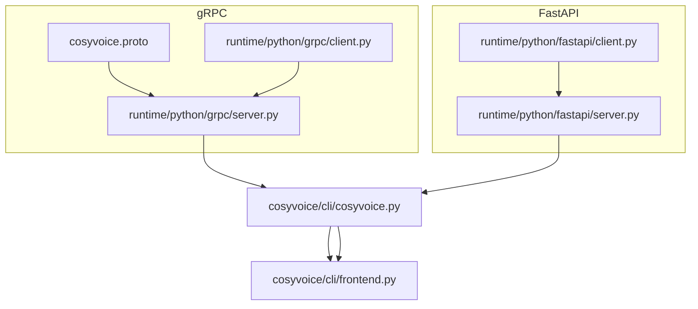
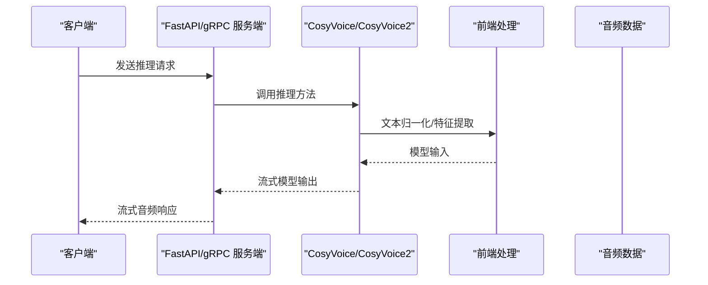
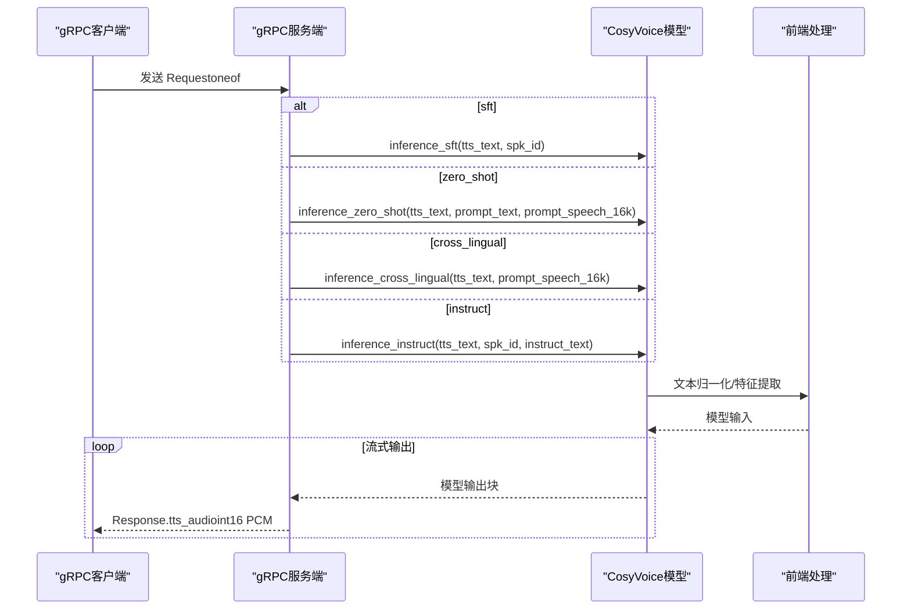
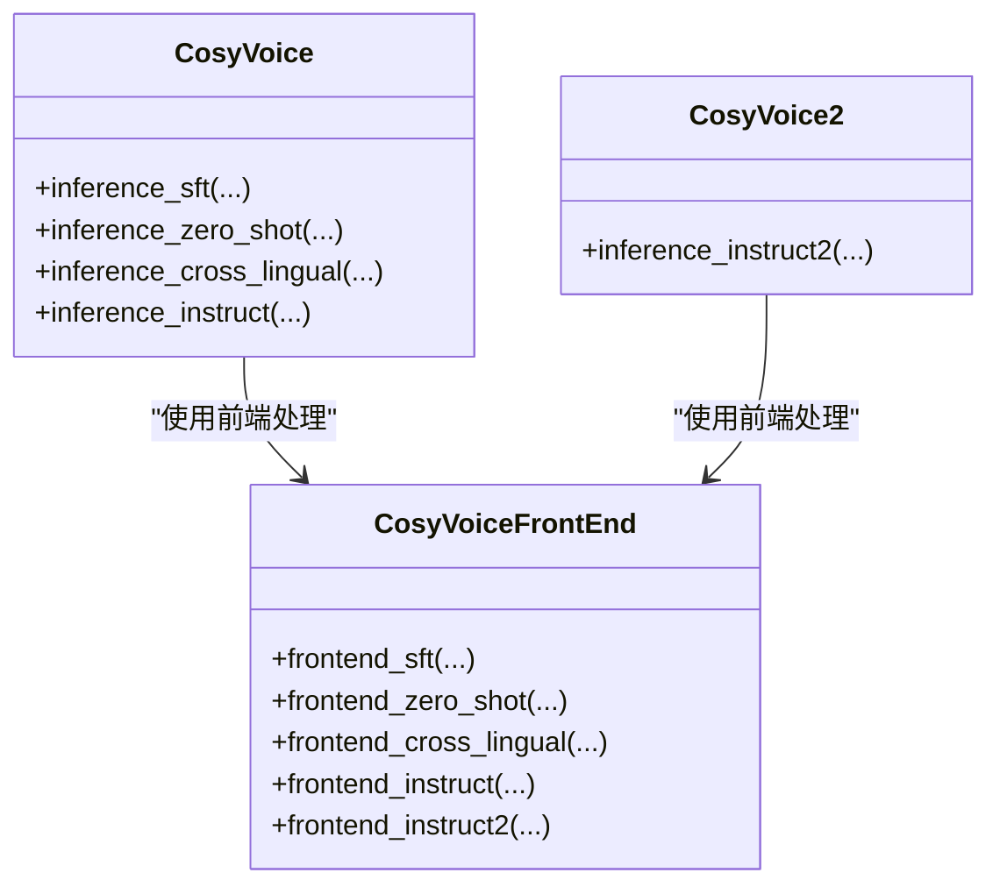

# API参考

<cite>
**本文引用的文件**
- [cosyvoice.proto](file://runtime/python/grpc/cosyvoice.proto)
- [grpc服务端](file://runtime/python/grpc/server.py)
- [grpc客户端](file://runtime/python/grpc/client.py)
- [fastapi服务端](file://runtime/python/fastapi/server.py)
- [fastapi客户端](file://runtime/python/fastapi/client.py)
- [CosyVoice主类](file://cosyvoice/cli/cosyvoice.py)
- [CosyVoice前端处理](file://cosyvoice/cli/frontend.py)
- [项目自述文件](file://README.md)
</cite>

## 目录
1. [简介](#简介)
2. [项目结构](#项目结构)
3. [核心组件](#核心组件)
4. [架构总览](#架构总览)
5. [详细组件分析](#详细组件分析)
6. [依赖关系分析](#依赖关系分析)
7. [性能考虑](#性能考虑)
8. [故障排查指南](#故障排查指南)
9. [结论](#结论)
10. [附录](#附录)

## 简介
本文件为 CosyVoice 的 API 参考文档，覆盖 gRPC 和 FastAPI HTTP 两种服务形态。gRPC 基于 proto 文件定义的服务与消息；FastAPI 提供多条 HTTP 推理端点，均支持流式音频响应，便于长音频实时传输与播放。文档同时给出各端点的请求/响应格式、认证方式、错误处理策略以及客户端调用示例（gRPC 使用客户端代码，HTTP 使用 curl 示例思路）。

## 项目结构
CosyVoice 在 runtime/python 下提供了两种运行时服务：
- gRPC 服务：基于 proto 定义的服务与消息，服务端在 server.py 中实现，客户端在 client.py 中演示。
- FastAPI 服务：在 server.py 中定义多个推理端点，客户端在 client.py 中演示。

图表来源
- [cosyvoice.proto](file://runtime/python/grpc/cosyvoice.proto#L1-L43)
- [grpc服务端](file://runtime/python/grpc/server.py#L1-L97)
- [grpc客户端](file://runtime/python/grpc/client.py#L1-L107)
- [fastapi服务端](file://runtime/python/fastapi/server.py#L1-L102)
- [fastapi客户端](file://runtime/python/fastapi/client.py#L1-L93)
- [CosyVoice主类](file://cosyvoice/cli/cosyvoice.py#L1-L200)
- [CosyVoice前端处理](file://cosyvoice/cli/frontend.py#L191-L213)

章节来源
- [项目自述文件](file://README.md#L240-L253)

## 核心组件
- gRPC 服务：CosyVoice 服务，包含单个 RPC 方法 Inference，返回流式 Response。
- gRPC 消息：
  - Request：oneof 请求载荷，支持四种模式：sftRequest、zeroshotRequest、crosslingualRequest、instructRequest。
  - Response：包含二进制音频数据。
- FastAPI 端点：
  - /inference_sft：支持 GET/POST，参数为 tts_text、spk_id。
  - /inference_zero_shot：支持 GET/POST，参数为 tts_text、prompt_text、prompt_wav（上传文件）。
  - /inference_cross_lingual：支持 GET/POST，参数为 tts_text、prompt_wav（上传文件）。
  - /inference_instruct：支持 GET/POST，参数为 tts_text、spk_id、instruct_text。
  - /inference_instruct2：FastAPI 服务端未暴露该端点，仅在 CosyVoice2 类中存在，不在本次 HTTP API 范畴内。

章节来源
- [cosyvoice.proto](file://runtime/python/grpc/cosyvoice.proto#L6-L43)
- [fastapi服务端](file://runtime/python/fastapi/server.py#L46-L81)

## 架构总览
CosyVoice 的推理由模型层与前端层协作完成。gRPC 与 FastAPI 服务端均通过 CosyVoice/CosyVoice2 的推理方法生成音频，并以流式方式返回。

图表来源
- [grpc服务端](file://runtime/python/grpc/server.py#L45-L71)
- [fastapi服务端](file://runtime/python/fastapi/server.py#L40-L81)
- [CosyVoice主类](file://cosyvoice/cli/cosyvoice.py#L80-L127)
- [CosyVoice前端处理](file://cosyvoice/cli/frontend.py#L191-L213)

## 详细组件分析

### gRPC API

#### 服务与消息定义
- 服务：CosyVoice
  - 方法：Inference(Request) -> stream Response
- 消息：
  - Request：oneof 载荷
    - sftRequest：spk_id（字符串）、tts_text（字符串）
    - zeroshotRequest：tts_text（字符串）、prompt_text（字符串）、prompt_audio（字节）
    - crosslingualRequest：tts_text（字符串）、prompt_audio（字节）
    - instructRequest：tts_text（字符串）、spk_id（字符串）、instruct_text（字符串）
  - Response：tts_audio（字节）

章节来源
- [cosyvoice.proto](file://runtime/python/grpc/cosyvoice.proto#L6-L43)

#### RPC 方法：Inference
- 请求：Request（oneof 决定具体模式）
- 响应：stream Response（逐块返回音频字节）
- 数据格式：
  - prompt_audio 字段为 16kHz 采样率的短波形，客户端需将浮点波形转换为 int16 后序列化为字节；服务端接收后反序列化回张量再进行推理。
  - 返回的 tts_audio 字节为 int16 编码的 PCM 音频帧。

图表来源
- [grpc服务端](file://runtime/python/grpc/server.py#L45-L71)
- [grpc客户端](file://runtime/python/grpc/client.py#L30-L70)
- [CosyVoice主类](file://cosyvoice/cli/cosyvoice.py#L80-L127)

章节来源
- [grpc服务端](file://runtime/python/grpc/server.py#L45-L71)
- [grpc客户端](file://runtime/python/grpc/client.py#L30-L70)

#### 错误处理与异常
- 服务端在初始化模型时尝试 CosyVoice，失败则尝试 CosyVoice2，若仍失败则抛出类型错误。
- gRPC 服务端对不同 oneof 分支分别处理，日志记录请求类型与响应发送状态。
- 客户端在接收流式响应时累积字节，最终保存为音频文件。

章节来源
- [grpc服务端](file://runtime/python/grpc/server.py#L34-L43)
- [grpc服务端](file://runtime/python/grpc/server.py#L74-L80)
- [grpc客户端](file://runtime/python/grpc/client.py#L63-L70)

#### 客户端调用示例（gRPC）
- 使用 runtime/python/grpc/client.py 作为参考，按模式选择 oneof 字段并构造请求，然后遍历响应流写入音频文件。

章节来源
- [grpc客户端](file://runtime/python/grpc/client.py#L30-L70)

### FastAPI HTTP API

#### 端点定义与参数
- GET/POST /inference_sft
  - 参数：tts_text（表单）、spk_id（表单）
  - 响应：流式音频字节（int16 PCM）
- GET/POST /inference_zero_shot
  - 参数：tts_text（表单）、prompt_text（表单）、prompt_wav（上传文件）
  - 响应：流式音频字节（int16 PCM）
- GET/POST /inference_cross_lingual
  - 参数：tts_text（表单）、prompt_wav（上传文件）
  - 响应：流式音频字节（int16 PCM）
- GET/POST /inference_instruct
  - 参数：tts_text（表单）、spk_id（表单）、instruct_text（表单）
  - 响应：流式音频字节（int16 PCM）

章节来源
- [fastapi服务端](file://runtime/python/fastapi/server.py#L46-L81)

#### 认证与安全
- 默认未启用鉴权机制。
- CORS 已开启，允许跨域访问（开发调试友好）。

章节来源
- [fastapi服务端](file://runtime/python/fastapi/server.py#L30-L37)

#### 错误处理策略
- 服务端在启动阶段尝试加载 CosyVoice 或 CosyVoice2，若均失败则抛出类型错误。
- HTTP 层通过流式响应返回音频，客户端需正确处理流式读取与保存。

章节来源
- [fastapi服务端](file://runtime/python/fastapi/server.py#L84-L101)

#### 客户端调用示例（HTTP）
- 使用 curl 的思路：
  - /inference_sft：使用 -d 传参 tts_text、spk_id，配合 -L 与 --output 保存音频。
  - /inference_zero_shot：使用 -F 上传 prompt_wav，同时传 tts_text、prompt_text。
  - /inference_cross_lingual：使用 -F 上传 prompt_wav，传 tts_text。
  - /inference_instruct：使用 -d 传参 tts_text、spk_id、instruct_text。
- 实际 HTTP 客户端可参考 runtime/python/fastapi/client.py 的参数与请求方式。

章节来源
- [fastapi客户端](file://runtime/python/fastapi/client.py#L22-L56)

## 依赖关系分析

图表来源
- [CosyVoice主类](file://cosyvoice/cli/cosyvoice.py#L27-L137)
- [CosyVoice前端处理](file://cosyvoice/cli/frontend.py#L191-L213)

章节来源
- [CosyVoice主类](file://cosyvoice/cli/cosyvoice.py#L27-L137)
- [CosyVoice前端处理](file://cosyvoice/cli/frontend.py#L191-L213)

## 性能考虑
- 流式响应：两种服务均采用流式输出，适合长音频的边生成边播放，降低首包延迟与内存占用。
- 采样率与编码：gRPC 中 prompt_audio 期望 16kHz PCM；HTTP 服务端在接收上传文件后统一重采样至 16kHz。
- 模型加载与并发：gRPC 服务端支持设置最大并发连接数，避免过载。
- 推荐实践：
  - 对长文本进行分片推理，结合流式输出提升交互体验。
  - 在网络不稳定场景下，建议使用流式客户端逐步写入文件，减少一次性缓冲。
  - 如需更高吞吐，可在部署时调整并发参数与硬件资源。

章节来源
- [grpc服务端](file://runtime/python/grpc/server.py#L74-L80)
- [fastapi服务端](file://runtime/python/fastapi/server.py#L40-L43)

## 故障排查指南
- 无法启动服务
  - 检查模型目录是否正确，CosyVoice 与 CosyVoice2 初始化失败会抛出类型错误。
- gRPC 客户端报错
  - 确认 oneof 字段与对应请求消息一致；确保 prompt_audio 为正确的 int16 PCM 字节。
- HTTP 客户端保存音频失败
  - 确保流式读取完整，按块拼接后再解码保存。
- CORS 问题
  - 若浏览器访问出现跨域限制，检查服务端 CORS 配置。

章节来源
- [grpc服务端](file://runtime/python/grpc/server.py#L34-L43)
- [grpc服务端](file://runtime/python/grpc/server.py#L74-L80)
- [fastapi服务端](file://runtime/python/fastapi/server.py#L30-L37)
- [fastapi服务端](file://runtime/python/fastapi/server.py#L84-L101)

## 结论
CosyVoice 提供了稳定高效的推理 API，支持多种推理模式与流式输出。gRPC 适合高吞吐与低延迟场景，FastAPI 则更适合快速集成与调试。通过合理的参数传递与流式处理，可有效提升长音频的用户体验。

## 附录

### gRPC 端点与消息对照表
- 服务：CosyVoice
  - 方法：Inference(Request) -> stream Response
- 请求消息 Request（oneof）
  - sftRequest：spk_id、tts_text
  - zeroshotRequest：tts_text、prompt_text、prompt_audio（bytes）
  - crosslingualRequest：tts_text、prompt_audio（bytes）
  - instructRequest：tts_text、spk_id、instruct_text
- 响应消息 Response
  - tts_audio（bytes）

章节来源
- [cosyvoice.proto](file://runtime/python/grpc/cosyvoice.proto#L6-L43)

### FastAPI 端点对照表
- GET/POST /inference_sft
  - 参数：tts_text、spk_id
  - 响应：流式音频字节
- GET/POST /inference_zero_shot
  - 参数：tts_text、prompt_text、prompt_wav（上传文件）
  - 响应：流式音频字节
- GET/POST /inference_cross_lingual
  - 参数：tts_text、prompt_wav（上传文件）
  - 响应：流式音频字节
- GET/POST /inference_instruct
  - 参数：tts_text、spk_id、instruct_text
  - 响应：流式音频字节

章节来源
- [fastapi服务端](file://runtime/python/fastapi/server.py#L46-L81)