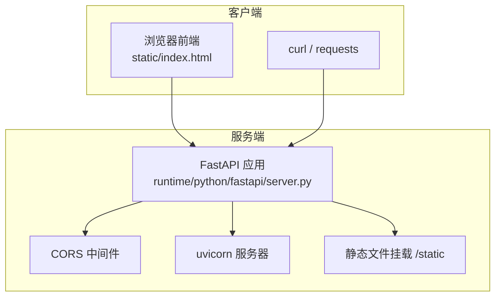
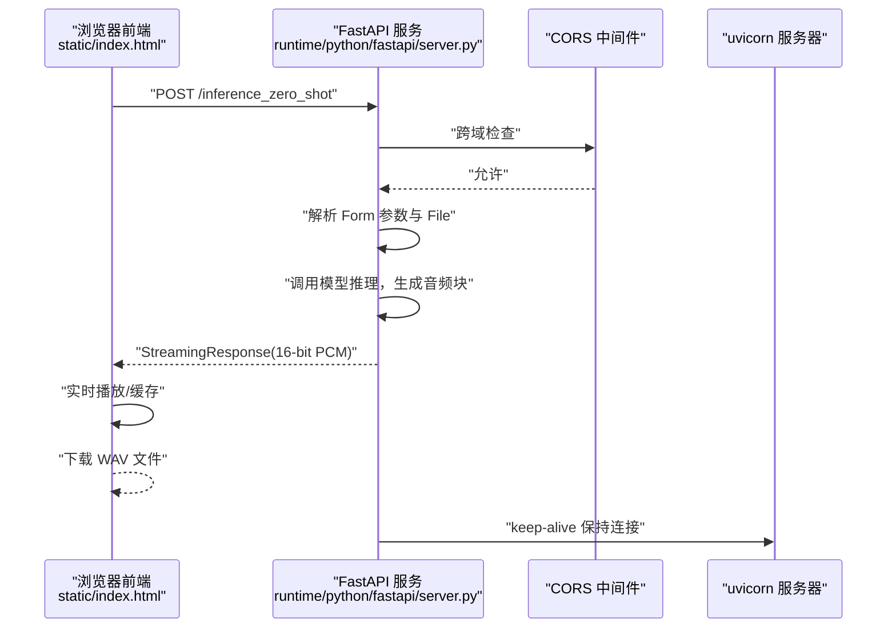
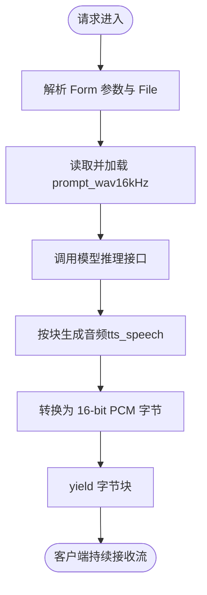
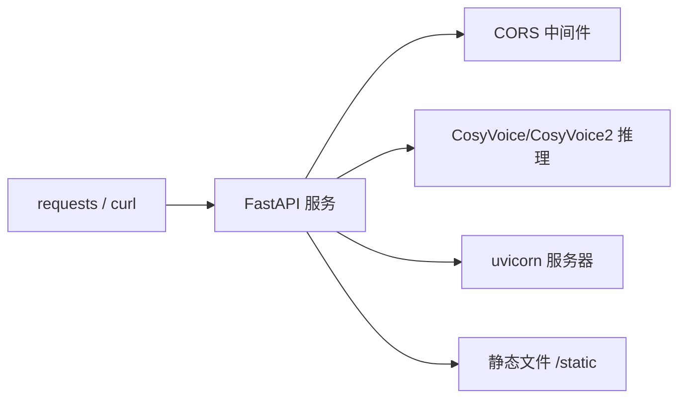

# HTTP API

<cite>
**本文引用的文件**
- [server.py](file://server.py)
- [runtime/python/fastapi/server.py](file://runtime/python/fastapi/server.py)
- [runtime/python/fastapi/client.py](file://runtime/python/fastapi/client.py)
- [static/index.html](file://static/index.html)
- [requirements.txt](file://requirements.txt)
</cite>

## 目录
1. [简介](#简介)
2. [项目结构](#项目结构)
3. [核心组件](#核心组件)
4. [架构总览](#架构总览)
5. [详细组件分析](#详细组件分析)
6. [依赖关系分析](#依赖关系分析)
7. [性能考量](#性能考量)
8. [故障排查指南](#故障排查指南)
9. [结论](#结论)
10. [附录](#附录)

## 简介
本文件面向使用 CosyVoice 的 FastAPI HTTP 推理服务，聚焦于运行在 runtime/python/fastapi 目录下的服务端实现，系统性梳理以下端点：
- /inference_sft
- /inference_zero_shot
- /inference_cross_lingual
- /inference_instruct
- /inference_instruct2

文档将说明每个端点的 HTTP 方法、URL 模式、请求参数（Form/File）、响应格式（StreamingResponse），并给出 curl 与 Python requests 的调用示例。同时覆盖 CORS 配置、启动参数（端口、模型目录）、文件上传处理、流式响应机制以及常见 HTTP 错误处理建议。

## 项目结构
该服务由 FastAPI 应用提供 REST API，采用 CORS 中间件允许跨域访问，使用 uvicorn 作为 ASGI 服务器。静态资源挂载在 /static，前端页面位于 static/index.html，提供浏览器端的流式播放与下载能力。

图表来源
- [runtime/python/fastapi/server.py](file://runtime/python/fastapi/server.py#L30-L38)
- [runtime/python/fastapi/server.py](file://runtime/python/fastapi/server.py#L84-L102)

章节来源
- [runtime/python/fastapi/server.py](file://runtime/python/fastapi/server.py#L30-L38)
- [runtime/python/fastapi/server.py](file://runtime/python/fastapi/server.py#L84-L102)

## 核心组件
- FastAPI 应用与路由：定义五个推理端点，统一返回 StreamingResponse，按块输出 16-bit PCM 音频字节流。
- CORS 中间件：允许任意来源、方法与头，便于前端跨域访问。
- uvicorn 服务器：提供高性能异步 HTTP 服务，支持 keep-alive 与并发限制。
- 静态文件与前端页面：提供基础 Web UI，演示流式播放与下载。

章节来源
- [runtime/python/fastapi/server.py](file://runtime/python/fastapi/server.py#L30-L38)
- [runtime/python/fastapi/server.py](file://runtime/python/fastapi/server.py#L46-L82)
- [runtime/python/fastapi/server.py](file://runtime/python/fastapi/server.py#L84-L102)
- [static/index.html](file://static/index.html#L347-L800)

## 架构总览
下图展示浏览器前端与服务端之间的交互流程，包括 CORS、请求参数传递、流式响应接收与播放。

图表来源
- [runtime/python/fastapi/server.py](file://runtime/python/fastapi/server.py#L46-L82)
- [runtime/python/fastapi/server.py](file://runtime/python/fastapi/server.py#L30-L38)
- [runtime/python/fastapi/server.py](file://runtime/python/fastapi/server.py#L84-L102)

## 详细组件分析

### 端点概览与参数说明
- 端点均支持 GET 与 POST 方法（在服务端通过装饰器同时注册）。
- 所有端点返回 StreamingResponse，响应体为 16-bit PCM 音频字节流，采样率通常为 22050 Hz（部分实现中为 24000 Hz，具体以实际模型为准）。
- 文件上传统一使用 UploadFile（multipart/form-data），音频文件需为 16kHz 采样率。

章节来源
- [runtime/python/fastapi/server.py](file://runtime/python/fastapi/server.py#L46-L82)

#### /inference_sft
- 方法：GET/POST
- URL：/inference_sft
- 请求参数（Form）：
  - tts_text：合成文本
  - spk_id：说话人标识
- 响应：StreamingResponse（16-bit PCM 音频字节流）

章节来源
- [runtime/python/fastapi/server.py](file://runtime/python/fastapi/server.py#L46-L50)

#### /inference_zero_shot
- 方法：GET/POST
- URL：/inference_zero_shot
- 请求参数（Form + File）：
  - tts_text：合成文本
  - prompt_text：提示文本（与 prompt_wav 对应）
  - prompt_wav：上传的提示音频文件（16kHz）
- 响应：StreamingResponse（16-bit PCM 音频字节流）

章节来源
- [runtime/python/fastapi/server.py](file://runtime/python/fastapi/server.py#L53-L58)

#### /inference_cross_lingual
- 方法：GET/POST
- URL：/inference_cross_lingual
- 请求参数（Form + File）：
  - tts_text：合成文本
  - prompt_wav：上传的提示音频文件（16kHz）
- 响应：StreamingResponse（16-bit PCM 音频字节流）

章节来源
- [runtime/python/fastapi/server.py](file://runtime/python/fastapi/server.py#L61-L66)

#### /inference_instruct
- 方法：GET/POST
- URL：/inference_instruct
- 请求参数（Form）：
  - tts_text：合成文本
  - spk_id：说话人标识
  - instruct_text：自然语言控制指令
- 响应：StreamingResponse（16-bit PCM 音频字节流）

章节来源
- [runtime/python/fastapi/server.py](file://runtime/python/fastapi/server.py#L69-L73)

#### /inference_instruct2
- 方法：GET/POST
- URL：/inference_instruct2
- 请求参数（Form + File）：
  - tts_text：合成文本
  - instruct_text：自然语言控制指令
  - prompt_wav：上传的提示音频文件（16kHz）
- 响应：StreamingResponse（16-bit PCM 音频字节流）

章节来源
- [runtime/python/fastapi/server.py](file://runtime/python/fastapi/server.py#L76-L81)

### 请求处理流程（以 /inference_zero_shot 为例）

图表来源
- [runtime/python/fastapi/server.py](file://runtime/python/fastapi/server.py#L53-L58)
- [runtime/python/fastapi/server.py](file://runtime/python/fastapi/server.py#L40-L43)

### CORS 配置
- 允许来源：*（任意）
- 允许方法：*（GET/POST 等）
- 允许头：*（含 Content-Type 等）
- 用途：使浏览器前端可直接跨域访问服务端 API。

章节来源
- [runtime/python/fastapi/server.py](file://runtime/python/fastapi/server.py#L30-L38)

### 启动参数与服务器配置
- 端口：默认 50000，可通过 --port 指定
- 模型目录：默认 iic/CosyVoice-300M，可通过 --model_dir 指定
- 服务器：uvicorn，支持 keep-alive、并发限制等参数

章节来源
- [runtime/python/fastapi/server.py](file://runtime/python/fastapi/server.py#L84-L102)

### 浏览器前端与流式播放
- 前端页面 static/index.html 提供 Web UI，支持：
  - 文本输入、说话人选择
  - 流式播放与后台接收两种模式
  - 下载为 WAV 文件
- 浏览器端通过 fetch + ReadableStream 接收字节流，实时解码并播放。

章节来源
- [static/index.html](file://static/index.html#L347-L800)

## 依赖关系分析
- 依赖 FastAPI、uvicorn、NumPy 等库，版本要求见 requirements.txt。
- 服务端依赖 CosyVoice/CosyVoice2 模型推理接口，负责将文本转为音频帧并按块输出。

图表来源
- [runtime/python/fastapi/server.py](file://runtime/python/fastapi/server.py#L30-L38)
- [runtime/python/fastapi/server.py](file://runtime/python/fastapi/server.py#L46-L82)
- [runtime/python/fastapi/server.py](file://runtime/python/fastapi/server.py#L84-L102)
- [requirements.txt](file://requirements.txt#L6-L43)

章节来源
- [requirements.txt](file://requirements.txt#L6-L43)
- [runtime/python/fastapi/server.py](file://runtime/python/fastapi/server.py#L30-L38)

## 性能考量
- 流式传输：服务端按块生成音频，客户端可边接收边播放，降低首包延迟（TTFB）。
- 采样率：不同模型默认采样率可能不同，前端与下载时需注意匹配。
- keep-alive：uvicorn 支持 keep-alive，有助于减少连接建立开销。
- 并发与超时：可通过 uvicorn 参数调整并发与超时，避免长时间空闲连接占用资源。

章节来源
- [runtime/python/fastapi/server.py](file://runtime/python/fastapi/server.py#L84-L102)
- [static/index.html](file://static/index.html#L525-L684)

## 故障排查指南
- 400 Bad Request：请求参数缺失或格式错误（如缺少 prompt_wav 或 tts_text）。
- 500 Internal Server Error：模型推理异常或文件读取失败。
- CORS 错误：浏览器报跨域错误，确认服务端 CORS 配置是否允许来源与方法。
- 音频播放异常：检查客户端是否正确接收 16-bit PCM 字节流，采样率与通道数是否匹配。
- 首包延迟高：检查网络与服务器负载，适当调整 uvicorn 参数与模型加载策略。

章节来源
- [runtime/python/fastapi/server.py](file://runtime/python/fastapi/server.py#L30-L38)
- [runtime/python/fastapi/server.py](file://runtime/python/fastapi/server.py#L46-L82)

## 结论
本文档系统梳理了 CosyVoice FastAPI HTTP 推理服务的五个端点，明确了请求参数、响应格式与调用方式，并提供了浏览器与命令行两种客户端示例。通过 CORS 与 uvicorn 的配合，服务端实现了低延迟的流式音频传输，适合在线语音合成与前端集成场景。

## 附录

### curl 调用示例
- /inference_sft
  - POST：携带 tts_text 与 spk_id
  - 示例：curl -X POST "http://localhost:50000/inference_sft" -F "tts_text=你好" -F "spk_id=中文女" -o out_sft.wav
- /inference_zero_shot
  - POST：携带 tts_text、prompt_text 与 prompt_wav（16kHz）
  - 示例：curl -X POST "http://localhost:50000/inference_zero_shot" -F "tts_text=你好" -F "prompt_text=你好" -F "prompt_wav=@prompt.wav" -o out_zs.wav
- /inference_cross_lingual
  - POST：携带 tts_text 与 prompt_wav（16kHz）
  - 示例：curl -X POST "http://localhost:50000/inference_cross_lingual" -F "tts_text=你好" -F "prompt_wav=@prompt.wav" -o out_cl.wav
- /inference_instruct
  - POST：携带 tts_text、spk_id、instruct_text
  - 示例：curl -X POST "http://localhost:50000/inference_instruct" -F "tts_text=你好" -F "spk_id=中文女" -F "instruct_text=请用温暖的声音" -o out_instruct.wav
- /inference_instruct2
  - POST：携带 tts_text、instruct_text、prompt_wav（16kHz）
  - 示例：curl -X POST "http://localhost:50000/inference_instruct2" -F "tts_text=你好" -F "instruct_text=请用温暖的声音" -F "prompt_wav=@prompt.wav" -o out_instruct2.wav

### Python requests 调用示例
- 参考客户端脚本 runtime/python/fastapi/client.py，按模式选择参数并发起 GET 请求，使用 stream=True 接收流式响应，最后保存为 WAV 文件。

章节来源
- [runtime/python/fastapi/client.py](file://runtime/python/fastapi/client.py#L22-L57)