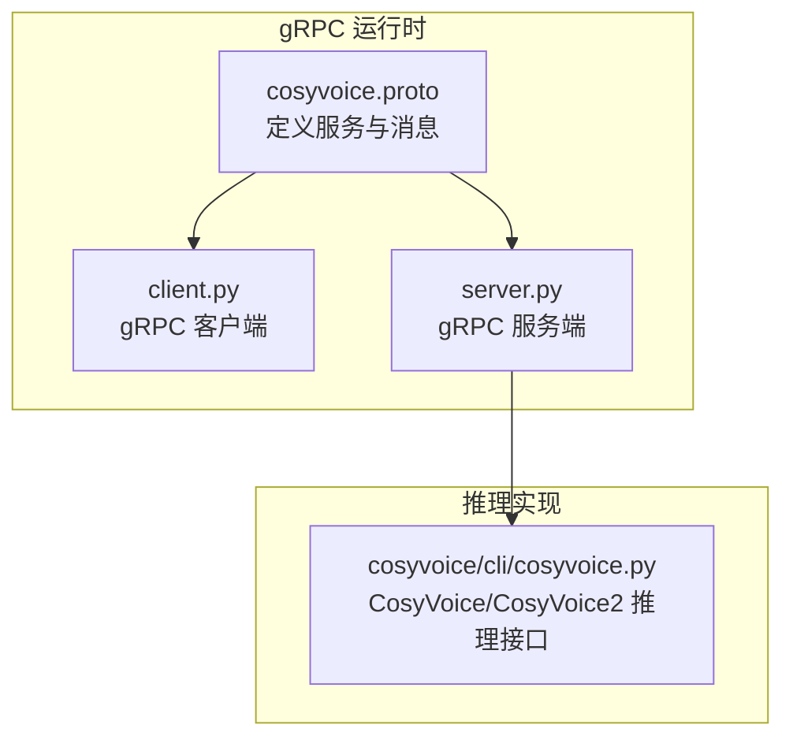
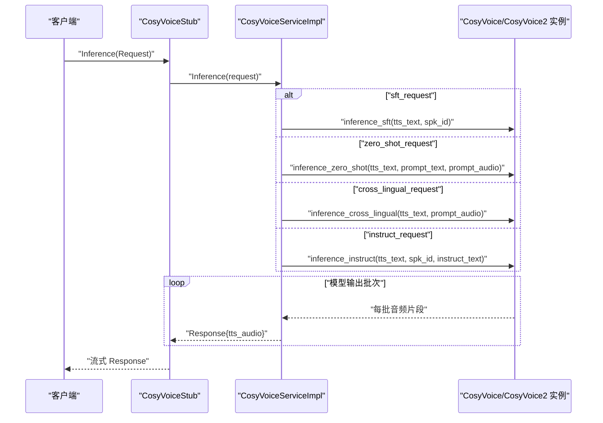
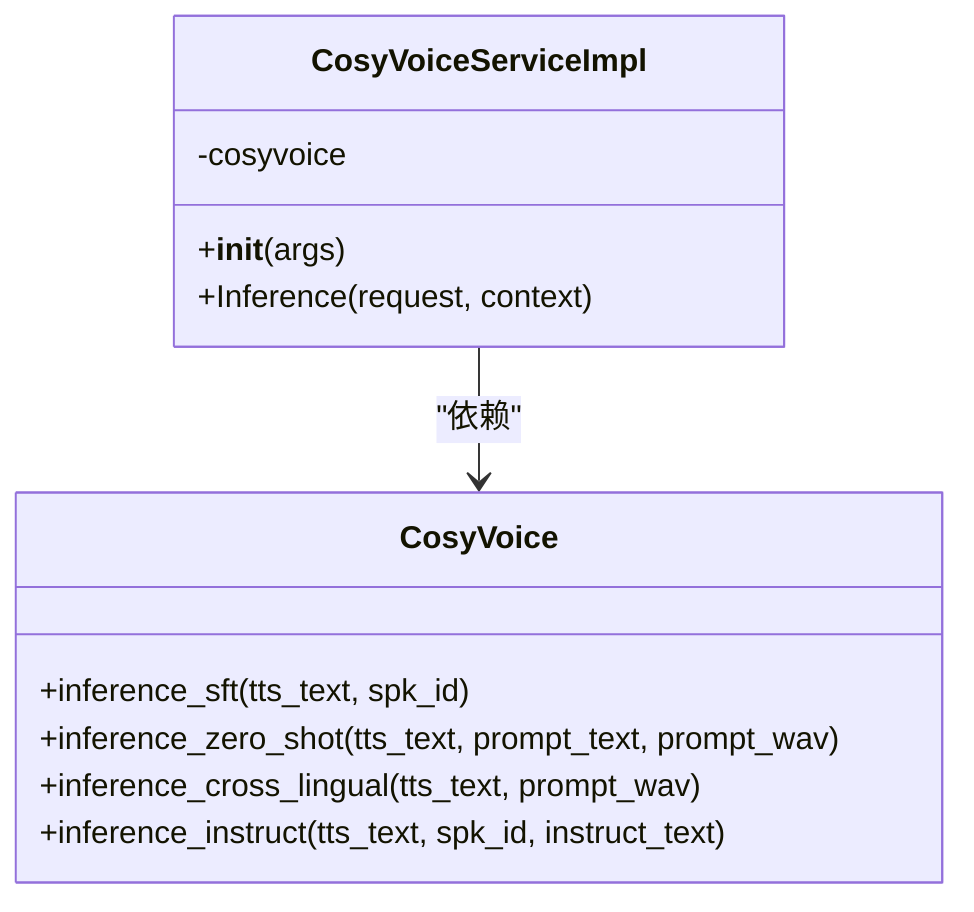
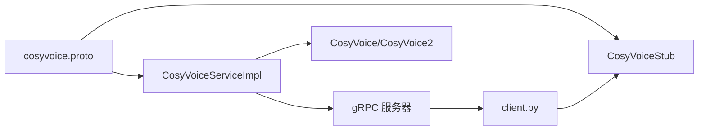
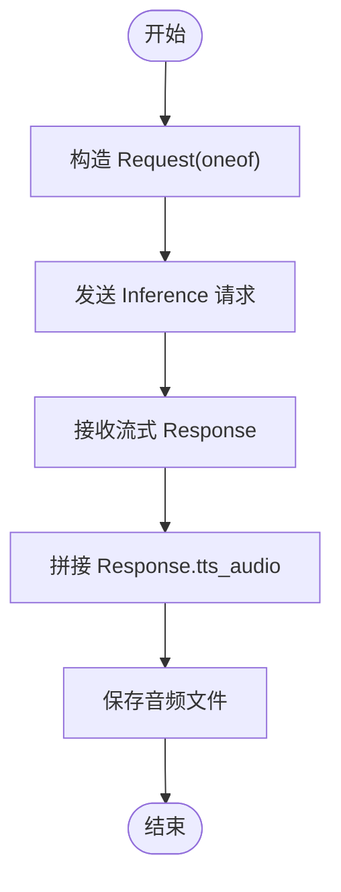

# gRPC API

<cite>
**本文引用的文件**
- [cosyvoice.proto](file://runtime/python/grpc/cosyvoice.proto)
- [client.py](file://runtime/python/grpc/client.py)
- [server.py](file://runtime/python/grpc/server.py)
- [cosyvoice.py](file://cosyvoice/cli/cosyvoice.py)
- [server.py](file://runtime/python/fastapi/server.py)
</cite>

## 目录
1. [简介](#简介)
2. [项目结构](#项目结构)
3. [核心组件](#核心组件)
4. [架构总览](#架构总览)
5. [详细组件分析](#详细组件分析)
6. [依赖关系分析](#依赖关系分析)
7. [性能考虑](#性能考虑)
8. [故障排查指南](#故障排查指南)
9. [结论](#结论)
10. [附录](#附录)

## 简介
本文档面向使用 gRPC 提供 CosyVoice 语音合成服务的开发者，聚焦于 runtime/python/grpc 中定义的 CosyVoice 服务与 Inference RPC 方法。文档覆盖：
- .proto 中 CosyVoice 服务与 Request/Response 消息结构
- Request 的 oneof 四种子请求消息及字段语义
- Response 的音频数据字段含义与传输方式
- 客户端 client.py 的完整调用示例（涵盖四种推理模式）
- 服务端 server.py 的实现要点（CosyVoiceServiceImpl 初始化与 Inference 处理流程）
- 错误处理、连接配置与性能调优建议（如并发连接数）

## 项目结构
CosyVoice 在 runtime/python/grpc 下提供 gRPC 服务端与客户端，以及 .proto 定义；CosyVoice 核心推理逻辑位于 cosyvoice/cli/cosyvoice.py，服务端通过该模块调用具体推理方法。

图表来源
- [cosyvoice.proto](file://runtime/python/grpc/cosyvoice.proto#L1-L43)
- [client.py](file://runtime/python/grpc/client.py#L1-L107)
- [server.py](file://runtime/python/grpc/server.py#L1-L97)
- [cosyvoice.py](file://cosyvoice/cli/cosyvoice.py#L27-L135)

章节来源
- [cosyvoice.proto](file://runtime/python/grpc/cosyvoice.proto#L1-L43)
- [client.py](file://runtime/python/grpc/client.py#L1-L107)
- [server.py](file://runtime/python/grpc/server.py#L1-L97)
- [cosyvoice.py](file://cosyvoice/cli/cosyvoice.py#L27-L135)

## 核心组件
- CosyVoice 服务：定义 Inference RPC，返回流式 Response。
- Request 消息：包含 oneof 字段，用于选择四种推理模式之一。
- 子请求消息：
  - sftRequest：风格微调（sft）推理，包含说话人标识与文本。
  - zeroshotRequest：零样本（zero-shot）推理，包含文本、提示文本与提示音频。
  - crosslingualRequest：跨语言（cross-lingual）推理，包含文本与提示音频。
  - instructRequest：指令控制（instruct）推理，包含文本、说话人标识与指令文本。
- Response 消息：包含二进制音频数据字段，按块流式返回。

章节来源
- [cosyvoice.proto](file://runtime/python/grpc/cosyvoice.proto#L6-L43)

## 架构总览
gRPC 客户端向服务端发送 Request，服务端根据 oneof 字段分派到对应的 CosyVoice 推理方法，并将模型输出的音频以 Response.tts_audio 流式返回。

图表来源
- [server.py](file://runtime/python/grpc/server.py#L45-L71)
- [cosyvoice.py](file://cosyvoice/cli/cosyvoice.py#L80-L127)

## 详细组件分析

### .proto 定义与消息结构
- 服务：CosyVoice，方法 Inference(Request) 返回 stream Response。
- Request.oneof：四选一，分别对应四种推理模式。
- 子消息字段：
  - sftRequest：spk_id（说话人标识）、tts_text（合成文本）
  - zeroshotRequest：tts_text、prompt_text、prompt_audio（提示音频二进制）
  - crosslingualRequest：tts_text、prompt_audio
  - instructRequest：tts_text、spk_id、instruct_text
- Response：tts_audio（二进制音频数据）

章节来源
- [cosyvoice.proto](file://runtime/python/grpc/cosyvoice.proto#L6-L43)

### 请求/响应模式与流式传输
- Inference 为双向流式 RPC，服务端对模型输出进行分片，逐片写入 Response.tts_audio 并持续返回，直到生成完成。
- 客户端循环读取流，拼接所有 Response.tts_audio 得到完整音频。

章节来源
- [cosyvoice.proto](file://runtime/python/grpc/cosyvoice.proto#L7-L43)
- [client.py](file://runtime/python/grpc/client.py#L63-L70)

### 四种推理模式与字段语义
- sft（风格微调）
  - spk_id：指定说话人身份，用于风格迁移或个性化合成。
  - tts_text：待合成文本。
- zero_shot（零样本）
  - tts_text：待合成文本。
  - prompt_text：与 tts_text 对齐的提示文本，帮助模型理解风格或上下文。
  - prompt_audio：提示音频（16kHz PCM，16bit 整型编码为二进制）。
- cross_lingual（跨语言）
  - tts_text：待合成文本（可包含多语言标记）。
  - prompt_audio：跨语言提示音频（16kHz PCM，16bit）。
- instruct（指令控制）
  - tts_text：待合成文本。
  - spk_id：目标说话人。
  - instruct_text：控制指令（如语气、情感等）。

章节来源
- [cosyvoice.proto](file://runtime/python/grpc/cosyvoice.proto#L10-L39)
- [server.py](file://runtime/python/grpc/server.py#L46-L65)

### 客户端调用示例（含四种模式）
- 连接与通道：使用 insecure channel 连接到服务端地址。
- 构造 Request：
  - sft：设置 sft_request.spk_id 与 tts_text。
  - zero_shot：设置 tts_text、prompt_text，并将提示音频读取为 16kHz PCM，16bit 编码为二进制后赋值 prompt_audio。
  - cross_lingual：设置 tts_text 与 prompt_audio。
  - instruct：设置 tts_text、spk_id、instruct_text。
- 发送请求并接收流式响应：遍历响应流，拼接 Response.tts_audio，保存为音频文件。

章节来源
- [client.py](file://runtime/python/grpc/client.py#L30-L70)

### 服务端实现要点（CosyVoiceServiceImpl）
- 初始化：
  - 优先尝试 CosyVoice，失败则尝试 CosyVoice2，均失败抛出异常。
  - 通过参数 trt_concurrent 控制模型内部并发。
- Inference 处理：
  - 根据 HasField 判断 oneof 字段，调用对应推理方法。
  - 将提示音频从二进制解码为浮点张量（16kHz），再传入模型。
  - 将模型输出的音频片段转换为 16bit PCM 二进制，逐片返回。
- 服务启动：
  - 使用 ThreadPoolExecutor，最大并发由参数 max_conc 控制。
  - 启动监听端口，等待请求。

图表来源
- [server.py](file://runtime/python/grpc/server.py#L34-L71)
- [cosyvoice.py](file://cosyvoice/cli/cosyvoice.py#L80-L127)

章节来源
- [server.py](file://runtime/python/grpc/server.py#L34-L71)
- [cosyvoice.py](file://cosyvoice/cli/cosyvoice.py#L80-L127)

### Response.tts_audio 字段说明
- 类型：bytes（二进制）。
- 内容：模型输出的音频片段，按 16kHz PCM、16bit 整型编码为二进制。
- 客户端：将所有 Response.tts_audio 拼接后，转换为浮点张量并保存为音频文件。

章节来源
- [cosyvoice.proto](file://runtime/python/grpc/cosyvoice.proto#L41-L43)
- [server.py](file://runtime/python/grpc/server.py#L68-L71)
- [client.py](file://runtime/python/grpc/client.py#L63-L70)

## 依赖关系分析
- 服务端依赖 CosyVoice/CosyVoice2 推理接口，负责将 gRPC 请求映射到具体推理方法。
- 客户端依赖 .proto 生成的 stub，负责构造请求与消费流式响应。
- FastAPI 服务作为对比参考，展示相同推理接口的 HTTP 流式返回方式。

图表来源
- [cosyvoice.proto](file://runtime/python/grpc/cosyvoice.proto#L6-L43)
- [client.py](file://runtime/python/grpc/client.py#L30-L32)
- [server.py](file://runtime/python/grpc/server.py#L74-L76)
- [cosyvoice.py](file://cosyvoice/cli/cosyvoice.py#L80-L127)

章节来源
- [cosyvoice.proto](file://runtime/python/grpc/cosyvoice.proto#L6-L43)
- [client.py](file://runtime/python/grpc/client.py#L30-L32)
- [server.py](file://runtime/python/grpc/server.py#L74-L76)
- [cosyvoice.py](file://cosyvoice/cli/cosyvoice.py#L80-L127)

## 性能考虑
- 最大并发连接数：服务端通过参数 max_conc 控制 gRPC 服务器的最大并发 RPC 数与模型内部并发，建议结合硬件资源与延迟目标调整。
- 模型加速：CosyVoice/CosyVoice2 支持多种加速选项（如 TensorRT、JIT、vLLM），可在初始化时启用以降低推理时延。
- 流式输出：服务端按模型输出片段逐片返回，客户端应尽快消费，避免阻塞导致背压。
- 音频采样率：提示音频统一要求 16kHz，客户端需确保输入音频重采样与量化一致。

章节来源
- [server.py](file://runtime/python/grpc/server.py#L74-L95)
- [cosyvoice.py](file://cosyvoice/cli/cosyvoice.py#L29-L62)

## 故障排查指南
- 无有效模型类型：当初始化 CosyVoice 与 CosyVoice2 均失败时，抛出类型错误。请确认模型路径与仓库 ID 正确。
- 连接失败：检查服务端监听端口与防火墙设置，确认客户端 host/port 参数正确。
- 音频格式不匹配：提示音频必须为 16kHz PCM、16bit，且按二进制编码。客户端读取音频后需进行正确的量化与编码。
- 性能异常：若出现高延迟或高 CPU/GPU 占用，适当降低 max_conc，并评估是否启用模型加速（如 TRT/JIT/vLLM）。

章节来源
- [server.py](file://runtime/python/grpc/server.py#L36-L42)
- [client.py](file://runtime/python/grpc/client.py#L45-L46)
- [cosyvoice.py](file://cosyvoice/cli/cosyvoice.py#L29-L62)

## 结论
本文档梳理了 CosyVoice gRPC 服务的协议定义、请求/响应模式与流式传输机制，给出了四种推理模式的字段语义与客户端调用示例，并总结了服务端实现与性能调优要点。通过合理配置并发与模型加速，可在保证实时性的前提下获得高质量的语音合成结果。

## 附录
- 与 FastAPI 的对比：FastAPI 服务同样提供相同的推理接口与流式返回，便于在不同部署场景间切换。
- 典型调用流程（概念图）：客户端构造请求 -> 服务端路由到具体推理方法 -> 模型分片输出 -> 服务端逐片返回 -> 客户端拼接保存。

[本图为概念流程示意，不直接映射具体源码文件]