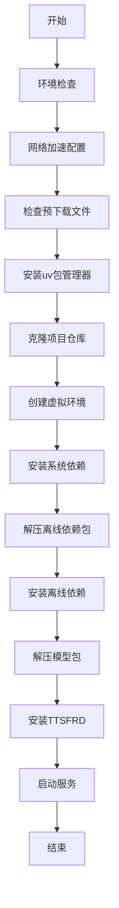
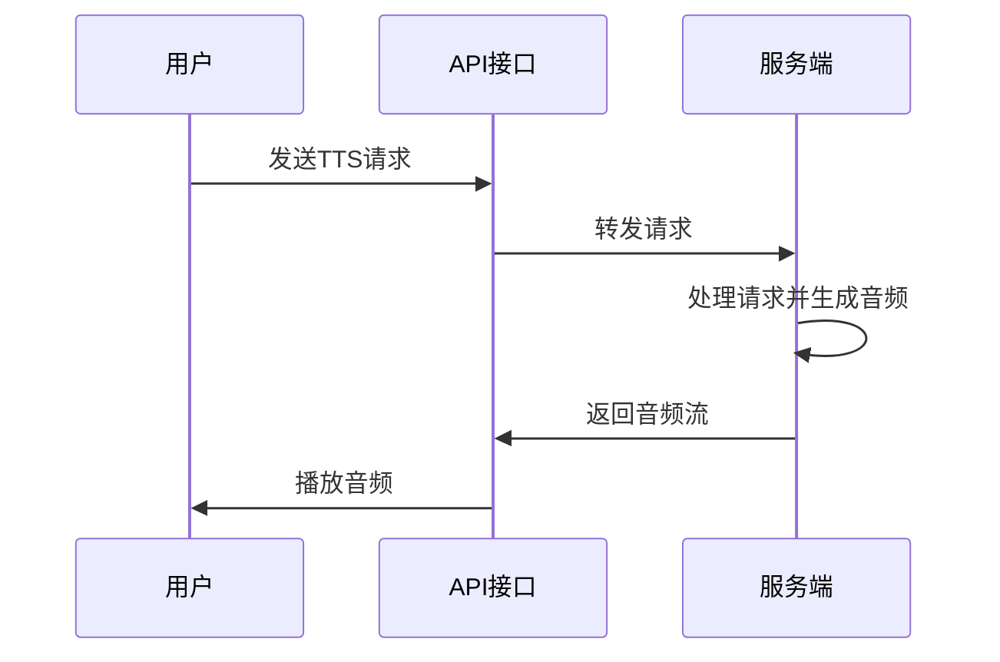

# AutoDL部署

<cite>
**本文档引用文件**   
- [autodl_deploy.sh](file://autodl_deploy.sh)
- [AUTODL_DEPLOYMENT_GUIDE.md](file://AUTODL_DEPLOYMENT_GUIDE.md)
- [server.py](file://server.py)
- [fast_server.py](file://fast_server.py)
- [README.md](file://README.md)
- [requirements.txt](file://requirements.txt)
- [requirements_all.txt](file://requirements_all.txt)
</cite>

## 目录
1. [简介](#简介)
2. [部署流程概述](#部署流程概述)
3. [预下载文件准备](#预下载文件准备)
4. [autodl_deploy.sh脚本详解](#autodl_deploy.sh脚本详解)
5. [云环境优化建议](#云环境优化建议)
6. [服务验证方法](#服务验证方法)
7. [常见错误处理](#常见错误处理)
8. [结论](#结论)

## 简介
CosyVoice是一个基于大型语言模型的可扩展多语言零样本文本到语音合成系统，支持多种语言和方言的语音合成。本文档重点介绍在AutoDL等云平台上的自动化部署流程，详细说明`autodl_deploy.sh`脚本的使用方法，包括预下载文件的准备、网络加速配置和离线依赖安装。文档将解释脚本如何自动完成仓库克隆、虚拟环境创建、依赖安装、模型解压和TTSFRD安装等步骤，并提供针对云环境的优化建议。

**Section sources**
- [README.md](file://README.md#L1-L318)

## 部署流程概述
CosyVoice在AutoDL平台上的部署流程是一个自动化的过程，通过`autodl_deploy.sh`脚本实现一键部署。该流程主要包括以下几个关键步骤：首先，准备预下载的离线依赖包和模型包；然后，执行自动化部署脚本，该脚本会自动完成网络加速配置、系统依赖安装、仓库克隆、虚拟环境创建、离线依赖安装、模型解压和TTSFRD安装等操作；最后，启动服务并进行验证。

整个部署流程设计为在云环境中高效运行，特别考虑了网络不稳定和资源受限的情况。通过使用离线包，避免了在部署过程中因网络问题导致的失败。同时，脚本中包含了网络加速功能，可以提升下载速度。部署完成后，系统会自动启动服务，用户可以通过Web界面或API进行访问和测试。

**Section sources**
- [autodl_deploy.sh](file://autodl_deploy.sh#L1-L242)
- [AUTODL_DEPLOYMENT_GUIDE.md](file://AUTODL_DEPLOYMENT_GUIDE.md#L1-L159)

## 预下载文件准备
在执行自动化部署之前，需要提前准备两个关键的预下载文件：离线依赖包和模型包。这两个文件需要上传到AutoDL平台的默认数据盘目录中，以便部署脚本能够找到并使用它们。

### 离线依赖包
离线依赖包（`offline_packages.zip`）包含了项目运行所需的所有Python包，这些包已经被预先下载并打包，以避免在部署过程中因网络问题导致的安装失败。该文件需要上传到`/root/autodl-tmp`目录下，文件名必须为`offline_packages.zip`。这个包中包含了项目所需的各种依赖，包括深度学习框架、音频处理库和其他必要的Python包。

### 模型包
模型包（`pretrained_models.zip`）包含了CosyVoice的预训练模型文件，这些模型是语音合成的核心。该文件同样需要上传到`/root/autodl-tmp`目录下，文件名必须为`pretrained_models.zip`。模型包中包含了不同版本的CosyVoice模型，如CosyVoice2-0.5B等，以及TTSFRD相关的资源文件。

准备这些预下载文件的最佳实践是使用高速网络环境提前下载并打包，然后上传到云平台。这样可以大大缩短部署时间，并确保部署过程的稳定性。

**Section sources**
- [autodl_deploy.sh](file://autodl_deploy.sh#L9-L12)
- [autodl_deploy.sh](file://autodl_deploy.sh#L36-L40)

## autodl_deploy.sh脚本详解
`autodl_deploy.sh`脚本是CosyVoice在AutoDL平台上自动化部署的核心工具。该脚本采用模块化设计，将整个部署过程分解为多个独立的函数，每个函数负责一个特定的任务。这种设计不仅提高了脚本的可读性和可维护性，还使得错误排查更加容易。

### 脚本执行流程
脚本的执行流程遵循一个清晰的顺序：首先进行环境检查和网络加速配置，然后依次执行仓库克隆、虚拟环境创建、系统依赖安装、离线依赖包解压和安装、模型解压以及TTSFRD安装，最后启动服务。每个步骤都有相应的错误处理机制，如果某个步骤失败，脚本会立即终止并输出错误信息，帮助用户快速定位问题。

### 关键函数解析
脚本中包含多个关键函数，每个函数都承担着重要的职责。`check_predownloaded_files`函数负责检查预下载文件是否存在；`install_uv`函数用于安装uv包管理器；`clone_repo`函数负责克隆项目仓库；`create_venv`函数创建Python虚拟环境；`install_sys_deps`函数安装系统级别的依赖；`extract_offline_pkgs`和`install_offline_pkgs`函数分别负责解压和安装离线依赖包；`extract_models`函数解压模型包；`install_ttsfrd`函数安装TTSFRD相关组件；最后`start_server`函数启动服务。

**Diagram sources **
- [autodl_deploy.sh](file://autodl_deploy.sh#L213-L238)

**Section sources**
- [autodl_deploy.sh](file://autodl_deploy.sh#L1-L242)

## 云环境优化建议
在AutoDL等云平台上部署CosyVoice时，为了获得最佳性能和稳定性，需要进行一些针对性的优化。这些优化建议涵盖了数据盘挂载、资源监控和性能调优等方面。

### 数据盘挂载
建议将项目目录挂载到云平台提供的数据盘上，而不是使用系统盘。数据盘通常具有更大的存储空间和更好的I/O性能，这对于存储大型模型文件和处理大量音频数据非常重要。在AutoDL平台上，默认的数据盘挂载点是`/root/autodl-tmp`，部署脚本已经配置为使用这个路径来存放预下载文件。

### 资源监控
在部署和运行过程中，应密切关注GPU和内存的使用情况。可以使用`nvidia-smi`命令来监控GPU的利用率和显存使用情况，使用`htop`或`ps`命令来监控CPU和内存的使用情况。如果发现资源使用率过高，可能需要调整服务的并发数或优化模型的推理参数。

### 性能调优
为了获得最佳的推理性能，可以考虑使用TensorRT-LLM来加速模型推理。根据文档中的基准测试结果，使用TensorRT-LLM相比HuggingFace Transformers可以显著降低延迟并提高吞吐量。此外，还可以通过调整批处理大小、并发数等参数来优化性能。

**Section sources**
- [AUTODL_DEPLOYMENT_GUIDE.md](file://AUTODL_DEPLOYMENT_GUIDE.md#L140-L146)
- [runtime/triton_trtllm/README.md](file://runtime/triton_trtllm/README.md#L94-L125)

## 服务验证方法
部署完成后，需要对服务进行验证以确保其正常运行。验证方法包括检查服务日志、使用API测试和通过Web界面测试。

### 检查服务日志
服务启动后，会输出详细的日志信息。正常启动的日志应该包含"🚀 CosyVoice TTS Server 启动在端口"这样的信息，并显示服务监听的端口号。如果日志中出现错误信息，需要根据错误提示进行排查。

### API测试
可以通过发送HTTP请求来测试API是否正常工作。使用`curl`命令或Postman等工具，向服务的TTS接口发送一个包含文本和说话人信息的POST请求，如果服务正常，应该能够收到音频流作为响应。

### Web界面测试
如果部署了Web界面，可以通过浏览器访问服务的Web页面，使用提供的界面进行语音合成测试。这不仅可以验证服务的功能，还可以直观地体验合成语音的质量。

**Diagram sources **
- [server.py](file://server.py#L409-L438)

**Section sources**
- [server.py](file://server.py#L441-L568)
- [fast_server.py](file://fast_server.py#L441-L800)

## 常见错误处理
在部署和使用CosyVoice的过程中，可能会遇到一些常见问题。了解这些问题的解决方案可以帮助快速恢复服务。

### 离线包缺失
如果出现离线包缺失的错误，首先需要确认`offline_packages.zip`和`pretrained_models.zip`文件是否已经正确上传到`/root/autodl-tmp`目录下。如果文件存在但仍然报错，可能是文件名不正确或文件损坏，需要重新上传。

### 权限问题
权限问题通常表现为无法写入文件或执行脚本。解决方法是检查相关文件和目录的权限设置，必要时使用`chmod`命令修改权限。例如，如果脚本无法执行，可以使用`chmod +x script_name.sh`命令添加执行权限。

### MPI初始化问题
在AutoDL环境中，直接运行`python fast_server.py`可能会因为TensorRT-LLM的MPI初始化问题而卡住。解决方案是使用`mpirun`命令来启动服务，如`mpirun -n 1 --allow-run-as-root --bind-to none python fast_server.py`。

**Section sources**
- [autodl_deploy.sh](file://autodl_deploy.sh#L38-L40)
- [AUTODL_DEPLOYMENT_GUIDE.md](file://AUTODL_DEPLOYMENT_GUIDE.md#L7-L18)

## 结论
通过本文档的指导，用户可以在AutoDL等云平台上成功部署CosyVoice语音合成系统。自动化部署脚本`autodl_deploy.sh`极大地简化了部署过程，使得即使是非专业用户也能轻松完成部署。预下载文件的使用确保了部署的稳定性和效率，而云环境优化建议则帮助用户获得最佳的性能表现。服务验证方法和常见错误处理指南为系统的维护和故障排除提供了有力支持。总体而言，这套部署方案为CosyVoice的广泛应用奠定了坚实的基础。