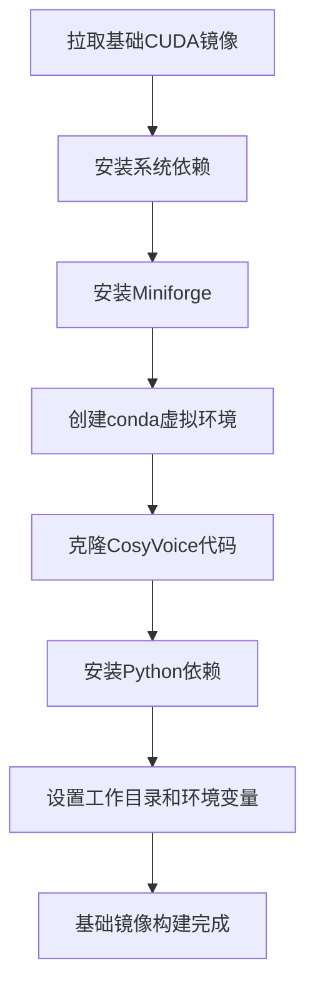
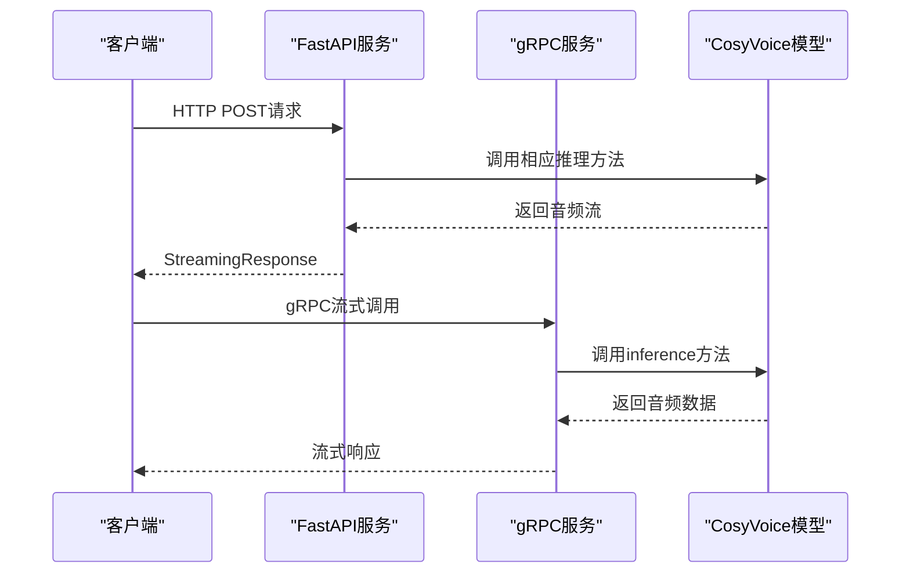
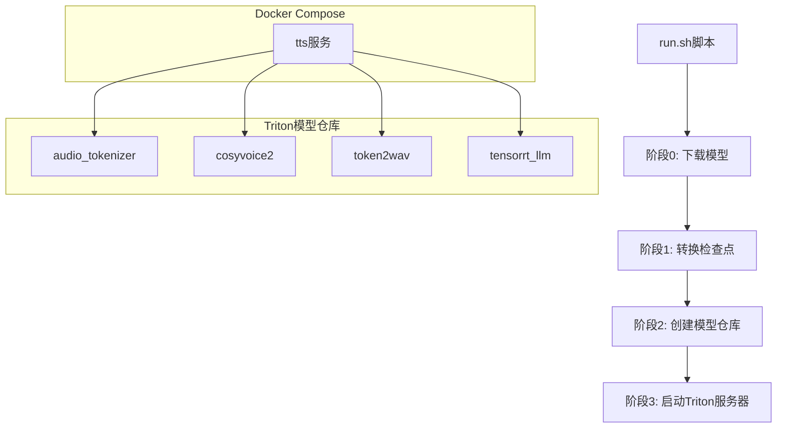
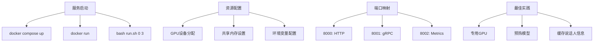
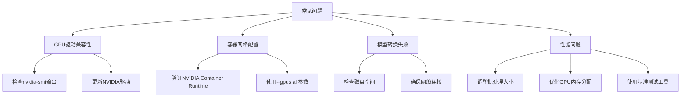

# Docker部署

<cite>
**本文档中引用的文件**  
- [Dockerfile](file://docker/Dockerfile)
- [Dockerfile](file://runtime/python/Dockerfile)
- [docker-compose.yml](file://runtime/triton_trtllm/docker-compose.yml)
- [Dockerfile.server](file://runtime/triton_trtllm/Dockerfile.server)
- [run.sh](file://runtime/triton_trtllm/run.sh)
- [server.py](file://runtime/python/fastapi/server.py)
- [server.py](file://runtime/python/grpc/server.py)
- [cosyvoice.proto](file://runtime/python/grpc/cosyvoice.proto)
- [config.pbtxt](file://runtime/triton_trtllm/model_repo/cosyvoice2/config.pbtxt)
- [fill_template.py](file://runtime/triton_trtllm/scripts/fill_template.py)
- [client_grpc.py](file://runtime/triton_trtllm/client_grpc.py)
- [client_http.py](file://runtime/triton_trtllm/client_http.py)
- [offline_inference.py](file://runtime/triton_trtllm/offline_inference.py)
- [streaming_inference.py](file://runtime/triton_trtllm/streaming_inference.py)
- [requirements.txt](file://runtime/triton_trtllm/requirements.txt)
- [requirements.txt](file://requirements.txt)
</cite>

## 目录
1. [简介](#简介)
2. [基础镜像构建](#基础镜像构建)
3. [FastAPI与gRPC服务部署](#fastapi与grpc服务部署)
4. [基于TensorRT-LLM的高性能部署](#基于tensorrt-llm的高性能部署)
5. [服务启动与资源配置](#服务启动与资源配置)
6. [常见问题与解决方案](#常见问题与解决方案)
7. [总结](#总结)

## 简介
CosyVoice项目提供了多种Docker部署方案，支持从基础镜像构建到高性能推理服务的完整部署流程。本文档详细介绍了使用Docker进行CosyVoice部署的三种主要方案：基础镜像构建、FastAPI/gRPC服务部署，以及基于NVIDIA TensorRT-LLM的高性能部署。每种方案都针对不同的使用场景和性能需求进行了优化，为用户提供灵活的部署选择。

## 基础镜像构建
CosyVoice的基础Docker镜像构建在`nvidia/cuda:12.4.1-cudnn-devel-ubuntu22.04`之上，为后续的语音合成服务提供了完整的运行环境。该Dockerfile首先安装了必要的系统依赖，包括git、编译工具、curl、wget、ffmpeg等多媒体处理工具。随后，通过安装Miniforge来管理Python环境，创建了一个名为"cosyvoice"的conda虚拟环境，并指定Python版本为3.10。

在环境配置完成后，Dockerfile克隆了CosyVoice代码仓库，并安装了项目所需的Python依赖包。通过设置PYTHONPATH环境变量，确保了CosyVoice及其第三方依赖Matcha-TTS的正确导入路径。整个构建过程通过分层设计，将环境配置、代码获取和依赖安装分离，提高了镜像构建的效率和可维护性。

**图源**
- [Dockerfile](file://docker/Dockerfile)

**本节来源**
- [Dockerfile](file://docker/Dockerfile)

## FastAPI与gRPC服务部署
CosyVoice提供了基于Python的FastAPI和gRPC两种服务部署方案，位于`runtime/python`目录下。这两种方案共享相同的Docker基础镜像`pytorch/pytorch:2.0.1-cuda11.7-cudnn8-runtime`，确保了PyTorch和CUDA环境的一致性。

FastAPI服务通过`fastapi/server.py`实现，提供了RESTful API接口，支持多种语音合成模式，包括标准合成（inference_sft）、零样本合成（inference_zero_shot）、跨语言合成（inference_cross_lingual）和指令合成（inference_instruct）。服务使用StreamingResponse实现音频流式传输，提高了用户体验。启动时可通过命令行参数指定服务端口和模型路径。

gRPC服务通过`grpc/server.py`实现，定义了`CosyVoiceServiceImpl`类来处理不同的推理请求。服务支持四种请求类型：sft_request、zero_shot_request、cross_lingual_request和instruct_request，通过protobuf定义的`cosyvoice.proto`文件进行消息序列化。gRPC服务支持并发处理，可通过`max_conc`参数配置最大并发数。

**图源**
- [server.py](file://runtime/python/fastapi/server.py)
- [server.py](file://runtime/python/grpc/server.py)
- [cosyvoice.proto](file://runtime/python/grpc/cosyvoice.proto)

**本节来源**
- [Dockerfile](file://runtime/python/Dockerfile)
- [server.py](file://runtime/python/fastapi/server.py)
- [server.py](file://runtime/python/grpc/server.py)
- [cosyvoice.proto](file://runtime/python/grpc/cosyvoice.proto)

## 基于TensorRT-LLM的高性能部署
CosyVoice的高性能部署方案基于NVIDIA Triton Inference Server和TensorRT-LLM，位于`runtime/triton_trtllm`目录下。该方案通过Docker Compose进行服务编排，实现了从模型转换、服务部署到性能测试的完整流程。

核心组件包括`docker-compose.yml`文件，定义了名为"tts"的服务，映射了8000、8001和8002三个端口分别用于HTTP、gRPC和metrics服务。服务配置了GPU资源，通过NVIDIA Container Runtime确保GPU的正确分配。`Dockerfile.server`基于`nvcr.io/nvidia/tritonserver:25.06-trtllm-python-py3`镜像，安装了必要的依赖并设置了工作目录。

`run.sh`脚本是整个部署流程的核心，分为六个阶段：下载模型、转换检查点、创建模型仓库、启动Triton服务器、HTTP客户端测试和gRPC基准测试。通过`bash run.sh 0 3`命令可以依次执行前三个阶段，完成模型准备和服务器启动。模型仓库结构包含多个子模型，如`audio_tokenizer`、`cosyvoice2`、`token2wav`等，每个子模型都有独立的`config.pbtxt`配置文件。

**图源**
- [docker-compose.yml](file://runtime/triton_trtllm/docker-compose.yml)
- [Dockerfile.server](file://runtime/triton_trtllm/Dockerfile.server)
- [run.sh](file://runtime/triton_trtllm/run.sh)
- [config.pbtxt](file://runtime/triton_trtllm/model_repo/cosyvoice2/config.pbtxt)

**本节来源**
- [docker-compose.yml](file://runtime/triton_trtllm/docker-compose.yml)
- [Dockerfile.server](file://runtime/triton_trtllm/Dockerfile.server)
- [run.sh](file://runtime/triton_trtllm/run.sh)
- [model_repo](file://runtime/triton_trtllm/model_repo)

## 服务启动与资源配置
CosyVoice的Docker部署提供了多种服务启动方式和资源配置选项。对于基础部署，可以使用`docker build`命令构建镜像，然后通过`docker run`启动容器。对于高性能部署，推荐使用`docker compose up`命令一键启动所有服务。

资源分配方面，Triton服务器通过`docker-compose.yml`文件中的`deploy.resources.reservations.devices`配置GPU资源，可以指定使用特定的GPU设备。`shm_size`设置为'1gb'，确保了共享内存的充足。通过环境变量`MODEL_ID`可以动态指定模型ID，提高了部署的灵活性。

端口映射方面，Triton服务器开放了三个端口：8000用于HTTP推理，8001用于gRPC通信，8002用于metrics监控。这些端口可以根据实际需求进行调整。对于流式合成服务，建议启用`Decoupled=True`模式，以支持实时音频流传输。

最佳实践包括：在生产环境中使用专用GPU，确保足够的共享内存，预热模型以获得稳定的性能表现，以及使用`use_spk2info_cache=True`来缓存说话人信息，提高固定说话人的合成效率。

**图源**
- [docker-compose.yml](file://runtime/triton_trtllm/docker-compose.yml)
- [run.sh](file://runtime/triton_trtllm/run.sh)

**本节来源**
- [docker-compose.yml](file://runtime/triton_trtllm/docker-compose.yml)
- [run.sh](file://runtime/triton_trtllm/run.sh)

## 常见问题与解决方案
在CosyVoice的Docker部署过程中，可能会遇到一些常见问题。首先是GPU驱动兼容性问题，确保主机上的NVIDIA驱动版本与容器内的CUDA版本兼容。可以通过`nvidia-smi`命令检查驱动版本，并根据需要更新驱动。

容器网络配置问题可能导致服务无法访问。确保Docker守护进程正确配置了NVIDIA Container Runtime，并在`docker run`命令中使用`--gpus all`参数。对于Docker Compose部署，检查`docker-compose.yml`文件中的网络配置是否正确。

模型转换失败可能是由于磁盘空间不足或网络连接问题。建议在转换前确保有足够的磁盘空间，并使用稳定的网络连接下载模型。如果遇到权限问题，可以尝试在Docker命令中添加`--privileged`参数。

性能问题可以通过调整批处理大小、并发数和GPU内存分配来优化。使用`client_grpc.py`脚本进行基准测试，可以帮助识别性能瓶颈。对于流式合成，调整`chunk_overlap_duration`参数可以改善音频拼接质量。

**图源**
- [run.sh](file://runtime/triton_trtllm/run.sh)
- [client_grpc.py](file://runtime/triton_trtllm/client_grpc.py)

**本节来源**
- [run.sh](file://runtime/triton_trtllm/run.sh)
- [client_grpc.py](file://runtime/triton_trtllm/client_grpc.py)
- [client_http.py](file://runtime/triton_trtllm/client_http.py)

## 总结
CosyVoice提供了全面的Docker部署方案，从基础镜像构建到高性能推理服务，满足了不同场景下的需求。基础部署方案简单易用，适合快速原型开发和测试；而基于TensorRT-LLM的高性能部署方案则针对生产环境进行了优化，提供了卓越的推理性能。

通过Docker Compose的编排，复杂的多模型服务部署变得简单可靠。灵活的资源配置和端口映射选项，使得CosyVoice可以轻松集成到现有的基础设施中。详细的基准测试结果和最佳实践指南，为用户提供了性能优化的明确方向。

未来，随着模型和硬件技术的不断发展，CosyVoice的部署方案也将持续演进，为用户提供更加高效、可靠的语音合成服务。