# 模型下载

<cite>
**本文档引用的文件**
- [download_models.py](file://download_models.py)
- [README.md](file://README.md)
- [requirements_all.txt](file://requirements_all.txt)
- [requirements_heavy.txt](file://requirements_heavy.txt)
- [example.py](file://example.py)
- [cosyvoice/cli/frontend.py](file://cosyvoice/cli/frontend.py)
- [fast_server.py](file://fast_server.py)
</cite>

## 目录
1. [简介](#简介)
2. [项目结构](#项目结构)
3. [核心组件](#核心组件)
4. [架构概览](#架构概览)
5. [详细组件分析](#详细组件分析)
6. [依赖关系分析](#依赖关系分析)
7. [性能考虑](#性能考虑)
8. [故障排除指南](#故障排除指南)
9. [结论](#结论)

## 简介

CosyVoice 是一个基于大型语言模型的多语言文本转语音（TTS）系统，支持零样本多语言语音合成。本文档详细介绍如何使用 `download_models.py` 脚本下载 CosyVoice 所需的预训练模型，包括 Fun-CosyVoice3-0.5B、CosyVoice2-0.5B 等核心模型。

该脚本提供了完整的模型下载解决方案，支持多种下载方式、代理配置、断点续传和并行下载等功能，确保用户能够在各种网络环境下高效地获取所需的预训练模型。

## 项目结构

CosyVoice 项目采用模块化设计，主要包含以下关键目录和文件：

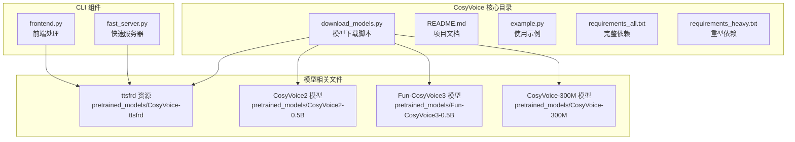

**图表来源**
- [download_models.py](file://download_models.py#L1-L50)
- [README.md](file://README.md#L168-L202)

**章节来源**
- [download_models.py](file://download_models.py#L1-L50)
- [README.md](file://README.md#L168-L202)

## 核心组件

### 模型下载脚本

`download_models.py` 是整个模型下载系统的核心组件，提供了完整的模型管理功能：

#### 主要功能特性
- **多模型支持**: 支持 Fun-CosyVoice3-0.5B、CosyVoice2-0.5B、CosyVoice-300M 等核心模型
- **双平台兼容**: 同时支持 ModelScope 和 HuggingFace 平台
- **智能代理**: 自动检测和配置代理设置
- **断点续传**: 支持网络中断后的自动续传
- **并行下载**: 使用多线程技术最大化下载效率
- **状态管理**: 实时显示下载进度和状态

#### 模型配置结构

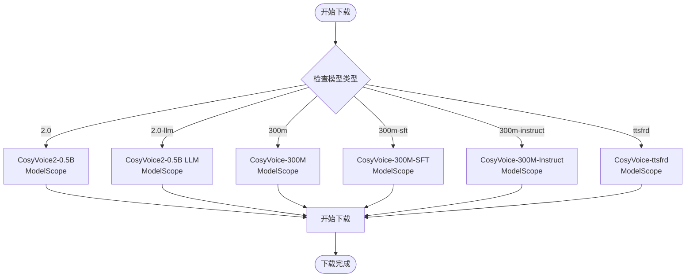

**图表来源**
- [download_models.py](file://download_models.py#L84-L127)

**章节来源**
- [download_models.py](file://download_models.py#L82-L127)

## 架构概览

### 模型下载架构

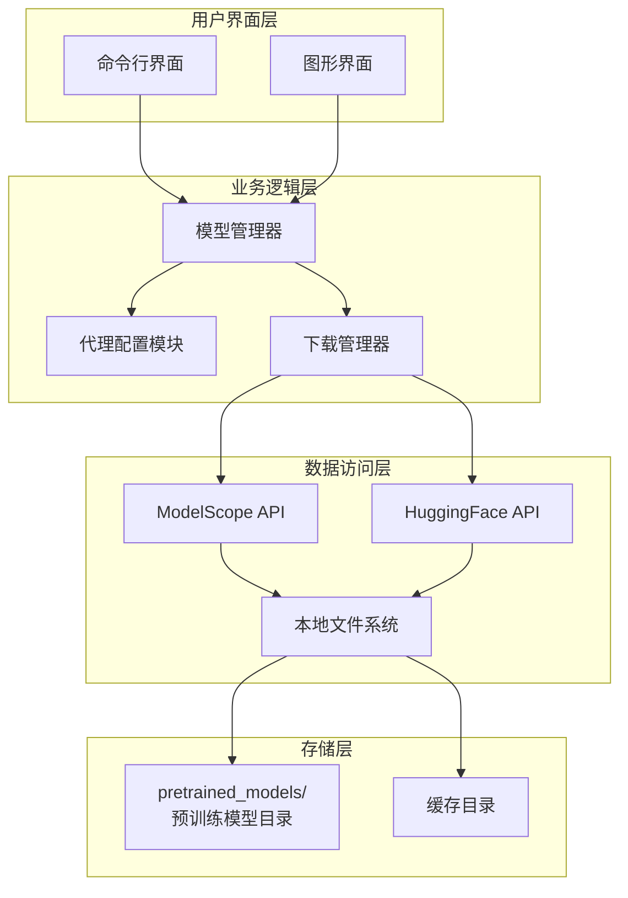

**图表来源**
- [download_models.py](file://download_models.py#L268-L419)

### 代理配置架构

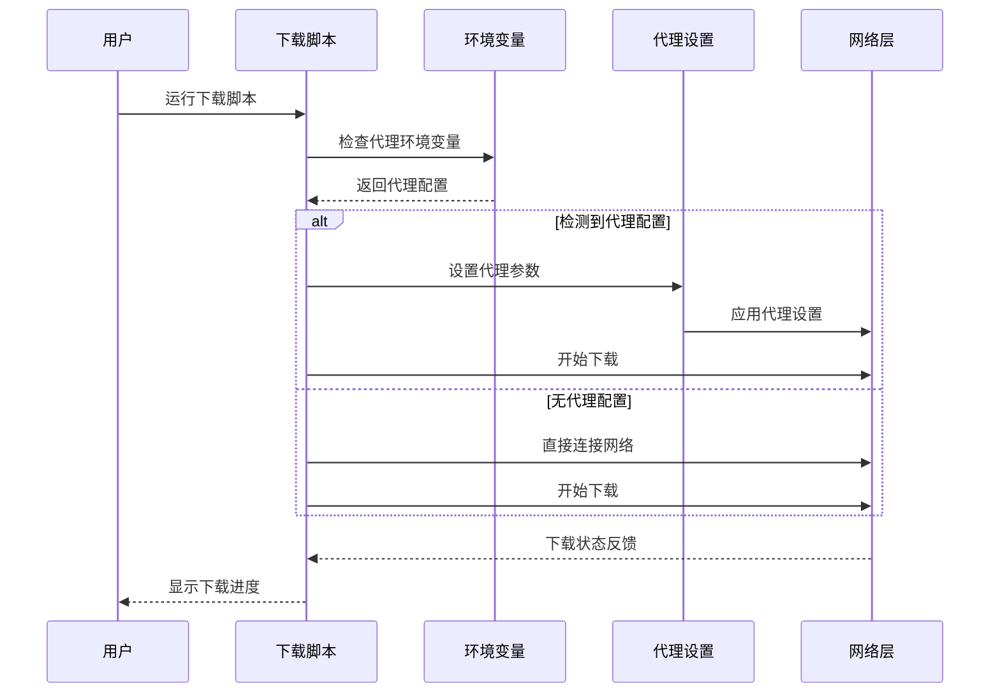

**图表来源**
- [download_models.py](file://download_models.py#L40-L79)

**章节来源**
- [download_models.py](file://download_models.py#L40-L79)

## 详细组件分析

### 代理配置组件

#### 代理检测机制

代理配置组件实现了智能的代理检测和设置功能：

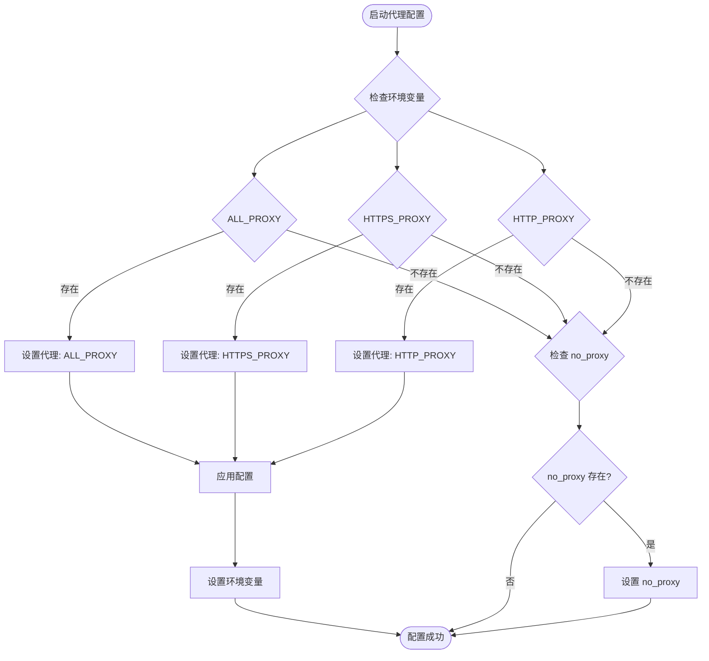

**图表来源**
- [download_models.py](file://download_models.py#L40-L79)

#### 支持的代理环境变量

| 环境变量 | 作用 | 优先级 |
|---------|------|--------|
| ALL_PROXY | 通用代理设置 | 最高 |
| HTTPS_PROXY | HTTPS 代理设置 | 中等 |
| HTTP_PROXY | HTTP 代理设置 | 中等 |
| all_proxy | 通用代理设置（小写） | 中等 |
| https_proxy | HTTPS 代理设置（小写） | 中等 |
| http_proxy | HTTP 代理设置（小写） | 中等 |
| NO_PROXY | 跳过代理的域名列表 | 最低 |
| no_proxy | 跳过代理的域名列表（小写） | 最低 |

**章节来源**
- [download_models.py](file://download_models.py#L40-L79)

### 模型下载组件

#### 下载流程管理

模型下载组件负责协调不同来源的模型下载过程：

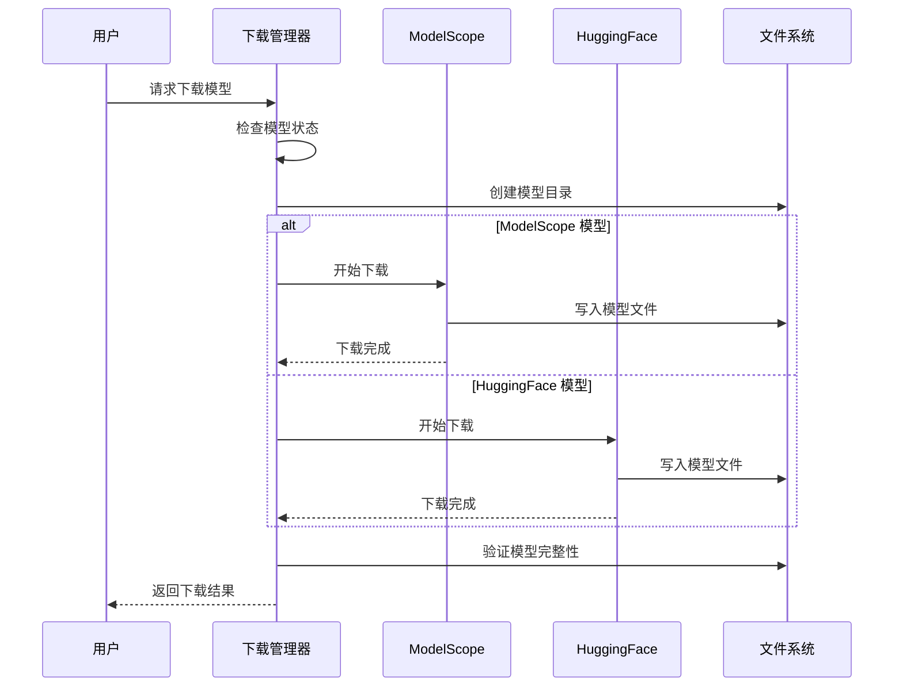

**图表来源**
- [download_models.py](file://download_models.py#L175-L266)

#### 断点续传机制

断点续传功能确保网络中断后能够自动恢复下载：

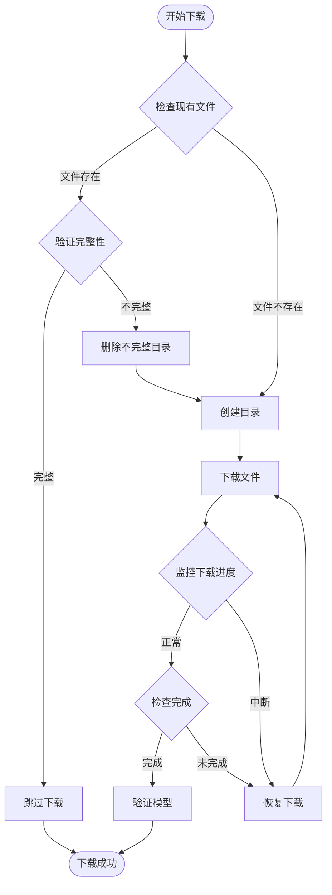

**图表来源**
- [download_models.py](file://download_models.py#L158-L172)

**章节来源**
- [download_models.py](file://download_models.py#L158-L172)

### 文本规范化组件

#### TTSFRD 集成

TTSFRD（中文文本规范化）是一个可选的高性能文本规范化包：

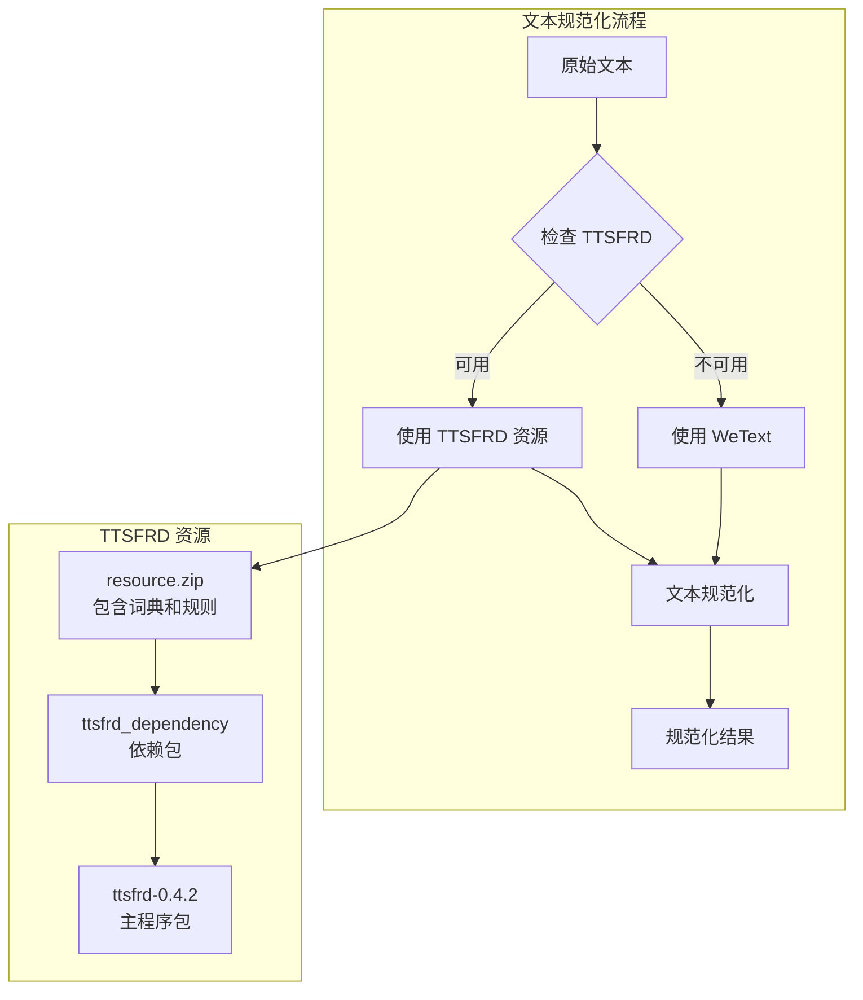

**图表来源**
- [README.md](file://README.md#L192-L201)

#### 性能对比

| 功能 | TTSFRD | WeText |
|------|--------|--------|
| 处理速度 | 更快 | 标准 |
| 准确性 | 更高 | 良好 |
| 资源占用 | 较高 | 较低 |
| 安装复杂度 | 中等 | 简单 |
| 适用场景 | 生产环境 | 开发测试 |

**章节来源**
- [README.md](file://README.md#L192-L201)

## 依赖关系分析

### 核心依赖关系

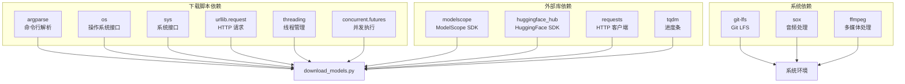

**图表来源**
- [download_models.py](file://download_models.py#L32-L38)
- [requirements_all.txt](file://requirements_all.txt#L86-L87)
- [requirements_all.txt](file://requirements_all.txt#L63)

### 模型依赖关系

```mermaid
erDiagram
MODEL {
string id PK
string name
string source
string size
string description
string dir
}
DEPENDENCY {
string model_id FK
string dependency_id FK
string version
string type
}
MODEL ||--o{ DEPENDENCY : "requires"
MODEL {
"iic/CosyVoice2-0.5B" ||--|| "iic/CosyVoice-ttsfrd"
"FunAudioLLM/Fun-CosyVoice3-0.5B-2512" ||--|| "iic/CosyVoice-ttsfrd"
"iic/CosyVoice-300M" ||--|| "iic/CosyVoice-ttsfrd"
}
```

**图表来源**
- [download_models.py](file://download_models.py#L84-L127)

**章节来源**
- [requirements_all.txt](file://requirements_all.txt#L86-L87)
- [requirements_all.txt](file://requirements_all.txt#L63)

## 性能考虑

### 并行下载优化

下载脚本采用了多层次的并行优化策略：

#### 线程池配置

| 组件 | 线程数 | 作用 | 优势 |
|------|--------|------|------|
| 模型下载线程池 | 3 | 同时下载最多3个模型 | 避免带宽浪费 |
| 文件下载线程池 | 6 | 每个模型内部文件下载 | 最大化单个模型下载速度 |
| **总计** | **18** | **并发连接数** | **充分利用网络带宽** |

#### 下载策略优化

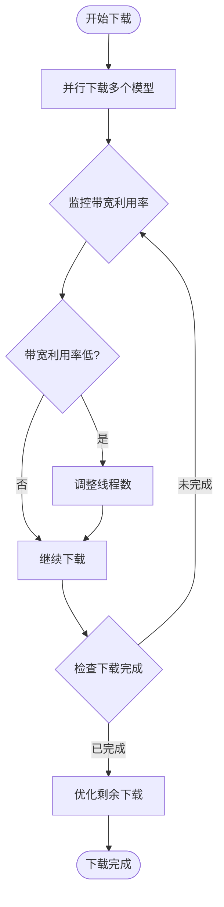

**图表来源**
- [download_models.py](file://download_models.py#L374-L397)

### 内存和磁盘优化

#### 内存使用优化

- **流式下载**: 使用流式下载避免大文件占用过多内存
- **分块传输**: 将大文件分割为小块进行传输和存储
- **垃圾回收**: 及时释放不再使用的内存资源

#### 磁盘空间管理

- **空间预检查**: 下载前检查磁盘空间是否充足
- **增量更新**: 支持模型的增量更新而非全量重下
- **清理机制**: 自动清理损坏或不完整的下载文件

**章节来源**
- [download_models.py](file://download_models.py#L374-L397)

## 故障排除指南

### 常见问题及解决方案

#### 代理配置问题

| 问题症状 | 可能原因 | 解决方案 |
|----------|----------|----------|
| 下载超时 | 代理设置错误 | 检查代理地址和端口 |
| 认证失败 | 代理需要认证 | 配置代理用户名密码 |
| 连接被拒绝 | 代理服务器不可用 | 更换代理服务器 |
| DNS 解析失败 | 代理 DNS 配置错误 | 检查代理 DNS 设置 |

#### 网络连接问题

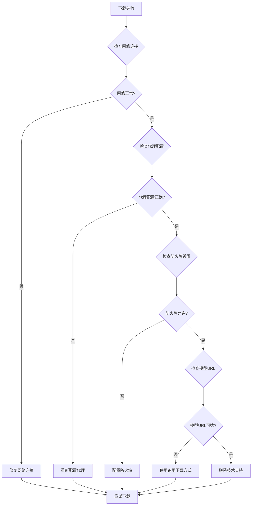

**图表来源**
- [download_models.py](file://download_models.py#L200-L208)

#### 模型完整性问题

| 问题类型 | 检测方法 | 修复方案 |
|----------|----------|----------|
| 文件损坏 | 校验文件大小和哈希值 | 重新下载损坏文件 |
| 下载中断 | 检查下载日志 | 使用断点续传功能 |
| 空目录 | 检查磁盘权限 | 清理空目录后重新下载 |
| 权限不足 | 检查文件权限 | 修改目录权限 |

**章节来源**
- [download_models.py](file://download_models.py#L200-L208)

### 调试和诊断

#### 日志记录

下载脚本提供了详细的日志记录功能：

- **调试级别**: 显示详细的下载过程信息
- **错误级别**: 记录下载失败的具体原因
- **警告级别**: 提醒潜在的问题和注意事项
- **信息级别**: 显示正常的下载状态和进度

#### 性能监控

- **下载速度**: 实时显示当前下载速度
- **剩余时间**: 预估剩余下载时间
- **成功率**: 统计各阶段的成功率
- **错误统计**: 记录各类错误的发生次数

## 结论

CosyVoice 的模型下载系统提供了完整、高效且可靠的模型获取解决方案。通过智能的代理配置、断点续传、并行下载和完善的错误处理机制，用户可以在各种网络环境下顺利完成模型下载。

### 主要优势

1. **多平台支持**: 同时支持 ModelScope 和 HuggingFace 两个主流平台
2. **智能代理**: 自动检测和配置代理设置，适应复杂的网络环境
3. **断点续传**: 网络中断后自动恢复，提高下载可靠性
4. **性能优化**: 多层次并行下载，最大化利用网络带宽
5. **易用性强**: 简洁的命令行接口，支持多种下载模式

### 未来发展方向

- **增量更新**: 支持模型的增量更新而非全量重下
- **智能缓存**: 实现更智能的本地缓存管理
- **批量管理**: 提供更强大的模型批量管理功能
- **云端同步**: 支持云端模型的同步和备份

通过本文档的指导，用户可以高效地下载和管理 CosyVoice 所需的预训练模型，为后续的语音合成应用开发奠定坚实的基础。