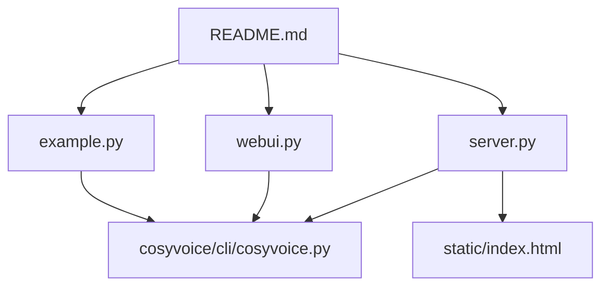
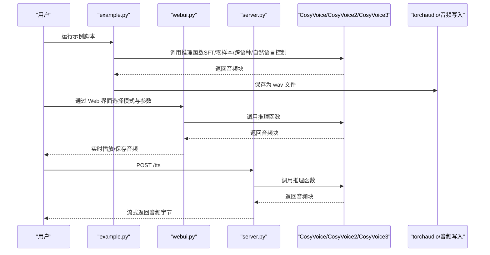
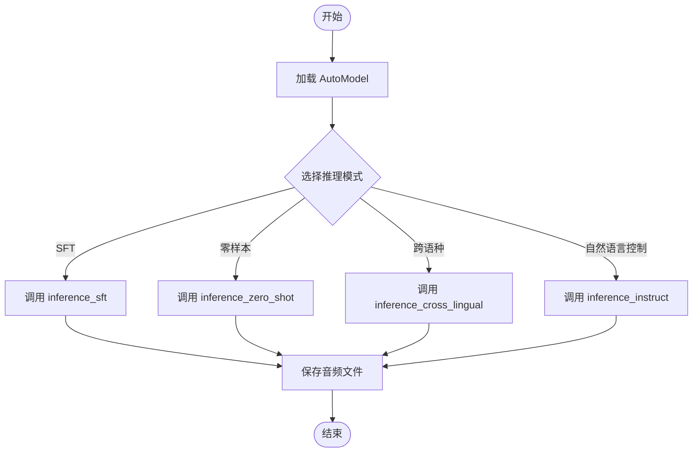
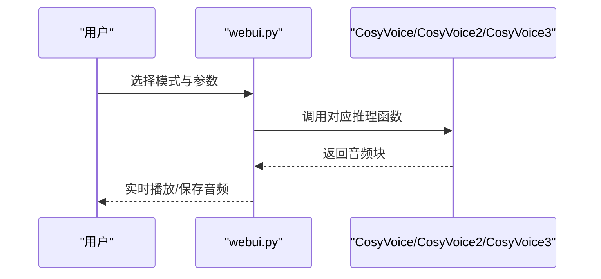
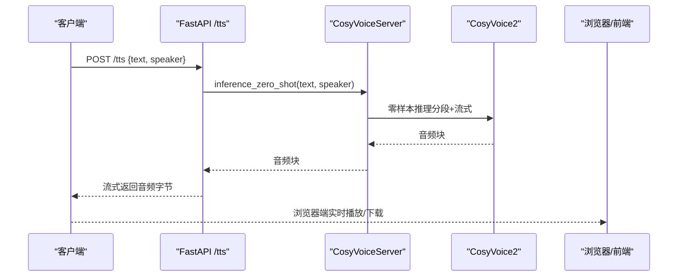
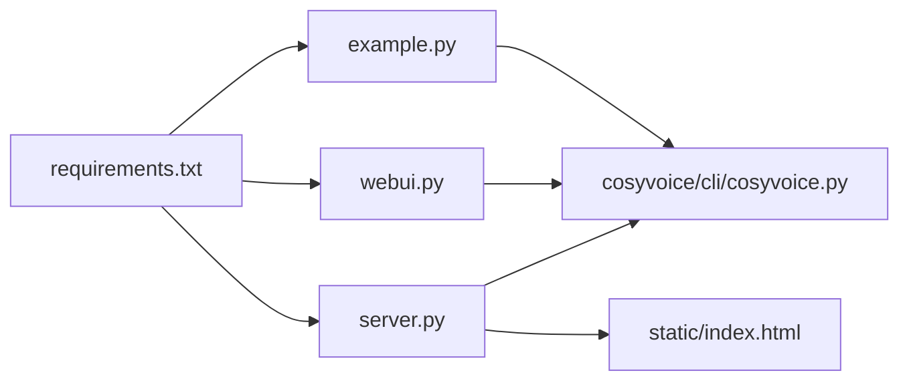

# 快速开始

<cite>
**本文引用的文件**
- [example.py](file://example.py)
- [webui.py](file://webui.py)
- [server.py](file://server.py)
- [README.md](file://README.md)
- [cosyvoice/cli/cosyvoice.py](file://cosyvoice/cli/cosyvoice.py)
- [pretrained_models/CosyVoice2-0.5B/cosyvoice2.yaml](file://pretrained_models/CosyVoice2-0.5B/cosyvoice2.yaml)
- [static/index.html](file://static/index.html)
- [requirements.txt](file://requirements.txt)
</cite>

## 目录
1. [简介](#简介)
2. [项目结构](#项目结构)
3. [核心组件](#核心组件)
4. [架构总览](#架构总览)
5. [详细组件解析](#详细组件解析)
6. [依赖关系分析](#依赖关系分析)
7. [性能注意事项](#性能注意事项)
8. [故障排查指南](#故障排查指南)
9. [结论](#结论)
10. [附录](#附录)

## 简介
本指南面向初学者，带你从零开始体验 CosyVoice 的基础推理能力。你将学会：
- 使用 example.py 中的示例代码进行 SFT、零样本、跨语种、自然语言控制等模式的推理；
- 使用 webui.py 启动图形界面，指定模型目录与端口；
- 使用 server.py 启动 FastAPI 服务，支持流式音频输出；
- 通过保存生成的音频文件，验证推理结果。

## 项目结构
以下为与“快速入门”密切相关的文件与职责概览：
- example.py：提供多种推理模式的示例调用，覆盖 SFT、零样本、跨语种、自然语言控制等；
- webui.py：基于 Gradio 的 Web 界面，支持多模式切换与参数控制；
- server.py：基于 FastAPI 的服务端，提供 /tts 接口与流式音频输出；
- cosyvoice/cli/cosyvoice.py：AutoModel/CosyVoice/CosyVoice2/CosyVoice3 的推理封装；
- pretrained_models/CosyVoice2-0.5B/cosyvoice2.yaml：CosyVoice2 模型配置示例；
- static/index.html：内置前端页面，配合 server.py 提供浏览器访问；
- requirements.txt：运行所需依赖清单。

图表来源
- [example.py](file://example.py#L1-L107)
- [webui.py](file://webui.py#L164-L182)
- [server.py](file://server.py#L441-L568)
- [cosyvoice/cli/cosyvoice.py](file://cosyvoice/cli/cosyvoice.py#L27-L137)
- [pretrained_models/CosyVoice2-0.5B/cosyvoice2.yaml](file://pretrained_models/CosyVoice2-0.5B/cosyvoice2.yaml#L1-L200)
- [static/index.html](file://static/index.html#L1-L846)
- [README.md](file://README.md#L203-L233)

章节来源
- [README.md](file://README.md#L203-L233)

## 核心组件
- AutoModel/CosyVoice/CosyVoice2/CosyVoice3：统一的推理入口，提供多种推理模式与参数控制；
- Web 界面（Gradio）：提供 SFT、3s极速复刻、跨语种复刻、自然语言控制四种模式；
- FastAPI 服务：提供 /tts 接口，支持长文本分段与流式音频输出；
- 配置文件：cosyvoice2.yaml 等，定义采样率、模型结构、前端处理等。

章节来源
- [cosyvoice/cli/cosyvoice.py](file://cosyvoice/cli/cosyvoice.py#L27-L137)
- [pretrained_models/CosyVoice2-0.5B/cosyvoice2.yaml](file://pretrained_models/CosyVoice2-0.5B/cosyvoice2.yaml#L1-L200)

## 架构总览
下面的序列图展示了从“调用推理”到“生成音频”的关键流程，分别对应 example.py、webui.py 和 server.py 的典型路径。

图表来源
- [example.py](file://example.py#L7-L34)
- [webui.py](file://webui.py#L50-L122)
- [server.py](file://server.py#L409-L439)
- [cosyvoice/cli/cosyvoice.py](file://cosyvoice/cli/cosyvoice.py#L80-L137)

## 详细组件解析

### 示例脚本：使用 example.py 进行基础推理
- 目标：通过最小改动即可运行，覆盖 SFT、零样本、跨语种、自然语言控制等模式；
- 关键点：
  - AutoModel(model_dir=...) 加载模型；
  - inference_sft、inference_zero_shot、inference_cross_lingual、inference_instruct 等方法；
  - 使用 torchaudio.save 保存生成的音频；
  - 可通过 stream 参数控制是否流式推理；
  - 可通过 speed 参数调整语速（部分模式支持）。

图表来源
- [example.py](file://example.py#L10-L33)

章节来源
- [example.py](file://example.py#L7-L34)

### Web 界面：使用 webui.py 启动图形界面
- 目标：通过浏览器快速体验 CosyVoice 的多模式推理；
- 关键点：
  - 命令行参数：--port、--model_dir；
  - 模式选择：预训练音色、3s极速复刻、跨语种复刻、自然语言控制；
  - 参数校验与提示：对 instruct 文本、prompt 音频、采样率等进行检查；
  - 流式推理：支持 stream 参数；
  - 种子控制：随机种子可调，便于复现实验。

图表来源
- [webui.py](file://webui.py#L125-L161)
- [webui.py](file://webui.py#L50-L122)

章节来源
- [webui.py](file://webui.py#L164-L182)
- [webui.py](file://webui.py#L125-L161)

### FastAPI 服务：使用 server.py 启动服务
- 目标：提供 /tts 接口，支持长文本分段与流式音频输出；
- 关键点：
  - /tts 接口：POST text、speaker，返回流式音频字节；
  - 文本规范化与分段：TextNormalizer 对输入文本进行规范化与智能分段；
  - CosyVoiceServer：封装推理流程，支持零样本推理与流式输出；
  - 说话人管理：支持从目录加载说话人、保存 spk2info；
  - 预热：启动时对默认说话人进行短句预热，提升首包延迟表现；
  - uvicorn 配置：支持 keep-alive、并发限制等。

图表来源
- [server.py](file://server.py#L409-L439)
- [server.py](file://server.py#L202-L301)
- [server.py](file://server.py#L441-L568)
- [static/index.html](file://static/index.html#L525-L684)

章节来源
- [server.py](file://server.py#L409-L439)
- [server.py](file://server.py#L202-L301)
- [server.py](file://server.py#L441-L568)
- [static/index.html](file://static/index.html#L525-L684)

### 推理模式详解与参数说明
- SFT（预训练音色）
  - 方法：inference_sft(tts_text, spk_id, stream=False, speed=1.0, text_frontend=True)
  - 适用场景：使用预训练音色进行语音合成；
  - 关键参数：
    - tts_text：合成文本；
    - spk_id：预训练音色 ID；
    - stream：是否流式输出；
    - speed：语速（非流式模式有效）；
    - text_frontend：是否启用前端文本处理。
- 零样本（3s极速复刻）
  - 方法：inference_zero_shot(tts_text, prompt_text, prompt_wav, zero_shot_spk_id='', stream=False, speed=1.0, text_frontend=True)
  - 适用场景：使用 prompt 音频与文本快速克隆音色；
  - 关键参数：
    - tts_text：目标合成文本；
    - prompt_text：与 prompt_wav 对应的文本；
    - prompt_wav：参考音频（采样率建议≥16kHz）；
    - zero_shot_spk_id：可选的零样本音色 ID；
    - stream/speed/text_frontend：同上。
- 跨语种复刻
  - 方法：inference_cross_lingual(tts_text, prompt_wav, zero_shot_spk_id='', stream=False, speed=1.0, text_frontend=True)
  - 适用场景：在不同语言之间进行音色迁移；
  - 关键参数：tts_text（目标语言文本）、prompt_wav（参考音频）。
- 自然语言控制（CosyVoice3）
  - 方法：inference_instruct(tts_text, spk_id, instruct_text, stream=False, speed=1.0, text_frontend=True)
  - 适用场景：通过 instruct 文本控制情感、语速、方言等；
  - 关键参数：instruct_text（控制指令）。
- 语音转换（VC）
  - 方法：inference_vc(source_wav, prompt_wav, stream=False, speed=1.0)
  - 适用场景：将一段音频转换为另一段音频的音色风格。

章节来源
- [cosyvoice/cli/cosyvoice.py](file://cosyvoice/cli/cosyvoice.py#L80-L137)

### 模型配置与采样率
- CosyVoice2 的配置文件示例展示了采样率、token 帧率、流式推理参数等关键配置项；
- 采样率在配置文件中定义，推理时会据此保存音频。

章节来源
- [pretrained_models/CosyVoice2-0.5B/cosyvoice2.yaml](file://pretrained_models/CosyVoice2-0.5B/cosyvoice2.yaml#L8-L14)

## 依赖关系分析
- example.py 依赖 cosyvoice/cli/cosyvoice.py 提供的 AutoModel/CosyVoice；
- webui.py 依赖 AutoModel 与 gradio；
- server.py 依赖 FastAPI、uvicorn、cosyvoice/cli/cosyvoice.py；
- static/index.html 为 server.py 的静态前端页面，与 /tts 接口配合使用；
- requirements.txt 列出了运行所需依赖。

图表来源
- [requirements.txt](file://requirements.txt#L1-L43)
- [example.py](file://example.py#L1-L10)
- [webui.py](file://webui.py#L14-L27)
- [server.py](file://server.py#L20-L38)
- [cosyvoice/cli/cosyvoice.py](file://cosyvoice/cli/cosyvoice.py#L14-L25)
- [static/index.html](file://static/index.html#L1-L846)

## 性能注意事项
- 流式推理：通过 stream=True 可降低首包延迟，适合实时场景；
- 语速调节：speed 参数在非流式模式下生效；
- 预热：server.py 启动时对默认说话人进行短句预热，有助于降低首次请求的延迟；
- keep-alive：server.py 使用 uvicorn 的 keep-alive 配置，减少连接建立开销；
- 采样率：确保 prompt 音频采样率不低于 16kHz，避免降采样带来的质量损失。

章节来源
- [webui.py](file://webui.py#L164-L182)
- [server.py](file://server.py#L559-L567)

## 故障排查指南
- 模型目录错误
  - 现象：无法加载模型或报错找不到配置文件；
  - 处理：确认 --model_dir 或 model_dir 指向正确的模型目录或模型仓库 ID。
- prompt 音频问题
  - 现象：跨语种或零样本模式报错或效果差；
  - 处理：确保 prompt_wav 采样率≥16kHz；prompt_text 与音频内容一致。
- instruct 文本问题
  - 现象：自然语言控制模式无效；
  - 处理：确保使用支持 instruct 的模型（如 CosyVoice-300M-Instruct），并在 instruct 文本中包含有效控制指令。
- 端口占用
  - 现象：启动 webui 或 server 报端口被占用；
  - 处理：修改 --port 参数或释放占用端口。
- 依赖缺失
  - 现象：运行时报错缺少依赖；
  - 处理：根据 requirements.txt 安装依赖，必要时使用镜像源加速。

章节来源
- [webui.py](file://webui.py#L58-L122)
- [server.py](file://server.py#L441-L456)
- [README.md](file://README.md#L168-L202)

## 结论
通过本指南，你可以：
- 快速运行 example.py，体验多种推理模式；
- 使用 webui.py 启动图形界面，直观地进行推理与保存；
- 使用 server.py 启动服务，结合 static/index.html 提供的前端页面进行在线体验；
- 理解各模式的参数与适用场景，按需调整 stream、speed、prompt 等参数以获得最佳效果。

## 附录

### 常用命令与参数
- 运行示例脚本
  - 命令：python example.py
  - 说明：执行 example.py 中的示例函数，生成多种模式的音频文件。
- 启动 Web 界面
  - 命令：python webui.py --port 50000 --model_dir pretrained_models/CosyVoice-300M
  - 说明：启动 Gradio 界面，监听 0.0.0.0:50000；--model_dir 指定模型目录或仓库 ID。
- 启动 FastAPI 服务
  - 命令：python server.py --port 50000 --model_dir pretrained_models/CosyVoice2-0.5B
  - 说明：启动 FastAPI 服务，监听 0.0.0.0:50000；/tts 接口支持流式音频输出。
- 浏览器访问
  - 地址：http://localhost:50000/static/index.html
  - 说明：访问内置前端页面，选择说话人并生成语音。

章节来源
- [README.md](file://README.md#L223-L233)
- [webui.py](file://webui.py#L164-L182)
- [server.py](file://server.py#L441-L568)
- [static/index.html](file://static/index.html#L1-L846)