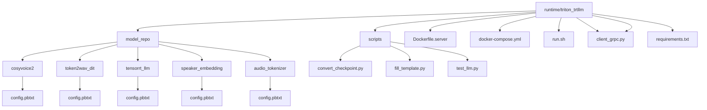
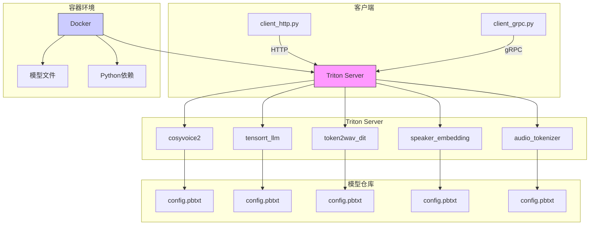
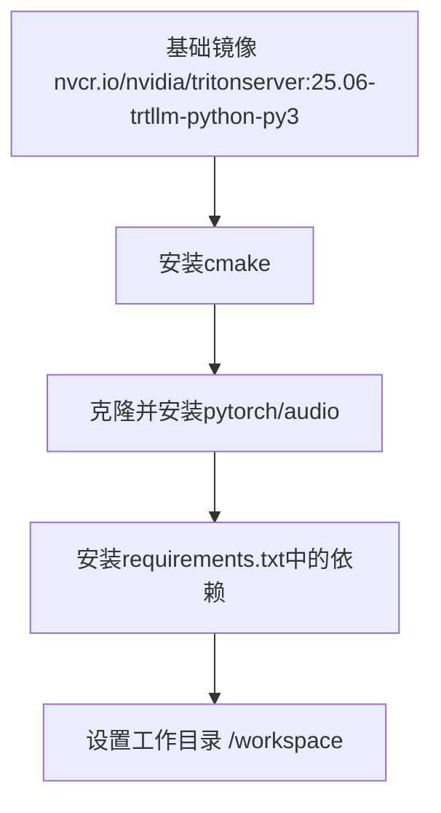
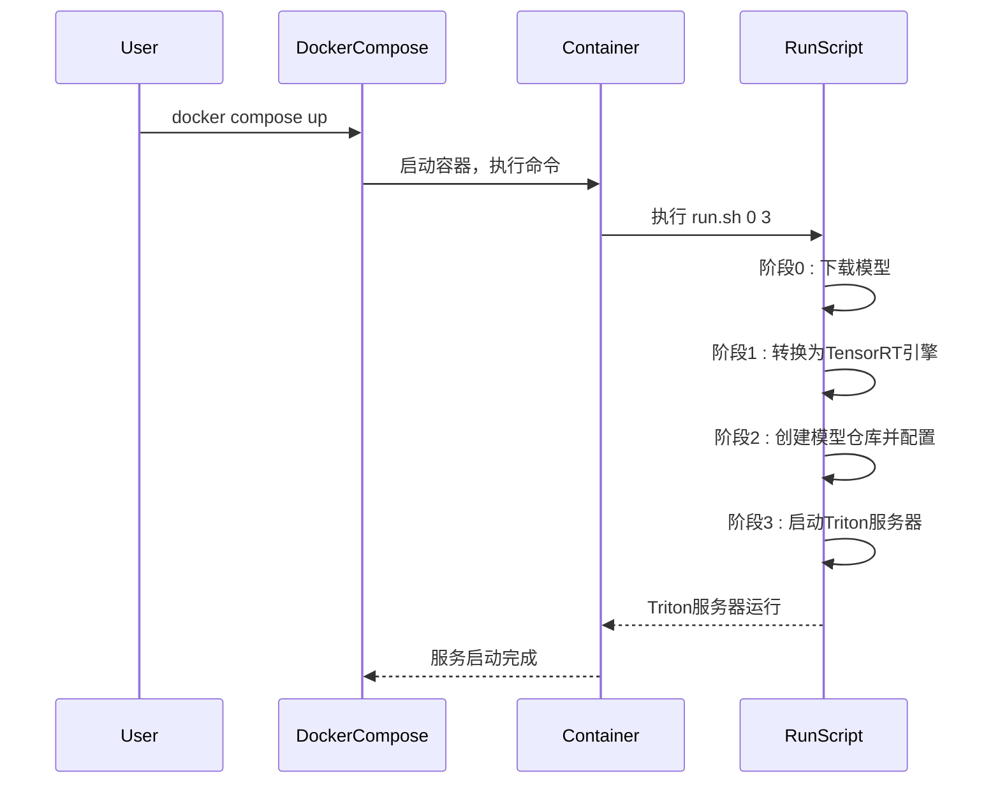
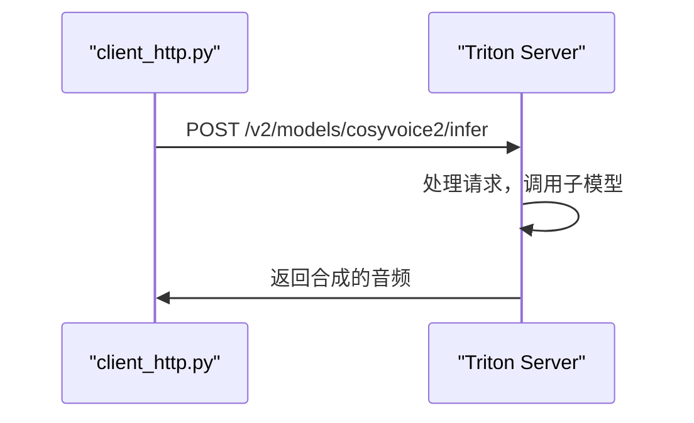
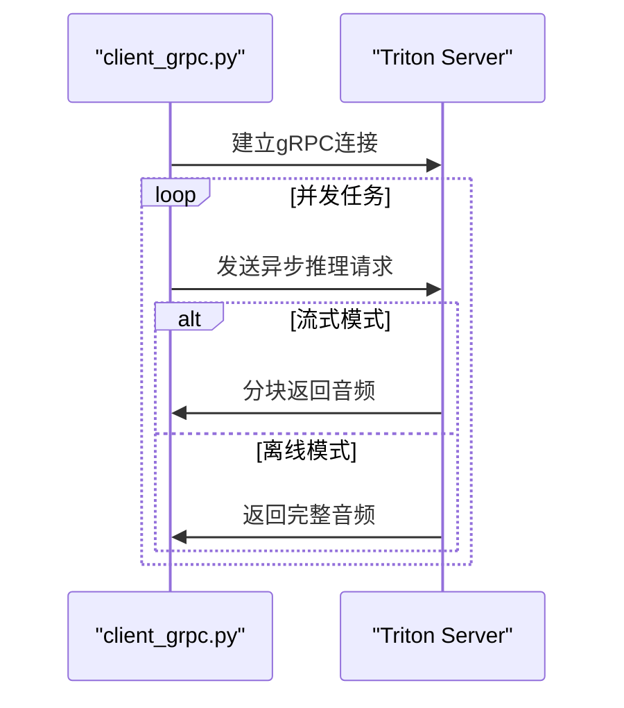
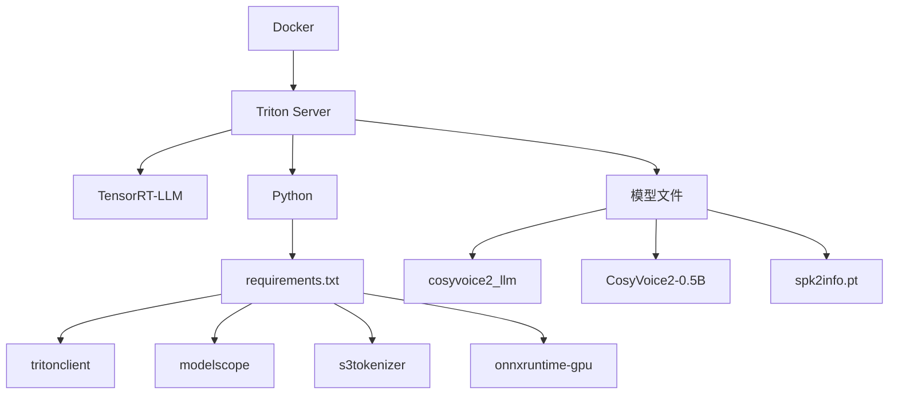

# Triton部署

<cite>
**本文档引用的文件**   
- [README.md](file://runtime/triton_trtllm/README.md)
- [Dockerfile.server](file://runtime/triton_trtllm/Dockerfile.server)
- [docker-compose.yml](file://runtime/triton_trtllm/docker-compose.yml)
- [run.sh](file://runtime/triton_trtllm/run.sh)
- [client_http.py](file://runtime/triton_trtllm/client_http.py)
- [client_grpc.py](file://runtime/triton_trtllm/client_grpc.py)
- [config.pbtxt](file://runtime/triton_trtllm/model_repo/cosyvoice2/config.pbtxt)
- [config.pbtxt](file://runtime/triton_trtllm/model_repo/token2wav_dit/config.pbtxt)
- [config.pbtxt](file://runtime/triton_trtllm/model_repo/tensorrt_llm/config.pbtxt)
- [config.pbtxt](file://runtime/triton_trtllm/model_repo/speaker_embedding/config.pbtxt)
- [config.pbtxt](file://runtime/triton_trtllm/model_repo/audio_tokenizer/config.pbtxt)
- [fill_template.py](file://runtime/triton_trtllm/scripts/fill_template.py)
- [offline_inference.py](file://runtime/triton_trtllm/offline_inference.py)
- [streaming_inference.py](file://runtime/triton_trtllm/streaming_inference.py)
- [requirements.txt](file://runtime/triton_trtllm/requirements.txt)
</cite>

## 目录
1. [简介](#简介)
2. [项目结构](#项目结构)
3. [核心组件](#核心组件)
4. [架构概述](#架构概述)
5. [详细组件分析](#详细组件分析)
6. [依赖分析](#依赖分析)
7. [性能考量](#性能考量)
8. [故障排除指南](#故障排除指南)
9. [结论](#结论)

## 简介
本文档详细描述了基于Triton Inference Server的CosyVoice语音合成模型部署架构。该部署方案利用NVIDIA Triton Inference Server和TensorRT-LLM技术，实现了高性能、可扩展的生产级语音合成服务。系统通过模块化的模型仓库（model_repo）组织多个子模型，如`cosyvoice2`和`token2wav_dit`，并利用Docker容器化技术确保环境的一致性和可移植性。通过`docker-compose.yml`和`run.sh`脚本协同工作，可以一键启动整个服务。客户端可通过`client_http.py`和`client_grpc.py`脚本发送推理请求，支持流式和离线两种模式。这种解耦的架构设计允许各个模型组件独立扩展和优化，是生产环境下的推荐部署方案。

## 项目结构
`runtime/triton_trtllm`目录是Triton Inference Server部署的核心，其结构清晰地体现了模块化和服务化的设计理念。该目录包含模型仓库（model_repo）、启动脚本、客户端工具和容器化配置文件。



**图示来源**
- [model_repo](file://runtime/triton_trtllm/model_repo)
- [scripts](file://runtime/triton_trtllm/scripts)
- [Dockerfile.server](file://runtime/triton_trtllm/Dockerfile.server)
- [docker-compose.yml](file://runtime/triton_trtllm/docker-compose.yml)
- [run.sh](file://runtime/triton_trtllm/run.sh)

**本节来源**
- [README.md](file://runtime/triton_trtllm/README.md#L1-L147)
- [project_structure](file://workspace_path)

## 核心组件
本部署方案的核心组件包括模型仓库中的各个子模型配置、用于构建运行环境的Dockerfile、用于启动服务的编排脚本以及用于发送推理请求的客户端工具。`model_repo`目录下的`config.pbtxt`文件定义了每个模型的版本、输入输出张量、实例组和后端配置，是Triton服务器管理模型的关键。`Dockerfile.server`文件基于NVIDIA官方的Triton Server镜像，构建了一个包含所有必要依赖的运行环境。`docker-compose.yml`和`run.sh`脚本则协同工作，自动化了从模型下载、转换、配置到服务启动的整个流程。`client_http.py`和`client_grpc.py`提供了两种协议的客户端示例，用于测试和基准测试。

**本节来源**
- [README.md](file://runtime/triton_trtllm/README.md#L1-L147)
- [Dockerfile.server](file://runtime/triton_trtllm/Dockerfile.server#L1-L8)
- [docker-compose.yml](file://runtime/triton_trtllm/docker-compose.yml#L1-L20)
- [run.sh](file://runtime/triton_trtllm/run.sh#L1-L143)

## 架构概述
该部署方案采用了一种解耦的微服务架构，将语音合成流程分解为多个独立的模型服务，由Triton Inference Server统一管理和调度。整个系统通过Docker容器化部署，确保了环境的隔离性和可移植性。



**图示来源**
- [client_http.py](file://runtime/triton_trtllm/client_http.py#L1-L173)
- [client_grpc.py](file://runtime/triton_trtllm/client_grpc.py#L1-L800)
- [model_repo](file://runtime/triton_trtllm/model_repo)
- [Dockerfile.server](file://runtime/triton_trtllm/Dockerfile.server#L1-L8)

## 详细组件分析

### 模型仓库配置分析
`model_repo`目录是Triton服务器的核心，其中每个子目录代表一个独立的模型服务。这些模型通过`config.pbtxt`文件进行配置，实现了服务的解耦和独立管理。

#### cosyvoice2模型配置
`cosyvoice2`模型是整个语音合成流程的协调者，它是一个Python后端模型，负责接收用户输入并调用其他子模型。

```mermaid
classDiagram
class cosyvoice2 {
+name : "cosyvoice2"
+backend : "python"
+max_batch_size : ${triton_max_batch_size}
+model_transaction_policy : {decoupled : ${decoupled_mode}}
+parameters : {llm_tokenizer_dir, model_dir}
+input : {reference_wav, reference_wav_len, reference_text, target_text}
+output : {waveform}
+instance_group : {count : ${bls_instance_num}, kind : KIND_CPU}
}
```

**图示来源**
- [config.pbtxt](file://runtime/triton_trtllm/model_repo/cosyvoice2/config.pbtxt#L1-L73)

**本节来源**
- [config.pbtxt](file://runtime/triton_trtllm/model_repo/cosyvoice2/config.pbtxt#L1-L73)
- [run.sh](file://runtime/triton_trtllm/run.sh#L79-L82)

#### token2wav_dit模型配置
`token2wav_dit`模型负责将语言模型生成的语音标记（speech tokens）转换为最终的音频波形，是语音合成的最后一步。

```mermaid
classDiagram
class token2wav_dit {
+name : "token2wav_dit"
+backend : "python"
+max_batch_size : ${triton_max_batch_size}
+dynamic_batching : {max_queue_delay_microseconds, priority_levels}
+parameters : {model_dir}
+input : {target_speech_tokens, reference_wav, reference_wav_len, finalize}
+output : {waveform}
+instance_group : {count : 1, kind : KIND_CPU}
}
```

**图示来源**
- [config.pbtxt](file://runtime/triton_trtllm/model_repo/token2wav_dit/config.pbtxt#L1-L69)

**本节来源**
- [config.pbtxt](file://runtime/triton_trtllm/model_repo/token2wav_dit/config.pbtxt#L1-L69)
- [run.sh](file://runtime/triton_trtllm/run.sh#L66-L67)

#### tensorrt_llm模型配置
`tensorrt_llm`模型是语言模型的核心，它使用TensorRT-LLM后端，将文本提示转换为语音标记序列，是整个流程的“大脑”。

```mermaid
classDiagram
class tensorrt_llm {
+name : "tensorrt_llm"
+backend : "${triton_backend}"
+max_batch_size : ${triton_max_batch_size}
+model_transaction_policy : {decoupled : ${decoupled_mode}}
+dynamic_batching : {preferred_batch_size, max_queue_delay_microseconds}
+input : {input_ids, encoder_input_features, input_lengths, request_output_len, ...}
+output : {output_ids, sequence_length, cum_log_probs, ...}
+instance_group : {count : 1, kind : KIND_CPU}
+parameters : {max_beam_width, gpt_model_path, max_tokens_in_paged_kv_cache, ...}
}
```

**图示来源**
- [config.pbtxt](file://runtime/triton_trtllm/model_repo/tensorrt_llm/config.pbtxt#L1-L800)

**本节来源**
- [config.pbtxt](file://runtime/triton_trtllm/model_repo/tensorrt_llm/config.pbtxt#L1-L800)
- [run.sh](file://runtime/triton_trtllm/run.sh#L82-L83)

#### 其他辅助模型配置
除了核心模型外，系统还包含用于提取说话人特征的辅助模型，这些模型在`use_spk2info_cache=False`时被调用。

```mermaid
classDiagram
class speaker_embedding {
+name : "speaker_embedding"
+backend : "python"
+max_batch_size : ${triton_max_batch_size}
+input : {reference_wav}
+output : {prompt_spk_embedding}
+instance_group : {count : 1, kind : KIND_CPU}
}
class audio_tokenizer {
+name : "audio_tokenizer"
+backend : "python"
+max_batch_size : ${triton_max_batch_size}
+input : {reference_wav, reference_wav_len}
+output : {prompt_speech_tokens}
+instance_group : {count : 1, kind : KIND_CPU}
}
```

**图示来源**
- [config.pbtxt](file://runtime/triton_trtllm/model_repo/speaker_embedding/config.pbtxt#L1-L48)
- [config.pbtxt](file://runtime/triton_trtllm/model_repo/audio_tokenizer/config.pbtxt#L1-L53)

**本节来源**
- [config.pbtxt](file://runtime/triton_trtllm/model_repo/speaker_embedding/config.pbtxt#L1-L48)
- [config.pbtxt](file://runtime/triton_trtllm/model_repo/audio_tokenizer/config.pbtxt#L1-L53)
- [run.sh](file://runtime/triton_trtllm/run.sh#L67-L70)

### Docker构建与服务启动分析
`Dockerfile.server`和`docker-compose.yml`文件共同定义了服务的运行环境和启动流程。

#### Dockerfile.server分析
该文件基于NVIDIA官方的Triton Server镜像，添加了必要的系统依赖和Python包，构建了一个完整的运行环境。



**图示来源**
- [Dockerfile.server](file://runtime/triton_trtllm/Dockerfile.server#L1-L8)

**本节来源**
- [Dockerfile.server](file://runtime/triton_trtllm/Dockerfile.server#L1-L8)
- [requirements.txt](file://runtime/triton_trtllm/requirements.txt#L1-L15)

#### docker-compose.yml与run.sh协同分析
`docker-compose.yml`定义了服务的容器化部署，而`run.sh`脚本则在容器内部执行复杂的初始化和启动逻辑。



**图示来源**
- [docker-compose.yml](file://runtime/triton_trtllm/docker-compose.yml#L1-L20)
- [run.sh](file://runtime/triton_trtllm/run.sh#L1-L143)

**本节来源**
- [docker-compose.yml](file://runtime/triton_trtllm/docker-compose.yml#L1-L20)
- [run.sh](file://runtime/triton_trtllm/run.sh#L1-L143)

### 推理请求示例分析
系统提供了HTTP和gRPC两种客户端，用于发送推理请求和进行基准测试。

#### HTTP客户端分析
`client_http.py`脚本展示了如何通过HTTP协议发送一个离线TTS请求。



**图示来源**
- [client_http.py](file://runtime/triton_trtllm/client_http.py#L1-L173)

**本节来源**
- [client_http.py](file://runtime/triton_trtllm/client_http.py#L1-L173)
- [README.md](file://runtime/triton_trtllm/README.md#L56-L61)

#### gRPC客户端分析
`client_grpc.py`脚本支持并发和流式请求，功能更为强大。



**图示来源**
- [client_grpc.py](file://runtime/triton_trtllm/client_grpc.py#L1-L800)

**本节来源**
- [client_grpc.py](file://runtime/triton_trtllm/client_grpc.py#L1-L800)
- [README.md](file://runtime/triton_trtllm/README.md#L63-L71)

## 依赖分析
该部署方案的依赖关系清晰，主要分为容器基础依赖、Python包依赖和模型文件依赖。



**图示来源**
- [Dockerfile.server](file://runtime/triton_trtllm/Dockerfile.server#L1-L8)
- [requirements.txt](file://runtime/triton_trtllm/requirements.txt#L1-L15)
- [run.sh](file://runtime/triton_trtllm/run.sh#L30-L34)

**本节来源**
- [Dockerfile.server](file://runtime/triton_trtllm/Dockerfile.server#L1-L8)
- [requirements.txt](file://runtime/triton_trtllm/requirements.txt#L1-L15)
- [run.sh](file://runtime/triton_trtllm/run.sh#L30-L34)

## 性能考量
该部署方案通过多种技术实现了高性能服务化。首先，利用TensorRT-LLM对语言模型进行优化，显著提升了推理速度。其次，Triton Inference Server的动态批处理（dynamic batching）功能可以将多个小请求合并处理，提高GPU利用率。此外，系统支持流式（streaming）和离线（offline）两种模式，流式模式可以降低首包延迟，提升用户体验。通过`use_spk2info_cache`参数，可以缓存说话人信息，避免重复计算，进一步提升性能。基准测试结果表明，该方案在单张L20 GPU上能够高效处理大量语音合成请求。

**本节来源**
- [README.md](file://runtime/triton_trtllm/README.md#L91-L125)
- [run.sh](file://runtime/triton_trtllm/run.sh#L18-L19)
- [config.pbtxt](file://runtime/triton_trtllm/model_repo/tensorrt_llm/config.pbtxt#L35-L39)

## 故障排除指南
在部署和使用过程中，可能会遇到一些常见问题。首先，确保Docker和NVIDIA Container Toolkit已正确安装。如果服务启动失败，请检查`run.sh`脚本的输出日志，确认模型下载和转换是否成功。如果推理请求超时，可能是GPU内存不足，可以尝试降低`max_batch_size`。如果遇到gRPC连接问题，请确认`docker-compose.yml`中暴露的端口（8000, 8001, 8002）没有被占用。对于流式模式的问题，可以检查`client_grpc.py`中的`chunk_overlap_duration`参数设置。如果性能不达标，建议参考文档中的基准测试结果进行调优。

**本节来源**
- [README.md](file://runtime/triton_trtllm/README.md#L91-L125)
- [run.sh](file://runtime/triton_trtllm/run.sh#L90-L91)
- [client_grpc.py](file://runtime/triton_trtllm/client_grpc.py#L437-L454)

## 结论
本文档详细阐述了基于Triton Inference Server的CosyVoice部署方案。该方案通过将复杂的语音合成流程解耦为多个独立的模型服务，实现了高度的模块化和可扩展性。利用`config.pbtxt`文件，可以精确控制每个模型的版本、输入输出、实例数量和后端配置。通过Docker容器化，确保了部署环境的一致性和可移植性。`docker-compose.yml`和`run.sh`脚本的结合，使得服务的启动和管理变得自动化和简单。客户端工具提供了HTTP和gRPC两种接口，方便集成和测试。这种架构不仅能够满足生产环境对高性能和高可用性的要求，还为未来的功能扩展和性能优化提供了坚实的基础，是推荐的生产级部署方案。