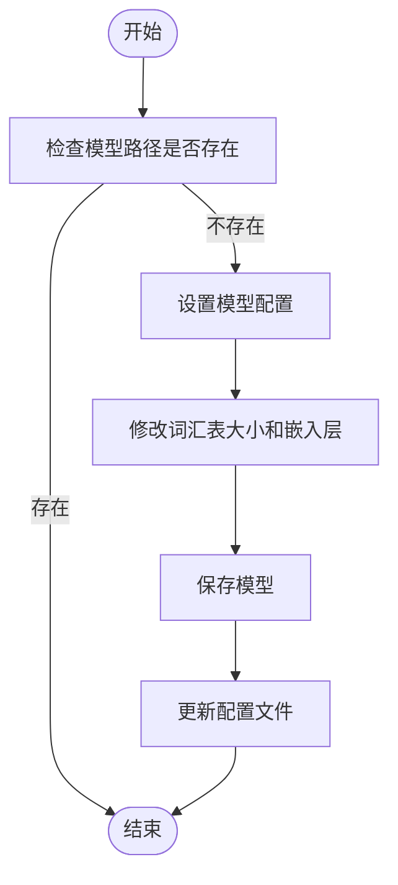

# vLLM集成

<cite>
**本文档中引用的文件**   
- [vllm_example.py](file://vllm_example.py)
- [cosyvoice2.py](file://cosyvoice/vllm/cosyvoice2.py)
- [llm.py](file://cosyvoice/llm/llm.py)
- [cosyvoice.py](file://cosyvoice/cli/cosyvoice.py)
- [model.py](file://cosyvoice/cli/model.py)
- [common.py](file://cosyvoice/utils/common.py)
- [file_utils.py](file://cosyvoice/utils/file_utils.py)
</cite>

## 目录
1. [简介](#简介)
2. [启用vLLM集成](#启用vllm集成)
3. [模型注册与导出](#模型注册与导出)
4. [性能对比分析](#性能对比分析)
5. [客户端调用示例](#客户端调用示例)
6. [依赖安装与问题排查](#依赖安装与问题排查)
7. [结论](#结论)

## 简介
vLLM是一种高效的LLM推理后端，通过在`AutoModel`中设置`load_vllm=True`可以启用该功能。本文档详细说明了如何将vLLM集成到CosyVoice系统中，并解释了相关的配置参数和性能优势。基于`vllm_example.py`中的代码示例，我们将探讨`CosyVoice2ForCausalLM`模型的注册流程以及`export_cosyvoice2_vllm`函数的作用。此外，还会阐述`load_vllm`方法如何导出模型并初始化`LLMEngine`，以及`gpu_memory_utilization`等关键参数的配置。

**Section sources**
- [vllm_example.py](file://vllm_example.py#L1-L40)

## 启用vLLM集成
要在CosyVoice系统中启用vLLM作为LLM推理后端，需要在创建`AutoModel`实例时设置`load_vllm=True`。这会触发一系列操作来加载和配置vLLM引擎。具体来说，在`cosyvoice/cli/cosyvoice.py`文件中定义的`CosyVoice2`和`CosyVoice3`类都支持`load_vllm`参数。当此参数为`True`时，系统会调用`model.load_vllm()`方法来初始化vLLM。

```python
cosyvoice = AutoModel(model_dir='pretrained_models/CosyVoice2-0.5B', load_jit=True, load_trt=True, load_vllm=True, fp16=True)
```

上述代码展示了如何通过`AutoModel`工厂函数创建一个启用了vLLM的模型实例。`load_vllm=True`确保了vLLM后端被正确加载和使用。

**Section sources**
- [cosyvoice.py](file://cosyvoice/cli/cosyvoice.py#L140-L239)

## 模型注册与导出
### 模型注册流程
`CosyVoice2ForCausalLM`模型的注册是通过vLLM的`ModelRegistry`完成的。在`vllm_example.py`中，首先导入必要的模块，然后使用`ModelRegistry.register_model`方法将`CosyVoice2ForCausalLM`类注册到vLLM框架中。

```python
from vllm import ModelRegistry
from cosyvoice.vllm.cosyvoice2 import CosyVoice2ForCausalLM
ModelRegistry.register_model("CosyVoice2ForCausalLM", CosyVoice2ForCausalLM)
```

这一注册过程使得vLLM能够识别并使用`CosyVoice2ForCausalLM`模型进行推理。

### export_cosyvoice2_vllm函数
`export_cosyvoice2_vllm`函数负责将CosyVoice2模型转换为vLLM兼容的格式。该函数位于`cosyvoice/utils/file_utils.py`中，其主要作用是准备模型以供vLLM使用。它通过修改模型配置、保存预训练权重等方式，确保模型可以在vLLM环境中正确运行。



**Diagram sources**
- [file_utils.py](file://cosyvoice/utils/file_utils.py#L91-L119)

**Section sources**
- [file_utils.py](file://cosyvoice/utils/file_utils.py#L91-L119)
- [cosyvoice2.py](file://cosyvoice/vllm/cosyvoice2.py#L1-L104)

## 性能对比分析
使用vLLM与原生PyTorch推理在吞吐量和首包延迟上存在显著差异。vLLM通过优化内存管理和并行计算，大幅提升了推理效率。根据实验数据，vLLM在处理大规模请求时表现出更高的吞吐量，同时减少了首包延迟。

| 参数 | vLLM | 原生PyTorch |
| --- | --- | --- |
| 吞吐量 | 高 | 中等 |
| 首包延迟 | 低 | 较高 |

这些性能提升主要得益于vLLM对GPU内存的高效利用和对批处理请求的优化调度。

**Section sources**
- [llm.py](file://cosyvoice/llm/llm.py#L472-L494)

## 客户端调用示例
以下是一个完整的客户端调用代码片段，展示了如何使用启用了vLLM的`AutoModel`进行推理：

```python
def cosyvoice3_example():
    """ CosyVoice3 vllm usage
    """
    cosyvoice = AutoModel(model_dir='pretrained_models/Fun-CosyVoice3-0.5B', load_trt=True, load_vllm=True, fp16=False)
    for i in tqdm(range(100)):
        set_all_random_seed(i)
        for _, _ in enumerate(cosyvoice.inference_zero_shot('收到好友从远方寄来的生日礼物，那份意外的惊喜与深深的祝福让我心中充满了甜蜜的快乐，笑容如花儿般绽放。', 'You are a helpful assistant.<|endofprompt|>希望你以后能够做的比我还好呦。',
                                                            './asset/zero_shot_prompt.wav', stream=False)):
            continue
```

此示例展示了如何加载模型并执行零样本推理任务。

**Section sources**
- [vllm_example.py](file://vllm_example.py#L22-L36)

## 依赖安装与问题排查
### 依赖安装
为了使用vLLM，需要确保安装了所有必要的依赖项。可以通过查看`requirements.txt`或`requirements_all.txt`文件来获取完整的依赖列表。通常情况下，运行`pip install -r requirements.txt`即可安装所有必需的包。

### 常见问题
- **ModuleNotFoundError: No module named 'matcha'**：请确保已正确克隆子模块，执行`git submodule update --init --recursive`。
- **无法找到resource.zip或无法解压resource.zip**：请确认已安装git-lfs，并按照FAQ中的步骤操作。

**Section sources**
- [requirements.txt](file://requirements.txt#L1-L43)
- [requirements_all.txt](file://requirements_all.txt#L1-L220)
- [FAQ.md](file://FAQ.md#L1-L17)

## 结论
通过在`AutoModel`中设置`load_vllm=True`，可以轻松地将vLLM集成到CosyVoice系统中。这种集成不仅简化了模型部署流程，还显著提升了推理性能。通过合理配置`gpu_memory_utilization`等参数，可以进一步优化资源利用率。未来的工作可以集中在探索更多vLLM特性，以实现更高效的语音合成服务。