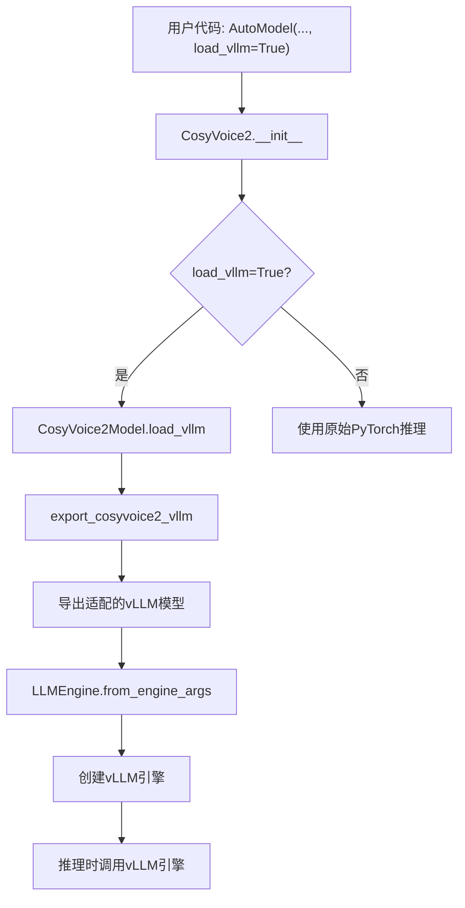

# 性能优化

<cite>
**本文档引用的文件**   
- [cosyvoice/cli/cosyvoice.py](file://cosyvoice/cli/cosyvoice.py)
- [cosyvoice/cli/model.py](file://cosyvoice/cli/model.py)
- [cosyvoice/utils/file_utils.py](file://cosyvoice/utils/file_utils.py)
- [vllm_example.py](file://vllm_example.py)
- [runtime/triton_trtllm/README.md](file://runtime/triton_trtllm/README.md)
- [runtime/triton_trtllm/run.sh](file://runtime/triton_trtllm/run.sh)
- [runtime/triton_trtllm/client_grpc.py](file://runtime/triton_trtllm/client_grpc.py)
- [runtime/triton_trtllm/offline_inference.py](file://runtime/triton_trtllm/offline_inference.py)
- [fast_server_opt_ttfb.py](file://fast_server_opt_ttfb.py)
</cite>

## 目录
1. [模型量化](#模型量化)
2. [TensorRT加速Flow模块](#tensorrt加速flow模块)
3. [vLLM集成](#vllm集成)
4. [Triton Inference Server集成](#triton-inference-server集成)
5. [首包延迟（TTFB）优化策略](#首包延迟ttfb优化策略)
6. [性能基准测试与比较](#性能基准测试与比较)

## 模型量化

CosyVoice通过模型量化技术显著提升推理速度。核心方法是使用`load_jit=True`和`fp16=True`参数来加速推理过程。

`load_jit=True`参数用于加载通过TorchScript JIT编译优化的模型组件。在`CosyVoice`、`CosyVoice2`和`CosyVoice3`类的初始化过程中，当`load_jit`设置为`True`时，系统会加载预编译的JIT模型文件。例如，对于`CosyVoice`模型，它会加载`llm.text_encoder`、`llm.llm`和`flow.encoder`的JIT版本。这些JIT模型是通过`cosyvoice/bin/export_jit.py`脚本预先导出的，能够绕过Python解释器的开销，直接在C++层面执行，从而大幅提高推理速度。

`fp16=True`参数则启用了FP16混合精度计算。在模型初始化时，如果`fp16`为`True`且GPU可用，模型的计算将使用半精度浮点数（FP16）进行。这不仅减少了显存占用，还利用了现代GPU对FP16运算的硬件加速，进一步提升了计算效率。在`CosyVoiceModel`基类中，`fp16`标志被传递给`torch.cuda.amp.autocast`上下文管理器，确保在推理过程中自动进行精度转换。

**Section sources**
- [cosyvoice/cli/cosyvoice.py](file://cosyvoice/cli/cosyvoice.py#L29-L63)
- [cosyvoice/cli/model.py](file://cosyvoice/cli/model.py#L74-L81)

## TensorRT加速Flow模块

CosyVoice利用NVIDIA TensorRT来加速其Flow模块的推理过程。该技术通过将ONNX模型转换为高度优化的TensorRT引擎，实现极致的推理性能。

启用此功能需要在模型初始化时设置`load_trt=True`。系统会检查对应的TensorRT引擎文件（`.plan`文件）是否存在。如果不存在，`convert_onnx_to_trt`函数会自动调用TensorRT API，将提供的ONNX模型（如`flow.decoder.estimator.fp32.onnx`）转换为TensorRT引擎。转换过程会指定输入张量的最小、最优和最大形状，以支持动态批处理和输入长度。

在`CosyVoiceModel`类中，`load_trt`方法负责加载已生成的TensorRT引擎。它使用`TrtContextWrapper`类来管理一个执行上下文池，允许多个推理请求并发执行，从而最大化GPU利用率。`TrtContextWrapper`内部维护一个队列，存放创建好的`trt.IExecutionContext`和`torch.cuda.Stream`，在推理时从池中获取，使用完毕后归还，避免了频繁创建和销毁上下文的开销。

**Section sources**
- [cosyvoice/cli/model.py](file://cosyvoice/cli/model.py#L82-L98)
- [cosyvoice/utils/file_utils.py](file://cosyvoice/utils/file_utils.py#L53-L88)
- [cosyvoice/utils/common.py](file://cosyvoice/utils/common.py#L198-L213)

## vLLM集成

CosyVoice集成了vLLM库来加速大型语言模型（LLM）的推理。vLLM通过PagedAttention等技术，显著提高了吞吐量和推理速度。

要启用vLLM加速，需在初始化`CosyVoice2`或`CosyVoice3`模型时设置`load_vllm=True`。该过程首先调用`export_cosyvoice2_vllm`函数，将原始的CosyVoice2 LLM模型适配并导出为vLLM兼容的格式。此函数会修改模型的配置，例如将`vocab_size`设置为语音嵌入的词汇量，并移除不必要的生成配置。

导出完成后，系统会使用`LLMEngine`从导出的目录加载模型。`CosyVoice2Model`的`load_vllm`方法会创建一个`LLMEngine`实例，并将其挂载到模型的`vllm`属性上。在推理时，`llm_job`方法会调用vLLM引擎进行流式或非流式生成，从而绕过原始的PyTorch推理流程，获得显著的性能提升。

`vllm_example.py`文件提供了具体的使用示例，展示了如何通过`AutoModel`工厂函数并设置`load_vllm=True`来启用此功能。

**Diagram sources **
- [vllm_example.py](file://vllm_example.py#L15-L29)
- [cosyvoice/cli/cosyvoice.py](file://cosyvoice/cli/cosyvoice.py#L141-L178)
- [cosyvoice/utils/file_utils.py](file://cosyvoice/utils/file_utils.py#L92-L118)

**Section sources**
- [vllm_example.py](file://vllm_example.py#L15-L29)
- [cosyvoice/cli/cosyvoice.py](file://cosyvoice/cli/cosyvoice.py#L141-L178)
- [cosyvoice/cli/model.py](file://cosyvoice/cli/model.py#L268-L278)
- [cosyvoice/utils/file_utils.py](file://cosyvoice/utils/file_utils.py#L92-L118)

## Triton Inference Server集成

CosyVoice支持与NVIDIA Triton Inference Server和TensorRT-LLM深度集成，以实现生产级的高性能部署。

集成的核心位于`runtime/triton_trtllm`目录。用户可以通过`docker compose up`命令快速启动服务。该流程由`run.sh`脚本驱动，分为多个阶段：
1.  **下载模型**：从HuggingFace或ModelScope下载`CosyVoice2-0.5B`模型。
2.  **转换与编译**：使用`scripts/convert_checkpoint.py`将HuggingFace检查点转换为TensorRT-LLM格式，然后通过`trtllm-build`命令编译生成TensorRT引擎。
3.  **配置模型仓库**：`scripts/fill_template.py`脚本会根据模板创建Triton所需的`config.pbtxt`文件，配置模型的输入输出、批处理大小和后端参数。
4.  **启动服务器**：运行`tritonserver`命令，加载配置好的模型仓库。
5.  **进行测试与基准测试**：提供`client_http.py`和`client_grpc.py`等客户端脚本，用于测试和评估服务性能。

这种集成方式支持流式（streaming）和离线（offline）两种模式。通过Triton的动态批处理和并发执行，可以最大化硬件利用率，实现高吞吐量的语音合成服务。

**Section sources**
- [runtime/triton_trtllm/README.md](file://runtime/triton_trtllm/README.md)
- [runtime/triton_trtllm/run.sh](file://runtime/triton_trtllm/run.sh)
- [runtime/triton_trtllm/client_grpc.py](file://runtime/triton_trtllm/client_grpc.py)

## 首包延迟（TTFB）优化策略

CosyVoice提供了多种高级策略来优化首包延迟（Time To First Byte, TTFB），这对于交互式语音应用至关重要。

主要策略包括：
*   **流式处理（Streaming）**：系统支持文本输入和音频输出的双向流式传输。通过`stream=True`参数，LLM可以边生成语音标记（speech tokens）边传递给Flow模块进行解码，无需等待整个文本生成完毕，从而大大降低了TTFB。
*   **上下文预加载**：`fast_server_opt_ttfb.py`中的`FastCosyVoice2`类实现了一种优化方案。它在添加新说话人时，会预计算并缓存Flow模块中与提示音频（prompt）相关的中间状态（如`prompt_encoded_proj`、`prompt_speech_feat`等）。在后续推理时，首块音频的生成可以直接利用这些缓存，跳过耗时的编码器计算，显著减少延迟。
*   **参数调优**：通过精细调整`token_hop_len_first`（首块hop长度）和`pre_lookahead_len`（前瞻长度）等参数，可以在延迟和音质之间取得最佳平衡。较小的`token_hop_len_first`意味着更早地开始生成首块音频。

**Section sources**
- [fast_server_opt_ttfb.py](file://fast_server_opt_ttfb.py#L322-L1014)

## 性能基准测试与比较

项目提供了详尽的性能基准测试结果，清晰地展示了各项优化技术带来的速度差异。

根据`runtime/triton_trtllm/README.md`中的基准测试数据：
*   **vLLM vs HuggingFace**: 在离线推理模式下，使用TensorRT-LLM后端相比HuggingFace后端，RTF（实时因子）从0.2494（batch size=1）降低至0.0987，速度提升超过2.5倍。随着批处理大小增加，性能优势更加明显。
*   **Triton-LLM流式TTS**：在流式TTS模式下，使用`use_spk2info_cache=True`时，首块平均延迟可低至189.88ms，RTF为0.1155，满足了低延迟交互的需求。

这些基准测试证明，通过结合模型量化、TensorRT加速、vLLM集成和Triton部署，CosyVoice能够实现从数倍到数十倍的性能提升，为大规模、低延迟的语音合成应用提供了坚实的技术基础。

**Section sources**
- [runtime/triton_trtllm/README.md](file://runtime/triton_trtllm/README.md#L91-L125)