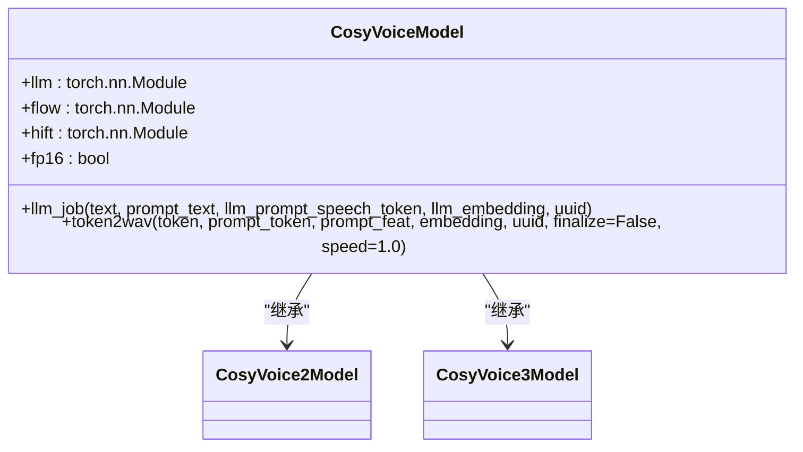

# 模型量化

<cite>
**本文档引用的文件**   
- [model.py](file://cosyvoice/cli/model.py)
- [cosyvoice.py](file://cosyvoice/cli/cosyvoice.py)
- [example.py](file://example.py)
- [train_utils.py](file://cosyvoice/utils/train_utils.py)
- [convert_checkpoint.py](file://runtime/triton_trtllm/scripts/convert_checkpoint.py)
</cite>

## 目录
1. [简介](#简介)
2. [模型量化概述](#模型量化概述)
3. [FP16量化实现](#fp16量化实现)
4. [代码示例与应用](#代码示例与应用)
5. [性能权衡与适用场景](#性能权衡与适用场景)
6. [结论](#结论)

## 简介
CosyVoice模型通过量化技术优化推理性能，特别是在显存占用和推理速度方面。本文档详细解释如何通过设置`fp16=True`在加载模型时启用半精度浮点数（FP16）量化，并结合`cosyvoice/cli/model.py`中的`CosyVoiceModel`、`CosyVoice2Model`和`CosyVoice3Model`类，说明量化在`torch.cuda.amp.autocast`上下文管理器中的实际应用。

**Section sources**
- [model.py](file://cosyvoice/cli/model.py#L29-L431)

## 模型量化概述
模型量化是一种通过降低模型参数的数值精度来减少模型大小和计算复杂度的技术。在CosyVoice模型中，FP16量化通过将模型参数从32位浮点数（FP32）转换为16位浮点数（FP16），从而减少显存占用并加速推理过程。

**Section sources**
- [model.py](file://cosyvoice/cli/model.py#L29-L431)

## FP16量化实现
在CosyVoice模型中，FP16量化通过`torch.cuda.amp.autocast`上下文管理器实现。`autocast`允许在推理过程中自动选择合适的精度进行计算，从而在保持模型精度的同时提高计算效率。

### CosyVoiceModel类
`CosyVoiceModel`类在初始化时接受一个`fp16`参数，该参数决定是否启用FP16量化。在`llm_job`和`token2wav`方法中，`torch.cuda.amp.autocast`上下文管理器根据`fp16`参数的值决定是否使用FP16进行计算。



**Diagram sources **
- [model.py](file://cosyvoice/cli/model.py#L29-L431)

### CosyVoice2Model和CosyVoice3Model类
`CosyVoice2Model`和`CosyVoice3Model`类继承自`CosyVoiceModel`，并在初始化时同样接受`fp16`参数。这些类在推理过程中使用`torch.cuda.amp.autocast`上下文管理器来实现FP16量化。

**Section sources**
- [model.py](file://cosyvoice/cli/model.py#L237-L431)

## 代码示例与应用
以下代码示例展示了如何在`AutoModel`初始化中使用`fp16=True`来启用FP16量化。

```python
from cosyvoice.cli.cosyvoice import AutoModel

# 初始化模型并启用FP16量化
cosyvoice = AutoModel(model_dir='pretrained_models/CosyVoice-300M-SFT', fp16=True)

# 使用模型进行推理
for i, j in enumerate(cosyvoice.inference_sft('你好，我是通义生成式语音大模型，请问有什么可以帮您的吗？', '中文女', stream=False)):
    torchaudio.save('sft_{}.wav'.format(i), j['tts_speech'], cosyvoice.sample_rate)
```

**Section sources**
- [example.py](file://example.py#L1-L107)
- [cosyvoice.py](file://cosyvoice/cli/cosyvoice.py#L228-L239)

## 性能权衡与适用场景
FP16量化在减少显存占用和加速推理过程的同时，可能会带来一定的精度损失。因此，在选择是否启用FP16量化时，需要根据具体应用场景进行权衡。

### 适用场景
- **资源受限环境**：在显存有限的设备上，FP16量化可以显著减少显存占用，使模型能够在这些设备上运行。
- **实时推理**：在需要快速响应的应用中，FP16量化可以加速推理过程，提高用户体验。

### 不适用场景
- **高精度要求**：在对模型精度要求极高的应用中，FP16量化可能会导致精度下降，影响模型性能。

**Section sources**
- [model.py](file://cosyvoice/cli/model.py#L29-L431)
- [train_utils.py](file://cosyvoice/utils/train_utils.py#L72-L143)

## 结论
通过设置`fp16=True`在加载模型时启用FP16量化，CosyVoice模型能够在减少显存占用的同时加速推理过程。结合`torch.cuda.amp.autocast`上下文管理器，量化技术在`CosyVoiceModel`、`CosyVoice2Model`和`CosyVoice3Model`类中得到了有效应用。在实际应用中，需要根据具体场景权衡性能提升与精度损失。

**Section sources**
- [model.py](file://cosyvoice/cli/model.py#L29-L431)
- [example.py](file://example.py#L1-L107)