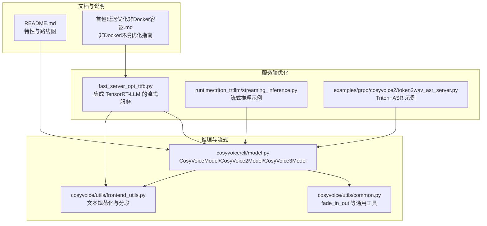
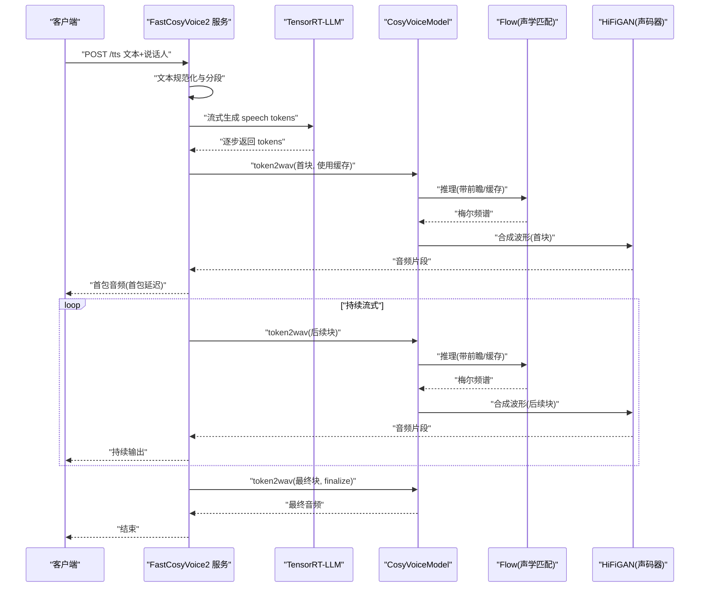
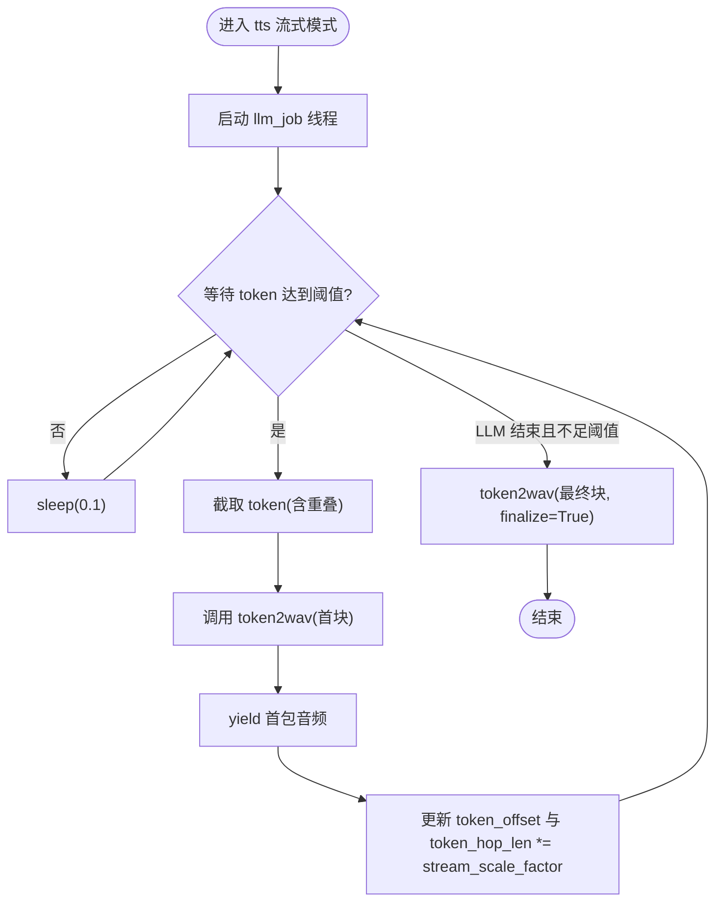
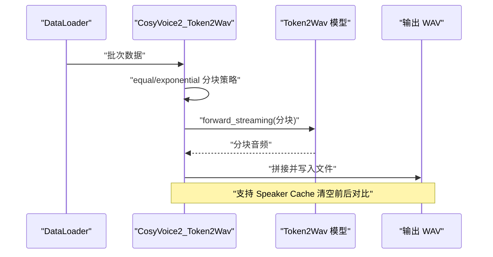
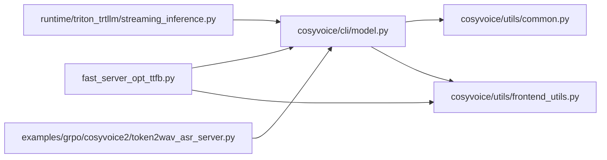

# 首包延迟优化

<cite>
**本文引用的文件**
- [cosyvoice/cli/model.py](file://cosyvoice/cli/model.py)
- [fast_server_opt_ttfb.py](file://fast_server_opt_ttfb.py)
- [runtime/triton_trtllm/streaming_inference.py](file://runtime/triton_trtllm/streaming_inference.py)
- [examples/grpo/cosyvoice2/token2wav_asr_server.py](file://examples/grpo/cosyvoice2/token2wav_asr_server.py)
- [cosyvoice/utils/common.py](file://cosyvoice/utils/common.py)
- [cosyvoice/utils/frontend_utils.py](file://cosyvoice/utils/frontend_utils.py)
- [README.md](file://README.md)
- [首包延迟优化（非Docker容器）.md](file://首包延迟优化（非Docker容器）.md)
</cite>

## 目录
1. [简介](#简介)
2. [项目结构](#项目结构)
3. [核心组件](#核心组件)
4. [架构总览](#架构总览)
5. [详细组件分析](#详细组件分析)
6. [依赖关系分析](#依赖关系分析)
7. [性能考量](#性能考量)
8. [故障排查指南](#故障排查指南)
9. [结论](#结论)
10. [附录](#附录)

## 简介
本文件围绕“首包延迟（Time to First Byte，TTFB）优化”主题，系统梳理 CosyVoice 在流式处理机制、并行执行、参数动态调整、上下文预加载与缓存、以及非Docker环境下的系统级优化策略。重点聚焦于 CosyVoiceModel.tts 方法中的多线程设计（llm_job 与 token2wav 并行执行）如何缩短 TTFB，解释 stream_scale_factor 对分块大小的动态调整策略，并介绍 mel_cache_len 与 source_cache_len 等缓存技术。同时，提供 runtime/triton_trtllm/streaming_inference.py 中的流式推理示例路径，讨论在非Docker环境下进行 CPU 调度与内存分配的系统级优化，以实现最低端到端延迟。

## 项目结构
CosyVoice 项目采用模块化组织，核心推理与流式能力集中在 CLI 模型层与服务端优化脚本中，同时提供 Triton/TensorRT-LLM 的运行时示例与集成方案。

图表来源
- [cosyvoice/cli/model.py](file://cosyvoice/cli/model.py#L1-L431)
- [cosyvoice/utils/common.py](file://cosyvoice/utils/common.py#L1-L214)
- [cosyvoice/utils/frontend_utils.py](file://cosyvoice/utils/frontend_utils.py#L1-L137)
- [fast_server_opt_ttfb.py](file://fast_server_opt_ttfb.py#L1-L1443)
- [runtime/triton_trtllm/streaming_inference.py](file://runtime/triton_trtllm/streaming_inference.py#L1-L123)
- [examples/grpo/cosyvoice2/token2wav_asr_server.py](file://examples/grpo/cosyvoice2/token2wav_asr_server.py#L1-L347)
- [README.md](file://README.md#L1-L318)
- [首包延迟优化（非Docker容器）.md](file://首包延迟优化（非Docker容器）.md#L1-L156)

章节来源
- [README.md](file://README.md#L1-L318)

## 核心组件
- CosyVoiceModel/CosyVoice2Model/CosyVoice3Model：提供 tts 流式推理、token2wav 合成、缓存与重叠处理、以及多线程并行执行 llm_job 与 token2wav 的机制。
- fast_server_opt_ttfb.py：集成 TensorRT-LLM 的流式服务，展示上下文预加载、Flow Prompt Cache 预计算、首包延迟分解与 RTF 统计。
- streaming_inference.py：演示在 Triton/TensorRT-LLM 环境下的流式推理与分块策略。
- token2wav_asr_server.py：Triton 服务示例，展示 token2wav 的离线/在线推理与 ASR 评测流程。
- utils/common.py：提供 fade_in_out 等音频拼接平滑工具。
- utils/frontend_utils.py：文本规范化与智能分段工具，支撑长文本流式处理。

章节来源
- [cosyvoice/cli/model.py](file://cosyvoice/cli/model.py#L1-L431)
- [fast_server_opt_ttfb.py](file://fast_server_opt_ttfb.py#L1-L1443)
- [runtime/triton_trtllm/streaming_inference.py](file://runtime/triton_trtllm/streaming_inference.py#L1-L123)
- [examples/grpo/cosyvoice2/token2wav_asr_server.py](file://examples/grpo/cosyvoice2/token2wav_asr_server.py#L1-L347)
- [cosyvoice/utils/common.py](file://cosyvoice/utils/common.py#L1-L214)
- [cosyvoice/utils/frontend_utils.py](file://cosyvoice/utils/frontend_utils.py#L1-L137)

## 架构总览
CosyVoice 的流式 TTS 由“文本/提示词预处理”、“LLM 生成语音 token（流式）”、“Flow 匹配生成梅尔频谱”、“HiFiGAN 合成波形”四阶段组成。其中 LLM 生成阶段是首包延迟的关键瓶颈，通过并行执行与缓存预计算可显著缩短 TTFB。

图表来源
- [fast_server_opt_ttfb.py](file://fast_server_opt_ttfb.py#L555-L831)
- [cosyvoice/cli/model.py](file://cosyvoice/cli/model.py#L167-L235)

## 详细组件分析

### 流式处理与并行执行（缩短 TTFB）
- 多线程设计：CosyVoiceModel.tts 在流式模式下启动独立线程执行 llm_job，主线程循环等待 tts_speech_token_dict 中的 token 达到最小跳跃长度（token_min_hop_len）后，调用 token2wav 进行首块合成，从而尽早产生首包音频。
- 动态分块策略：通过 token_hop_len 与 stream_scale_factor 控制分块大小，随着 token 积累逐步增大，兼顾首包延迟与音质稳定性。
- 重叠与缓存：使用 mel_overlap_len 与 source_cache_len 实现频谱与波形的重叠拼接，减少块边界爆音；同时维护 flow_cache_dict 与 hift_cache_dict，保证跨块连续性。

图表来源
- [cosyvoice/cli/model.py](file://cosyvoice/cli/model.py#L167-L235)

章节来源
- [cosyvoice/cli/model.py](file://cosyvoice/cli/model.py#L100-L121)
- [cosyvoice/cli/model.py](file://cosyvoice/cli/model.py#L167-L235)

### stream_scale_factor 的动态调整策略
- 作用：控制 token_hop_len 的增长速率，初始较小以尽快产生首包，随后按指数增长提升音质与吞吐。
- 默认值与约束：在 CosyVoiceModel 中定义 stream_scale_factor >= 1，建议根据实际 RTF 调整以平衡延迟与质量。
- 影响范围：影响 token_hop_len 的递增步长，进而影响首包生成时机与后续块的稳定性。

章节来源
- [cosyvoice/cli/model.py](file://cosyvoice/cli/model.py#L53-L54)
- [cosyvoice/cli/model.py](file://cosyvoice/cli/model.py#L200-L201)

### 上下文预加载与缓存（mel_cache_len/source_cache_len）
- mel_cache_len：控制 Flow 输出梅尔频谱的缓存长度，用于跨块拼接与重叠平滑。
- source_cache_len：控制 HiFiGAN 输出波形的缓存长度，配合 fade_in_out 实现块间平滑过渡。
- 重叠窗口：通过 hamming 窗口对相邻块进行 fade_in_out，避免爆音与突变。
- 适用场景：CosyVoiceModel 与 CosyVoice2Model/3Model 在流式 token2wav 中均使用缓存与重叠策略，确保连续输出。

章节来源
- [cosyvoice/cli/model.py](file://cosyvoice/cli/model.py#L48-L51)
- [cosyvoice/cli/model.py](file://cosyvoice/cli/model.py#L138-L165)
- [cosyvoice/utils/common.py](file://cosyvoice/utils/common.py#L169-L177)

### 流式推理代码示例（runtime/triton_trtllm/streaming_inference.py）
该示例展示了在 Triton/TensorRT-LLM 环境下的流式推理与分块策略，包括 equal/exponential 两种分块策略、overlap 与 lookahead 的处理、以及 Speaker Cache 的清空与对比。

图表来源
- [runtime/triton_trtllm/streaming_inference.py](file://runtime/triton_trtllm/streaming_inference.py#L40-L123)

章节来源
- [runtime/triton_trtllm/streaming_inference.py](file://runtime/triton_trtllm/streaming_inference.py#L28-L37)
- [runtime/triton_trtllm/streaming_inference.py](file://runtime/triton_trtllm/streaming_inference.py#L50-L123)

### 非Docker环境系统级优化（CPU调度、内存分配）
- LLM 加速：参考“非Docker容器”指南，通过 TensorRT-LLM 编译 LLM 引擎，替换 PyTorch LLM，显著降低 LLM Decode 阶段延迟。
- 服务端优化：fast_server_opt_ttfb.py 展示了集成 TensorRT-LLM 的服务端实现，包含请求计时中间件、长文本分段、首包延迟分解与 RTF 统计。
- 资源隔离：在 Autodl 等环境中，合理设置环境变量（如屏蔽 MPI 相关检查）、使用 bfloat16/float16 等精度以平衡性能与显存占用。
- 预热与稳定性：服务启动后进行预热，多次稳定测试以观察延迟波动与 RTF 指标。

章节来源
- [首包延迟优化（非Docker容器）.md](file://首包延迟优化（非Docker容器）.md#L1-L156)
- [fast_server_opt_ttfb.py](file://fast_server_opt_ttfb.py#L1-L1443)

### 文本规范化与长文本分段
- frontend_utils 提供中文/英文文本规范化与智能分段，保障长文本在流式推理中的 token 长度可控，避免过长导致的首包延迟。
- fast_server_opt_ttfb 中复用该逻辑，确保分段粒度与下游模型输入要求一致。

章节来源
- [cosyvoice/utils/frontend_utils.py](file://cosyvoice/utils/frontend_utils.py#L65-L117)
- [fast_server_opt_ttfb.py](file://fast_server_opt_ttfb.py#L229-L297)

## 依赖关系分析

图表来源
- [cosyvoice/cli/model.py](file://cosyvoice/cli/model.py#L1-L431)
- [cosyvoice/utils/common.py](file://cosyvoice/utils/common.py#L1-L214)
- [cosyvoice/utils/frontend_utils.py](file://cosyvoice/utils/frontend_utils.py#L1-L137)
- [fast_server_opt_ttfb.py](file://fast_server_opt_ttfb.py#L1-L1443)
- [runtime/triton_trtllm/streaming_inference.py](file://runtime/triton_trtllm/streaming_inference.py#L1-L123)
- [examples/grpo/cosyvoice2/token2wav_asr_server.py](file://examples/grpo/cosyvoice2/token2wav_asr_server.py#L1-L347)

章节来源
- [cosyvoice/cli/model.py](file://cosyvoice/cli/model.py#L1-L431)
- [fast_server_opt_ttfb.py](file://fast_server_opt_ttfb.py#L1-L1443)

## 性能考量
- 首包延迟（TTFB）关键路径：Frontend + LLM Prefill + LLM Decode + Flow + Vocoder。其中 LLM Decode 与 Flow 是主要瓶颈，需通过并行与加速引擎优化。
- 分块策略：equal/exponential 两种策略在 streaming_inference.py 中演示，可根据业务需求选择。
- 缓存与重叠：mel/source cache 与 fade_in_out 有效降低块边界噪声，提升连续性。
- RTF 目标：fast_server_opt_ttfb 中对首块 RTF 与整体 RTF 进行统计，目标 RTF < 0.2，指导参数调优。

## 故障排查指南
- 首包延迟过高
  - 检查 LLM 是否使用 TensorRT-LLM 引擎，确认引擎编译与加载路径正确。
  - 确认流式参数（token_hop_len、stream_scale_factor、pre_lookahead_len）设置合理。
  - 观察 RTF 统计与延迟分解，定位瓶颈阶段。
- 音频爆音或突变
  - 检查 mel_overlap_len 与 source_cache_len 是否与模型帧率匹配。
  - 确认 fade_in_out 窗口与缓存长度一致。
- 长文本分段异常
  - 检查 frontend_utils 的分段逻辑与 token 长度阈值，确保下游模型可处理。
- Triton/TensorRT-LLM 环境问题
  - 确认依赖版本与引擎文件存在，必要时重新编译引擎。

章节来源
- [fast_server_opt_ttfb.py](file://fast_server_opt_ttfb.py#L750-L771)
- [cosyvoice/utils/common.py](file://cosyvoice/utils/common.py#L169-L177)
- [runtime/triton_trtllm/streaming_inference.py](file://runtime/triton_trtllm/streaming_inference.py#L76-L103)

## 结论
通过多线程并行执行（llm_job 与 token2wav）、动态分块策略（stream_scale_factor）、上下文预加载与缓存（mel_cache_len/source_cache_len），以及在非Docker环境下采用 TensorRT-LLM 加速 LLM Decode 与 Flow，CosyVoice 能够显著降低首包延迟（TTFB），实现更低端到端延迟的流式 TTS。结合 fast_server_opt_ttfb 的延迟分解与 RTF 统计，可进一步指导参数调优与系统优化。

## 附录
- 代码示例路径
  - 流式推理示例：[runtime/triton_trtllm/streaming_inference.py](file://runtime/triton_trtllm/streaming_inference.py#L40-L123)
  - 服务端集成示例：[fast_server_opt_ttfb.py](file://fast_server_opt_ttfb.py#L555-L831)
  - Triton+ASR 示例：[examples/grpo/cosyvoice2/token2wav_asr_server.py](file://examples/grpo/cosyvoice2/token2wav_asr_server.py#L142-L238)
- 相关文档
  - 非Docker环境优化指南：[首包延迟优化（非Docker容器）.md](file://首包延迟优化（非Docker容器）.md#L1-L156)
  - 项目特性与路线图：[README.md](file://README.md#L1-L318)