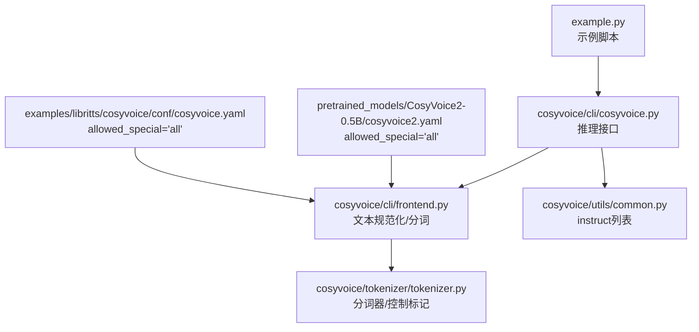
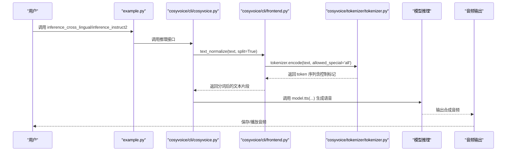
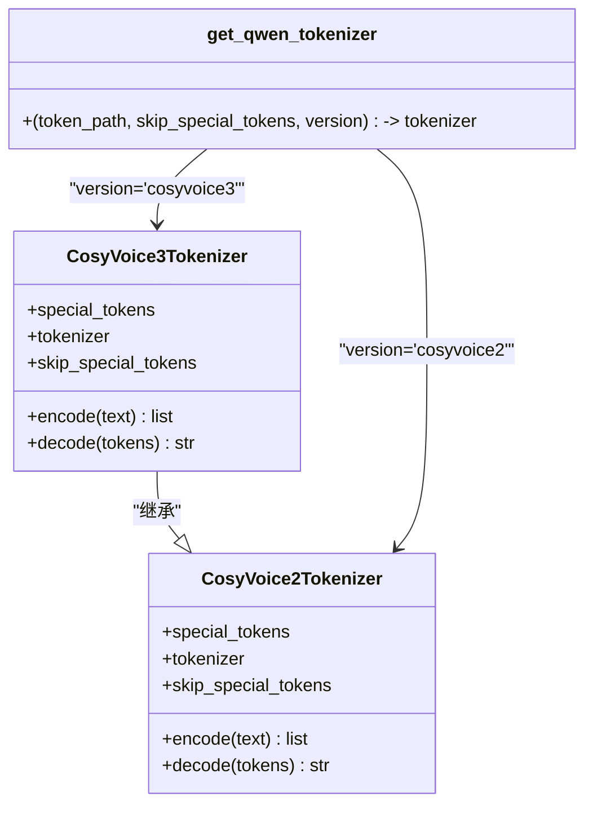
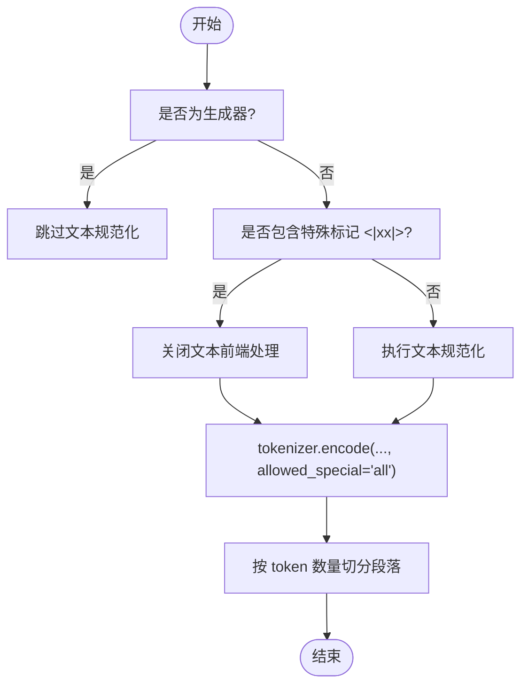
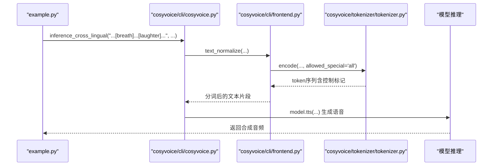
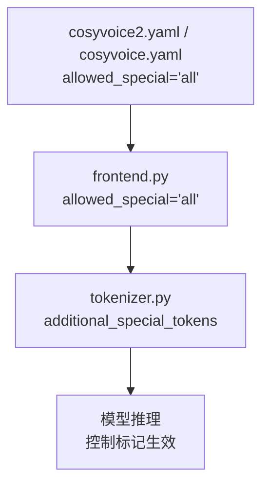

# 发音修补

<cite>
**本文档引用的文件**
- [example.py](file://example.py)
- [cosyvoice/tokenizer/tokenizer.py](file://cosyvoice/tokenizer/tokenizer.py)
- [cosyvoice/utils/common.py](file://cosyvoice/utils/common.py)
- [cosyvoice/cli/cosyvoice.py](file://cosyvoice/cli/cosyvoice.py)
- [cosyvoice/cli/frontend.py](file://cosyvoice/cli/frontend.py)
- [pretrained_models/CosyVoice2-0.5B/cosyvoice2.yaml](file://pretrained_models/CosyVoice2-0.5B/cosyvoice2.yaml)
- [examples/libritts/cosyvoice/conf/cosyvoice.yaml](file://examples/libritts/cosyvoice/conf/cosyvoice.yaml)
</cite>

## 目录
1. [简介](#简介)
2. [项目结构](#项目结构)
3. [核心组件](#核心组件)
4. [架构总览](#架构总览)
5. [详细组件分析](#详细组件分析)
6. [依赖关系分析](#依赖关系分析)
7. [性能考量](#性能考量)
8. [故障排查指南](#故障排查指南)
9. [结论](#结论)
10. [附录](#附录)

## 简介
本章节介绍 CosyVoice 的“发音修补（Pronunciation Inpainting）”能力：通过在文本中插入特定的控制标记，用户可以对合成语音的发音细节进行精细控制，例如添加笑声、呼吸声或强调特定词语。该功能由以下方法共同支撑：
- inference_cross_lingual：跨语言模式下的细粒度控制
- inference_instruct2：指令模式下的细粒度控制
- 分词器（tokenizer）：负责识别并编码控制标记
- 文本前端（frontend）：负责将控制标记传递给模型

本功能在 CosyVoice2/CosyVoice3 中得到完整支持，允许在文本中直接嵌入诸如 [laughter]、[breath]、[strong]/</strong> 等标记，从而影响语音输出的韵律、情感和自然度。

## 项目结构
围绕发音修补功能的关键文件与职责如下：
- example.py：提供使用示例，展示如何在文本中插入 [laughter]、[breath] 等标记，并调用 inference_cross_lingual 和 inference_instruct2
- cosyvoice/tokenizer/tokenizer.py：定义分词器及控制标记集合，包括 CosyVoice2Tokenizer/CosyVoice3Tokenizer
- cosyvoice/utils/common.py：提供 instruct 列表，用于情绪、语速、方言等控制
- cosyvoice/cli/cosyvoice.py：封装推理接口，包含 inference_cross_lingual、inference_instruct2 等方法
- cosyvoice/cli/frontend.py：文本规范化与分词入口，负责将控制标记传递给模型
- 配置文件：cosyvoice2.yaml、cosyvoice.yaml 指定 allowed_special 参数为 'all'

**图表来源**
- [example.py](file://example.py#L52-L54)
- [cosyvoice/cli/cosyvoice.py](file://cosyvoice/cli/cosyvoice.py#L105-L127)
- [cosyvoice/cli/frontend.py](file://cosyvoice/cli/frontend.py#L78-L87)
- [cosyvoice/tokenizer/tokenizer.py](file://cosyvoice/tokenizer/tokenizer.py#L241-L272)
- [cosyvoice/utils/common.py](file://cosyvoice/utils/common.py#L28-L53)
- [pretrained_models/CosyVoice2-0.5B/cosyvoice2.yaml](file://pretrained_models/CosyVoice2-0.5B/cosyvoice2.yaml#L137-L140)
- [examples/libritts/cosyvoice/conf/cosyvoice.yaml](file://examples/libritts/cosyvoice/conf/cosyvoice.yaml#L162-L165)

**章节来源**
- [example.py](file://example.py#L52-L54)
- [cosyvoice/cli/cosyvoice.py](file://cosyvoice/cli/cosyvoice.py#L105-L127)
- [cosyvoice/cli/frontend.py](file://cosyvoice/cli/frontend.py#L78-L87)
- [cosyvoice/tokenizer/tokenizer.py](file://cosyvoice/tokenizer/tokenizer.py#L241-L272)
- [cosyvoice/utils/common.py](file://cosyvoice/utils/common.py#L28-L53)
- [pretrained_models/CosyVoice2-0.5B/cosyvoice2.yaml](file://pretrained_models/CosyVoice2-0.5B/cosyvoice2.yaml#L137-L140)
- [examples/libritts/cosyvoice/conf/cosyvoice.yaml](file://examples/libritts/cosyvoice/conf/cosyvoice.yaml#L162-L165)

## 核心组件
- 控制标记集合
  - CosyVoice2Tokenizer/CosyVoice3Tokenizer 支持的标记包括但不限于：[laughter]、[breath]、[strong]/</strong>、[noise]、[cough]、[clucking]、[accent]、[quick_breath]、[hissing]、[sigh]、[vocalized-noise]、[lipsmack]、[mn]、[AA]-[ü] 等音素符号
  - 这些标记在 tokenizer 中以 additional_special_tokens 的形式注册，使分词器能识别并编码为特殊 token
- 文本规范化与分词
  - frontend 将文本通过 tokenizer.encode 并传入 allowed_special='all'，确保控制标记不被过滤
  - 对于 CosyVoice3，还额外支持大量音素符号，便于更精细的发音控制
- 推理接口
  - inference_cross_lingual：在跨语言模式下，将包含控制标记的文本送入模型，实现细粒度控制
  - inference_instruct2：在指令模式下，将控制标记与 instruct 文本一起输入，实现更丰富的语音风格控制

**章节来源**
- [cosyvoice/tokenizer/tokenizer.py](file://cosyvoice/tokenizer/tokenizer.py#L241-L272)
- [cosyvoice/tokenizer/tokenizer.py](file://cosyvoice/tokenizer/tokenizer.py#L274-L314)
- [cosyvoice/cli/frontend.py](file://cosyvoice/cli/frontend.py#L78-L87)
- [cosyvoice/cli/cosyvoice.py](file://cosyvoice/cli/cosyvoice.py#L105-L127)
- [cosyvoice/cli/cosyvoice.py](file://cosyvoice/cli/cosyvoice.py#L177-L186)

## 架构总览
下面的序列图展示了“发音修补”的端到端流程：从示例脚本调用推理接口，到文本规范化与分词，再到模型推理与音频生成。

**图表来源**
- [example.py](file://example.py#L52-L54)
- [cosyvoice/cli/cosyvoice.py](file://cosyvoice/cli/cosyvoice.py#L105-L127)
- [cosyvoice/cli/frontend.py](file://cosyvoice/cli/frontend.py#L78-L87)
- [cosyvoice/tokenizer/tokenizer.py](file://cosyvoice/tokenizer/tokenizer.py#L241-L272)

## 详细组件分析

### 分词器与控制标记
- CosyVoice2Tokenizer
  - 注册 additional_special_tokens，包含 [laughter]、[breath]、[strong]、</strong>、[noise]、[cough]、[clucking]、[accent]、[quick_breath]、<laughter>、</laughter>、[hissing]、[sigh]、[vocalized-noise]、[lipsmack]、[mn]
  - 通过 AutoTokenizer.from_pretrained 加载基础分词器，并追加特殊标记
- CosyVoice3Tokenizer
  - 在 CosyVoice2 的基础上，新增大量音素符号（如 [AA]、[AE]、[AH]、[AO]、[AW]、[AY]、[B]、[CH]、[D]、[DH]、[EH]、[ER]、[EY]、[F]、[G]、[HH]、[IH]、[IY]、[JH]、[K]、[L]、[M]、[N]、[NG]、[OW]、[OY]、[P]、[R]、[S]、[SH]、[T]、[TH]、[UH]、[UW]、[V]、[W]、[Y]、[Z]、[ZH]）
  - 同时保留所有 CosyVoice2 的控制标记，便于更精细的发音控制
- get_qwen_tokenizer
  - 根据版本选择 CosyVoice2Tokenizer 或 CosyVoice3Tokenizer

**图表来源**
- [cosyvoice/tokenizer/tokenizer.py](file://cosyvoice/tokenizer/tokenizer.py#L241-L272)
- [cosyvoice/tokenizer/tokenizer.py](file://cosyvoice/tokenizer/tokenizer.py#L274-L314)
- [cosyvoice/tokenizer/tokenizer.py](file://cosyvoice/tokenizer/tokenizer.py#L316-L327)

**章节来源**
- [cosyvoice/tokenizer/tokenizer.py](file://cosyvoice/tokenizer/tokenizer.py#L241-L272)
- [cosyvoice/tokenizer/tokenizer.py](file://cosyvoice/tokenizer/tokenizer.py#L274-L314)
- [cosyvoice/tokenizer/tokenizer.py](file://cosyvoice/tokenizer/tokenizer.py#L316-L327)

### 文本规范化与 allowed_special
- frontend 将文本通过 tokenizer.encode 并传入 allowed_special='all'，确保控制标记不会被过滤
- 对于包含特殊标记（如 <|xx|>）的文本，会跳过文本前端处理，直接进入分词阶段
- split_paragraph 基于 tokenizer.encode 的结果进行段落切分，保证 token 数量在合理范围内

**图表来源**
- [cosyvoice/cli/frontend.py](file://cosyvoice/cli/frontend.py#L127-L160)
- [cosyvoice/cli/frontend.py](file://cosyvoice/cli/frontend.py#L78-L87)

**章节来源**
- [cosyvoice/cli/frontend.py](file://cosyvoice/cli/frontend.py#L127-L160)
- [cosyvoice/cli/frontend.py](file://cosyvoice/cli/frontend.py#L78-L87)

### 推理接口与发音修补
- inference_cross_lingual
  - 将包含控制标记的文本送入模型，实现跨语言场景下的细粒度控制
  - 示例：在文本中插入 [breath]，可让合成语音在相应位置加入自然的呼吸声
- inference_instruct2
  - 将 instruct 文本与控制标记一起输入，实现更丰富的语音风格控制
  - 示例：在文本中插入 [laughter]，可让合成语音在相应位置加入笑声
- instruct 列表
  - 提供多种情绪、语速、方言等控制指令，配合控制标记实现更自然的语音表现

**图表来源**
- [example.py](file://example.py#L52-L54)
- [cosyvoice/cli/cosyvoice.py](file://cosyvoice/cli/cosyvoice.py#L105-L127)
- [cosyvoice/cli/frontend.py](file://cosyvoice/cli/frontend.py#L78-L87)
- [cosyvoice/tokenizer/tokenizer.py](file://cosyvoice/tokenizer/tokenizer.py#L241-L272)

**章节来源**
- [cosyvoice/cli/cosyvoice.py](file://cosyvoice/cli/cosyvoice.py#L105-L127)
- [cosyvoice/cli/cosyvoice.py](file://cosyvoice/cli/cosyvoice.py#L177-L186)
- [cosyvoice/utils/common.py](file://cosyvoice/utils/common.py#L28-L53)

### 示例：在文本中使用控制标记
- 在 inference_cross_lingual 中使用 [breath]：示例脚本展示了在句子中插入 [breath]，并在多个位置重复出现，以模拟自然的呼吸节奏
- 在 inference_instruct2 中使用 [laughter]：示例脚本展示了在文本中插入 [laughter]，以产生自然的笑声效果
- 使用方式
  - 将控制标记直接写入文本字符串中，无需额外的前缀或后缀
  - 分词器会将其识别为特殊 token，并在模型推理过程中被正确处理

**章节来源**
- [example.py](file://example.py#L52-L54)
- [example.py](file://example.py#L80-L83)

## 依赖关系分析
- 配置文件中的 allowed_special='all'
  - 在 CosyVoice2/CosyVoice3 的配置中，allowed_special 被设置为 'all'，确保控制标记不会被过滤
  - frontend 在调用 tokenizer.encode 时传入 allowed_special='all'，保证控制标记进入分词流程
- 分词器与模型的关系
  - CosyVoice2Tokenizer/CosyVoice3Tokenizer 通过 AutoTokenizer.from_pretrained 加载基础分词器
  - additional_special_tokens 中的控制标记被注册为特殊 token，参与模型的文本编码过程

**图表来源**
- [pretrained_models/CosyVoice2-0.5B/cosyvoice2.yaml](file://pretrained_models/CosyVoice2-0.5B/cosyvoice2.yaml#L137-L140)
- [examples/libritts/cosyvoice/conf/cosyvoice.yaml](file://examples/libritts/cosyvoice/conf/cosyvoice.yaml#L162-L165)
- [cosyvoice/cli/frontend.py](file://cosyvoice/cli/frontend.py#L78-L87)
- [cosyvoice/tokenizer/tokenizer.py](file://cosyvoice/tokenizer/tokenizer.py#L241-L272)

**章节来源**
- [pretrained_models/CosyVoice2-0.5B/cosyvoice2.yaml](file://pretrained_models/CosyVoice2-0.5B/cosyvoice2.yaml#L137-L140)
- [examples/libritts/cosyvoice/conf/cosyvoice.yaml](file://examples/libritts/cosyvoice/conf/cosyvoice.yaml#L162-L165)
- [cosyvoice/cli/frontend.py](file://cosyvoice/cli/frontend.py#L78-L87)
- [cosyvoice/tokenizer/tokenizer.py](file://cosyvoice/tokenizer/tokenizer.py#L241-L272)

## 性能考量
- allowed_special='all' 的使用
  - 允许控制标记进入分词流程，避免因过滤导致的标记丢失
  - 在长文本中，建议合理切分段落，以减少单次分词的 token 数量，提升推理效率
- 控制标记的频率
  - 过多的控制标记可能影响模型的推理速度与稳定性，建议按需使用
- 流式推理
  - 在流式推理场景中，控制标记的插入位置会影响音频的自然度，建议在合适的位置插入

[本节为通用指导，不涉及具体文件分析]

## 故障排查指南
- 控制标记未生效
  - 检查配置文件中的 allowed_special 是否为 'all'
  - 确认 frontend 在调用 tokenizer.encode 时传入了 allowed_special='all'
- 文本前端冲突
  - 当文本包含特殊标记（如 <|xx|>）时，会跳过文本前端处理，确保控制标记不被破坏
- 指令模式下的信息泄露
  - 在 inference_instruct/inference_instruct2 中，LLM 的说话人嵌入会被移除，避免信息泄露

**章节来源**
- [cosyvoice/cli/frontend.py](file://cosyvoice/cli/frontend.py#L127-L160)
- [cosyvoice/cli/cosyvoice.py](file://cosyvoice/cli/cosyvoice.py#L116-L127)
- [cosyvoice/cli/cosyvoice.py](file://cosyvoice/cli/cosyvoice.py#L177-L186)

## 结论
CosyVoice 的发音修补功能通过在文本中插入控制标记，实现了对合成语音的精细化控制。借助 CosyVoice2/CosyVoice3 的分词器与推理接口，用户可以在跨语言与指令模式下，灵活地添加笑声、呼吸声、强调等语音细节，显著提升语音的自然度与表现力。通过合理的标记使用与配置，可以获得更加真实、富有情感的语音合成效果。

[本节为总结性内容，不涉及具体文件分析]

## 附录

### 支持的控制标记清单与效果说明
- 基础控制标记（CosyVoice2/CosyVoice3）
  - [laughter]：在指定位置插入笑声
  - [breath]：在指定位置插入自然的呼吸声
  - [strong]/</strong>：对括号内的词语进行强调
  - [noise]：插入一般性噪声
  - [cough]：插入咳嗽声
  - [clucking]：插入咂舌声
  - [accent]：插入口音提示
  - [quick_breath]：插入快速呼吸声
  - <laughter>...</laughter>：带结束标签的笑声
  - [hissing]：插入嘶嘶声
  - [sigh]：插入叹息声
  - [vocalized-noise]：插入有声噪声
  - [lipsmack]：插入咂嘴声
  - [mn]：插入鼻音
- 高级控制标记（仅 CosyVoice3）
  - 大量音素符号：[AA]、[AA0]、[AA1]、[AA2]、[AE]、[AE0]、[AE1]、[AE2]、[AH]、[AH0]、[AH1]、[AH2]、[AO]、[AO0]、[AO1]、[AO2]、[AW]、[AW0]、[AW1]、[AW2]、[AY]、[AY0]、[AY1]、[AY2]、[B]、[CH]、[D]、[DH]、[EH]、[EH0]、[EH1]、[EH2]、[ER]、[ER0]、[ER1]、[ER2]、[EY]、[EY0]、[EY1]、[EY2]、[F]、[G]、[HH]、[IH]、[IH0]、[IH1]、[IH2]、[IY]、[IY0]、[IY1]、[IY2]、[JH]、[K]、[L]、[M]、[N]、[NG]、[OW]、[OW0]、[OW1]、[OW2]、[OY]、[OY0]、[OY1]、[OY2]、[P]、[R]、[S]、[SH]、[T]、[TH]、[UH]、[UH0]、[UH1]、[UH2]、[UW]、[UW0]、[UW1]、[UW2]、[V]、[W]、[Y]、[Z]、[ZH]
  - 中文音素符号：[a]、[ai]、[an]、[ang]、[ao]、[b]、[c]、[ch]、[d]、[e]、[ei]、[en]、[eng]、[f]、[g]、[h]、[i]、[ian]、[in]、[ing]、[iu]、[ià]、[iàn]、[iàng]、[iào]、[iá]、[ián]、[iáng]、[iáo]、[iè]、[ié]、[iòng]、[ióng]、[iù]、[iú]、[iā]、[iān]、[iāng]、[iāo]、[iē]、[iě]、[iōng]、[iū]、[iǎ]、[iǎn]、[iǎng]、[iǎo]、[iǒng]、[iǔ]、[j]、[k]、[l]、[m]、[n]、[o]、[ong]、[ou]、[p]、[q]、[r]、[s]、[sh]、[t]、[u]、[uang]、[ue]、[un]、[uo]、[uà]、[uài]、[uàn]、[uàng]、[uá]、[uái]、[uán]、[uáng]、[uè]、[ué]、[uì]、[uí]、[uò]、[uó]、[uā]、[uāi]、[uān]、[uāng]、[uē]、[uě]、[uī]、[uō]、[uǎ]、[uǎi]、[uǎn]、[uǎng]、[uǐ]、[uǒ]、[vè]、[w]、[x]、[y]、[z]、[zh]、[à]、[ài]、[àn]、[àng]、[ào]、[á]、[ái]、[án]、[áng]、[áo]、[è]、[èi]、[èn]、[èng]、[èr]、[é]、[éi]、[én]、[éng]、[ér]、[ì]、[ìn]、[ìng]、[í]、[ín]、[íng]、[ò]、[òng]、[òu]、[ó]、[óng]、[óu]、[ù]、[ùn]、[ú]、[ún]、[ā]、[āi]、[ān]、[āng]、[āo]、[ē]、[ēi]、[ēn]、[ēng]、[ě]、[ěi]、[ěn]、[ěng]、[ěr]、[ī]、[īn]、[īng]、[ō]、[ōng]、[ōu]、[ū]、[ūn]、[ǎ]、[ǎi]、[ǎn]、[ǎng]、[ǎo]、[ǐ]、[ǐn]、[ǐng]、[ǒ]、[ǒng]、[ǒu]、[ǔ]、[ǔn]、[ǘ]、[ǚ]、[ǜ]
- 效果说明
  - [laughter]：在指定位置插入自然的笑声，适合表达轻松、幽默的语气
  - [breath]：在指定位置插入自然的呼吸声，增强语音的真实感
  - [strong]/</strong>：对括号内的词语进行强调，突出重点
  - [noise]/[cough]/[clucking]/[accent]/[quick_breath]/[hissing]/[sigh]/[vocalized-noise]/[lipsmack]/[mn]：插入相应的自然声音，丰富语音的表现力
  - 音素符号：用于更精细的发音控制，适合需要精确调节音素的场景

**章节来源**
- [cosyvoice/tokenizer/tokenizer.py](file://cosyvoice/tokenizer/tokenizer.py#L241-L272)
- [cosyvoice/tokenizer/tokenizer.py](file://cosyvoice/tokenizer/tokenizer.py#L274-L314)