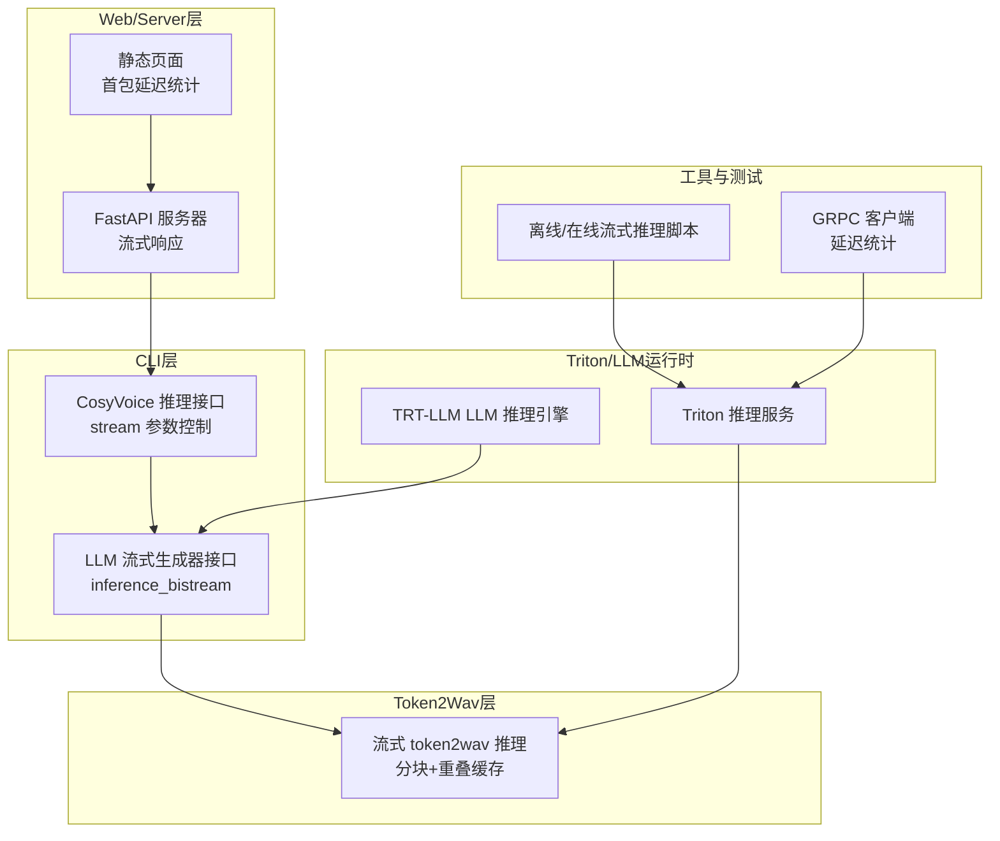
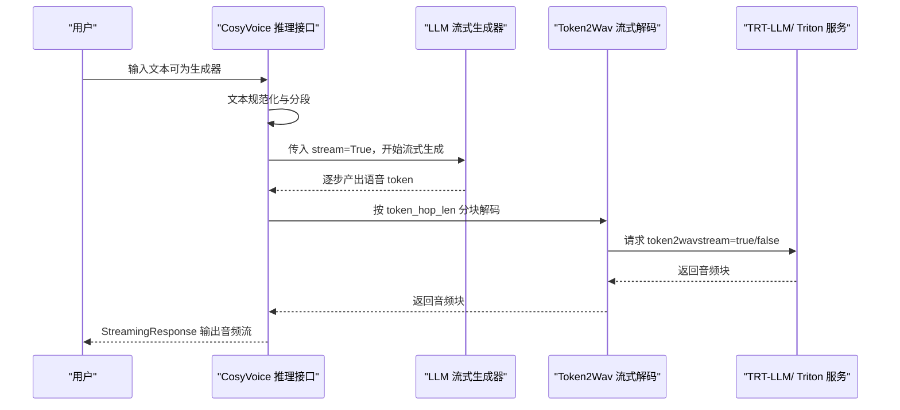
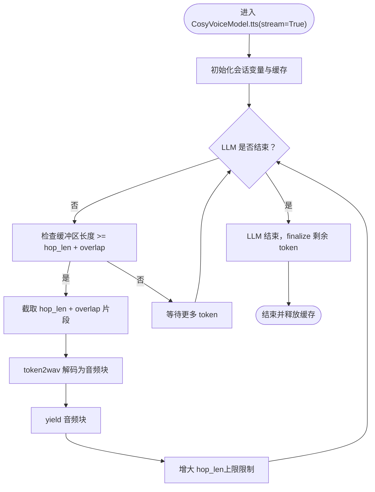
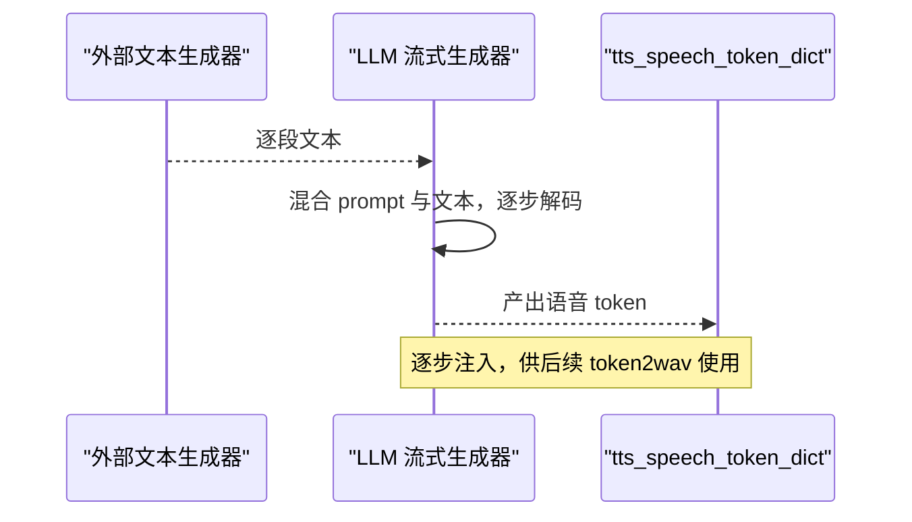
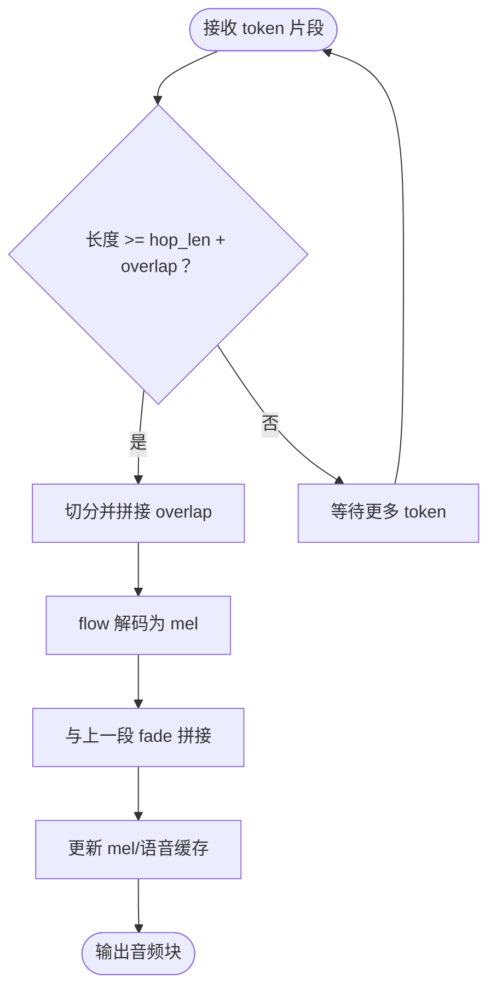
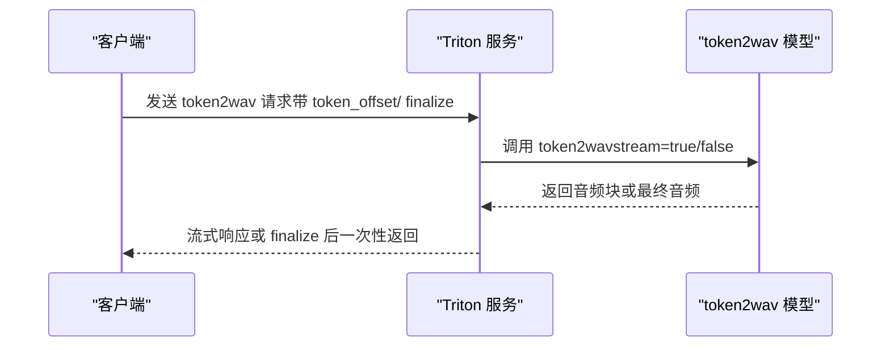
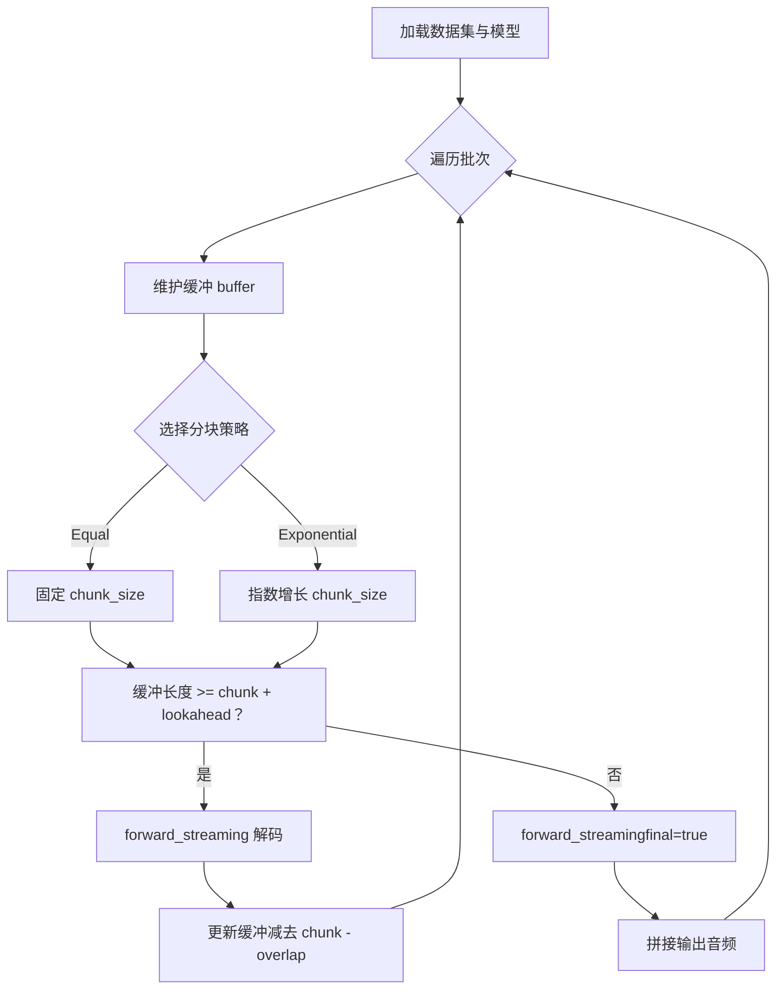
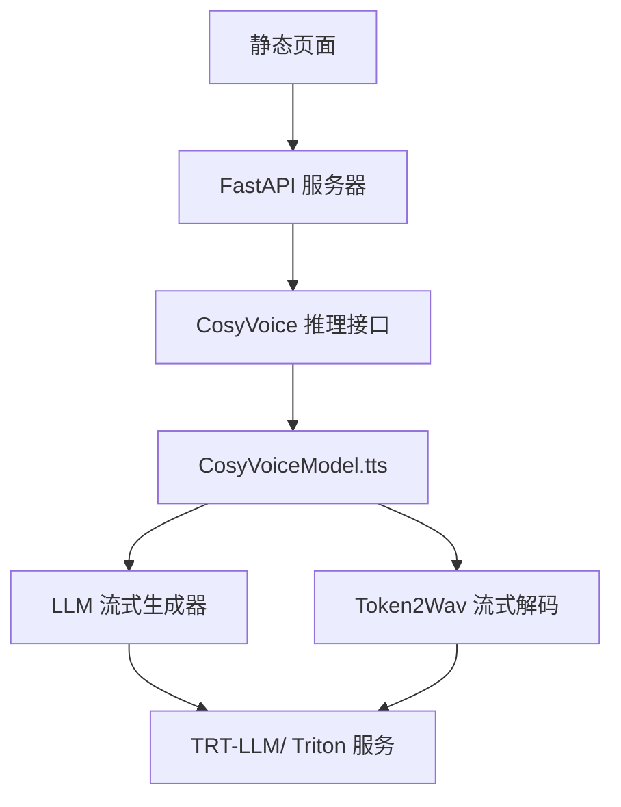

# 流式处理

<cite>
**本文引用的文件**
- [example.py](file://example.py)
- [cosyvoice/cli/cosyvoice.py](file://cosyvoice/cli/cosyvoice.py)
- [cosyvoice/cli/model.py](file://cosyvoice/cli/model.py)
- [cosyvoice/llm/llm.py](file://cosyvoice/llm/llm.py)
- [runtime/triton_trtllm/streaming_inference.py](file://runtime/triton_trtllm/streaming_inference.py)
- [runtime/triton_trtllm/model_repo/token2wav/1/model.py](file://runtime/triton_trtllm/model_repo/token2wav/1/model.py)
- [runtime/triton_trtllm/model_repo/cosyvoice2/1/model.py](file://runtime/triton_trtllm/model_repo/cosyvoice2/1/model.py)
- [runtime/triton_trtllm/model_repo/cosyvoice2_dit/1/model.py](file://runtime/triton_trtllm/model_repo/cosyvoice2_dit/1/model.py)
- [fast_server.py](file://fast_server.py)
- [fast_server_opt_ttfb.py](file://fast_server_opt_ttfb.py)
- [server.py](file://server.py)
- [static/index.html](file://static/index.html)
- [README.md](file://README.md)
- [runtime/triton_trtllm/client_grpc.py](file://runtime/triton_trtllm/client_grpc.py)
- [cosyvoice/utils/mask.py](file://cosyvoice/utils/mask.py)
</cite>

## 目录
1. [简介](#简介)
2. [项目结构](#项目结构)
3. [核心组件](#核心组件)
4. [架构总览](#架构总览)
5. [详细组件分析](#详细组件分析)
6. [依赖关系分析](#依赖关系分析)
7. [性能考量](#性能考量)
8. [故障排查指南](#故障排查指南)
9. [结论](#结论)

## 简介
本章节聚焦 CosyVoice 的流式处理能力，阐述其核心价值：在用户输入文本的同时即可开始生成并传输音频流，从而显著降低首包延迟（TTFB），提升交互体验。文档将系统讲解如何通过将推理接口的 stream 参数设为 True 启用流式模式，并以 example.py 中的 text_generator 示例展示如何将文本生成器作为输入，实现真正的“文本-语音”双向流式转换。同时，结合 runtime/triton_trtllm 下的 streaming_inference.py 脚本，深入分析其内部的流式数据处理与缓冲机制。最后，对比流式与非流式模式在性能、延迟（可低至 150ms）与资源消耗方面的权衡，并给出优化建议。

## 项目结构
围绕流式处理的相关模块分布如下：
- CLI 层：提供面向用户的推理接口，支持 stream 参数控制是否启用流式。
- LLM 层：支持基于生成器的流式文本输入，逐步产出语音 token。
- Token2Wav 层：将语音 token 流式解码为音频波形，支持分块与重叠缓存。
- Triton/TensorRT-LLM 运行时：提供高性能的流式推理管线，含客户端与服务端。
- Web/Server 层：提供 HTTP/WS 流式响应，前端页面统计首包延迟等指标。
- 工具与测试：包含离线/在线流式推理脚本与客户端，用于性能评估。

**图表来源**
- [cosyvoice/cli/cosyvoice.py](file://cosyvoice/cli/cosyvoice.py#L91-L103)
- [cosyvoice/llm/llm.py](file://cosyvoice/llm/llm.py#L520-L618)
- [cosyvoice/cli/model.py](file://cosyvoice/cli/model.py#L167-L235)
- [runtime/triton_trtllm/model_repo/token2wav/1/model.py](file://runtime/triton_trtllm/model_repo/token2wav/1/model.py#L229-L248)
- [runtime/triton_trtllm/model_repo/cosyvoice2/1/model.py](file://runtime/triton_trtllm/model_repo/cosyvoice2/1/model.py#L105-L133)
- [runtime/triton_trtllm/streaming_inference.py](file://runtime/triton_trtllm/streaming_inference.py#L40-L123)
- [fast_server.py](file://fast_server.py#L67-L92)
- [static/index.html](file://static/index.html#L347-L781)
- [runtime/triton_trtllm/client_grpc.py](file://runtime/triton_trtllm/client_grpc.py#L811-L870)

**章节来源**
- [README.md](file://README.md#L11-L21)
- [example.py](file://example.py#L60-L68)

## 核心组件
- CLI 推理接口：在 CosyVoice 类中，inference_zero_shot 等方法均支持 stream 参数，默认为 False。启用流式时，内部通过 CosyVoiceModel.tts 的流式循环，按步产出音频块。
- LLM 流式生成器：CosyVoiceModel.llm_job 支持传入 Generator 文本输入，调用 LLM 的 inference_bistream，逐步产出语音 token。
- Token2Wav 流式解码：CosyVoiceModel.token2wav 在流式模式下，按 token_hop_len 分块解码，配合重叠缓存与 fade-in/out 平滑拼接，避免断续。
- Triton/LLM 运行时：Triton 服务根据请求中的 token_offset/ finalize 控制流式/非流式，支持多段连续推理。
- Web/Server 层：FastAPI 服务器将流式音频块以 StreamingResponse 返回，前端页面统计首包延迟（TTFB）等指标。
- 工具与测试：runtime/triton_trtllm 下的 streaming_inference.py 展示了等宽/指数增长两种分块策略与重叠处理。

**章节来源**
- [cosyvoice/cli/cosyvoice.py](file://cosyvoice/cli/cosyvoice.py#L91-L103)
- [cosyvoice/cli/model.py](file://cosyvoice/cli/model.py#L100-L121)
- [cosyvoice/llm/llm.py](file://cosyvoice/llm/llm.py#L520-L618)
- [runtime/triton_trtllm/model_repo/token2wav/1/model.py](file://runtime/triton_trtllm/model_repo/token2wav/1/model.py#L229-L248)
- [fast_server.py](file://fast_server.py#L67-L92)
- [static/index.html](file://static/index.html#L347-L781)
- [runtime/triton_trtllm/streaming_inference.py](file://runtime/triton_trtllm/streaming_inference.py#L40-L123)

## 架构总览
下面的序列图展示了从用户输入文本到音频流输出的完整链路，包括文本规范化、LLM 流式生成、Token2Wav 流式解码以及 Triton/LLM 运行时的协同。

**图表来源**
- [cosyvoice/cli/cosyvoice.py](file://cosyvoice/cli/cosyvoice.py#L91-L103)
- [cosyvoice/llm/llm.py](file://cosyvoice/llm/llm.py#L520-L618)
- [cosyvoice/cli/model.py](file://cosyvoice/cli/model.py#L167-L235)
- [runtime/triton_trtllm/model_repo/token2wav/1/model.py](file://runtime/triton_trtllm/model_repo/token2wav/1/model.py#L229-L248)

## 详细组件分析

### CLI 推理接口与流式开关
- 在 CosyVoice.inference_zero_shot 等方法中，通过 stream 参数控制是否启用流式模式。启用后，CosyVoiceModel.tts 会在内部循环中按 token_hop_len 取出 token 片段，调用 token2wav 生成音频块并立即返回。
- 流式模式下，tts 循环会动态增大 token_hop_len，以平衡延迟与音质；当 LLM 结束且缓冲不足时，触发 finalize 生成剩余音频。

**图表来源**
- [cosyvoice/cli/model.py](file://cosyvoice/cli/model.py#L184-L213)

**章节来源**
- [cosyvoice/cli/cosyvoice.py](file://cosyvoice/cli/cosyvoice.py#L91-L103)
- [cosyvoice/cli/model.py](file://cosyvoice/cli/model.py#L167-L235)

### LLM 流式生成器（基于生成器的文本输入）
- 当传入的文本为 Generator 时，CosyVoiceModel.llm_job 会调用 LLM 的 inference_bistream，逐步消费生成器产出的文本片段，并将对应的语音 token 注入 tts_speech_token_dict。
- 该机制允许外部文本 LLM（如 TRT-LLM）边生成文本边驱动语音 token 的生成，实现真正的“文本-语音”双向流式。

**图表来源**
- [cosyvoice/cli/model.py](file://cosyvoice/cli/model.py#L100-L121)
- [cosyvoice/llm/llm.py](file://cosyvoice/llm/llm.py#L520-L618)

**章节来源**
- [cosyvoice/cli/model.py](file://cosyvoice/cli/model.py#L100-L121)
- [cosyvoice/llm/llm.py](file://cosyvoice/llm/llm.py#L520-L618)

### Token2Wav 流式解码与缓冲机制
- CosyVoiceModel.token2wav 在流式模式下，按 token_hop_len 分块解码，利用 mel_overlap_dict 与 hift_cache_dict 实现跨块平滑拼接，避免音频断续。
- CosyVoice2Model/CosyVoice3Model 在流式模式下，额外引入 token_offset 与 pre_lookahead_len，确保解码窗口覆盖未来 token，提升稳定性。

**图表来源**
- [cosyvoice/cli/model.py](file://cosyvoice/cli/model.py#L127-L165)
- [cosyvoice/cli/model.py](file://cosyvoice/cli/model.py#L279-L313)
- [cosyvoice/cli/model.py](file://cosyvoice/cli/model.py#L405-L430)

**章节来源**
- [cosyvoice/cli/model.py](file://cosyvoice/cli/model.py#L127-L165)
- [cosyvoice/cli/model.py](file://cosyvoice/cli/model.py#L279-L313)
- [cosyvoice/cli/model.py](file://cosyvoice/cli/model.py#L405-L430)

### Triton/LLM 运行时的流式控制
- Triton 服务端根据请求中的 token_offset/ finalize 判断是否为流式阶段，从而决定 stream=true/false。
- CosyVoice2/CosyVoice3 的 token2wav 在流式模式下，会考虑 prompt_token 的预看长度（pre_lookahead_len）与 token_offset，确保解码窗口正确。

**图表来源**
- [runtime/triton_trtllm/model_repo/token2wav/1/model.py](file://runtime/triton_trtllm/model_repo/token2wav/1/model.py#L229-L248)
- [runtime/triton_trtllm/model_repo/cosyvoice2/1/model.py](file://runtime/triton_trtllm/model_repo/cosyvoice2/1/model.py#L105-L133)
- [runtime/triton_trtllm/model_repo/cosyvoice2_dit/1/model.py](file://runtime/triton_trtllm/model_repo/cosyvoice2_dit/1/model.py#L77-L106)

**章节来源**
- [runtime/triton_trtllm/model_repo/token2wav/1/model.py](file://runtime/triton_trtllm/model_repo/token2wav/1/model.py#L229-L248)
- [runtime/triton_trtllm/model_repo/cosyvoice2/1/model.py](file://runtime/triton_trtllm/model_repo/cosyvoice2/1/model.py#L105-L133)
- [runtime/triton_trtllm/model_repo/cosyvoice2_dit/1/model.py](file://runtime/triton_trtllm/model_repo/cosyvoice2_dit/1/model.py#L77-L106)

### example.py 中的文本生成器示例
- example.py 展示了如何将一个文本生成器作为输入，实现“边写边播”的效果。通过将 stream=False 改为 stream=True，即可启用流式模式，实现更低的首包延迟与更流畅的交互体验。

**章节来源**
- [example.py](file://example.py#L60-L68)

### runtime/triton_trtllm/streaming_inference.py 的流式数据处理与缓冲
- 该脚本演示了等宽（equal）与指数增长（exponential）两种分块策略，结合重叠（OVERLAP_SIZE）与预看长度（pre_lookahead_len），在保证解码稳定性的前提下最大化吞吐。
- 通过 forward_streaming 调用，将分块后的 token 送入 token2wav，再拼接输出音频。

**图表来源**
- [runtime/triton_trtllm/streaming_inference.py](file://runtime/triton_trtllm/streaming_inference.py#L40-L123)

**章节来源**
- [runtime/triton_trtllm/streaming_inference.py](file://runtime/triton_trtllm/streaming_inference.py#L40-L123)

### Web/Server 层的流式响应与前端首包延迟统计
- FastAPI 服务器将音频块以 StreamingResponse 返回，前端页面在收到首个音频块时记录 TTFB，并实时播放音频，提升交互体验。
- static/index.html 中包含首包延迟（TTFB）、音频块计数、播放状态等统计与 UI 更新逻辑。

**章节来源**
- [fast_server.py](file://fast_server.py#L67-L92)
- [static/index.html](file://static/index.html#L347-L781)

## 依赖关系分析
- CosyVoice 推理接口依赖前端文本规范化与模型加载，最终调用 CosyVoiceModel.tts。
- CosyVoiceModel.tts 依赖 LLM 生成语音 token，再由 token2wav 解码为音频。
- Triton/LLM 运行时通过 Triton 服务提供 LLM 与 token2wav 的高性能推理，支持流式/非流式切换。
- Web/Server 层依赖 FastAPI 与静态资源，提供流式响应与前端可视化。

**图表来源**
- [cosyvoice/cli/cosyvoice.py](file://cosyvoice/cli/cosyvoice.py#L91-L103)
- [cosyvoice/cli/model.py](file://cosyvoice/cli/model.py#L167-L235)
- [runtime/triton_trtllm/model_repo/token2wav/1/model.py](file://runtime/triton_trtllm/model_repo/token2wav/1/model.py#L229-L248)
- [fast_server.py](file://fast_server.py#L67-L92)
- [static/index.html](file://static/index.html#L347-L781)

**章节来源**
- [cosyvoice/cli/cosyvoice.py](file://cosyvoice/cli/cosyvoice.py#L91-L103)
- [cosyvoice/cli/model.py](file://cosyvoice/cli/model.py#L167-L235)
- [runtime/triton_trtllm/model_repo/token2wav/1/model.py](file://runtime/triton_trtllm/model_repo/token2wav/1/model.py#L229-L248)
- [fast_server.py](file://fast_server.py#L67-L92)
- [static/index.html](file://static/index.html#L347-L781)

## 性能考量
- 流式 vs 非流式
  - 流式模式：在用户输入文本的同时开始生成音频，显著降低首包延迟（TTFB），可低至 150ms；适合实时交互场景。
  - 非流式模式：等待全部 token 生成后再一次性解码，延迟更高但音质更稳定，适合离线合成与高保真需求。
- 延迟来源分解（参考优化指南）
  - TTFF = Frontend + LLM_Prefill + LLM_Decode + Flow + Vocoder
  - 优化方向：LLM 预填充与解码阶段的加速（如 TRT-LLM）、Flow 与 Vocoder 的硬件加速（TensorRT/ONNX Runtime）。
- 资源消耗
  - 流式模式下，GPU/CPU 缓存与内存占用相对分散，但需关注分块大小与重叠带来的额外开销。
  - 非流式模式一次性占用更多显存，但推理次数减少，吞吐量更高。

**章节来源**
- [README.md](file://README.md#L11-L21)
- [fast_server_opt_ttfb.py](file://fast_server_opt_ttfb.py#L573-L619)
- [runtime/triton_trtllm/client_grpc.py](file://runtime/triton_trtllm/client_grpc.py#L811-L870)

## 故障排查指南
- 首包延迟异常
  - 检查 Triton/LLM 引擎是否已编译并加载；确认 token_offset/ finalize 参数传递正确。
  - 查看客户端/服务端日志中的首包时间戳与音频块计数，定位瓶颈阶段。
- 音频断续或拼接不自然
  - 调整 token_hop_len 与 overlap 长度，确保跨块 fade-in/out 窗口合理。
  - 确认 pre_lookahead_len 与 token_offset 对齐，避免解码窗口越界。
- 流式生成器未生效
  - 确认传入的是 Generator 且模型支持流式文本输入（CosyVoice2/3 或禁用 vLLM）。
  - 检查 LLM 的混合策略（mix_ratio）与填充值（fill_token）是否正确。
- 服务器端流式响应异常
  - 确认 FastAPI 的 StreamingResponse 配置与前端 WebSocket/流式读取逻辑一致。
  - 检查 CORS 与中间件顺序，确保计时与统计逻辑在请求早期生效。

**章节来源**
- [runtime/triton_trtllm/client_grpc.py](file://runtime/triton_trtllm/client_grpc.py#L811-L870)
- [cosyvoice/cli/model.py](file://cosyvoice/cli/model.py#L184-L213)
- [cosyvoice/llm/llm.py](file://cosyvoice/llm/llm.py#L520-L618)
- [fast_server.py](file://fast_server.py#L67-L92)

## 结论
CosyVoice 的流式处理能力通过“文本-语音”双向流式，实现了低至 150ms 的首包延迟与更流畅的交互体验。其核心在于：
- CLI 层通过 stream 参数控制流式开关；
- LLM 层支持基于生成器的文本输入，逐步产出语音 token；
- Token2Wav 层采用分块与重叠缓存机制，保障音频拼接质量；
- Triton/LLM 运行时提供高性能推理与灵活的流式控制；
- Web/Server 层提供实时流式响应与前端可视化。

在实际部署中，应根据业务场景在延迟与音质之间权衡，并结合 TRT-LLM、TensorRT 等技术优化关键路径，持续监控首包延迟与吞吐表现。