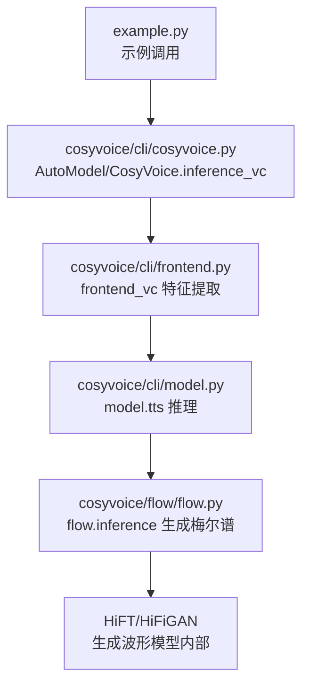
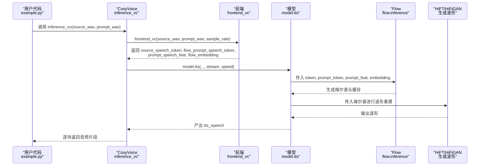
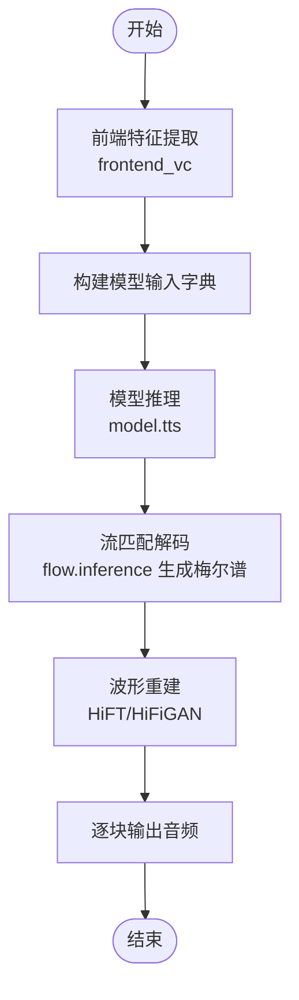
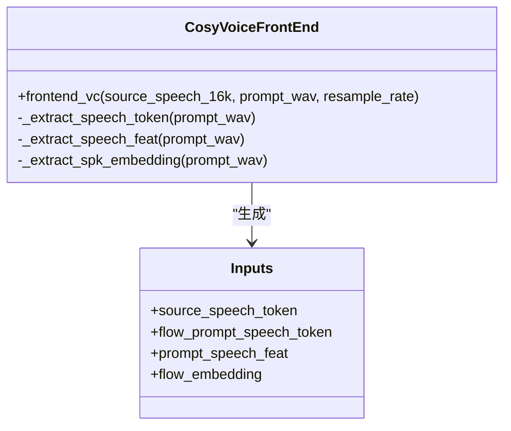
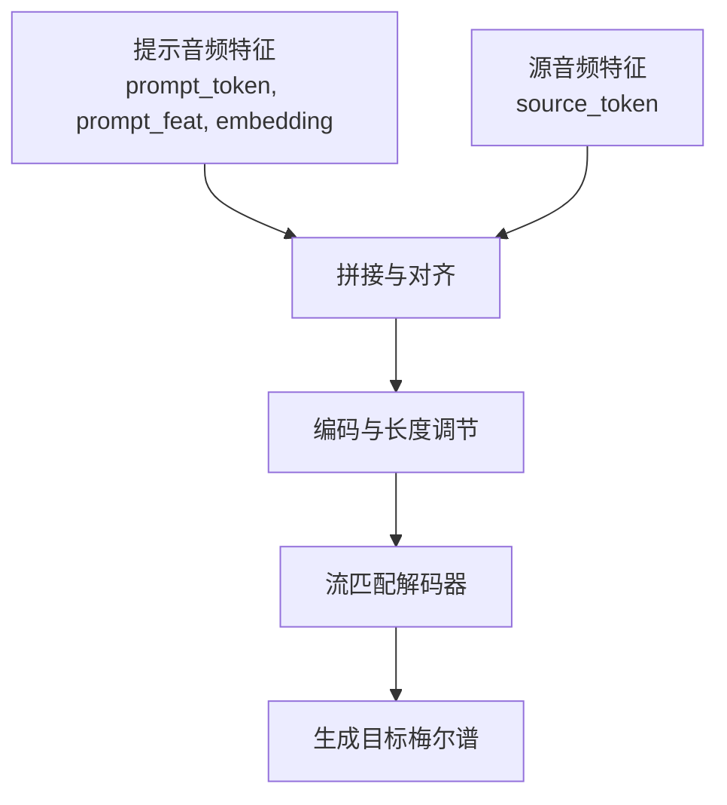
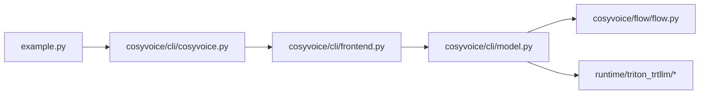

# 语音克隆

<cite>
**本文档引用的文件**
- [example.py](file://example.py)
- [README.md](file://README.md)
- [cosyvoice/cli/cosyvoice.py](file://cosyvoice/cli/cosyvoice.py)
- [cosyvoice/cli/frontend.py](file://cosyvoice/cli/frontend.py)
- [cosyvoice/flow/flow.py](file://cosyvoice/flow/flow.py)
- [cosyvoice/cli/model.py](file://cosyvoice/cli/model.py)
- [runtime/triton_trtllm/model_repo/token2wav_dit/1/token2wav_dit.py](file://runtime/triton_trtllm/model_repo/token2wav_dit/1/token2wav_dit.py)
- [runtime/triton_trtllm/model_repo/cosyvoice2_dit/1/model.py](file://runtime/triton_trtllm/model_repo/cosyvoice2_dit/1/model.py)
- [runtime/triton_trtllm/model_repo/audio_tokenizer/1/model.py](file://runtime/triton_trtllm/model_repo/audio_tokenizer/1/model.py)
</cite>

## 目录
1. [简介](#简介)
2. [项目结构](#项目结构)
3. [核心组件](#核心组件)
4. [架构总览](#架构总览)
5. [详细组件分析](#详细组件分析)
6. [依赖关系分析](#依赖关系分析)
7. [性能考量](#性能考量)
8. [故障排查指南](#故障排查指南)
9. [结论](#结论)
10. [附录](#附录)

## 简介
本节介绍 CosyVoice 的语音克隆（Voice Conversion, VC）功能。与零样本合成不同，VC 功能允许用户将源音频（source_wav）中的语音内容，转换为目标音色（由提示音频 prompt_wav 提供），从而实现“声音的直接转换”。该能力在配音、无障碍通信等领域具有重要应用潜力，并与零样本合成形成互补：零样本合成强调“从文本到语音”的跨说话人合成，而 VC 更关注“保持内容不变，仅替换音色”。

## 项目结构
围绕 VC 功能的关键文件与职责如下：
- 示例与入口：example.py 展示了如何调用 inference_vc 方法进行语音克隆。
- 接口层：cosyvoice/cli/cosyvoice.py 提供对外 API，封装前端特征提取与模型推理。
- 前端处理：cosyvoice/cli/frontend.py 负责文本/音频特征抽取（文本分词、语音声学特征、说话人嵌入、语音令牌）。
- 流式建模：cosyvoice/flow/flow.py 实现基于流匹配的声码器解码器，支持条件引导与缓存加速。
- 模型桥接：cosyvoice/cli/model.py 将前端输入传递给底层模型执行推理。
- Triton/ONNX 运行时：runtime/triton_trtllm 下的多个模型仓库提供部署级推理链路（音频令牌化、说话人嵌入、token2wav 等）。

图表来源
- [example.py](file://example.py#L25-L27)
- [cosyvoice/cli/cosyvoice.py](file://cosyvoice/cli/cosyvoice.py#L129-L136)
- [cosyvoice/cli/frontend.py](file://cosyvoice/cli/frontend.py#L215-L224)
- [cosyvoice/cli/model.py](file://cosyvoice/cli/model.py#L123-L136)
- [cosyvoice/flow/flow.py](file://cosyvoice/flow/flow.py#L101-L146)

章节来源
- [example.py](file://example.py#L25-L27)
- [README.md](file://README.md#L49-L49)

## 核心组件
- CosyVoice.inference_vc：对外暴露的 VC 推理接口，接收 source_wav 和 prompt_wav 两个核心参数，返回逐块音频输出。
- CosyVoiceFrontEnd.frontend_vc：将源音频与提示音频转换为模型所需的内部张量，包括：
  - 源音频的语音令牌（speech token）
  - 提示音频的语音令牌与梅尔谱（用于条件引导）
  - 提示音频的说话人嵌入（speaker embedding）
- Flow 模型（flow.inference）：将源语音令牌与提示条件拼接后，通过流匹配解码器生成目标音色的梅尔谱，并支持缓存以提升实时性。
- Triton/ONNX 运行时：提供音频令牌化、说话人嵌入、token2wav 等子模块，支撑大规模部署与低延迟推理。

章节来源
- [cosyvoice/cli/cosyvoice.py](file://cosyvoice/cli/cosyvoice.py#L129-L136)
- [cosyvoice/cli/frontend.py](file://cosyvoice/cli/frontend.py#L215-L224)
- [cosyvoice/flow/flow.py](file://cosyvoice/flow/flow.py#L101-L146)

## 架构总览
下图展示了 VC 功能从调用到输出的完整流程，包括特征提取、条件拼接、流匹配解码与波形生成。

图表来源
- [example.py](file://example.py#L25-L27)
- [cosyvoice/cli/cosyvoice.py](file://cosyvoice/cli/cosyvoice.py#L129-L136)
- [cosyvoice/cli/frontend.py](file://cosyvoice/cli/frontend.py#L215-L224)
- [cosyvoice/cli/model.py](file://cosyvoice/cli/model.py#L123-L136)
- [cosyvoice/flow/flow.py](file://cosyvoice/flow/flow.py#L101-L146)

## 详细组件分析

### inference_vc 方法详解
- 输入参数
  - source_wav：待转换的原始音频路径或张量，作为“内容载体”。
  - prompt_wav：目标音色的参考音频路径或张量，作为“音色条件”。
  - stream：是否启用流式输出。
  - speed：语速控制参数。
- 处理流程
  - 前端提取：调用 frontend_vc，得到 source_speech_token、flow_prompt_speech_token、prompt_speech_feat、flow_embedding。
  - 模型推理：将上述张量传入 model.tts，内部通过 flow.inference 生成目标音色的梅尔谱。
  - 波形重建：由 HiFT/HiFiGAN 将梅尔谱转为波形并逐块返回。
- 输出
  - 生成的语音张量（tts_speech），按采样率划分的长度与 RTF 日志。

图表来源
- [cosyvoice/cli/cosyvoice.py](file://cosyvoice/cli/cosyvoice.py#L129-L136)
- [cosyvoice/cli/frontend.py](file://cosyvoice/cli/frontend.py#L215-L224)
- [cosyvoice/cli/model.py](file://cosyvoice/cli/model.py#L123-L136)
- [cosyvoice/flow/flow.py](file://cosyvoice/flow/flow.py#L101-L146)

章节来源
- [cosyvoice/cli/cosyvoice.py](file://cosyvoice/cli/cosyvoice.py#L129-L136)

### 前端特征提取（frontend_vc）
- 关键步骤
  - 提取提示音频的语音令牌与梅尔谱，以及说话人嵌入，作为音色条件。
  - 提取源音频的语音令牌，作为内容载体。
  - 组装为模型输入字典，包含 token、长度、条件特征与嵌入。
- 与零样本合成的区别
  - VC 不使用文本编码，而是直接使用源音频的语音令牌作为输入。
  - 零样本合成需要文本与提示文本共同驱动，VC 则完全由音频驱动。

图表来源
- [cosyvoice/cli/frontend.py](file://cosyvoice/cli/frontend.py#L215-L224)

章节来源
- [cosyvoice/cli/frontend.py](file://cosyvoice/cli/frontend.py#L215-L224)

### 流匹配解码（flow.inference）
- 功能要点
  - 将提示音频的语音令牌与源音频的语音令牌拼接，作为条件引导。
  - 通过长度调节器与流匹配解码器，生成目标音色的梅尔谱。
  - 支持缓存以提升流式推理效率。
- 与零样本合成的关系
  - 两者都使用相同的 flow 模块，但零样本合成还会引入文本编码与提示文本的条件，VC 则完全由音频条件主导。

图表来源
- [cosyvoice/flow/flow.py](file://cosyvoice/flow/flow.py#L101-L146)

章节来源
- [cosyvoice/flow/flow.py](file://cosyvoice/flow/flow.py#L101-L146)

### 示例用法（example.py）
- 在示例中，VC 的调用方式如下：
  - 调用 inference_vc(source_wav, prompt_wav)，其中 source_wav 是待转换的内容音频，prompt_wav 是目标音色参考。
  - 逐块保存生成的音频片段，便于流式播放或后续处理。

章节来源
- [example.py](file://example.py#L25-L27)

### 应用场景与互补性
- 配音与多角色广播剧
  - 使用 VC 可以将同一段文本内容，快速转换为不同角色的音色，避免重复录制。
- 无障碍通信
  - 将用户熟悉的音色迁移到合成语音中，提升可理解性与亲和力。
- 与零样本合成的互补
  - 零样本合成适合“从文本到语音”的跨说话人合成；VC 则适合“保持内容不变，仅换音色”的场景，二者结合可覆盖更广泛的应用需求。

章节来源
- [README.md](file://README.md#L13-L21)

## 依赖关系分析
- 调用链依赖
  - example.py -> CosyVoice.inference_vc -> CosyVoiceFrontEnd.frontend_vc -> model.tts -> flow.inference -> HiFT/HiFiGAN
- 运行时依赖
  - Triton/ONNX 子模块：audio_tokenizer（音频令牌化）、speaker_embedding（说话人嵌入）、token2wav（声码器）协同工作，支撑大规模部署。

图表来源
- [example.py](file://example.py#L25-L27)
- [cosyvoice/cli/cosyvoice.py](file://cosyvoice/cli/cosyvoice.py#L129-L136)
- [cosyvoice/cli/frontend.py](file://cosyvoice/cli/frontend.py#L215-L224)
- [cosyvoice/cli/model.py](file://cosyvoice/cli/model.py#L123-L136)
- [cosyvoice/flow/flow.py](file://cosyvoice/flow/flow.py#L101-L146)
- [runtime/triton_trtllm/model_repo/token2wav_dit/1/token2wav_dit.py](file://runtime/triton_trtllm/model_repo/token2wav_dit/1/token2wav_dit.py#L311-L332)
- [runtime/triton_trtllm/model_repo/cosyvoice2_dit/1/model.py](file://runtime/triton_trtllm/model_repo/cosyvoice2_dit/1/model.py#L230-L276)
- [runtime/triton_trtllm/model_repo/audio_tokenizer/1/model.py](file://runtime/triton_trtllm/model_repo/audio_tokenizer/1/model.py#L66-L97)

章节来源
- [cosyvoice/cli/cosyvoice.py](file://cosyvoice/cli/cosyvoice.py#L129-L136)
- [cosyvoice/cli/frontend.py](file://cosyvoice/cli/frontend.py#L215-L224)
- [cosyvoice/cli/model.py](file://cosyvoice/cli/model.py#L123-L136)
- [cosyvoice/flow/flow.py](file://cosyvoice/flow/flow.py#L101-L146)
- [runtime/triton_trtllm/model_repo/token2wav_dit/1/token2wav_dit.py](file://runtime/triton_trtllm/model_repo/token2wav_dit/1/token2wav_dit.py#L311-L332)
- [runtime/triton_trtllm/model_repo/cosyvoice2_dit/1/model.py](file://runtime/triton_trtllm/model_repo/cosyvoice2_dit/1/model.py#L230-L276)
- [runtime/triton_trtllm/model_repo/audio_tokenizer/1/model.py](file://runtime/triton_trtllm/model_repo/audio_tokenizer/1/model.py#L66-L97)

## 性能考量
- 流式输出与缓存
  - flow.inference 支持缓存与流式推理，有助于降低首包延迟并提升实时性。
- 采样率与令牌对齐
  - 前端在特定采样率下会对梅尔谱与语音令牌进行对齐，确保条件与输入的时序一致性。
- ONNX/Triton 加速
  - 通过 ONNXRuntime 与 Triton 推理引擎，可在 CPU/GPU 上实现高效部署，满足生产环境的吞吐与延迟要求。

章节来源
- [cosyvoice/flow/flow.py](file://cosyvoice/flow/flow.py#L101-L146)
- [runtime/triton_trtllm/model_repo/audio_tokenizer/1/model.py](file://runtime/triton_trtllm/model_repo/audio_tokenizer/1/model.py#L66-L97)

## 故障排查指南
- 模型加载与路径问题
  - 若出现模块导入错误，需确保 Matcha-TTS 子模块已初始化，或正确设置 PYTHONPATH。
- 音频长度限制
  - 前端在提取语音令牌时对音频长度有限制（不超过 30 秒），超长音频可能导致异常。
- 采样率不一致
  - VC 对输入音频的采样率有要求，前端会按需重采样，确保与模型配置一致。
- 零样本与 VC 的混淆
  - 零样本合成需要文本与提示文本，VC 仅需 source_wav 与 prompt_wav；确认调用接口与参数组合正确。

章节来源
- [FAQ.md](file://FAQ.md#L1-L17)
- [cosyvoice/cli/frontend.py](file://cosyvoice/cli/frontend.py#L95-L106)

## 结论
CosyVoice 的语音克隆（VC）功能通过“内容音频 + 音色参考音频”的双输入设计，实现了高保真音色迁移。其与零样本合成在应用场景上形成互补：前者专注于“音色替换”，后者侧重“跨说话人内容合成”。借助前端特征提取、流匹配解码与 Triton/ONNX 运行时，VC 在准确度、实时性与可扩展性方面均具备良好表现，适合在配音、无障碍通信等实际业务中落地。

## 附录
- 相关实现参考路径
  - VC 调用入口：[cosyvoice/cli/cosyvoice.py](file://cosyvoice/cli/cosyvoice.py#L129-L136)
  - 前端特征提取：[cosyvoice/cli/frontend.py](file://cosyvoice/cli/frontend.py#L215-L224)
  - 流匹配解码：[cosyvoice/flow/flow.py](file://cosyvoice/flow/flow.py#L101-L146)
  - 示例调用：[example.py](file://example.py#L25-L27)