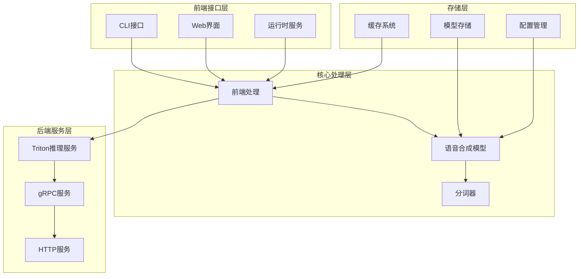
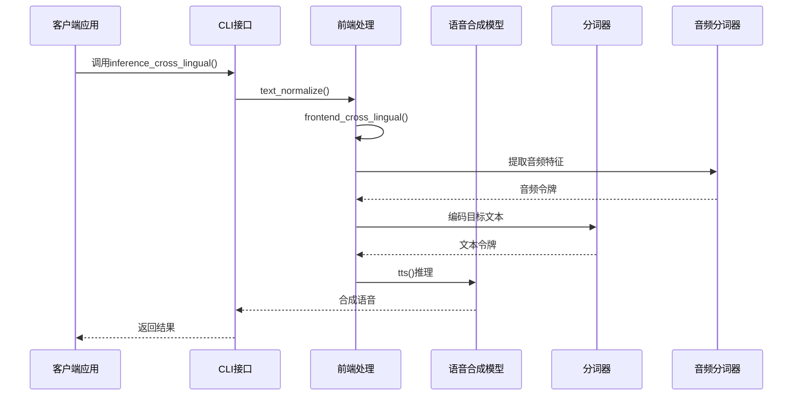
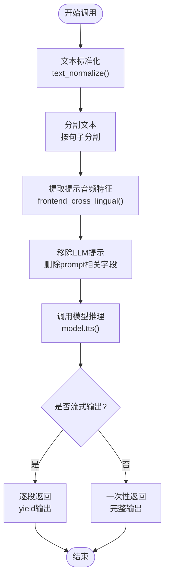
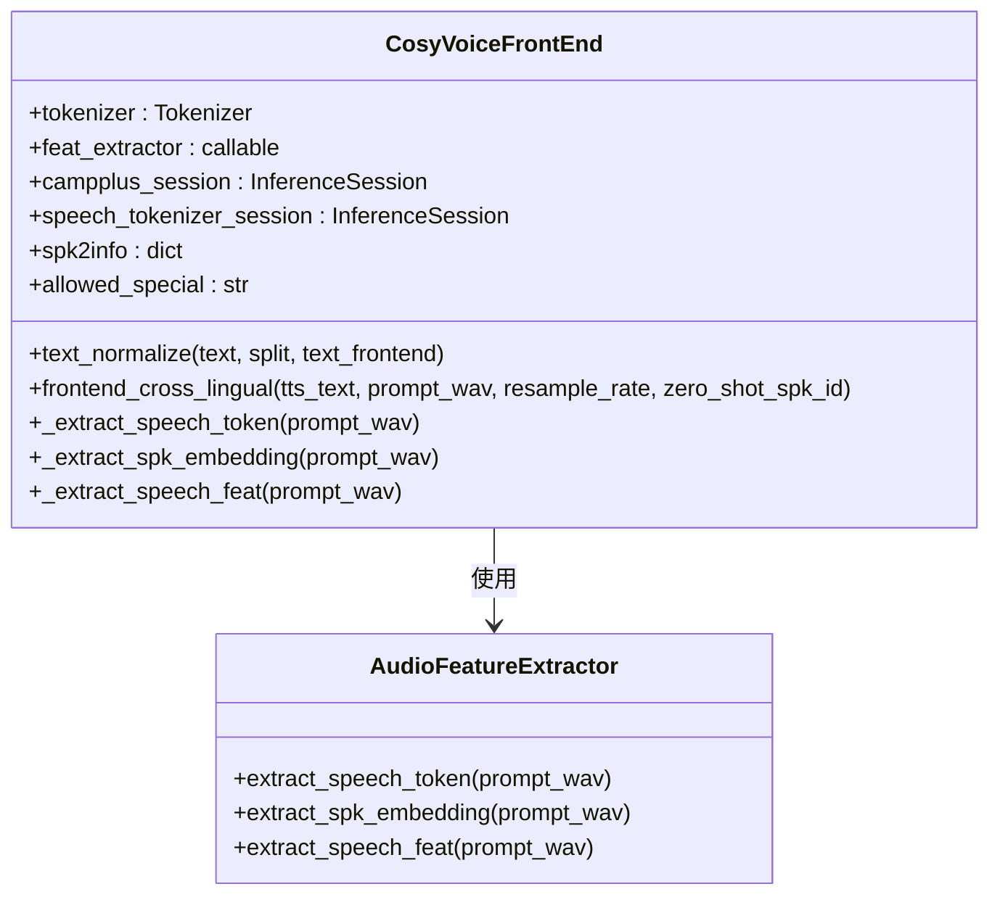
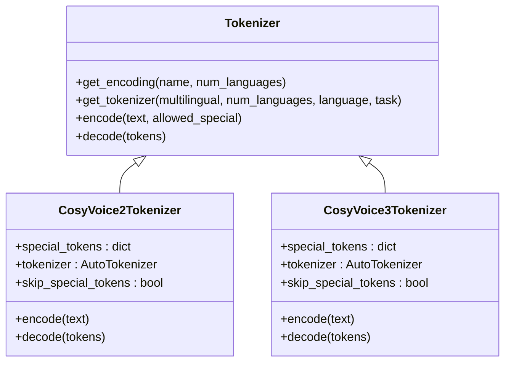
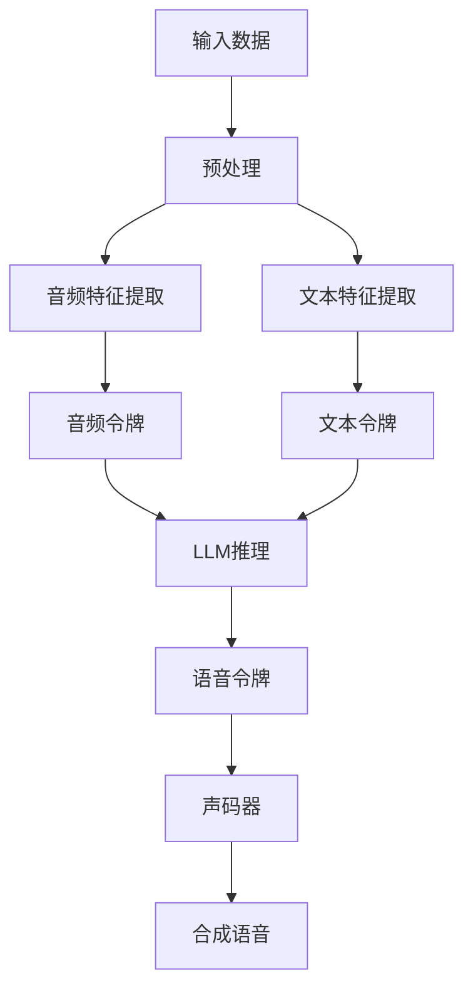
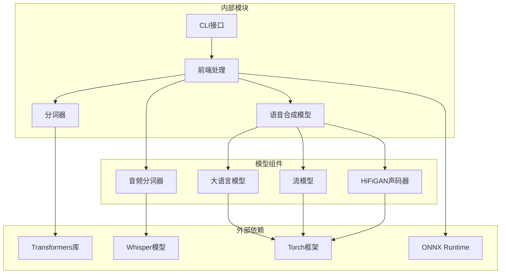

# 跨语言语音合成

<cite>
**本文档引用的文件**
- [example.py](file://example.py)
- [cosyvoice.py](file://cosyvoice/cli/cosyvoice.py)
- [frontend.py](file://cosyvoice/cli/frontend.py)
- [tokenizer.py](file://cosyvoice/tokenizer/tokenizer.py)
- [multilingual_zh_ja_yue_char_del.tiktoken](file://cosyvoice/tokenizer/assets/multilingual_zh_ja_yue_char_del.tiktoken)
</cite>

## 目录
1. [简介](#简介)
2. [项目结构](#项目结构)
3. [核心组件](#核心组件)
4. [架构概览](#架构概览)
5. [详细组件分析](#详细组件分析)
6. [依赖关系分析](#依赖关系分析)
7. [性能考虑](#性能考虑)
8. [故障排除指南](#故障排除指南)
9. [结论](#结论)

## 简介

CosyVoice是一个先进的跨语言语音合成系统，能够实现真正的跨语言语音克隆。该系统的核心能力是能够在保持说话人身份特征不变的情况下，将一种语言的提示音频转换为另一种语言的文本合成语音。

在跨语言语音合成场景中，系统只需要提供提示音频（prompt_wav），而无需提供对应的提示文本（prompt_text）。这种设计使得用户可以使用任何语言的音频作为参考，然后合成目标语言的文本内容。

## 项目结构

CosyVoice项目采用模块化架构设计，主要包含以下核心模块：

**图表来源**
- [cosyvoice.py](file://cosyvoice/cli/cosyvoice.py#L27-L64)
- [frontend.py](file://cosyvoice/cli/frontend.py#L30-L54)

**章节来源**
- [cosyvoice.py](file://cosyvoice/cli/cosyvoice.py#L1-L239)
- [frontend.py](file://cosyvoice/cli/frontend.py#L1-L225)

## 核心组件

### 1. 跨语言语音合成接口

跨语言语音合成功能通过`inference_cross_lingual`方法实现，该方法具有以下特点：

- **输入参数**：
  - `tts_text`：包含语言标记的目标文本
  - `prompt_wav`：提示音频文件路径
  - `zero_shot_spk_id`：零样本说话人ID（可选）
  - `stream`：流式输出标志（可选）
  - `speed`：语速控制（可选）

- **核心特性**：
  - 仅需要音频提示，无需文本提示
  - 支持多语言无缝切换
  - 保持原始说话人的音色特征

### 2. 语言标记系统

系统支持多种语言标记，用于指定目标文本的语言：

- `<|zh|>` - 中文
- `<|en|>` - 英语  
- `<|ja|>` - 日语
- `<|yue|>` - 粤语
- `<|ko|>` - 韩语

这些语言标记在文本预处理阶段被识别和处理，确保模型正确理解目标语言。

### 3. 分词器架构

分词器采用多语言支持的设计，包含以下组件：

- **基础分词器**：支持99种语言的通用分词
- **多语言分词器**：专门针对中文、日语、粤语字符进行优化
- **特殊标记处理**：支持语言标记、情感标记、语音事件标记等

**章节来源**
- [cosyvoice.py](file://cosyvoice/cli/cosyvoice.py#L105-L114)
- [tokenizer.py](file://cosyvoice/tokenizer/tokenizer.py#L11-L117)
- [tokenizer.py](file://cosyvoice/tokenizer/tokenizer.py#L169-L206)

## 架构概览

CosyVoice的跨语言语音合成架构采用分层设计，确保了系统的可扩展性和高效性：

**图表来源**
- [cosyvoice.py](file://cosyvoice/cli/cosyvoice.py#L105-L114)
- [frontend.py](file://cosyvoice/cli/frontend.py#L191-L198)

## 详细组件分析

### 1. CLI接口层

CLI接口提供了用户友好的API，支持多种语音合成模式：

#### 跨语言语音合成方法

**图表来源**
- [cosyvoice.py](file://cosyvoice/cli/cosyvoice.py#L105-L114)
- [frontend.py](file://cosyvoice/cli/frontend.py#L191-L198)

#### 跨语言模式的特殊处理

在跨语言模式下，系统会执行特殊的预处理步骤：

1. **提示文本清空**：将`prompt_text`设置为空字符串
2. **LLM提示移除**：删除所有与LLM提示相关的字段
3. **音频特征保留**：保留音频特征用于说话人建模

**章节来源**
- [cosyvoice.py](file://cosyvoice/cli/cosyvoice.py#L105-L114)
- [frontend.py](file://cosyvoice/cli/frontend.py#L191-L198)

### 2. 前端处理层

前端处理层负责将输入数据转换为模型可理解的格式：

#### 音频特征提取

**图表来源**
- [frontend.py](file://cosyvoice/cli/frontend.py#L30-L54)
- [frontend.py](file://cosyvoice/cli/frontend.py#L95-L125)

#### 文本预处理流程

前端处理包含复杂的文本预处理逻辑：

1. **语言检测**：自动检测输入文本的语言类型
2. **规范化处理**：根据语言类型进行相应的文本规范化
3. **分段处理**：将长文本分割为适合模型处理的片段
4. **特殊标记处理**：识别和处理语言标记等特殊符号

**章节来源**
- [frontend.py](file://cosyvoice/cli/frontend.py#L127-L160)

### 3. 分词器系统

分词器是跨语言语音合成的核心组件，负责将文本转换为模型可理解的令牌序列：

#### 多语言分词器架构

**图表来源**
- [tokenizer.py](file://cosyvoice/tokenizer/tokenizer.py#L209-L238)
- [tokenizer.py](file://cosyvoice/tokenizer/tokenizer.py#L241-L272)
- [tokenizer.py](file://cosyvoice/tokenizer/tokenizer.py#L274-L314)

#### 语言标记处理机制

分词器系统实现了完整的语言标记处理机制：

1. **语言标记注册**：在特殊令牌中注册所有支持的语言标记
2. **动态编码**：根据目标语言动态选择编码器
3. **令牌映射**：将语言标记映射到对应的令牌ID

**章节来源**
- [tokenizer.py](file://cosyvoice/tokenizer/tokenizer.py#L169-L206)
- [tokenizer.py](file://cosyvoice/tokenizer/tokenizer.py#L241-L314)

### 4. 模型推理层

模型推理层负责实际的语音合成过程，包括多个子组件的协同工作：

#### 语音合成流程

**图表来源**
- [cosyvoice.py](file://cosyvoice/cli/cosyvoice.py#L50-L63)

## 依赖关系分析

CosyVoice的跨语言语音合成功能涉及多个层次的依赖关系：

**图表来源**
- [cosyvoice.py](file://cosyvoice/cli/cosyvoice.py#L20-L24)
- [frontend.py](file://cosyvoice/cli/frontend.py#L42-L48)

**章节来源**
- [cosyvoice.py](file://cosyvoice/cli/cosyvoice.py#L1-L239)
- [frontend.py](file://cosyvoice/cli/frontend.py#L1-L225)

## 性能考虑

### 1. 推理性能优化

跨语言语音合成系统在性能方面采用了多项优化策略：

- **并行处理**：支持多线程和异步推理
- **内存管理**：优化内存使用，避免内存泄漏
- **缓存机制**：缓存常用的音频特征和模型权重
- **流式输出**：支持实时流式语音合成

### 2. 语言切换效率

系统在语言切换方面的优化包括：

- **快速令牌映射**：使用LRU缓存加速语言标记处理
- **动态编码器选择**：根据语言类型选择最优编码器
- **批量处理**：支持批量音频和文本处理

### 3. 资源管理

- **GPU加速**：优先使用GPU进行推理
- **内存池**：使用内存池减少内存分配开销
- **模型量化**：支持FP16半精度推理

## 故障排除指南

### 1. 常见问题及解决方案

#### 问题1：跨语言合成效果不佳

**可能原因**：
- 提示音频质量差
- 目标文本过短
- 语言标记不正确

**解决方案**：
- 使用高质量的提示音频（建议10-30秒）
- 确保目标文本长度适中（至少包含完整句子）
- 正确使用语言标记

#### 问题2：模型加载失败

**可能原因**：
- 模型文件损坏
- CUDA环境不兼容
- 内存不足

**解决方案**：
- 重新下载模型文件
- 检查CUDA版本兼容性
- 关闭其他占用内存的应用程序

#### 问题3：推理速度慢

**可能原因**：
- CPU资源不足
- 模型未使用GPU
- 批量大小不合适

**解决方案**：
- 确保GPU可用且驱动正常
- 启用GPU推理模式
- 调整批量大小参数

### 2. 调试技巧

- **启用详细日志**：查看详细的推理过程信息
- **监控资源使用**：观察CPU和GPU使用情况
- **测试最小化案例**：先测试简单的跨语言合成案例
- **检查音频格式**：确保输入音频格式正确

**章节来源**
- [cosyvoice.py](file://cosyvoice/cli/cosyvoice.py#L91-L103)
- [frontend.py](file://cosyvoice/cli/frontend.py#L95-L106)

## 结论

CosyVoice的跨语言语音合成技术代表了语音合成领域的最新进展。通过独特的设计，系统实现了真正的跨语言语音克隆，用户只需提供提示音频即可合成任意语言的文本内容。

### 主要优势

1. **真正的跨语言能力**：无需文本提示，仅需音频即可实现语言切换
2. **保持说话人特征**：合成的语音完美保持原始说话人的音色特征
3. **多语言支持**：支持99种语言的无缝切换
4. **易于使用**：简洁的API设计，便于集成和使用

### 应用场景

- **多语言客服系统**：为不同语言用户提供统一的语音服务
- **内容本地化**：快速将内容翻译并合成为目标语言
- **语音助手**：支持多语言交互的智能语音助手
- **教育培训**：提供多语言学习和练习材料

### 未来发展方向

- **更高质量的语音合成**：持续改进语音质量和自然度
- **实时语音转换**：支持实时的跨语言语音转换
- **个性化定制**：提供更多个性化的语音风格选项
- **移动端优化**：优化移动端的性能和用户体验

通过深入理解CosyVoice的跨语言语音合成技术，开发者可以更好地利用这一强大的工具来构建各种语音应用，为用户提供更加丰富和便捷的语音交互体验。