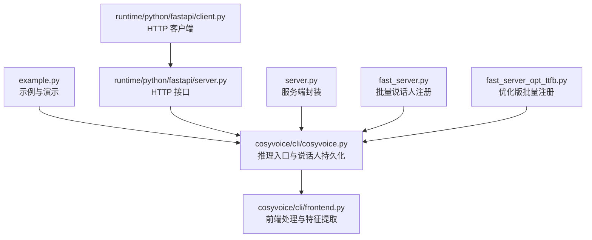
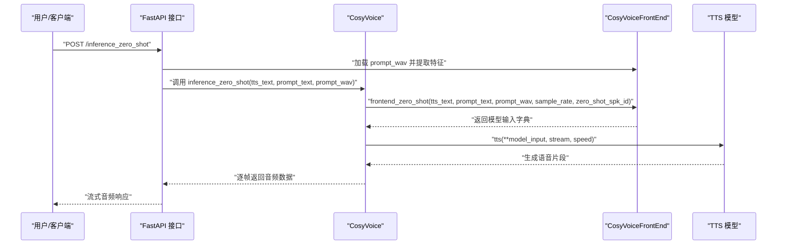
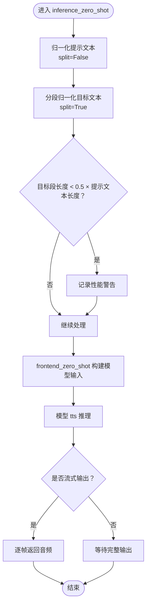
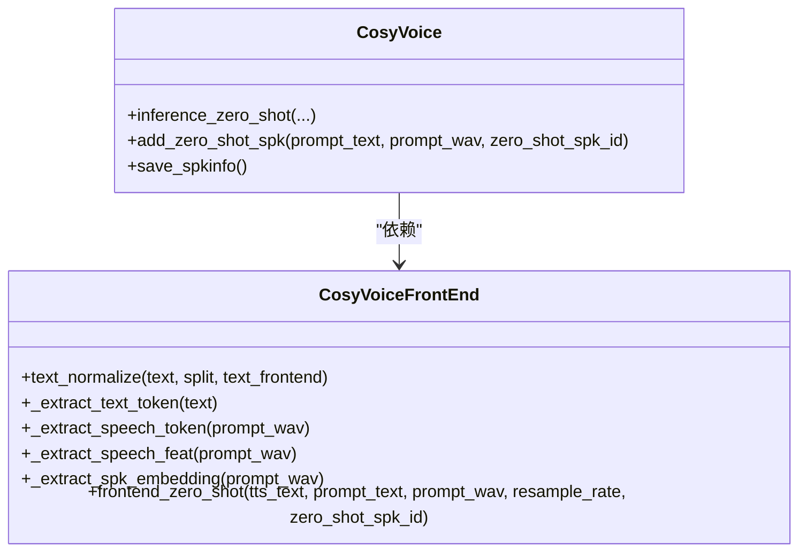
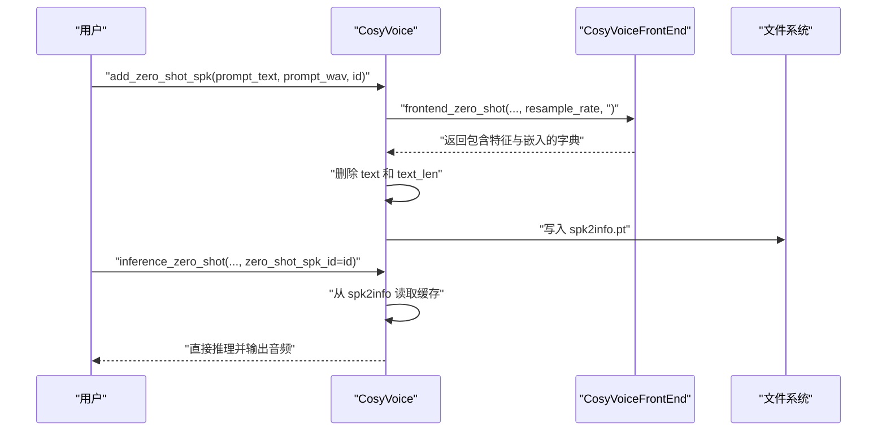
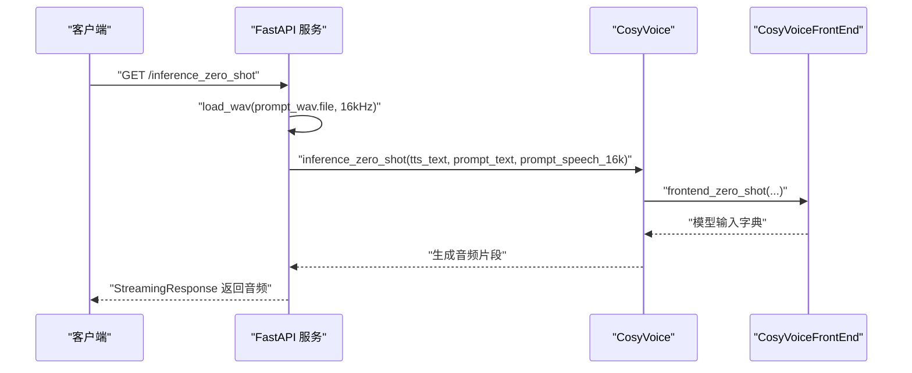
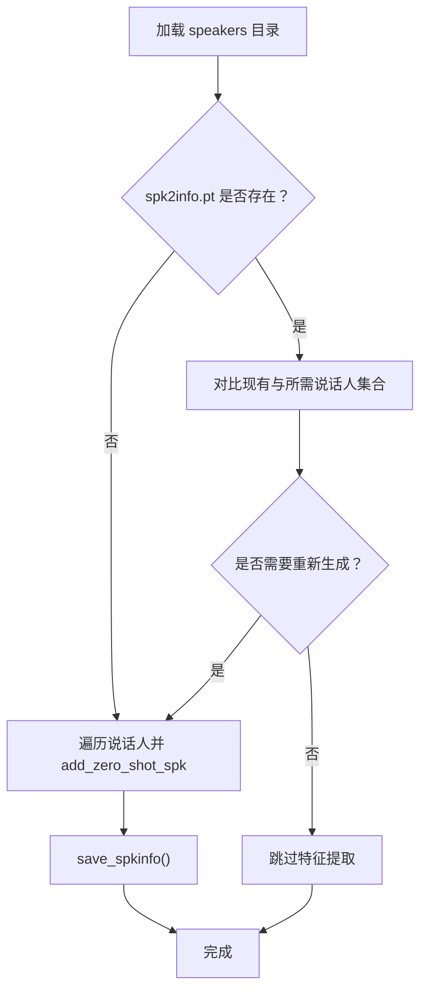
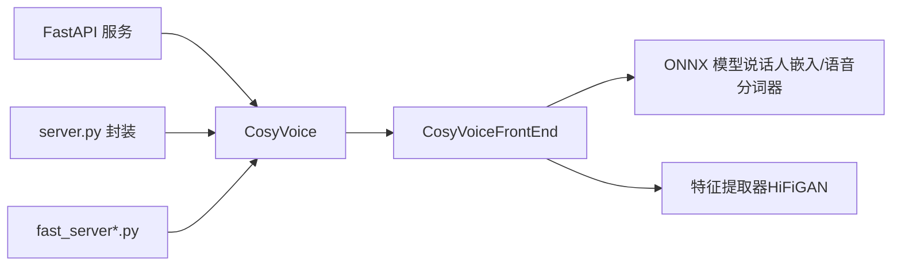

# 零样本语音合成

<cite>
**本文档引用的文件**
- [example.py](file://example.py)
- [cosyvoice.py](file://cosyvoice/cli/cosyvoice.py)
- [frontend.py](file://cosyvoice/cli/frontend.py)
- [server.py](file://server.py)
- [fast_server.py](file://fast_server.py)
- [fast_server_opt_ttfb.py](file://fast_server_opt_ttfb.py)
- [client.py](file://runtime/python/fastapi/client.py)
- [server.py](file://runtime/python/fastapi/server.py)
- [README.md](file://README.md)
</cite>

## 目录
1. [简介](#简介)
2. [项目结构](#项目结构)
3. [核心组件](#核心组件)
4. [架构总览](#架构总览)
5. [详细组件分析](#详细组件分析)
6. [依赖关系分析](#依赖关系分析)
7. [性能考量](#性能考量)
8. [故障排查指南](#故障排查指南)
9. [结论](#结论)

## 简介
本节介绍 CosyVoice 的零样本语音合成（Zero-Shot TTS）能力，即通过提供一段提示音频（prompt_wav）和对应的提示文本（prompt_text），模型能够学习并克隆新说话人的声音特征，从而合成任意文本的语音。该功能广泛应用于语音克隆、个性化语音助手、多语言内容播报等场景。

## 项目结构
围绕零样本 TTS 的关键文件与职责如下：
- 示例与演示：example.py 提供调用入口与典型用法
- 核心推理：cosyvoice/cli/cosyvoice.py 实现 inference_zero_shot 及说话人信息持久化
- 前端处理：cosyvoice/cli/frontend.py 实现文本归一化、声学特征提取与说话人嵌入
- 服务器与客户端：runtime/python/fastapi/server.py 与 client.py 提供 HTTP 接口
- 服务端封装：server.py、fast_server.py、fast_server_opt_ttfb.py 提供批量说话人注册与持久化

**图表来源**
- [example.py](file://example.py#L1-L107)
- [cosyvoice.py](file://cosyvoice/cli/cosyvoice.py#L69-L103)
- [frontend.py](file://cosyvoice/cli/frontend.py#L127-L189)
- [server.py](file://runtime/python/fastapi/server.py#L53-L58)
- [client.py](file://runtime/python/fastapi/client.py#L22-L56)
- [server.py](file://server.py#L306-L315)
- [fast_server.py](file://fast_server.py#L1044-L1103)
- [fast_server_opt_ttfb.py](file://fast_server_opt_ttfb.py#L1338-L1397)

**章节来源**
- [example.py](file://example.py#L1-L107)
- [cosyvoice.py](file://cosyvoice/cli/cosyvoice.py#L1-L239)
- [frontend.py](file://cosyvoice/cli/frontend.py#L1-L225)
- [server.py](file://runtime/python/fastapi/server.py#L40-L73)
- [client.py](file://runtime/python/fastapi/client.py#L22-L92)
- [server.py](file://server.py#L306-L315)
- [fast_server.py](file://fast_server.py#L1044-L1103)
- [fast_server_opt_ttfb.py](file://fast_server_opt_ttfb.py#L1338-L1397)

## 核心组件
- CosyVoice 类：提供 inference_zero_shot 方法及 add_zero_shot_spk/save_spkinfo 说话人持久化接口
- CosyVoiceFrontEnd 类：负责文本归一化、声学特征提取（语音 token、mel 特征）、说话人嵌入提取
- 服务器与客户端：提供 HTTP 接口以支持远程调用零样本 TTS

**章节来源**
- [cosyvoice.py](file://cosyvoice/cli/cosyvoice.py#L27-L137)
- [frontend.py](file://cosyvoice/cli/frontend.py#L30-L125)
- [server.py](file://runtime/python/fastapi/server.py#L53-L58)
- [client.py](file://runtime/python/fastapi/client.py#L22-L56)

## 架构总览
零样本 TTS 的整体流程：
- 输入：目标文本（tts_text）、提示文本（prompt_text）、提示音频（prompt_wav）或已注册的说话人 ID（zero_shot_spk_id）
- 前端处理：文本归一化、提取语音 token、mel 特征、说话人嵌入
- 模型推理：将提示信息与目标文本组合，生成语音 token 再经声码器合成音频
- 输出：按流式返回的音频片段

**图表来源**
- [server.py](file://runtime/python/fastapi/server.py#L53-L58)
- [cosyvoice.py](file://cosyvoice/cli/cosyvoice.py#L91-L103)
- [frontend.py](file://cosyvoice/cli/frontend.py#L168-L189)

## 详细组件分析

### inference_zero_shot 方法详解
- 参数说明
  - tts_text：目标合成文本，支持字符串或文本生成器（用于流式输入）
  - prompt_text：提示文本，用于指导模型学习说话人风格
  - prompt_wav：提示音频路径，提供说话人声音特征
  - zero_shot_spk_id：可选，若提供则直接复用已保存的说话人信息，无需再次提取特征
  - stream：是否启用流式输出
  - speed：语速控制
  - text_frontend：是否启用文本前端归一化
- 处理流程
  - 对 prompt_text 进行一次归一化（split=False）
  - 对 tts_text 分段归一化（split=True），并在每段开始前进行长度比较，短于提示文本一半时给出性能警告
  - 调用 frontend_zero_shot 生成模型输入字典
  - 逐段调用模型 tts 生成语音并按 RTF 记录日志

**图表来源**
- [cosyvoice.py](file://cosyvoice/cli/cosyvoice.py#L91-L103)

**章节来源**
- [cosyvoice.py](file://cosyvoice/cli/cosyvoice.py#L91-L103)

### 前端处理与特征提取
- 文本归一化：根据语言自动选择 ttsfrd/wetext 归一化器，进行换行、括号、数字等处理，并按 token 数量进行智能分段
- 语音特征提取：
  - 说话人嵌入：使用 ONNX 模型提取 192 维说话人嵌入向量
  - 语音 token：使用 Whisper 的 log-mel 谱与 ONNX 语音分词器提取离散 token 序列
  - Mel 特征：使用特征提取器（如 HiFiGAN）提取 80 维 mel 特征序列
- 零样本模式：当 zero_shot_spk_id 为空时，提取上述特征并组织成模型输入；否则直接从 spk2info 中读取缓存

**图表来源**
- [frontend.py](file://cosyvoice/cli/frontend.py#L127-L189)
- [cosyvoice.py](file://cosyvoice/cli/cosyvoice.py#L69-L103)

**章节来源**
- [frontend.py](file://cosyvoice/cli/frontend.py#L78-L125)
- [frontend.py](file://cosyvoice/cli/frontend.py#L168-L189)
- [cosyvoice.py](file://cosyvoice/cli/cosyvoice.py#L69-L79)

### 说话人信息持久化与复用
- add_zero_shot_spk：将提示文本、提示音频的特征与嵌入提取后，存入 spk2info，并删除 text/text_len 字段，便于后续直接复用
- save_spkinfo：将 spk2info 保存为模型目录下的 spk2info.pt 文件
- 在 inference_zero_shot 中，若提供 zero_shot_spk_id，则直接从 spk2info 读取缓存，避免重复特征提取

**图表来源**
- [cosyvoice.py](file://cosyvoice/cli/cosyvoice.py#L69-L79)
- [frontend.py](file://cosyvoice/cli/frontend.py#L168-L189)

**章节来源**
- [cosyvoice.py](file://cosyvoice/cli/cosyvoice.py#L69-L79)
- [frontend.py](file://cosyvoice/cli/frontend.py#L168-L189)

### HTTP 接口与客户端调用
- FastAPI 接口：/inference_zero_shot 接收 tts_text、prompt_text 与 prompt_wav 文件，内部加载音频并调用 CosyVoice 推理
- 客户端：示例中通过 GET 请求发送表单数据与文件，接收流式音频并保存为本地文件

**图表来源**
- [server.py](file://runtime/python/fastapi/server.py#L53-L58)
- [client.py](file://runtime/python/fastapi/client.py#L22-L56)

**章节来源**
- [server.py](file://runtime/python/fastapi/server.py#L53-L58)
- [client.py](file://runtime/python/fastapi/client.py#L22-L56)

### 批量说话人注册与持久化（服务端）
- fast_server.py/fast_server_opt_ttfb.py：从指定目录批量加载说话人，调用 add_zero_shot_spk 注册，最后统一保存 spk2info.pt
- 支持增量更新：若检测到新增说话人，重新生成并覆盖保存

**图表来源**
- [fast_server.py](file://fast_server.py#L1044-L1103)
- [fast_server_opt_ttfb.py](file://fast_server_opt_ttfb.py#L1338-L1397)

**章节来源**
- [fast_server.py](file://fast_server.py#L1044-L1103)
- [fast_server_opt_ttfb.py](file://fast_server_opt_ttfb.py#L1338-L1397)

## 依赖关系分析
- CosyVoice 依赖 CosyVoiceFrontEnd 进行文本与音频特征处理
- CosyVoiceFrontEnd 依赖 ONNX 模型（说话人嵌入、语音分词器）与特征提取器（HiFiGAN）
- 服务器层通过 FastAPI 将 CosyVoice 暴露为 HTTP 接口
- 服务端封装（server.py）与批量注册脚本（fast_server*.py）进一步扩展了零样本 TTS 的工程化能力

**图表来源**
- [cosyvoice.py](file://cosyvoice/cli/cosyvoice.py#L27-L63)
- [frontend.py](file://cosyvoice/cli/frontend.py#L32-L53)
- [server.py](file://runtime/python/fastapi/server.py#L53-L58)
- [server.py](file://server.py#L306-L315)
- [fast_server.py](file://fast_server.py#L1044-L1103)
- [fast_server_opt_ttfb.py](file://fast_server_opt_ttfb.py#L1338-L1397)

**章节来源**
- [cosyvoice.py](file://cosyvoice/cli/cosyvoice.py#L27-L63)
- [frontend.py](file://cosyvoice/cli/frontend.py#L32-L53)
- [server.py](file://runtime/python/fastapi/server.py#L53-L58)
- [server.py](file://server.py#L306-L315)
- [fast_server.py](file://fast_server.py#L1044-L1103)
- [fast_server_opt_ttfb.py](file://fast_server_opt_ttfb.py#L1338-L1397)

## 性能考量
- 提示文本长度建议：当目标文本长度显著短于提示文本时，可能出现性能下降。系统会在推理前进行长度比较并发出警告，建议保持目标文本长度至少为提示文本的一半以上
- 流式输出：启用 stream 可降低首包延迟，适合实时应用
- 说话人特征复用：通过 add_zero_shot_spk 与 save_spkinfo 将特征缓存到 spk2info.pt，后续推理可直接复用，避免重复特征提取
- 批量注册优化：fast_server*.py 支持增量检测与批量保存，减少重复计算

**章节来源**
- [cosyvoice.py](file://cosyvoice/cli/cosyvoice.py#L94-L95)
- [fast_server.py](file://fast_server.py#L1044-L1103)
- [fast_server_opt_ttfb.py](file://fast_server_opt_ttfb.py#L1338-L1397)

## 故障排查指南
- 无 CUDA 设备时的降级：若系统无 GPU，CosyVoice 会自动关闭 JIT/TensorRT/FP16 加速选项并打印警告
- 说话人 ID 为空：add_zero_shot_spk 断言 zero_shot_spk_id 不能为空
- 提示音频过长：语音 token 提取限制最长不超过 30 秒
- 文本前端不可用：若 ttsfrd 不可用，将回退至 wetext；若均不可用，将跳过文本前端处理

**章节来源**
- [cosyvoice.py](file://cosyvoice/cli/cosyvoice.py#L47-L49)
- [cosyvoice.py](file://cosyvoice/cli/cosyvoice.py#L69-L75)
- [frontend.py](file://cosyvoice/cli/frontend.py#L97-L98)
- [frontend.py](file://cosyvoice/cli/frontend.py#L65-L75)

## 结论
CosyVoice 的零样本语音合成通过“提示文本 + 提示音频”的方式，实现了对新说话人的快速克隆与高质量语音合成。其核心在于前端特征提取与模型输入构建，配合流式输出与说话人信息持久化，既保证了实时性又提升了工程可用性。结合 HTTP 接口与批量注册脚本，可在实际业务中快速落地语音克隆与个性化语音助手等应用场景。