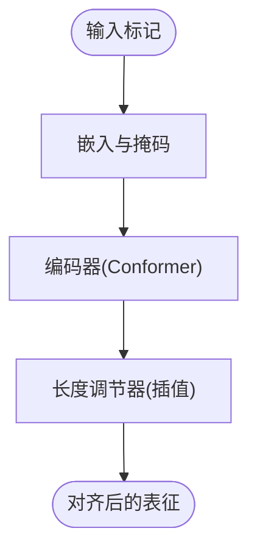

# Flow模块

<cite>
**本文档引用的文件**
- [flow.py](file://cosyvoice/flow/flow.py)
- [flow_matching.py](file://cosyvoice/flow/flow_matching.py)
- [decoder.py](file://cosyvoice/flow/decoder.py)
- [length_regulator.py](file://cosyvoice/flow/length_regulator.py)
- [dit.py](file://cosyvoice/flow/DiT/dit.py)
- [modules.py](file://cosyvoice/flow/DiT/modules.py)
- [cosyvoice.yaml](file://examples/libritts/cosyvoice/conf/cosyvoice.yaml)
- [README.md](file://README.md)
- [export_onnx.py](file://cosyvoice/bin/export_onnx.py)
- [token2wav.py](file://runtime/triton_trtllm/token2wav.py)
</cite>

## 目录
1. [简介](#简介)
2. [项目结构](#项目结构)
3. [核心组件](#核心组件)
4. [架构总览](#架构总览)
5. [详细组件分析](#详细组件分析)
6. [依赖关系分析](#依赖关系分析)
7. [性能考量](#性能考量)
8. [故障排查指南](#故障排查指南)
9. [结论](#结论)
10. [附录](#附录)

## 简介
本文件聚焦于CosyVoice的Flow模块，这是一个基于条件流匹配（Conditional Flow Matching, CFM）的声学建模子系统。Flow模块的核心目标是将LLM生成的语音标记序列转换为梅尔频谱图，并通过扩散过程进行高质量、高效率的语音合成。Flow模块采用DiT（Diffusion Transformer）架构作为估计器，结合长度调节器与条件解码器，实现从文本标记到梅尔谱的端到端映射。模块支持非流式与流式两种推理模式，分别针对离线批量合成与实时流式合成进行优化。

## 项目结构
Flow模块位于cosyvoice/flow目录下，主要由以下文件组成：
- flow.py：定义多种Flow模型封装类（掩码扩散、因果扩散、DiT因果扩散），负责前向与推理流程编排
- flow_matching.py：实现条件流匹配（CFM）算法，包含扩散求解器与损失计算
- decoder.py：提供条件解码器（UNet1D变体）与因果解码器，作为CFM估计器
- length_regulator.py：插值长度调节器，用于对齐文本编码特征与梅尔时间步长
- DiT/dit.py 与 DiT/modules.py：DiT架构实现，包含文本嵌入、输入嵌入、旋转位置编码、注意力块等

图表来源
- [flow.py](file://cosyvoice/flow/flow.py#L1-L434)
- [flow_matching.py](file://cosyvoice/flow/flow_matching.py#L1-L229)
- [decoder.py](file://cosyvoice/flow/decoder.py#L1-L495)
- [length_regulator.py](file://cosyvoice/flow/length_regulator.py#L1-L71)
- [dit.py](file://cosyvoice/flow/DiT/dit.py#L1-L177)
- [modules.py](file://cosyvoice/flow/DiT/modules.py#L1-L617)

章节来源
- [flow.py](file://cosyvoice/flow/flow.py#L1-L434)
- [flow_matching.py](file://cosyvoice/flow/flow_matching.py#L1-L229)
- [decoder.py](file://cosyvoice/flow/decoder.py#L1-L495)
- [length_regulator.py](file://cosyvoice/flow/length_regulator.py#L1-L71)
- [dit.py](file://cosyvoice/flow/DiT/dit.py#L1-L177)
- [modules.py](file://cosyvoice/flow/DiT/modules.py#L1-L617)

## 核心组件
- 编码器（Encoder）：将LLM生成的语音标记序列编码为上下文表征，供后续长度调节与条件解码器使用
- 长度调节器（Length Regulator）：将编码器输出按采样率比例扩展，使其与目标梅尔帧数对齐
- 解码器（Decoder）：作为CFM估计器，学习从噪声到目标梅尔谱的映射；支持非因果与因果两种实现
- 条件流匹配（Conditional CFM）：定义扩散过程的求解策略与损失函数，支持训练时CFG与推理时CFG
- DiT估计器：基于Transformer的Diffusion Transformer，具备旋转位置编码与跨模态注意力能力

章节来源
- [flow.py](file://cosyvoice/flow/flow.py#L24-L146)
- [flow_matching.py](file://cosyvoice/flow/flow_matching.py#L21-L194)
- [decoder.py](file://cosyvoice/flow/decoder.py#L88-L291)
- [length_regulator.py](file://cosyvoice/flow/length_regulator.py#L21-L71)
- [dit.py](file://cosyvoice/flow/DiT/dit.py#L104-L177)

## 架构总览
Flow模块的总体数据流如下：
- 输入：LLM生成的语音标记、说话人嵌入、提示音频与提示文本
- 编码阶段：将语音标记经嵌入与编码器得到上下文表征
- 长度调节：根据输入帧率与目标长度，将编码表征插值扩展
- 条件构建：拼接提示梅尔与动态条件，形成扩散过程的条件张量
- 扩散求解：CFM估计器（解码器或DiT）在时间步上逐步去噪，输出目标梅尔谱
- 合成后处理：通过HiFi-GAN等声码器生成波形

图表来源
- [flow.py](file://cosyvoice/flow/flow.py#L57-L146)
- [flow_matching.py](file://cosyvoice/flow/flow_matching.py#L36-L124)
- [decoder.py](file://cosyvoice/flow/decoder.py#L210-L291)
- [dit.py](file://cosyvoice/flow/DiT/dit.py#L145-L177)

## 详细组件分析

### 编码器与长度调节器
- 编码器：将语音标记嵌入后送入Conformer编码器，输出与目标梅尔维度一致的表征
- 长度调节器：通过线性插值将编码表征扩展到目标梅尔帧数，支持推理时对提示段与生成段分别插值以获得清晰边界

图表来源
- [flow.py](file://cosyvoice/flow/flow.py#L73-L79)
- [length_regulator.py](file://cosyvoice/flow/length_regulator.py#L44-L70)

章节来源
- [flow.py](file://cosyvoice/flow/flow.py#L73-L79)
- [length_regulator.py](file://cosyvoice/flow/length_regulator.py#L21-L71)

### 条件流匹配（CFM）
- 训练阶段：随机采样时间步与噪声，计算目标流与估计器输出的均方误差损失
- 推理阶段：使用欧拉求解器沿时间步迭代去噪，支持训练CFG与推理CFG以提升保真度与覆盖率
- 因果CFM：推理时使用固定随机噪声，确保可重复性与稳定性

图表来源
- [flow_matching.py](file://cosyvoice/flow/flow_matching.py#L66-L124)
- [flow_matching.py](file://cosyvoice/flow/flow_matching.py#L155-L194)

章节来源
- [flow_matching.py](file://cosyvoice/flow/flow_matching.py#L21-L194)

### 解码器（UNet1D条件解码器）
- 结构：下采样-中间块-上采样链路，穿插Transformer块与残差连接
- 因果版本：使用因果卷积与因果块，支持静态分块注意力掩码，适合流式推理
- 掩码：在各层应用掩码以处理可变长度序列

图表来源
- [decoder.py](file://cosyvoice/flow/decoder.py#L88-L291)
- [decoder.py](file://cosyvoice/flow/decoder.py#L294-L495)

章节来源
- [decoder.py](file://cosyvoice/flow/decoder.py#L88-L291)
- [decoder.py](file://cosyvoice/flow/decoder.py#L294-L495)

### DiT估计器（Diffusion Transformer）
- 文本嵌入：将语音标记映射为文本表征，可选额外卷积块增强
- 输入嵌入：拼接无噪输入、条件与文本表征，加入因果卷积位置嵌入
- Transformer骨干：多层DiT块，每层包含自注意力与前馈网络，AdaLayerNorm-Zero调制
- 因果支持：通过静态分块掩码与因果卷积实现流式推理

图表来源
- [dit.py](file://cosyvoice/flow/DiT/dit.py#L33-L71)
- [dit.py](file://cosyvoice/flow/DiT/dit.py#L76-L99)
- [dit.py](file://cosyvoice/flow/DiT/dit.py#L104-L177)
- [modules.py](file://cosyvoice/flow/DiT/modules.py#L500-L531)
- [modules.py](file://cosyvoice/flow/DiT/modules.py#L536-L601)

章节来源
- [dit.py](file://cosyvoice/flow/DiT/dit.py#L104-L177)
- [modules.py](file://cosyvoice/flow/DiT/modules.py#L1-L617)

### 模型封装与推理流程
- 掩码扩散（MaskedDiffWithXvec）：将说话人嵌入线性投影到梅尔维度，拼接提示与生成标记，长度调节后通过CFM估计器
- 因果扩散（CausalMaskedDiffWithXvec）：支持流式训练与推理，使用预前瞻策略与掩码条件
- DiT因果扩散（CausalMaskedDiffWithDiT）：用DiT替代解码器作为估计器，支持更高效的流式推理

图表来源
- [flow.py](file://cosyvoice/flow/flow.py#L149-L276)
- [flow.py](file://cosyvoice/flow/flow.py#L279-L404)

章节来源
- [flow.py](file://cosyvoice/flow/flow.py#L24-L146)
- [flow.py](file://cosyvoice/flow/flow.py#L149-L276)
- [flow.py](file://cosyvoice/flow/flow.py#L279-L404)

## 依赖关系分析
- Flow模块依赖Matcha-TTS中的BASECFM与相关组件，复用其CFM实现
- 解码器与DiT估计器共享注意力与位置编码组件
- ONNX导出与TensorRT集成用于部署优化

图表来源
- [flow.py](file://cosyvoice/flow/flow.py#L1-L434)
- [flow_matching.py](file://cosyvoice/flow/flow_matching.py#L1-L229)
- [decoder.py](file://cosyvoice/flow/decoder.py#L1-L495)
- [length_regulator.py](file://cosyvoice/flow/length_regulator.py#L1-L71)
- [dit.py](file://cosyvoice/flow/DiT/dit.py#L1-L177)
- [modules.py](file://cosyvoice/flow/DiT/modules.py#L1-L617)
- [export_onnx.py](file://cosyvoice/bin/export_onnx.py#L63-L95)
- [token2wav.py](file://runtime/triton_trtllm/token2wav.py#L173-L191)

章节来源
- [export_onnx.py](file://cosyvoice/bin/export_onnx.py#L63-L95)
- [token2wav.py](file://runtime/triton_trtllm/token2wav.py#L173-L191)

## 性能考量
- 流式推理优化
  - 因果解码器与DiT估计器通过静态分块掩码与因果卷积减少信息泄漏
  - 预前瞻策略（pre-lookahead）在流式推理中提前处理未来片段，提高稳定性
- 计算与内存
  - 解码器采用残差与跳连结构，注意掩码一致性以避免无效计算
  - DiT使用旋转位置编码与高效注意力实现，适合长序列
- 部署优化
  - ONNX导出与TensorRT引擎序列化，支持动态batch与多输入形状
  - 提供FP16与权重量化选项，降低显存占用与提升吞吐

章节来源
- [decoder.py](file://cosyvoice/flow/decoder.py#L294-L495)
- [dit.py](file://cosyvoice/flow/DiT/dit.py#L104-L177)
- [export_onnx.py](file://cosyvoice/bin/export_onnx.py#L63-L95)
- [token2wav.py](file://runtime/triton_trtllm/token2wav.py#L173-L191)

## 故障排查指南
- 形状不匹配
  - 确认编码器输出维度与长度调节器目标一致
  - 检查掩码与时间步维度是否匹配
- 推理不稳定
  - 调整CFG比率（训练CFG与推理CFG）以平衡覆盖率与保真度
  - 在因果模式下确保静态分块大小与左缓存设置合理
- 部署问题
  - 确认ONNX导出动态轴与TensorRT引擎输入名称一致
  - 检查dtype与精度设置（FP16/BF16）以适配硬件

章节来源
- [flow_matching.py](file://cosyvoice/flow/flow_matching.py#L102-L124)
- [flow_matching.py](file://cosyvoice/flow/flow_matching.py#L186-L194)
- [export_onnx.py](file://cosyvoice/bin/export_onnx.py#L63-L95)
- [token2wav.py](file://runtime/triton_trtllm/token2wav.py#L173-L191)

## 结论
Flow模块通过条件流匹配与DiT估计器，实现了从LLM语音标记到高质量梅尔谱的高效映射。其非流式与流式两种推理路径分别满足离线与实时场景需求，配合ONNX/TensorRT部署优化，可在保证音质的同时显著降低延迟与资源消耗。DiT架构的引入进一步提升了长序列建模能力与跨模态融合效果，为CosyVoice的多语言、多说话人零样本合成提供了坚实基础。

## 附录
- 配置参考：示例配置文件展示了Flow模块的参数设置，包括编码器、长度调节器、解码器与CFM参数
- 实际使用：可通过CLI或WebUI接口调用，结合LLM前端与HiFi-GAN声码器完成端到端语音合成

章节来源
- [cosyvoice.yaml](file://examples/libritts/cosyvoice/conf/cosyvoice.yaml#L63-L111)
- [README.md](file://README.md#L1-L318)