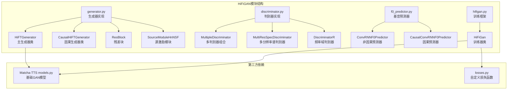
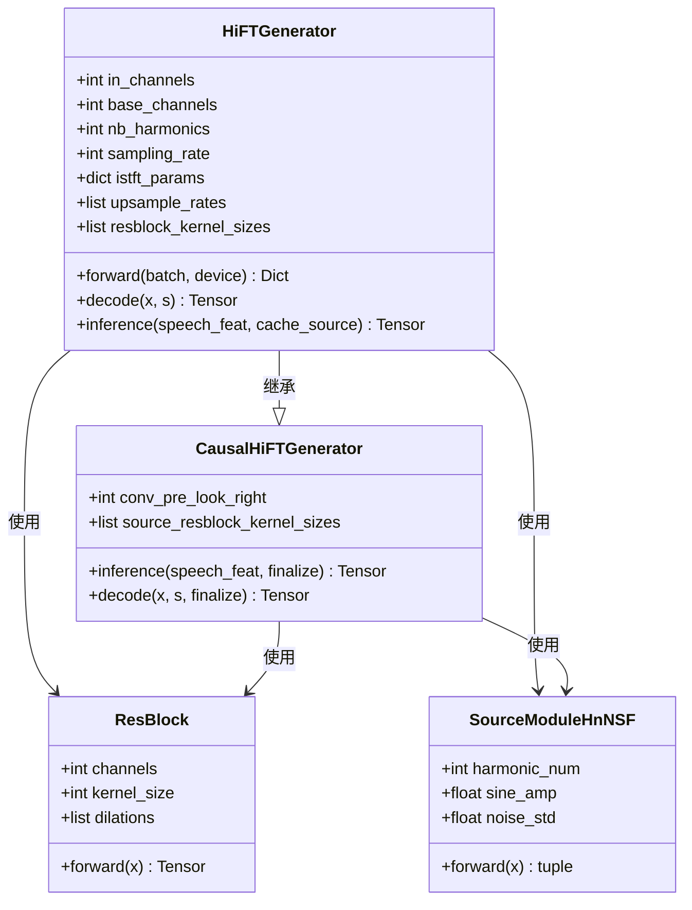
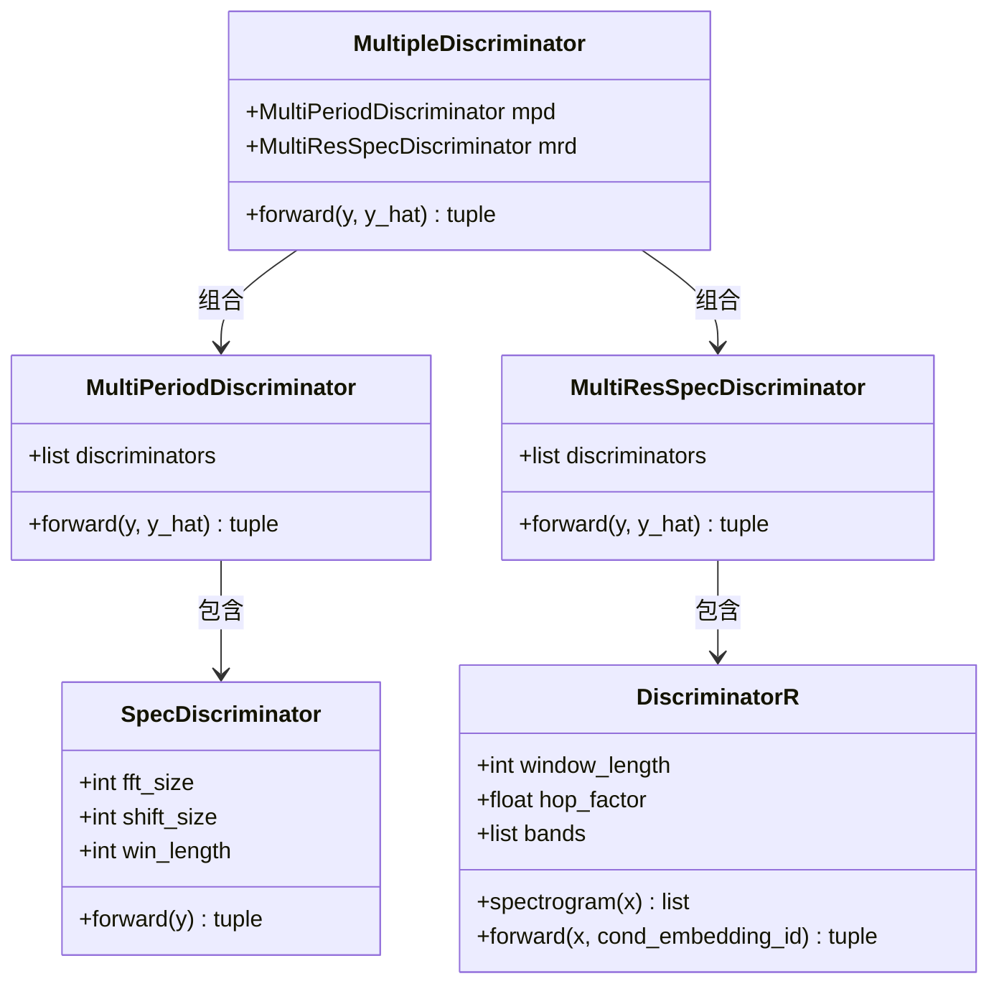
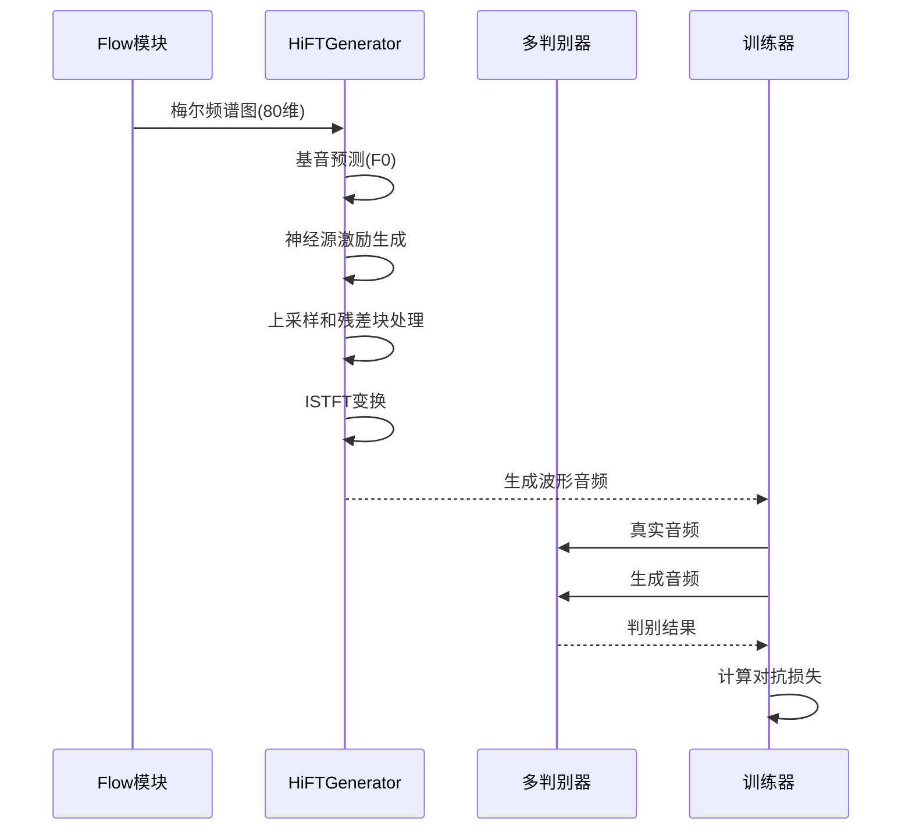
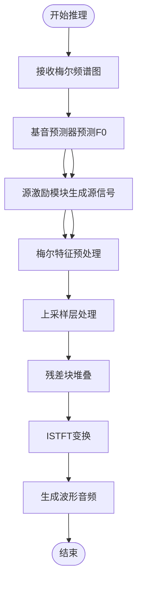
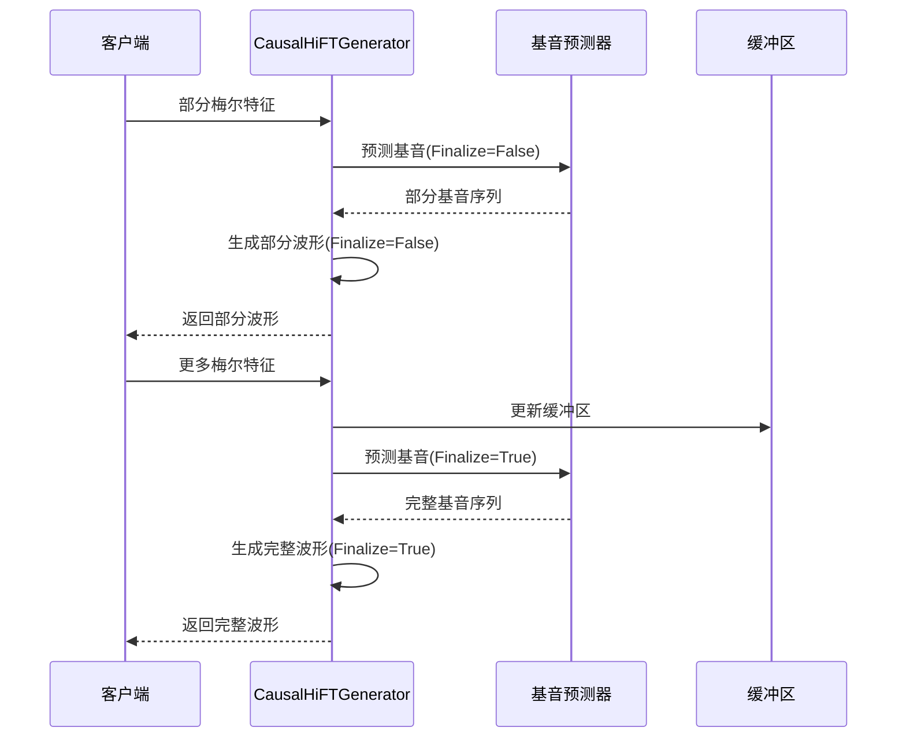
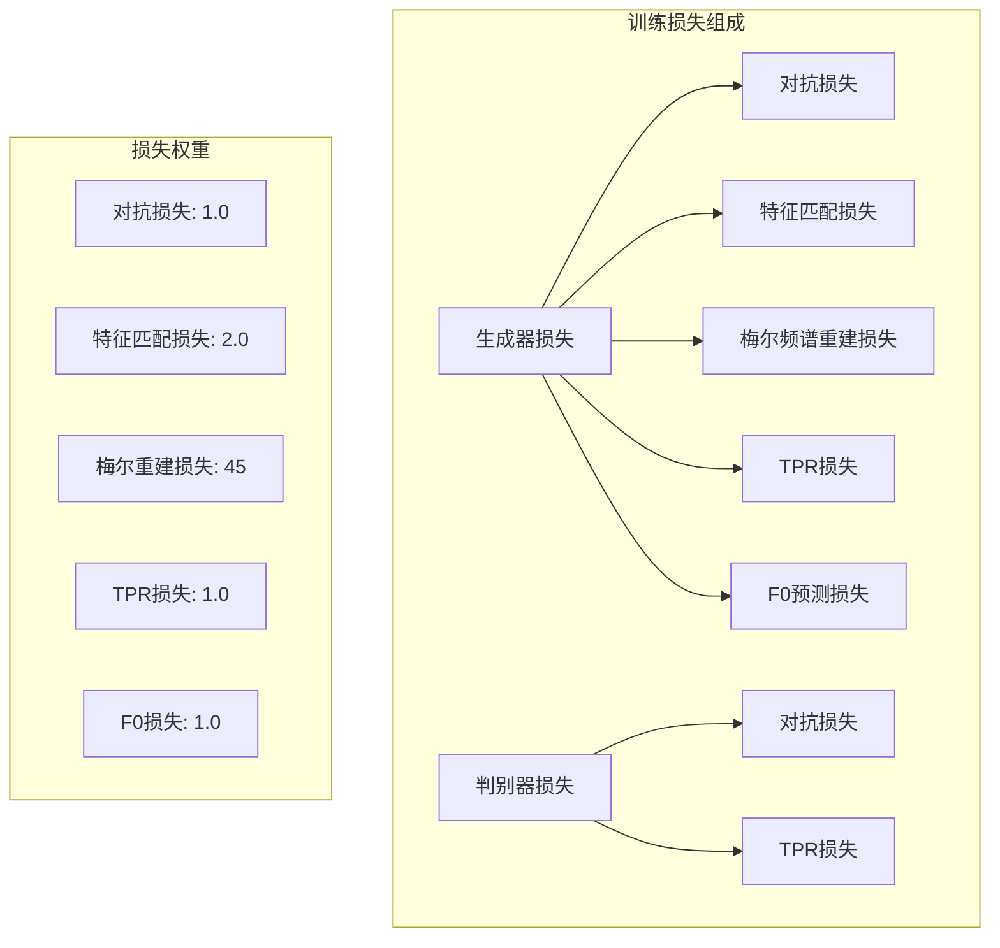
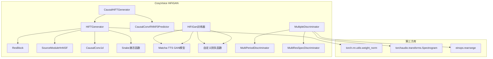
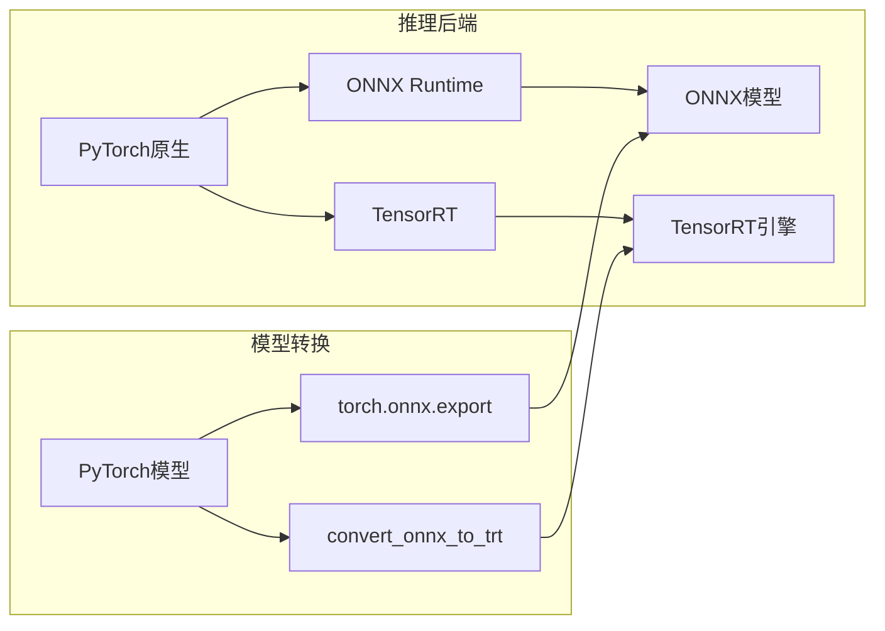
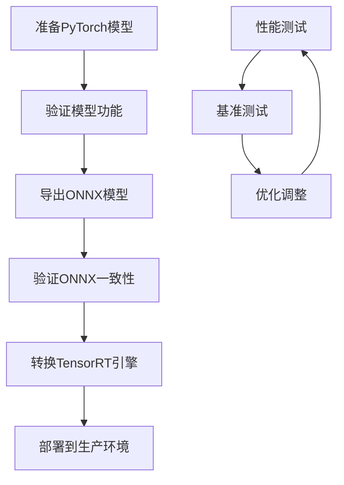

# HiFiGAN模块

<cite>
**本文档引用的文件**
- [generator.py](file://cosyvoice/hifigan/generator.py)
- [discriminator.py](file://cosyvoice/hifigan/discriminator.py)
- [hifigan.py](file://cosyvoice/hifigan/hifigan.py)
- [f0_predictor.py](file://cosyvoice/hifigan/f0_predictor.py)
- [models.py](file://third_party/Matcha-TTS/matcha/hifigan/models.py)
- [losses.py](file://cosyvoice/utils/losses.py)
- [cosyvoice.yaml](file://examples/libritts/cosyvoice/conf/cosyvoice.yaml)
- [cosyvoice2.yaml](file://examples/libritts/cosyvoice2/conf/cosyvoice2.yaml)
- [cosyvoice3.yaml](file://examples/libritts/cosyvoice3/conf/cosyvoice3.yaml)
- [export_onnx.py](file://cosyvoice/bin/export_onnx.py)
- [export_jit.py](file://cosyvoice/bin/export_jit.py)
- [file_utils.py](file://cosyvoice/utils/file_utils.py)
- [token2wav.py](file://runtime/triton_trtllm/token2wav.py)
</cite>

## 目录
1. [简介](#简介)
2. [项目结构](#项目结构)
3. [核心组件](#核心组件)
4. [架构概览](#架构概览)
5. [详细组件分析](#详细组件分析)
6. [依赖关系分析](#依赖关系分析)
7. [性能考虑](#性能考虑)
8. [故障排除指南](#故障排除指南)
9. [结论](#结论)

## 简介

HiFiGAN模块是CosyVoice语音合成系统中的关键声码器组件，负责将Flow模块输出的梅尔频谱图转换为高质量的波形音频。该模块基于HiFTNet架构，结合神经源滤波器和ISTFT网络，实现了高效的端到端语音合成。

HiFiGAN模块的核心作用：
- 将80维梅尔频谱图转换为22.05kHz采样率的波形音频
- 通过对抗训练确保音频的自然度和保真度
- 支持因果推理以实现实时流式语音合成
- 提供多种部署选项包括ONNX和TensorRT加速

## 项目结构

HiFiGAN模块位于cosyvoice/hifigan目录下，包含以下核心文件：

**图表来源**
- [generator.py](file://cosyvoice/hifigan/generator.py#L1-L747)
- [discriminator.py](file://cosyvoice/hifigan/discriminator.py#L1-L231)
- [hifigan.py](file://cosyvoice/hifigan/hifigan.py#L1-L68)
- [f0_predictor.py](file://cosyvoice/hifigan/f0_predictor.py#L1-L104)

**章节来源**
- [generator.py](file://cosyvoice/hifigan/generator.py#L1-L747)
- [discriminator.py](file://cosyvoice/hifigan/discriminator.py#L1-L231)
- [hifigan.py](file://cosyvoice/hifigan/hifigan.py#L1-L68)

## 核心组件

### 生成器架构

HiFiGAN模块采用HiFTNet架构，这是基于传统HiFi-GAN的改进版本，专门针对语音合成进行了优化：

**图表来源**
- [generator.py](file://cosyvoice/hifigan/generator.py#L378-L570)
- [generator.py](file://cosyvoice/hifigan/generator.py#L572-L727)
- [generator.py](file://cosyvoice/hifigan/generator.py#L46-L123)

### 判别器架构

HiFiGAN使用多层次判别器架构，包括多周期判别器和多分辨率谱判别器：

**图表来源**
- [discriminator.py](file://cosyvoice/hifigan/discriminator.py#L15-L36)
- [discriminator.py](file://cosyvoice/hifigan/discriminator.py#L247-L274)
- [discriminator.py](file://cosyvoice/hifigan/discriminator.py#L149-L177)
- [discriminator.py](file://cosyvoice/hifigan/discriminator.py#L78-L147)

**章节来源**
- [generator.py](file://cosyvoice/hifigan/generator.py#L378-L727)
- [discriminator.py](file://cosyvoice/hifigan/discriminator.py#L1-L231)

## 架构概览

HiFiGAN模块在整个CosyVoice系统中的位置和数据流：

**图表来源**
- [hifigan.py](file://cosyvoice/hifigan/hifigan.py#L22-L67)
- [generator.py](file://cosyvoice/hifigan/generator.py#L541-L570)

## 详细组件分析

### 生成器前向推理流程

HiFTGenerator的完整推理过程：

**图表来源**
- [generator.py](file://cosyvoice/hifigan/generator.py#L541-L570)
- [generator.py](file://cosyvoice/hifigan/generator.py#L507-L540)

### 因果推理机制

CausalHiFTGenerator支持实时流式推理：

**图表来源**
- [generator.py](file://cosyvoice/hifigan/generator.py#L713-L727)
- [generator.py](file://cosyvoice/hifigan/generator.py#L672-L712)

### 训练损失函数

HiFiGAN使用多种损失函数确保生成质量：

**图表来源**
- [hifigan.py](file://cosyvoice/hifigan/hifigan.py#L32-L67)
- [losses.py](file://cosyvoice/utils/losses.py#L6-L21)

**章节来源**
- [generator.py](file://cosyvoice/hifigan/generator.py#L507-L570)
- [discriminator.py](file://cosyvoice/hifigan/discriminator.py#L1-L231)
- [hifigan.py](file://cosyvoice/hifigan/hifigan.py#L1-L68)
- [losses.py](file://cosyvoice/utils/losses.py#L1-L58)

## 依赖关系分析

### 模块间依赖关系

**图表来源**
- [generator.py](file://cosyvoice/hifigan/generator.py#L1-L35)
- [discriminator.py](file://cosyvoice/hifigan/discriminator.py#L1-L11)
- [hifigan.py](file://cosyvoice/hifigan/hifigan.py#L1-L7)

### 配置文件映射

不同配置文件中HiFiGAN模块的配置：

| 配置文件 | 采样率 | 上采样率 | ISTFT参数 | F0预测器 |
|---------|--------|----------|-----------|----------|
| cosyvoice.yaml | 22050 | [8, 8] | n_fft: 16, hop_len: 4 | ConvRNNF0Predictor |
| cosyvoice2.yaml | 24000 | [8, 5, 3] | n_fft: 16, hop_len: 4 | ConvRNNF0Predictor |
| cosyvoice3.yaml | 可变 | [8, 5, 3] | n_fft: 16, hop_len: 4 | CausalConvRNNF0Predictor |

**章节来源**
- [cosyvoice.yaml](file://examples/libritts/cosyvoice/conf/cosyvoice.yaml#L112-L153)
- [cosyvoice2.yaml](file://examples/libritts/cosyvoice2/conf/cosyvoice2.yaml#L89-L130)
- [cosyvoice3.yaml](file://examples/libritts/cosyvoice3/conf/cosyvoice3.yaml#L77-L119)

## 性能考虑

### 推理优化策略

HiFiGAN模块提供了多种性能优化选项：

1. **因果推理优化**：CausalHiFTGenerator支持流式推理，减少延迟
2. **多采样率支持**：支持22.05kHz和24kHz采样率
3. **部署选项**：
   - PyTorch原生推理
   - ONNX导出和推理
   - TensorRT加速推理

### 加速后端集成

**图表来源**
- [export_onnx.py](file://cosyvoice/bin/export_onnx.py#L55-L115)
- [file_utils.py](file://cosyvoice/utils/file_utils.py#L53-L81)
- [token2wav.py](file://runtime/triton_trtllm/token2wav.py#L36-L92)

**章节来源**
- [export_onnx.py](file://cosyvoice/bin/export_onnx.py#L1-L115)
- [export_jit.py](file://cosyvoice/bin/export_jit.py#L1-L100)
- [file_utils.py](file://cosyvoice/utils/file_utils.py#L53-L81)

## 故障排除指南

### 常见问题及解决方案

1. **音频质量不佳**
   - 检查梅尔频谱图预处理
   - 调整特征匹配损失权重
   - 验证判别器训练状态

2. **推理延迟过高**
   - 使用CausalHiFTGenerator进行流式推理
   - 启用TensorRT加速
   - 减少上采样率

3. **内存不足**
   - 降低批处理大小
   - 使用半精度推理
   - 优化上采样参数

### 模型导出和部署

**图表来源**
- [export_onnx.py](file://cosyvoice/bin/export_onnx.py#L55-L115)
- [export_jit.py](file://cosyvoice/bin/export_jit.py#L51-L96)

**章节来源**
- [export_onnx.py](file://cosyvoice/bin/export_onnx.py#L55-L115)
- [export_jit.py](file://cosyvoice/bin/export_jit.py#L51-L96)

## 结论

HiFiGAN模块是CosyVoice系统中实现高质量语音合成的关键组件。通过采用HiFTNet架构和多判别器设计，该模块能够有效提升音频的自然度和保真度。模块的主要优势包括：

1. **架构创新**：基于HiFTNet的神经源滤波器设计
2. **训练稳定性**：多损失函数组合确保训练稳定
3. **推理效率**：支持因果推理和多种加速后端
4. **部署灵活性**：提供完整的模型导出和部署方案

该模块为CosyVoice的整体性能奠定了重要基础，是实现高质量语音合成不可或缺的核心组件。