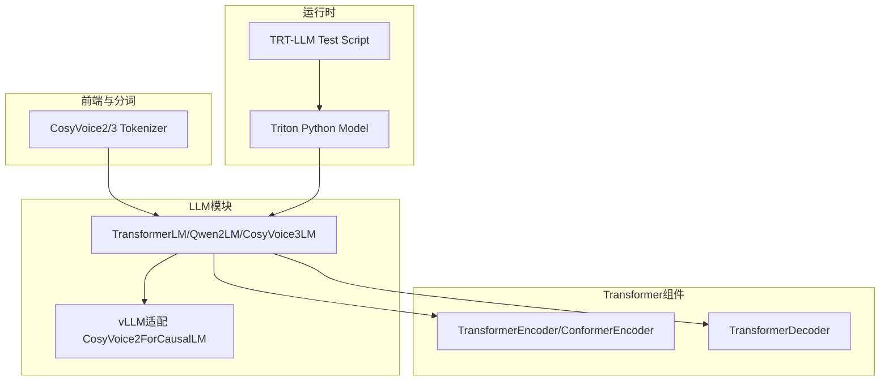
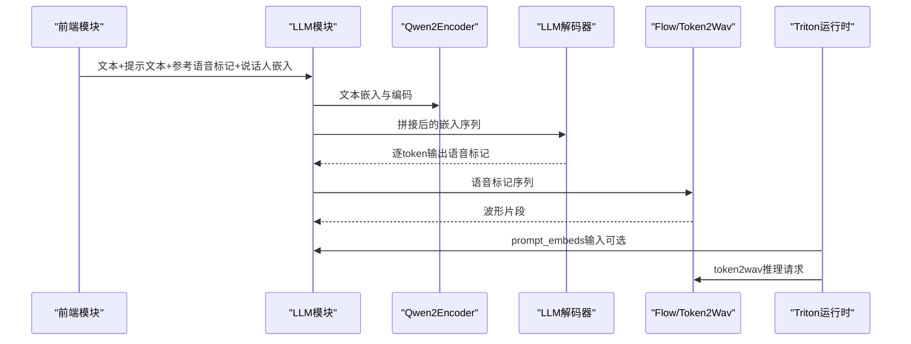
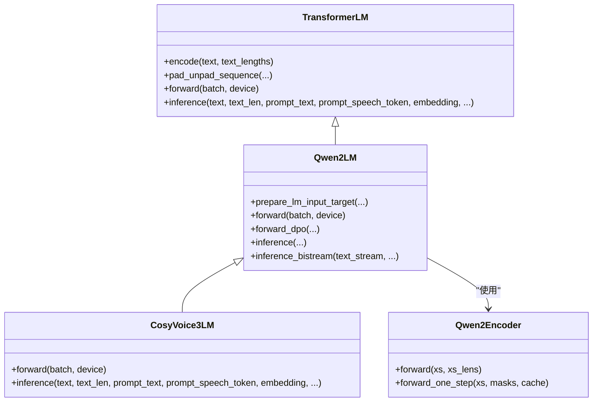
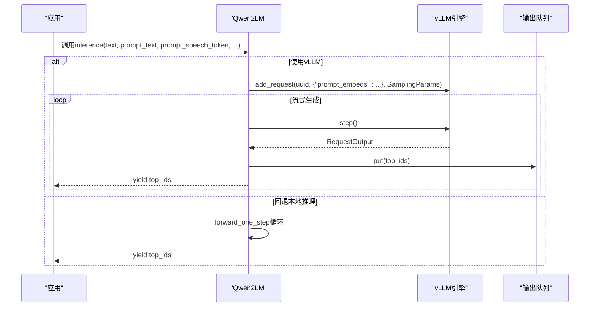
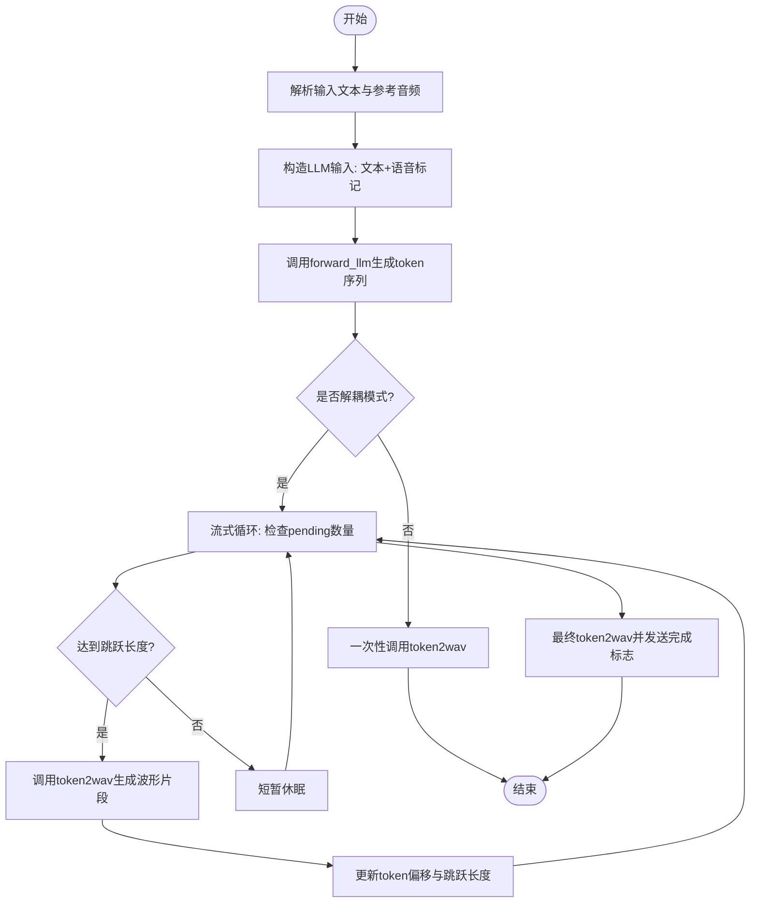
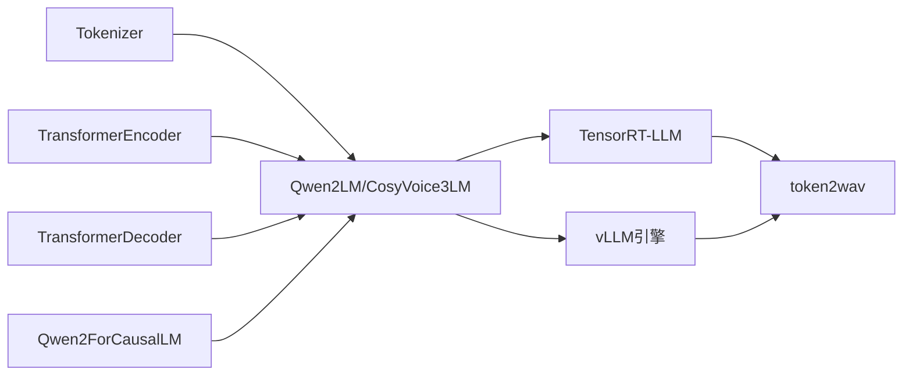

# LLM模块

<cite>
**本文引用的文件**
- [cosyvoice/llm/llm.py](file://cosyvoice/llm/llm.py)
- [cosyvoice/vllm/cosyvoice2.py](file://cosyvoice/vllm/cosyvoice2.py)
- [runtime/triton_trtllm/model_repo/cosyvoice2/1/model.py](file://runtime/triton_trtllm/model_repo/cosyvoice2/1/model.py)
- [runtime/triton_trtllm/scripts/test_llm.py](file://runtime/triton_trtllm/scripts/test_llm.py)
- [cosyvoice/transformer/encoder.py](file://cosyvoice/transformer/encoder.py)
- [cosyvoice/transformer/decoder.py](file://cosyvoice/transformer/decoder.py)
- [cosyvoice/tokenizer/tokenizer.py](file://cosyvoice/tokenizer/tokenizer.py)
- [README.md](file://README.md)
- [云GPU容器导入MPI模块卡死分析.md](file://云GPU容器导入MPI模块卡死分析.md)
</cite>

## 目录
1. [简介](#简介)
2. [项目结构](#项目结构)
3. [核心组件](#核心组件)
4. [架构总览](#架构总览)
5. [详细组件分析](#详细组件分析)
6. [依赖关系分析](#依赖关系分析)
7. [性能考量](#性能考量)
8. [故障排查指南](#故障排查指南)
9. [结论](#结论)
10. [附录](#附录)

## 简介
本章节面向CosyVoice的LLM模块，聚焦其作为大型语言模型在语音合成流水线中的核心职责：接收文本与提示信息，生成语音标记（speech tokens），并与前端模块、Flow模块协同完成端到端推理。LLM模块采用基于Transformer的架构，结合文本编码器与解码器组件，支持流式推理与批处理训练；同时提供与vLLM、TensorRT-LLM等推理后端的集成能力，满足高吞吐与低延迟需求。技术决策上，CosyVoice2/3采用Qwen系列模型作为基础大模型，通过定制化嵌入与损失函数适配语音标记空间，实现高质量的跨语言、跨方言零样本语音合成。

## 项目结构
- LLM模块位于cosyvoice/llm/llm.py，包含通用的TransformerLM基类、Qwen2Encoder、Qwen2LM、CosyVoice3LM等实现。
- vLLM适配层位于cosyvoice/vllm/cosyvoice2.py，提供与vLLM兼容的CosyVoice2ForCausalLM实现。
- Triton+TensorRT-LLM运行时位于runtime/triton_trtllm，其中model.py负责端到端编排（LLM生成+token2wav），test_llm.py提供独立测试脚本。
- 前端与分词器位于cosyvoice/tokenizer/tokenizer.py，支撑多语言文本编码与特殊标记注册。
- Transformer编码器/解码器位于cosyvoice/transformer/encoder.py与cosyvoice/transformer/decoder.py，为文本编码器提供底层组件。

图表来源
- [cosyvoice/llm/llm.py](file://cosyvoice/llm/llm.py#L33-L740)
- [cosyvoice/vllm/cosyvoice2.py](file://cosyvoice/vllm/cosyvoice2.py#L29-L104)
- [runtime/triton_trtllm/model_repo/cosyvoice2/1/model.py](file://runtime/triton_trtllm/model_repo/cosyvoice2/1/model.py#L47-L453)
- [runtime/triton_trtllm/scripts/test_llm.py](file://runtime/triton_trtllm/scripts/test_llm.py#L69-L139)
- [cosyvoice/transformer/encoder.py](file://cosyvoice/transformer/encoder.py#L37-L475)
- [cosyvoice/transformer/decoder.py](file://cosyvoice/transformer/decoder.py#L33-L397)

章节来源
- [README.md](file://README.md#L1-L318)

## 核心组件
- TransformerLM：通用的基于Transformer的语音标记语言模型框架，包含文本嵌入、文本编码器、语音标记嵌入、LLM解码器与损失计算。
- Qwen2Encoder：基于Qwen2ForCausalLM的文本编码器封装，提供embed_tokens与forward_one_step接口，便于KV缓存与增量推理。
- Qwen2LM：面向CosyVoice2的LLM实现，支持混合序列（bistream/unistream）策略、停止符集合、vLLM队列与流式生成。
- CosyVoice3LM：面向CosyVoice3的扩展实现，扩大语音标记空间并调整嵌入与停止符集合，支持更丰富的指令与控制标记。
- vLLM适配：CosyVoice2ForCausalLM兼容vLLM的模型包装，提供forward与compute_logits接口，用于prompt_embeds输入与采样参数传递。
- Triton运行时：TritonPythonModel协调LLM与token2wav，支持解耦流式输出与动态块策略，实现端到端TTS管线。

章节来源
- [cosyvoice/llm/llm.py](file://cosyvoice/llm/llm.py#L33-L740)
- [cosyvoice/vllm/cosyvoice2.py](file://cosyvoice/vllm/cosyvoice2.py#L29-L104)
- [runtime/triton_trtllm/model_repo/cosyvoice2/1/model.py](file://runtime/triton_trtllm/model_repo/cosyvoice2/1/model.py#L47-L453)

## 架构总览
CosyVoice的LLM模块在整体TTS系统中的位置如下：
- 输入阶段：前端模块将参考音频与目标文本进行预处理，提取参考语音标记、说话人嵌入与文本编码；LLM接收文本与提示信息。
- LLM阶段：文本经由Qwen2Encoder编码，结合语音标记与任务标识拼接为统一嵌入序列，通过Qwen2LM或CosyVoice3LM进行自回归生成，输出语音标记序列。
- 后处理阶段：生成的语音标记交由Flow模块（token2wav）进行声学建模与波形合成；在Triton运行时中，LLM与token2wav通过解耦模式实现边生成边合成。

图表来源
- [cosyvoice/llm/llm.py](file://cosyvoice/llm/llm.py#L166-L228)
- [runtime/triton_trtllm/model_repo/cosyvoice2/1/model.py](file://runtime/triton_trtllm/model_repo/cosyvoice2/1/model.py#L314-L453)

## 详细组件分析

### TransformerLM与Qwen2LM/CosyVoice3LM
- 文本编码器：使用TransformerEncoder/ConformerEncoder对文本token进行编码，输出隐藏态与掩码，随后通过仿射层映射到LLM输入维度。
- 语音标记嵌入：将语音标记映射到LLM输入维度，支持拼接文本编码与任务标识，形成统一序列。
- LLM解码器：将LLM输出映射到语音标记空间，使用标签平滑交叉熵损失，支持按长度归一化。
- 采样策略：提供重复感知采样（Repetition Aware Sampling）与EOS忽略策略，确保生成稳定性与可控长度。
- 流式推理：支持forward_chunk与one-step forward，配合KV缓存与三角掩码，实现低延迟、高吞吐的增量生成。

图表来源
- [cosyvoice/llm/llm.py](file://cosyvoice/llm/llm.py#L33-L740)
- [cosyvoice/transformer/encoder.py](file://cosyvoice/transformer/encoder.py#L37-L475)

章节来源
- [cosyvoice/llm/llm.py](file://cosyvoice/llm/llm.py#L33-L740)

### vLLM集成与推理后端
- CosyVoice2ForCausalLM：在vLLM中以prompt_embeds形式接收LLM输入，通过compute_logits生成logits，兼容SamplingParams与stop_token_ids。
- Qwen2LM的inference_wrapper：当存在vLLM实例时，将prompt_embeds加入请求队列，通过队列与step循环实现流式输出；否则回退到本地one-step推理。
- 采样参数：top_k、stop_token_ids、min_tokens、max_tokens等参数在inference_wrapper中统一设置。

图表来源
- [cosyvoice/llm/llm.py](file://cosyvoice/llm/llm.py#L472-L518)
- [cosyvoice/vllm/cosyvoice2.py](file://cosyvoice/vllm/cosyvoice2.py#L29-L104)

章节来源
- [cosyvoice/llm/llm.py](file://cosyvoice/llm/llm.py#L472-L518)
- [cosyvoice/vllm/cosyvoice2.py](file://cosyvoice/vllm/cosyvoice2.py#L29-L104)

### Triton+TensorRT-LLM运行时
- TritonPythonModel：解析输入文本与参考音频，构造LLM输入（文本+语音标记），通过TensorRT-LLM模型生成语音标记序列；在解耦模式下，按动态块策略逐步发送token2wav进行边生成边合成。
- 动态块策略：指数增长或基于耗时的比例调整token跳跃长度，平衡延迟与吞吐。
- 流式输出：通过响应发送器分片输出波形，最终发送完成标志。

图表来源
- [runtime/triton_trtllm/model_repo/cosyvoice2/1/model.py](file://runtime/triton_trtllm/model_repo/cosyvoice2/1/model.py#L314-L453)

章节来源
- [runtime/triton_trtllm/model_repo/cosyvoice2/1/model.py](file://runtime/triton_trtllm/model_repo/cosyvoice2/1/model.py#L47-L453)

### 分词器与多语言支持
- CosyVoice2Tokenizer/CosyVoice3Tokenizer：基于AutoTokenizer添加特殊标记，支持多语言、情感、事件等TTS专用标记，以及丰富的音素/拼音标记集。
- get_qwen_tokenizer：按版本选择对应分词器，支持skip_special_tokens配置。

章节来源
- [cosyvoice/tokenizer/tokenizer.py](file://cosyvoice/tokenizer/tokenizer.py#L241-L328)

## 依赖关系分析
- LLM模块依赖于Transformer编码器/解码器组件，用于文本编码与自回归解码。
- LLM模块依赖于Qwen2ForCausalLM作为基础大模型，通过Qwen2Encoder与Qwen2LM实现prompt_embeds输入与one-step推理。
- 运行时依赖TensorRT-LLM或vLLM作为高性能推理后端，Triton负责端到端编排与流式输出。
- 分词器为多语言文本编码提供基础，支撑CosyVoice2/3的特殊标记体系。

图表来源
- [cosyvoice/llm/llm.py](file://cosyvoice/llm/llm.py#L230-L258)
- [cosyvoice/vllm/cosyvoice2.py](file://cosyvoice/vllm/cosyvoice2.py#L29-L104)
- [runtime/triton_trtllm/model_repo/cosyvoice2/1/model.py](file://runtime/triton_trtllm/model_repo/cosyvoice2/1/model.py#L47-L453)

章节来源
- [cosyvoice/llm/llm.py](file://cosyvoice/llm/llm.py#L230-L258)
- [cosyvoice/vllm/cosyvoice2.py](file://cosyvoice/vllm/cosyvoice2.py#L29-L104)
- [runtime/triton_trtllm/model_repo/cosyvoice2/1/model.py](file://runtime/triton_trtllm/model_repo/cosyvoice2/1/model.py#L47-L453)

## 性能考量
- KV缓存与SDPA：在Qwen2Encoder与Qwen2LM中使用forward_chunk与forward_one_step，结合三角掩码与past_key_values，降低自回归推理的重复计算。
- 流式推理：通过最小/最大长度约束与EOS检测，避免无限生成；在Triton运行时中采用动态块策略，提升吞吐与延迟平衡。
- vLLM集成：在支持环境下，使用prompt_embeds与SamplingParams减少显存占用与通信开销，提高并发能力。
- 训练损失：标签平滑与长度归一化有助于稳定训练过程，提升泛化能力。

[本节为通用性能讨论，不直接分析具体文件]

## 故障排查指南
- 容器中因MPI初始化导致的卡死问题
  - 症状：导入tensorrt_llm后永久阻塞在futex()系统调用。
  - 根因：TensorRT-LLM 0.20.0默认启用ENABLE_MULTI_DEVICE=1，链接OpenMPI并在共享库加载时自动调用MPI_Init_thread()，容器环境缺少PMIx守护进程、共享内存与Unix域套接字，导致初始化失败并阻塞。
  - 解决方案：
    - 获取ENABLE_MULTI_DEVICE=0版本或自行编译关闭MPI支持的版本；
    - 使用具备完整系统权限的容器或宿主IPC命名空间；
    - 切换至不依赖MPI的推理框架（如vLLM）；
    - 在TensorRT-LLM社区反馈或提交Issue，寻求官方支持。
  - 参考文档：云GPU容器导入MPI模块卡死分析.md

章节来源
- [云GPU容器导入MPI模块卡死分析.md](file://云GPU容器导入MPI模块卡死分析.md#L1-L264)

## 结论
CosyVoice的LLM模块以Qwen为基础，结合Transformer编码器与定制化的语音标记语言模型，实现了高质量、多语言、零样本的语音合成。通过与vLLM、TensorRT-LLM的深度集成，模块在训练与推理两端均具备优秀的扩展性与性能表现。在实际部署中，建议优先采用vLLM以获得更好的吞吐与资源利用；若必须使用TensorRT-LLM，请关注容器环境下的MPI初始化问题并采取相应规避措施。

[本节为总结性内容，不直接分析具体文件]

## 附录
- 实际使用示例（路径）
  - vLLM使用示例：README.md中提供了CosyVoice2 vLLM使用说明与示例命令。
  - Triton+TensorRT-LLM运行时：runtime/triton_trtllm目录下提供Docker Compose与脚本，可快速启动服务。
  - 独立测试脚本：runtime/triton_trtllm/scripts/test_llm.py可用于验证LLM推理流程。

章节来源
- [README.md](file://README.md#L211-L264)
- [runtime/triton_trtllm/scripts/test_llm.py](file://runtime/triton_trtllm/scripts/test_llm.py#L69-L139)