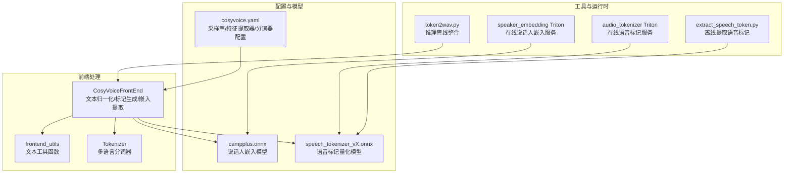
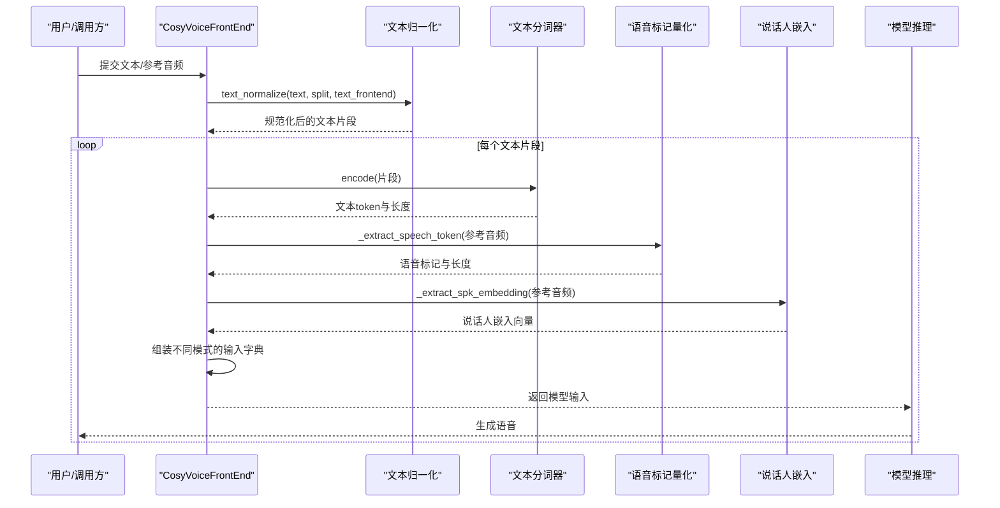
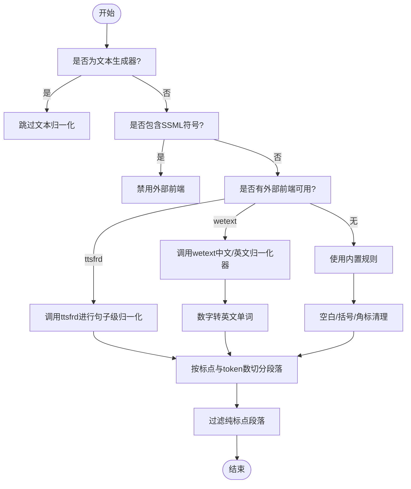
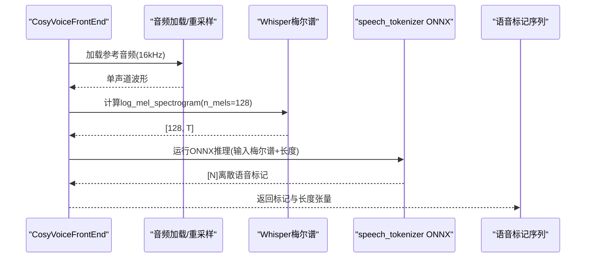
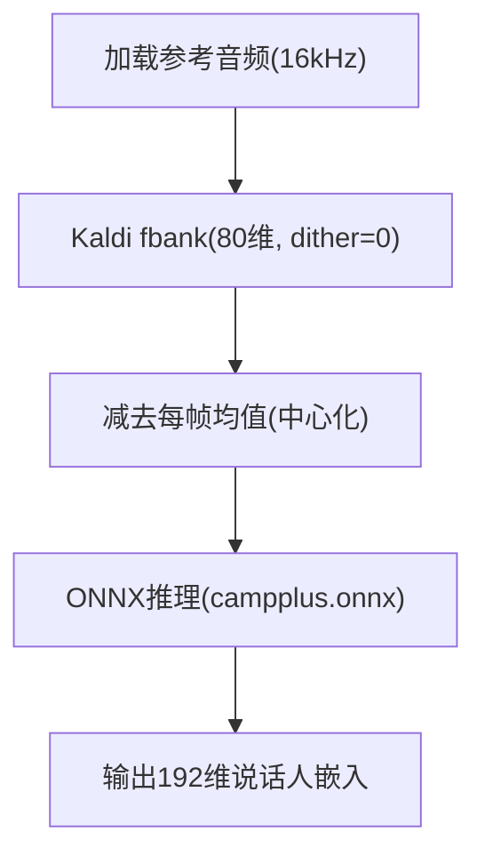
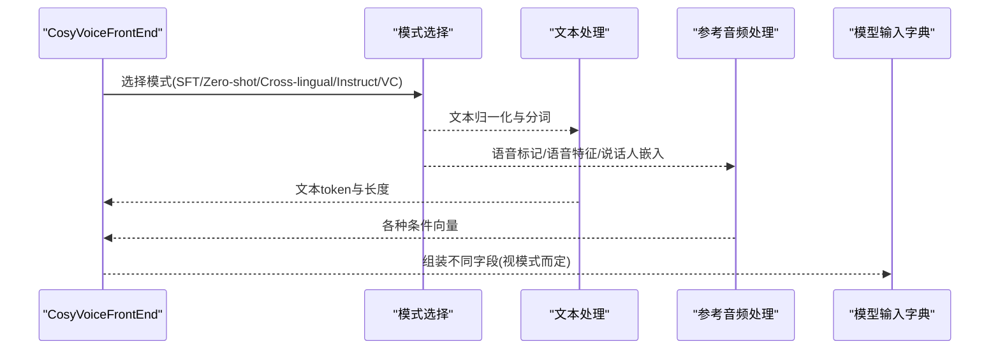
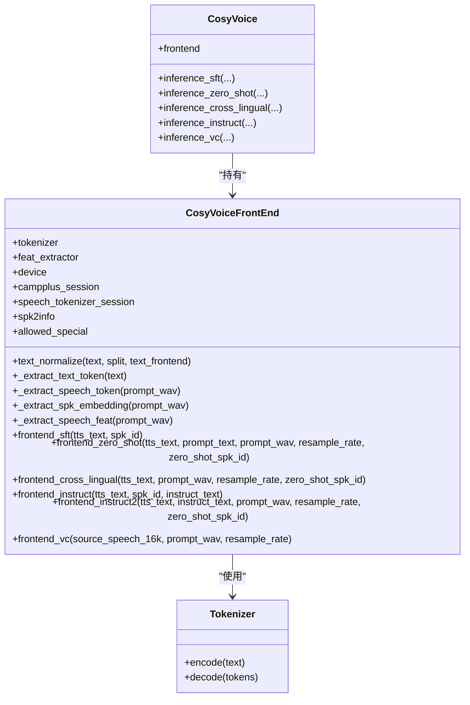
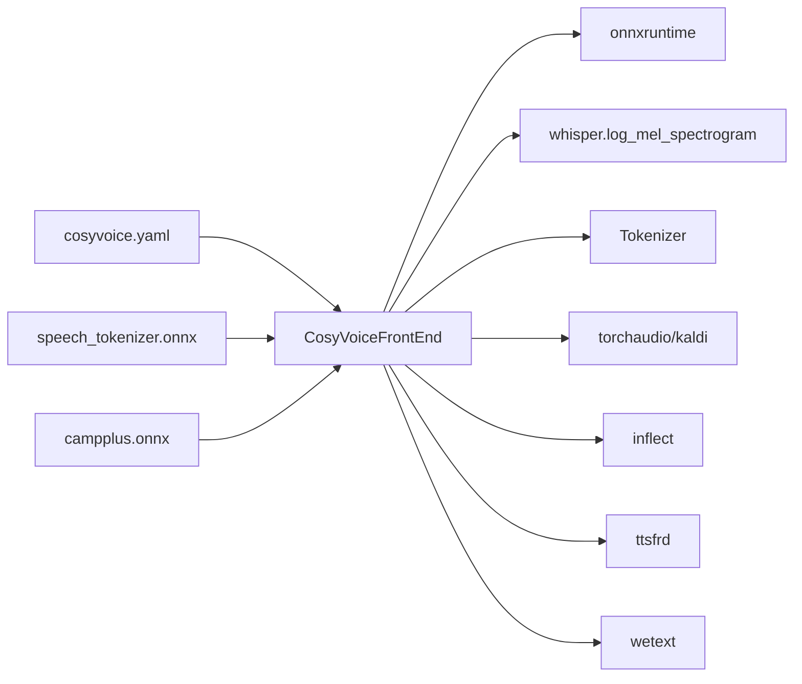

# 前端处理模块

<cite>
**本文引用的文件**
- [cosyvoice/cli/frontend.py](file://cosyvoice/cli/frontend.py)
- [cosyvoice/utils/frontend_utils.py](file://cosyvoice/utils/frontend_utils.py)
- [cosyvoice/cli/cosyvoice.py](file://cosyvoice/cli/cosyvoice.py)
- [cosyvoice/tokenizer/tokenizer.py](file://cosyvoice/tokenizer/tokenizer.py)
- [examples/libritts/cosyvoice/conf/cosyvoice.yaml](file://examples/libritts/cosyvoice/conf/cosyvoice.yaml)
- [tools/extract_speech_token.py](file://tools/extract_speech_token.py)
- [runtime/triton_trtllm/model_repo/audio_tokenizer/1/model.py](file://runtime/triton_trtllm/model_repo/audio_tokenizer/1/model.py)
- [runtime/triton_trtllm/model_repo/speaker_embedding/1/model.py](file://runtime/triton_trtllm/model_repo/speaker_embedding/1/model.py)
- [runtime/triton_trtllm/token2wav.py](file://runtime/triton_trtllm/token2wav.py)
</cite>

## 目录
1. [简介](#简介)
2. [项目结构](#项目结构)
3. [核心组件](#核心组件)
4. [架构总览](#架构总览)
5. [详细组件分析](#详细组件分析)
6. [依赖关系分析](#依赖关系分析)
7. [性能考量](#性能考量)
8. [故障排查指南](#故障排查指南)
9. [结论](#结论)
10. [附录](#附录)

## 简介
本章节聚焦 CosyVoice 的前端处理模块，系统性阐述其在语音合成流程中的职责与实现细节，包括：
- 文本归一化：支持中英文混合、数字、标点与特殊符号处理，兼容 ttsfrd 与 wetext 外部前端工具。
- 语音标记生成：基于 Whisper 的梅尔频谱图与 ONNX 推理，将参考音频转换为离散语音标记序列。
- 说话人嵌入提取：基于 Kaldi fbank 特征与 campplus ONNX 模型，抽取说话人特征向量。
- 零样本、跨语言与语音克隆模式下的输入处理流程与数据组织方式。
- 技术决策与配置项：如使用 Whisper 梅尔频谱图与 ONNX Runtime 的推理效率优化策略。

## 项目结构
前端处理模块位于 cosyvoice/cli/frontend.py，配套工具函数位于 cosyvoice/utils/frontend_utils.py，文本分词器位于 cosyvoice/tokenizer/tokenizer.py，配置文件位于 examples/libritts/cosyvoice/conf/cosyvoice.yaml。此外，工具脚本 tools/extract_speech_token.py 展示了离线批量提取语音标记的流程；运行时 Triton/TensorRT 实现位于 runtime/triton_trtllm 下，用于服务化部署。

图表来源
- [cosyvoice/cli/frontend.py](file://cosyvoice/cli/frontend.py#L30-L125)
- [cosyvoice/utils/frontend_utils.py](file://cosyvoice/utils/frontend_utils.py#L1-L137)
- [cosyvoice/tokenizer/tokenizer.py](file://cosyvoice/tokenizer/tokenizer.py#L1-L328)
- [examples/libritts/cosyvoice/conf/cosyvoice.yaml](file://examples/libritts/cosyvoice/conf/cosyvoice.yaml#L155-L183)
- [tools/extract_speech_token.py](file://tools/extract_speech_token.py#L26-L40)
- [runtime/triton_trtllm/model_repo/audio_tokenizer/1/model.py](file://runtime/triton_trtllm/model_repo/audio_tokenizer/1/model.py#L66-L97)
- [runtime/triton_trtllm/model_repo/speaker_embedding/1/model.py](file://runtime/triton_trtllm/model_repo/speaker_embedding/1/model.py#L57-L82)
- [runtime/triton_trtllm/token2wav.py](file://runtime/triton_trtllm/token2wav.py#L193-L218)

章节来源
- [cosyvoice/cli/frontend.py](file://cosyvoice/cli/frontend.py#L1-L225)
- [cosyvoice/utils/frontend_utils.py](file://cosyvoice/utils/frontend_utils.py#L1-L137)
- [cosyvoice/tokenizer/tokenizer.py](file://cosyvoice/tokenizer/tokenizer.py#L1-L328)
- [examples/libritts/cosyvoice/conf/cosyvoice.yaml](file://examples/libritts/cosyvoice/conf/cosyvoice.yaml#L155-L183)

## 核心组件
- CosyVoiceFrontEnd：前端处理主类，负责文本归一化、文本分词、语音标记生成、说话人嵌入提取与不同模式的输入组装。
- frontend_utils：提供文本检测与清洗工具，如中文判断、空白替换、括号移除、数字转词、段落切分、纯标点过滤等。
- Tokenizer：多语言分词器，支持 Whisper Tokenizer 与 CosyVoice 自定义 Tokenizer，覆盖多种语言与特殊标记。
- 配置文件：定义采样率、特征提取器、分词器与允许的特殊符号等关键参数。
- 工具与运行时：离线脚本与 Triton/TensorRT 在线服务，分别用于批量提取语音标记与实时推理。

章节来源
- [cosyvoice/cli/frontend.py](file://cosyvoice/cli/frontend.py#L30-L125)
- [cosyvoice/utils/frontend_utils.py](file://cosyvoice/utils/frontend_utils.py#L20-L137)
- [cosyvoice/tokenizer/tokenizer.py](file://cosyvoice/tokenizer/tokenizer.py#L209-L238)
- [examples/libritts/cosyvoice/conf/cosyvoice.yaml](file://examples/libritts/cosyvoice/conf/cosyvoice.yaml#L8-L25)
- [tools/extract_speech_token.py](file://tools/extract_speech_token.py#L26-L40)

## 架构总览
前端处理模块在推理流程中的位置如下：
- 文本归一化：根据语言类型选择外部前端工具或内置规则，对文本进行清洗、数字转词、段落切分与标点过滤。
- 文本分词：使用多语言分词器将文本编码为 token 序列及其长度张量。
- 参考音频预处理：按需加载参考音频，生成梅尔频谱图（Whisper 或自定义），并调用语音标记量化模型得到离散语音标记。
- 说话人嵌入：对参考音频计算 fbank 特征，经 campplus 模型输出说话人嵌入向量。
- 输入组装：根据不同模式（SFT、零样本、跨语言、指令、语音克隆）拼装模型输入字典，供后续声学/声码器模块使用。

图表来源
- [cosyvoice/cli/frontend.py](file://cosyvoice/cli/frontend.py#L127-L160)
- [cosyvoice/cli/frontend.py](file://cosyvoice/cli/frontend.py#L162-L224)
- [cosyvoice/cli/frontend.py](file://cosyvoice/cli/frontend.py#L95-L118)

## 详细组件分析

### 文本归一化（Text Normalization）
- 支持中英文混合文本，自动识别中文字符并应用相应规则：
  - 中文：去除换行、空白替换、角标替换、括号移除、逗号与顿号处理、句末标点统一、段落切分（按 token 数控制上下限）、过滤纯标点。
  - 英文：数字转英文单词（使用 inflect），按标点切分，保持 token 数在合理范围。
- 外部前端工具兼容：
  - ttsfrd：通过 JSON 结果合并句子文本。
  - wetext：分别使用中文/英文归一化器。
- 特殊逻辑：
  - 若文本包含 SSML 符号，则跳过外部前端以保留原始格式。
  - 对于生成器输入，跳过文本归一化直接进入分词阶段。

图表来源
- [cosyvoice/cli/frontend.py](file://cosyvoice/cli/frontend.py#L127-L160)
- [cosyvoice/utils/frontend_utils.py](file://cosyvoice/utils/frontend_utils.py#L20-L137)

章节来源
- [cosyvoice/cli/frontend.py](file://cosyvoice/cli/frontend.py#L127-L160)
- [cosyvoice/utils/frontend_utils.py](file://cosyvoice/utils/frontend_utils.py#L20-L137)

### 语音标记生成（Speech Tokenizer）
- 参考音频预处理：
  - 加载音频并重采样至 16kHz，限制最长 30 秒。
  - 使用 Whisper 的 log_mel_spectrogram 计算 128 维梅尔频谱图。
- 语音标记量化：
  - 使用 speech_tokenizer_vX.onnx 模型进行离散标记量化，输出整数标记序列及长度。
  - 在 Triton 服务中，先对批量音频计算 log-mel，再进行 padding 与 quantize，最终返回 prompt_speech_tokens。
- 离线工具：
  - tools/extract_speech_token.py 展示了批量提取流程，便于预处理数据集。

图表来源
- [cosyvoice/cli/frontend.py](file://cosyvoice/cli/frontend.py#L95-L106)
- [tools/extract_speech_token.py](file://tools/extract_speech_token.py#L26-L40)
- [runtime/triton_trtllm/model_repo/audio_tokenizer/1/model.py](file://runtime/triton_trtllm/model_repo/audio_tokenizer/1/model.py#L66-L97)

章节来源
- [cosyvoice/cli/frontend.py](file://cosyvoice/cli/frontend.py#L95-L106)
- [tools/extract_speech_token.py](file://tools/extract_speech_token.py#L26-L40)
- [runtime/triton_trtllm/model_repo/audio_tokenizer/1/model.py](file://runtime/triton_trtllm/model_repo/audio_tokenizer/1/model.py#L66-L97)

### 说话人嵌入提取（Speaker Embedding）
- 特征提取：
  - 使用 Kaldi fbank 计算 80 维梅尔频谱特征，减去均值形成中心化特征。
- 模型推理：
  - 通过 campplus.onnx 模型输出 192 维说话人嵌入向量。
- Triton/TensorRT：
  - 支持 ONNX 与 TensorRT 两种执行路径，按设备能力自动选择。

图表来源
- [cosyvoice/cli/frontend.py](file://cosyvoice/cli/frontend.py#L108-L118)
- [runtime/triton_trtllm/model_repo/speaker_embedding/1/model.py](file://runtime/triton_trtllm/model_repo/speaker_embedding/1/model.py#L57-L82)
- [runtime/triton_trtllm/token2wav.py](file://runtime/triton_trtllm/token2wav.py#L193-L218)

章节来源
- [cosyvoice/cli/frontend.py](file://cosyvoice/cli/frontend.py#L108-L118)
- [runtime/triton_trtllm/model_repo/speaker_embedding/1/model.py](file://runtime/triton_trtllm/model_repo/speaker_embedding/1/model.py#L57-L82)
- [runtime/triton_trtllm/token2wav.py](file://runtime/triton_trtllm/token2wav.py#L193-L218)

### 不同模式下的输入处理流程
- SFT（有监督微调）：仅需文本与指定说话人信息，组装文本 token、文本长度与说话人嵌入。
- 零样本（Zero-shot）：可选使用 prompt_text 或直接使用参考音频，生成 prompt_text token、语音标记、语音特征与说话人嵌入；当 resample_rate 为 24kHz 时，强制对齐语音标记与语音特征的时间步比例。
- 跨语言（Cross-lingual）：与零样本类似，但移除 LLM 中的 prompt 文本与对应语音标记，仅保留语音条件。
- 指令（Instruct）：将 instruct_text 作为 LLM 的 prompt，同时移除 LLM 中的说话人嵌入以避免信息泄露。
- 语音克隆（Voice Conversion）：以 source_speech_16k 作为源语音，结合 prompt_wav 的语音标记、语音特征与说话人嵌入，生成目标语音。

图表来源
- [cosyvoice/cli/frontend.py](file://cosyvoice/cli/frontend.py#L162-L224)

章节来源
- [cosyvoice/cli/frontend.py](file://cosyvoice/cli/frontend.py#L162-L224)

### 类关系与依赖

图表来源
- [cosyvoice/cli/frontend.py](file://cosyvoice/cli/frontend.py#L30-L125)
- [cosyvoice/tokenizer/tokenizer.py](file://cosyvoice/tokenizer/tokenizer.py#L209-L238)
- [cosyvoice/cli/cosyvoice.py](file://cosyvoice/cli/cosyvoice.py#L27-L137)

章节来源
- [cosyvoice/cli/frontend.py](file://cosyvoice/cli/frontend.py#L30-L125)
- [cosyvoice/tokenizer/tokenizer.py](file://cosyvoice/tokenizer/tokenizer.py#L209-L238)
- [cosyvoice/cli/cosyvoice.py](file://cosyvoice/cli/cosyvoice.py#L27-L137)

## 依赖关系分析
- 外部库与工具：
  - onnxruntime：用于 campplus 与 speech_tokenizer 的推理加速。
  - whisper：提供 log_mel_spectrogram，作为语音标记生成的特征基础。
  - torchaudio/kaldi：音频加载与 fbank 特征提取。
  - inflect：英文数字转词。
  - ttsfrd/wetext：可选的外部文本前端工具。
- 配置与模型：
  - cosyvoice.yaml 定义采样率、特征提取器、分词器与允许的特殊符号。
  - speech_tokenizer_vX.onnx 与 campplus.onnx 由模型目录提供。
- 运行时集成：
  - Triton/TensorRT 服务化部署，支持批量音频的语音标记与说话人嵌入在线推理。

图表来源
- [cosyvoice/cli/frontend.py](file://cosyvoice/cli/frontend.py#L14-L48)
- [examples/libritts/cosyvoice/conf/cosyvoice.yaml](file://examples/libritts/cosyvoice/conf/cosyvoice.yaml#L155-L183)

章节来源
- [cosyvoice/cli/frontend.py](file://cosyvoice/cli/frontend.py#L14-L48)
- [examples/libritts/cosyvoice/conf/cosyvoice.yaml](file://examples/libritts/cosyvoice/conf/cosyvoice.yaml#L155-L183)

## 性能考量
- ONNX Runtime 优化：
  - 启用 GraphOptimizationLevel 与单线程推理，减少开销。
  - 优先使用 CUDAExecutionProvider，若无 GPU 则回退 CPUExecutionProvider。
- 特征提取与对齐：
  - 在 24kHz 采样率下，强制语音特征与语音标记的时间步比例为 2:1，确保对齐。
- 批量处理：
  - Triton 服务对批量音频进行 log-mel 计算与 padding，提升吞吐。
- 推理管线：
  - 通过 token2wav.py 将语音标记、语音特征与说话人嵌入整合到统一推理流程，减少中间转换成本。

章节来源
- [cosyvoice/cli/frontend.py](file://cosyvoice/cli/frontend.py#L42-L48)
- [cosyvoice/cli/frontend.py](file://cosyvoice/cli/frontend.py#L174-L178)
- [runtime/triton_trtllm/model_repo/audio_tokenizer/1/model.py](file://runtime/triton_trtllm/model_repo/audio_tokenizer/1/model.py#L66-L97)
- [runtime/triton_trtllm/token2wav.py](file://runtime/triton_trtllm/token2wav.py#L193-L218)

## 故障排查指南
- 文本前端不可用：
  - 若未安装 ttsfrd 或 wetext，将回退到内置规则；可通过日志确认当前使用的前端类型。
- 音频长度限制：
  - 语音标记提取限制参考音频不超过 30 秒；超长会触发警告并返回空标记。
- 设备能力不足：
  - 无 GPU 时，ONNX 将回退 CPU 执行；建议在有 GPU 的环境中运行以获得最佳性能。
- 模式参数错误：
  - 零样本模式下，若未提供 zero_shot_spk_id，将自动从参考音频提取条件；若提供则直接复用缓存。
- Triton/TensorRT：
  - 若启用 TRT，需确保引擎已生成且路径正确；否则会触发转换流程。

章节来源
- [cosyvoice/cli/frontend.py](file://cosyvoice/cli/frontend.py#L56-L75)
- [cosyvoice/cli/frontend.py](file://cosyvoice/cli/frontend.py#L97-L98)
- [runtime/triton_trtllm/model_repo/speaker_embedding/1/model.py](file://runtime/triton_trtllm/model_repo/speaker_embedding/1/model.py#L57-L82)

## 结论
前端处理模块通过“文本归一化 + 文本分词 + 语音标记生成 + 说话人嵌入提取”的流水线，为 CosyVoice 的多模式语音合成提供了标准化的输入准备。其设计兼顾灵活性（外部前端工具与多语言分词器）与性能（ONNX Runtime 与 Triton/TensorRT）。在零样本、跨语言与语音克隆等场景下，前端模块能够自动适配不同的参考条件与对齐策略，确保下游模型的稳定推理与高质量输出。

## 附录
- 配置项说明（节选）：
  - 采样率：决定音频加载与特征提取的基准频率。
  - 特征提取器：定义梅尔频谱参数（FFT、梅尔 bins、hop、win、fmin/fmax）。
  - 分词器：选择 Whisper Tokenizer 或 CosyVoice 自定义 Tokenizer，并设置允许的特殊符号。
- 模型文件：
  - speech_tokenizer_vX.onnx：语音标记量化模型。
  - campplus.onnx：说话人嵌入模型。
- 工具脚本：
  - tools/extract_speech_token.py：离线批量提取语音标记，便于预处理数据集。

章节来源
- [examples/libritts/cosyvoice/conf/cosyvoice.yaml](file://examples/libritts/cosyvoice/conf/cosyvoice.yaml#L8-L25)
- [examples/libritts/cosyvoice/conf/cosyvoice.yaml](file://examples/libritts/cosyvoice/conf/cosyvoice.yaml#L155-L183)
- [tools/extract_speech_token.py](file://tools/extract_speech_token.py#L26-L40)