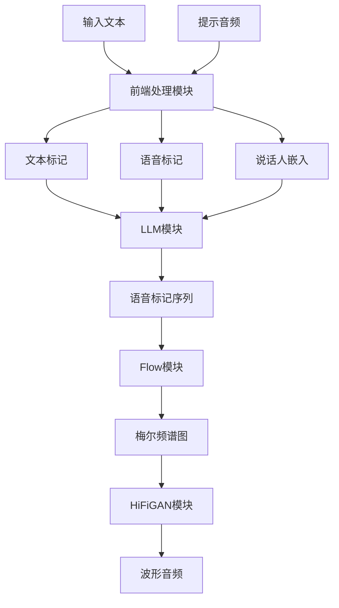

# 模型架构

<cite>
**本文档引用的文件**   
- [llm.py](file://cosyvoice/llm/llm.py)
- [flow.py](file://cosyvoice/flow/flow.py)
- [flow_matching.py](file://cosyvoice/flow/flow_matching.py)
- [length_regulator.py](file://cosyvoice/flow/length_regulator.py)
- [generator.py](file://cosyvoice/hifigan/generator.py)
- [frontend.py](file://cosyvoice/cli/frontend.py)
- [tokenizer.py](file://cosyvoice/tokenizer/tokenizer.py)
</cite>

## 目录
1. [引言](#引言)
2. [LLM模块](#llm模块)
3. [Flow模块](#flow模块)
4. [HiFiGAN模块](#hifigan模块)
5. [前端处理模块](#前端处理模块)
6. [系统集成与数据流](#系统集成与数据流)
7. [技术决策](#技术决策)
8. [结论](#结论)

## 引言
CosyVoice是一个先进的语音合成系统，其核心架构由多个协同工作的模块组成。该系统通过将文本和提示信息转换为语音标记（speech tokens），再利用声学模型生成梅尔频谱图，最终通过声码器合成高质量的波形音频。本架构文档将详细介绍CosyVoice的核心组件，包括LLM模块、Flow模块、HiFiGAN模块和前端处理模块，阐述它们的设计原理、功能职责以及相互之间的数据流和集成模式。

## LLM模块
LLM模块是CosyVoice系统的核心，负责将文本和提示信息转换为语音标记（speech tokens）。该模块基于Transformer架构，利用大型语言模型（LLM）进行序列到序列的转换。LLM模块接收文本输入和提示信息，通过编码器对文本进行编码，然后利用解码器逐步生成语音标记。该模块支持多种采样方法，以确保生成的语音标记具有多样性和自然性。

**Section sources**
- [llm.py](file://cosyvoice/llm/llm.py#L33-L740)

## Flow模块
Flow模块是CosyVoice系统的声学模型，负责将语音标记转换为梅尔频谱图。该模块基于流匹配（flow matching）技术，利用扩散模型生成高质量的声学特征。Flow模块包括一个编码器、一个长度调节器和一个解码器。编码器将语音标记转换为中间表示，长度调节器根据目标长度调整中间表示的长度，解码器则利用流匹配技术生成梅尔频谱图。

**Section sources**
- [flow.py](file://cosyvoice/flow/flow.py#L24-L434)
- [flow_matching.py](file://cosyvoice/flow/flow_matching.py#L21-L229)
- [length_regulator.py](file://cosyvoice/flow/length_regulator.py#L21-L71)

## HiFiGAN模块
HiFiGAN模块是CosyVoice系统的声码器，负责将梅尔频谱图转换为最终的波形音频。该模块基于HiFiGAN架构，利用生成对抗网络（GAN）生成高质量的音频波形。HiFiGAN模块包括一个生成器和一个判别器。生成器将梅尔频谱图作为输入，生成波形音频；判别器则用于评估生成的音频质量，以指导生成器的训练。

**Section sources**
- [generator.py](file://cosyvoice/hifigan/generator.py#L378-L747)

## 前端处理模块
前端处理模块负责对输入文本进行预处理，包括文本归一化、语音标记生成和说话人嵌入提取。该模块首先对输入文本进行归一化处理，去除不必要的符号和格式，然后利用文本到语音（TTS）模型生成语音标记。同时，该模块还从提示音频中提取说话人嵌入，以确保生成的语音具有目标说话人的特征。

**Section sources**
- [frontend.py](file://cosyvoice/cli/frontend.py#L30-L225)
- [tokenizer.py](file://cosyvoice/tokenizer/tokenizer.py#L1-L328)

## 系统集成与数据流
CosyVoice系统的各个模块通过明确的数据流进行集成。首先，前端处理模块对输入文本和提示音频进行预处理，生成文本标记、语音标记和说话人嵌入。然后，LLM模块利用这些信息生成语音标记序列。接下来，Flow模块将语音标记序列转换为梅尔频谱图。最后，HiFiGAN模块将梅尔频谱图转换为最终的波形音频。整个过程是一个端到端的流水线，确保了语音合成的高效性和一致性。

**Diagram sources**
- [frontend.py](file://cosyvoice/cli/frontend.py#L30-L225)
- [llm.py](file://cosyvoice/llm/llm.py#L33-L740)
- [flow.py](file://cosyvoice/flow/flow.py#L24-L434)
- [generator.py](file://cosyvoice/hifigan/generator.py#L378-L747)

## 技术决策
CosyVoice系统在设计过程中做出了多项关键的技术决策。首先，选择Transformer架构作为LLM模块的基础，因其在处理长序列和捕捉上下文依赖方面的优越性能。其次，采用流匹配技术作为Flow模块的核心，以生成高质量的声学特征。此外，选择HiFiGAN作为声码器，因其在生成高质量音频波形方面的卓越表现。这些技术决策共同确保了CosyVoice系统在语音合成任务中的高性能和高质量。

## 结论
CosyVoice系统通过精心设计的模块化架构，实现了从文本到高质量语音的端到端合成。LLM模块、Flow模块、HiFiGAN模块和前端处理模块各司其职，通过明确的数据流和集成模式协同工作。这些模块的设计和实现体现了对最新技术的深入理解和应用，确保了系统在语音合成任务中的卓越性能。未来，CosyVoice系统将继续优化和扩展，以满足更多应用场景的需求。