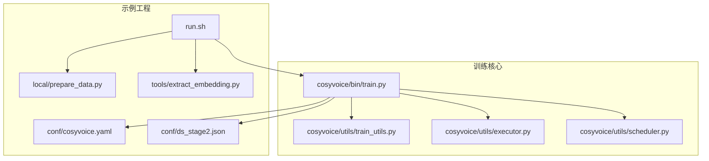
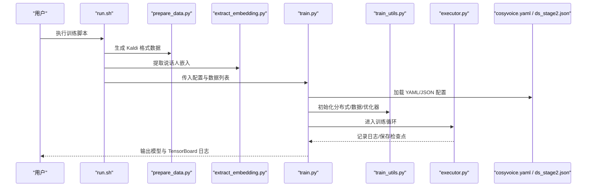
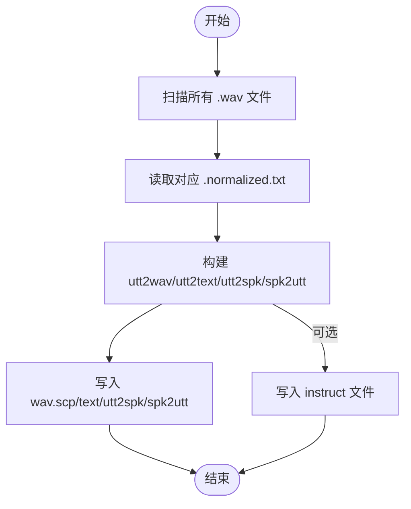
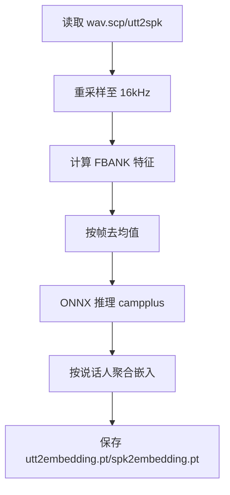
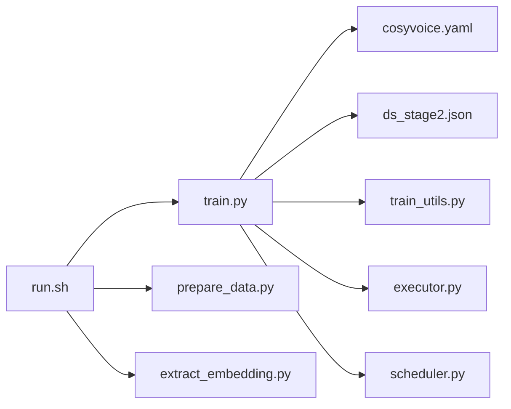

# 训练指南

<cite>
**本文引用的文件**
- [examples/libritts/cosyvoice/run.sh](file://examples/libritts/cosyvoice/run.sh)
- [examples/libritts/cosyvoice/conf/cosyvoice.yaml](file://examples/libritts/cosyvoice/conf/cosyvoice.yaml)
- [examples/libritts/cosyvoice/conf/ds_stage2.json](file://examples/libritts/cosyvoice/conf/ds_stage2.json)
- [examples/libritts/cosyvoice/local/prepare_data.py](file://examples/libritts/cosyvoice/local/prepare_data.py)
- [cosyvoice/bin/train.py](file://cosyvoice/bin/train.py)
- [cosyvoice/utils/train_utils.py](file://cosyvoice/utils/train_utils.py)
- [cosyvoice/utils/executor.py](file://cosyvoice/utils/executor.py)
- [cosyvoice/utils/scheduler.py](file://cosyvoice/utils/scheduler.py)
- [tools/extract_embedding.py](file://tools/extract_embedding.py)
- [requirements.txt](file://requirements.txt)
</cite>

## 目录
1. [简介](#简介)
2. [项目结构](#项目结构)
3. [核心组件](#核心组件)
4. [架构总览](#架构总览)
5. [详细组件分析](#详细组件分析)
6. [依赖关系分析](#依赖关系分析)
7. [性能考虑](#性能考虑)
8. [故障排查指南](#故障排查指南)
9. [结论](#结论)
10. [附录](#附录)

## 简介
本指南面向希望在 LibriTTS 数据集上训练 CosyVoice 模型的工程师与研究者，系统讲解从数据准备到训练执行、配置调优与问题排查的完整流程。重点覆盖：
- 使用本地脚本处理 LibriTTS 数据集，生成 Kaldi 风格的 wav.scp/text/utt2spk/spk2utt 文件
- 基于 YAML 配置文件的训练参数说明（学习率、批次大小、优化器等）
- 通过 run.sh 启动训练，支持单机多卡 DDP 与 DeepSpeed 分布式训练
- 使用 train.py 的命令行选项与最佳实践（混合精度、分布式）
- 常见问题与 OOM 内存不足的解决方案

## 项目结构
本训练示例位于 examples/libritts/cosyvoice 目录，主要由以下部分组成：
- 数据准备：local/prepare_data.py 将 LibriTTS 转换为 Kaldi 格式
- 训练入口：run.sh 组织下载、准备、特征提取、训练、模型平均与导出
- 训练配置：conf/cosyvoice.yaml 定义模型结构与训练超参；ds_stage2.json 为 DeepSpeed 配置
- 训练脚本：cosyvoice/bin/train.py 实现训练循环与分布式初始化
- 工具链：tools/extract_embedding.py 提取说话人嵌入；requirements.txt 列出依赖

图表来源
- [examples/libritts/cosyvoice/run.sh](file://examples/libritts/cosyvoice/run.sh#L1-L109)
- [examples/libritts/cosyvoice/local/prepare_data.py](file://examples/libritts/cosyvoice/local/prepare_data.py#L1-L63)
- [tools/extract_embedding.py](file://tools/extract_embedding.py#L1-L78)
- [cosyvoice/bin/train.py](file://cosyvoice/bin/train.py#L1-L196)
- [cosyvoice/utils/train_utils.py](file://cosyvoice/utils/train_utils.py#L1-L200)
- [cosyvoice/utils/executor.py](file://cosyvoice/utils/executor.py#L1-L177)
- [cosyvoice/utils/scheduler.py](file://cosyvoice/utils/scheduler.py#L1-L200)
- [examples/libritts/cosyvoice/conf/cosyvoice.yaml](file://examples/libritts/cosyvoice/conf/cosyvoice.yaml#L1-L257)
- [examples/libritts/cosyvoice/conf/ds_stage2.json](file://examples/libritts/cosyvoice/conf/ds_stage2.json#L1-L42)

章节来源
- [examples/libritts/cosyvoice/run.sh](file://examples/libritts/cosyvoice/run.sh#L1-L109)
- [examples/libritts/cosyvoice/conf/cosyvoice.yaml](file://examples/libritts/cosyvoice/conf/cosyvoice.yaml#L1-L257)

## 核心组件
- 数据准备脚本：将 LibriTTS 的 .wav/.txt 转换为 Kaldi 风格的 wav.scp/text/utt2spk/spk2utt，并可选生成 instruct 文件
- 特征提取工具：使用 ONNX 推理提取说话人嵌入，输出 utt2embedding.pt 与 spk2embedding.pt
- 训练入口脚本：统一调度下载、准备、特征提取、训练、模型平均与导出
- 训练主程序：解析配置、初始化分布式、构建数据加载器、执行训练循环、日志与检查点保存
- 训练工具库：分布式初始化、数据加载器、优化器与学习率调度器、TensorBoard 日志、模型保存
- 训练执行器：封装训练/验证循环、梯度累积、日志记录与周期性评估

章节来源
- [examples/libritts/cosyvoice/local/prepare_data.py](file://examples/libritts/cosyvoice/local/prepare_data.py#L1-L63)
- [tools/extract_embedding.py](file://tools/extract_embedding.py#L1-L78)
- [examples/libritts/cosyvoice/run.sh](file://examples/libritts/cosyvoice/run.sh#L1-L109)
- [cosyvoice/bin/train.py](file://cosyvoice/bin/train.py#L1-L196)
- [cosyvoice/utils/train_utils.py](file://cosyvoice/utils/train_utils.py#L1-L200)
- [cosyvoice/utils/executor.py](file://cosyvoice/utils/executor.py#L1-L177)

## 架构总览
下图展示从数据准备到训练执行的关键流程与组件交互。

图表来源
- [examples/libritts/cosyvoice/run.sh](file://examples/libritts/cosyvoice/run.sh#L1-L109)
- [examples/libritts/cosyvoice/local/prepare_data.py](file://examples/libritts/cosyvoice/local/prepare_data.py#L1-L63)
- [tools/extract_embedding.py](file://tools/extract_embedding.py#L1-L78)
- [cosyvoice/bin/train.py](file://cosyvoice/bin/train.py#L1-L196)
- [cosyvoice/utils/train_utils.py](file://cosyvoice/utils/train_utils.py#L1-L200)
- [cosyvoice/utils/executor.py](file://cosyvoice/utils/executor.py#L1-L177)
- [examples/libritts/cosyvoice/conf/cosyvoice.yaml](file://examples/libritts/cosyvoice/conf/cosyvoice.yaml#L1-L257)
- [examples/libritts/cosyvoice/conf/ds_stage2.json](file://examples/libritts/cosyvoice/conf/ds_stage2.json#L1-L42)

## 详细组件分析

### 数据准备：prepare_data.py
- 输入：LibriTTS 解压后的目录（包含 .wav 与 .normalized.txt）
- 输出：wav.scp、text、utt2spk、spk2utt（可选 instruct）
- 关键逻辑：遍历 .wav 文件，读取对应 .txt 文本，构造 utt2wav、utt2text、utt2spk、spk2utt 映射，写入 Kaldi 格式文件
- 可选 instruct：当启用 --instruct 时，为每条样本追加指令前缀

图表来源
- [examples/libritts/cosyvoice/local/prepare_data.py](file://examples/libritts/cosyvoice/local/prepare_data.py#L1-L63)

章节来源
- [examples/libritts/cosyvoice/local/prepare_data.py](file://examples/libritts/cosyvoice/local/prepare_data.py#L1-L63)

### 说话人嵌入提取：extract_embedding.py
- 读取 wav.scp 与 utt2spk，逐样本提取 FBANK 特征
- 使用 ONNX Runtime 推理 campplus 模型得到说话人嵌入
- 聚合每个说话人的 utt2embedding.pt 与 spk2embedding.pt

图表来源
- [tools/extract_embedding.py](file://tools/extract_embedding.py#L1-L78)

章节来源
- [tools/extract_embedding.py](file://tools/extract_embedding.py#L1-L78)

### 训练配置：cosyvoice.yaml
- 固定参数：采样率、文本编码器输入维度、LLM 输入/输出维度、说话人嵌入维度
- 模型定义：LLM、Flow、HiFiGAN/HFT 等模块的子配置
- 数据处理流水线：parquet 打开、分词、过滤、重采样、fbank、f0、说话人嵌入解析、打乱、排序、批处理、填充
- 训练配置：优化器类型与参数、学习率调度器、warmup 步数、最大轮次、梯度裁剪、梯度累积、日志间隔、按步保存策略

章节来源
- [examples/libritts/cosyvoice/conf/cosyvoice.yaml](file://examples/libritts/cosyvoice/conf/cosyvoice.yaml#L1-L257)

### DeepSpeed 配置：ds_stage2.json
- micro_batch_size_per_gpu、gradient_accumulation_steps、steps_per_print
- gradient_clipping、fp16/bf16 开关与参数
- ZeRO Stage 2 优化、CPU offload、通信优化开关
- 优化器类型与参数（AdamW）

章节来源
- [examples/libritts/cosyvoice/conf/ds_stage2.json](file://examples/libritts/cosyvoice/conf/ds_stage2.json#L1-L42)

### 训练入口：run.sh
- 支持多阶段：下载数据、准备 Kaldi 数据、提取说话人嵌入、提取离散语音 token、生成 Parquet 列表
- 训练阶段：设置 GPU 设备、拼接训练/验证数据列表、使用 torchrun 启动多卡训练
- 训练引擎：torch_ddp 或 deepspeed；支持混合精度与 DeepSpeed 状态保存
- 结束阶段：模型平均与导出（JIT/ONNX）

章节来源
- [examples/libritts/cosyvoice/run.sh](file://examples/libritts/cosyvoice/run.sh#L1-L109)

### 训练主程序：train.py
- 命令行参数：训练引擎选择、模型类型、配置路径、数据列表、检查点、模型保存目录、TensorBoard 目录、分布式后端、数据加载器参数、AMP、DPO、DeepSpeed 参数
- 流程：加载配置、初始化分布式、构建数据集与 DataLoader、保存初始检查点、模型部署到 GPU、初始化优化器与调度器、训练循环、周期性交叉验证与保存

章节来源
- [cosyvoice/bin/train.py](file://cosyvoice/bin/train.py#L1-L196)

### 训练工具库：train_utils.py
- 分布式初始化：支持 torch DDP 与 DeepSpeed
- 数据加载器：根据是否 GAN 选择不同数据流水线，支持 pin_memory、num_workers、prefetch_factor
- 配置校验与覆盖：根据训练引擎覆盖 dtype、梯度累积、日志间隔、保存策略
- 模型封装：DDP 包装或 DeepSpeed 初始化
- 优化器与调度器：支持 Adam/AdamW 与多种调度器（WarmupLR、NoamHoldAnnealing、ConstantLR），DeepSpeed 下使用其优化器
- TensorBoard 初始化与模型保存

章节来源
- [cosyvoice/utils/train_utils.py](file://cosyvoice/utils/train_utils.py#L1-L200)

### 训练执行器：executor.py
- 训练一个 epoch：支持 DDP 梯度累积、日志记录、周期性交叉验证、检查点保存
- GAN 训练：区分生成器与判别器的交替更新
- 交叉验证：聚合损失、记录日志、保存模型

章节来源
- [cosyvoice/utils/executor.py](file://cosyvoice/utils/executor.py#L1-L177)

### 学习率调度器：scheduler.py
- WarmupLR：带 warmup 的平方根缩放
- 其他策略：常量、Noam 等策略（用于不同场景）

章节来源
- [cosyvoice/utils/scheduler.py](file://cosyvoice/utils/scheduler.py#L1-L200)

## 依赖关系分析

图表来源
- [examples/libritts/cosyvoice/run.sh](file://examples/libritts/cosyvoice/run.sh#L1-L109)
- [cosyvoice/bin/train.py](file://cosyvoice/bin/train.py#L1-L196)
- [examples/libritts/cosyvoice/conf/cosyvoice.yaml](file://examples/libritts/cosyvoice/conf/cosyvoice.yaml#L1-L257)
- [examples/libritts/cosyvoice/conf/ds_stage2.json](file://examples/libritts/cosyvoice/conf/ds_stage2.json#L1-L42)
- [cosyvoice/utils/train_utils.py](file://cosyvoice/utils/train_utils.py#L1-L200)
- [cosyvoice/utils/executor.py](file://cosyvoice/utils/executor.py#L1-L177)
- [cosyvoice/utils/scheduler.py](file://cosyvoice/utils/scheduler.py#L1-L200)
- [examples/libritts/cosyvoice/local/prepare_data.py](file://examples/libritts/cosyvoice/local/prepare_data.py#L1-L63)
- [tools/extract_embedding.py](file://tools/extract_embedding.py#L1-L78)

章节来源
- [requirements.txt](file://requirements.txt#L1-L43)

## 性能考虑
- 混合精度训练
  - 使用 --use_amp 启用 PyTorch AMP；在 DDP 模式下 dtype 自动设为 bf16（若可用），否则 fp32
  - DeepSpeed 模式下优先参考 ds_stage2.json 中 fp16/bf16 配置
- 梯度累积
  - 在 cosyvoice.yaml 中设置 accum_grad；DeepSpeed 模式下会被 ds_stage2.json 的 gradient_accumulation_steps 覆盖
- 批大小与显存
  - train_micro_batch_size_per_gpu=1 时，单卡显存占用相对可控；增大该值可提升吞吐但需注意 OOM
- 通信后端
  - 默认 nccl；在多节点或特定环境可切换为 gloo
- 数据加载
  - num_workers、prefetch_factor、pin_memory 可影响 IO 与 CPU-GPU 协同效率
- 日志与保存
  - steps_per_print 控制日志频率；save_per_step 控制按步保存频率

章节来源
- [cosyvoice/utils/train_utils.py](file://cosyvoice/utils/train_utils.py#L72-L91)
- [examples/libritts/cosyvoice/conf/ds_stage2.json](file://examples/libritts/cosyvoice/conf/ds_stage2.json#L1-L42)
- [examples/libritts/cosyvoice/conf/cosyvoice.yaml](file://examples/libritts/cosyvoice/conf/cosyvoice.yaml#L229-L257)

## 故障排查指南
- 训练启动失败
  - 确认 CUDA_VISIBLE_DEVICES 设置正确且 GPU 数量匹配 --nproc_per_node
  - 检查 --deepspeed_config 路径与权限
- OOM（内存不足）
  - 降低 train_micro_batch_size_per_gpu 或 accum_grad
  - 减小 batch 类型的最大帧数（max_frames_in_batch）或减少 batch_size
  - 关闭不必要的预取与 pin_memory
  - 切换到 fp32 或 bf16（取决于硬件）以平衡精度与显存
- DeepSpeed 初始化异常
  - 确保 DeepSpeed 版本与 PyTorch 匹配；检查 ZeRO 阶段与 offload 配置
- 学习率/收敛问题
  - 检查 warmup 步数与 scheduler 配置；GAN 训练使用不同的 optim/scheduler
- 数据加载慢
  - 增大 num_workers 与 prefetch_factor；确保磁盘 IO 能力充足

章节来源
- [cosyvoice/utils/train_utils.py](file://cosyvoice/utils/train_utils.py#L39-L50)
- [cosyvoice/utils/train_utils.py](file://cosyvoice/utils/train_utils.py#L111-L184)
- [examples/libritts/cosyvoice/conf/ds_stage2.json](file://examples/libritts/cosyvoice/conf/ds_stage2.json#L1-L42)
- [examples/libritts/cosyvoice/conf/cosyvoice.yaml](file://examples/libritts/cosyvoice/conf/cosyvoice.yaml#L229-L257)

## 结论
通过本指南，您可以在 LibriTTS 上完成从数据准备到训练执行的全流程。建议优先使用 run.sh 统一调度，结合 cosyvoice.yaml 与 ds_stage2.json 的配置项进行针对性调优，并在训练过程中利用 TensorBoard 观察指标变化。遇到 OOM 等问题时，优先从 batch size、梯度累积与混合精度三方面入手调整。

## 附录

### 命令行选项速查（train.py）
- --train_engine：训练引擎选择（torch_ddp/deepspeed）
- --model：训练模型类型（llm/flow/hifigan）
- --config：配置文件路径（YAML）
- --train_data/--cv_data：训练/验证数据列表路径
- --checkpoint：断点续训检查点路径
- --model_dir：模型保存目录
- --tensorboard_dir：TensorBoard 日志目录
- --ddp.dist_backend：分布式后端（nccl/gloo）
- --num_workers/--prefetch/--pin_memory：数据加载相关
- --use_amp：启用混合精度
- --deepspeed.save_states：保存模型/优化器状态
- --timeout：进程组等待超时
- --deepspeed.*：DeepSpeed 配置参数（由 deepspeed.add_config_arguments 注入）

章节来源
- [cosyvoice/bin/train.py](file://cosyvoice/bin/train.py#L40-L93)

### 关键参数说明（cosyvoice.yaml）
- 优化器与调度器：optim、optim_conf、scheduler、scheduler_conf
- 训练控制：max_epoch、grad_clip、accum_grad、log_interval、save_per_step
- 数据流水线：batch 类型与最大帧数、padding 选项、shuffle/sort 大小

章节来源
- [examples/libritts/cosyvoice/conf/cosyvoice.yaml](file://examples/libritts/cosyvoice/conf/cosyvoice.yaml#L229-L257)