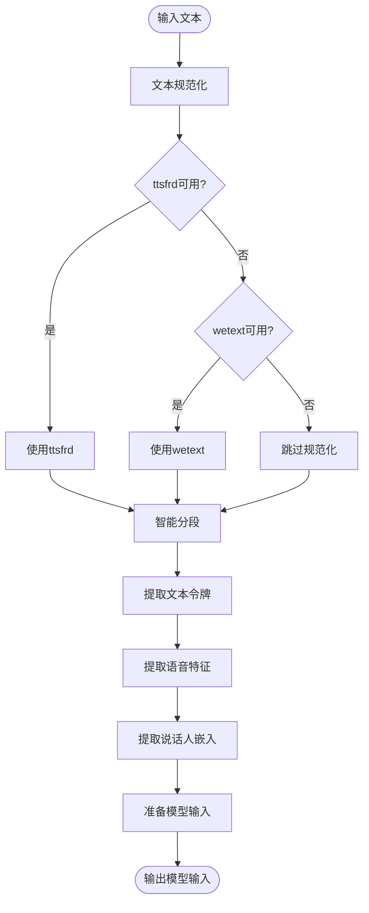

# 项目概述

<cite>
**本文档引用的文件**
- [README.md](file://README.md)
- [example.py](file://example.py)
- [FAQ.md](file://FAQ.md)
- [requirements.txt](file://requirements.txt)
- [cosyvoice/cli/cosyvoice.py](file://cosyvoice/cli/cosyvoice.py)
- [cosyvoice/llm/llm.py](file://cosyvoice/llm/llm.py)
- [cosyvoice/flow/flow_matching.py](file://cosyvoice/flow/flow_matching.py)
- [cosyvoice/hifigan/hifigan.py](file://cosyvoice/hifigan/hifigan.py)
- [cosyvoice/cli/frontend.py](file://cosyvoice/cli/frontend.py)
- [cosyvoice/cli/model.py](file://cosyvoice/cli/model.py)
- [cosyvoice/tokenizer/tokenizer.py](file://cosyvoice/tokenizer/tokenizer.py)
- [cosyvoice/utils/common.py](file://cosyvoice/utils/common.py)
- [webui.py](file://webui.py)
- [server.py](file://server.py)
</cite>

## 目录
1. [项目简介](#项目简介)
2. [项目结构](#项目结构)
3. [核心组件](#核心组件)
4. [架构总览](#架构总览)
5. [详细组件分析](#详细组件分析)
6. [依赖关系分析](#依赖关系分析)
7. [性能考虑](#性能考虑)
8. [故障排除指南](#故障排除指南)
9. [结论](#结论)

## 项目简介

CosyVoice是一个基于大型语言模型（LLM）的先进文本到语音（TTS）系统，旨在实现高质量、自然流畅的多语言和零样本语音合成。该项目由FunAudioLLM团队开发，代表了语音合成领域的最新进展。

### 核心特性

- **多语言支持**：覆盖9种常见语言（中文、英语、日语、韩语、德语、西班牙语、法语、意大利语、俄语），以及18种以上中国方言/口音
- **跨语言语音克隆**：支持多语言/跨语言零样本语音克隆
- **发音修补**：支持中文拼音和英文CMU音素的发音修补
- **双向流式处理**：支持文本输入流式和音频输出流式，延迟可达150ms
- **指令控制**：支持语言、方言、情感、速度、音量等多种指令控制

### 目标用户

- **语音合成研究人员**：寻求前沿TTS技术的学术研究者
- **NLP开发者**：构建自然语言处理应用的工程师
- **多媒体应用开发者**：开发语音助手、播客、教育软件等多媒体产品的开发者

## 项目结构

CosyVoice项目采用模块化设计，主要分为以下几个核心层次：


**图表来源**
- [cosyvoice/cli/cosyvoice.py](file://cosyvoice/cli/cosyvoice.py#L27-L239)
- [cosyvoice/cli/frontend.py](file://cosyvoice/cli/frontend.py#L30-L225)
- [cosyvoice/cli/model.py](file://cosyvoice/cli/model.py#L29-L431)

**章节来源**
- [README.md](file://README.md#L1-L318)
- [requirements.txt](file://requirements.txt#L1-L43)

## 核心组件

### AutoModel自动模型选择器

AutoModel是CosyVoice的统一入口点，根据模型配置自动选择合适的模型类型：


**图表来源**
- [cosyvoice/cli/cosyvoice.py](file://cosyvoice/cli/cosyvoice.py#L27-L239)

### LLM语言模型

CosyVoice的LLM组件基于Qwen2架构，支持多种推理模式：

- **TransformerLM**：基础的Transformer语言模型
- **Qwen2LM**：Qwen2架构的语言模型，支持vLLM加速
- **CosyVoice3LM**：专为CosyVoice3设计的增强版语言模型

**章节来源**
- [cosyvoice/llm/llm.py](file://cosyvoice/llm/llm.py#L33-L740)

### Flow匹配系统

Flow匹配是CosyVoice的核心声学建模组件：


**图表来源**
- [cosyvoice/flow/flow_matching.py](file://cosyvoice/flow/flow_matching.py#L21-L229)

### HiFiGAN声码器

HiFiGAN是高质量的神经声码器，负责将梅尔频谱转换为波形：

**章节来源**
- [cosyvoice/hifigan/hifigan.py](file://cosyvoice/hifigan/hifigan.py#L9-L68)

## 架构总览

CosyVoice采用端到端的TTS架构，从文本输入到音频输出的完整流程如下：


**图表来源**
- [cosyvoice/cli/cosyvoice.py](file://cosyvoice/cli/cosyvoice.py#L80-L136)
- [cosyvoice/cli/model.py](file://cosyvoice/cli/model.py#L167-L235)

## 详细组件分析

### 前端处理系统

前端处理负责文本规范化、特征提取和模型输入准备：



**图表来源**
- [cosyvoice/cli/frontend.py](file://cosyvoice/cli/frontend.py#L127-L160)

**章节来源**
- [cosyvoice/cli/frontend.py](file://cosyvoice/cli/frontend.py#L30-L225)

### 推理模型系统

推理模型系统实现了完整的TTS推理管道：


**图表来源**
- [cosyvoice/cli/model.py](file://cosyvoice/cli/model.py#L29-L431)

**章节来源**
- [cosyvoice/cli/model.py](file://cosyvoice/cli/model.py#L29-L431)

### 分词器系统

CosyVoice支持多语言和特殊标记的分词器：


**图表来源**
- [cosyvoice/tokenizer/tokenizer.py](file://cosyvoice/tokenizer/tokenizer.py#L241-L328)

**章节来源**
- [cosyvoice/tokenizer/tokenizer.py](file://cosyvoice/tokenizer/tokenizer.py#L1-L328)

### Web界面和API

CosyVoice提供了多种用户交互方式：

**章节来源**
- [webui.py](file://webui.py#L1-L182)
- [server.py](file://server.py#L1-L568)

## 依赖关系分析

### 核心依赖关系


**图表来源**
- [requirements.txt](file://requirements.txt#L1-L43)
- [cosyvoice/cli/cosyvoice.py](file://cosyvoice/cli/cosyvoice.py#L14-L25)

**章节来源**
- [requirements.txt](file://requirements.txt#L1-L43)

### 第三方模块集成

CosyVoice借鉴了多个开源项目的技术：

- **Matcha-TTS**：Flow匹配算法的基础实现
- **FunASR**：语音识别相关技术
- **FunCodec**：音频编码解码技术
- **AcademiCodec**：音频处理技术
- **WeNet**：端到端语音识别框架

**章节来源**
- [README.md](file://README.md#L274-L281)

## 性能考虑

### 推理优化策略

CosyVoice实现了多层次的性能优化：

1. **硬件加速**
   - CUDA加速的深度学习推理
   - TensorRT优化的流式推理
   - FP16混合精度计算

2. **模型优化**
   - JIT编译优化
   - vLLM加速的LLM推理
   - 流式处理减少内存占用

3. **缓存机制**
   - 语音令牌缓存
   - 梅尔频谱重叠缓存
   - 声码器缓存

### 性能指标

- **延迟**：支持低至150ms的首包延迟
- **吞吐量**：支持高并发流式处理
- **质量**：达到人类水平的语音自然度

## 故障排除指南

### 常见问题及解决方案

#### ModuleNotFoundError: No module named 'matcha'

**问题描述**：缺少Matcha-TTS第三方模块

**解决方案**：
```bash
# 初始化子模块
git submodule update --init --recursive

# 或者设置PYTHONPATH
export PYTHONPATH=third_party/Matcha-TTS
```

**章节来源**
- [FAQ.md](file://FAQ.md#L1-L17)

#### 模型下载问题

**问题描述**：无法下载预训练模型

**解决方案**：
```python
# 使用ModelScope下载
from modelscope import snapshot_download
snapshot_download('FunAudioLLM/Fun-CosyVoice3-0.5B-2512', local_dir='pretrained_models/Fun-CosyVoice3-0.5B')

# 或使用HuggingFace下载
from huggingface_hub import snapshot_download
snapshot_download('FunAudioLLM/Fun-CosyVoice3-0.5B-2512', local_dir='pretrained_models/Fun-CosyVoice3-0.5B')
```

#### 文本规范化问题

**问题描述**：ttsfrd包缺失导致文本规范化效果差

**解决方案**：
```bash
# 安装ttsfrd依赖
pip install ttsfrd_dependency-0.1-py3-none-any.whl
pip install ttsfrd-0.4.2-cp310-cp310-linux_x86_64.whl
```

**章节来源**
- [FAQ.md](file://FAQ.md#L7-L17)

### 性能优化建议

1. **硬件要求**
   - GPU：NVIDIA RTX 3090或更高
   - 内存：至少16GB RAM
   - 存储：至少50GB可用空间

2. **环境配置**
   - 使用CUDA 12.1
   - PyTorch 2.3.1
   - Python 3.10+

3. **模型选择**
   - 开发阶段：CosyVoice-300M
   - 生产环境：Fun-CosyVoice3-0.5B
   - 流式场景：CosyVoice2-0.5B

## 结论

CosyVoice代表了TTS技术的最新发展方向，通过LLM驱动的端到端架构实现了高质量、低延迟的语音合成。其多语言支持、零样本克隆能力和流式处理特性使其成为语音合成领域的领先解决方案。

### 技术优势

- **技术创新**：基于LLM的端到端TTS架构
- **性能卓越**：支持低延迟流式处理
- **功能丰富**：多语言、多方言、多情感支持
- **易于使用**：提供多种交互方式和API

### 应用前景

CosyVoice适用于各种语音合成应用场景，包括但不限于：
- 语音助手和聊天机器人
- 多媒体内容创作
- 教育和培训应用
- 无障碍技术支持

随着技术的不断发展和完善，CosyVoice将继续推动语音合成技术的发展，为用户提供更加自然、流畅的语音体验。