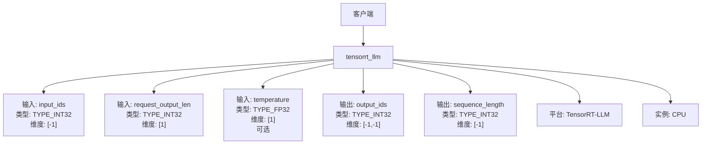
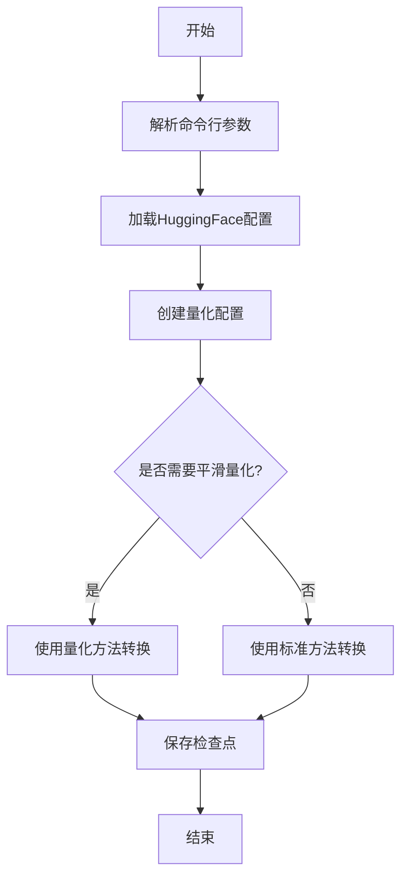
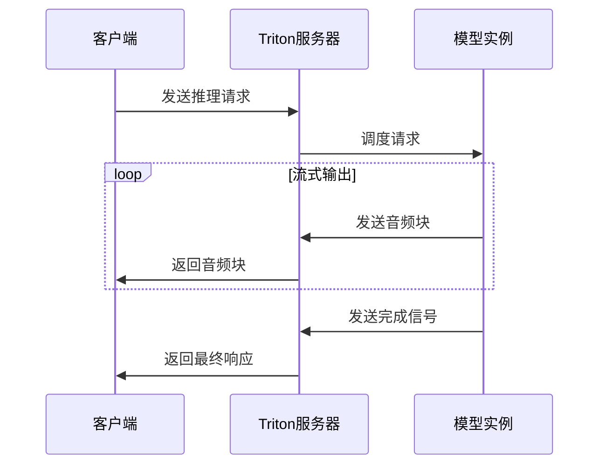
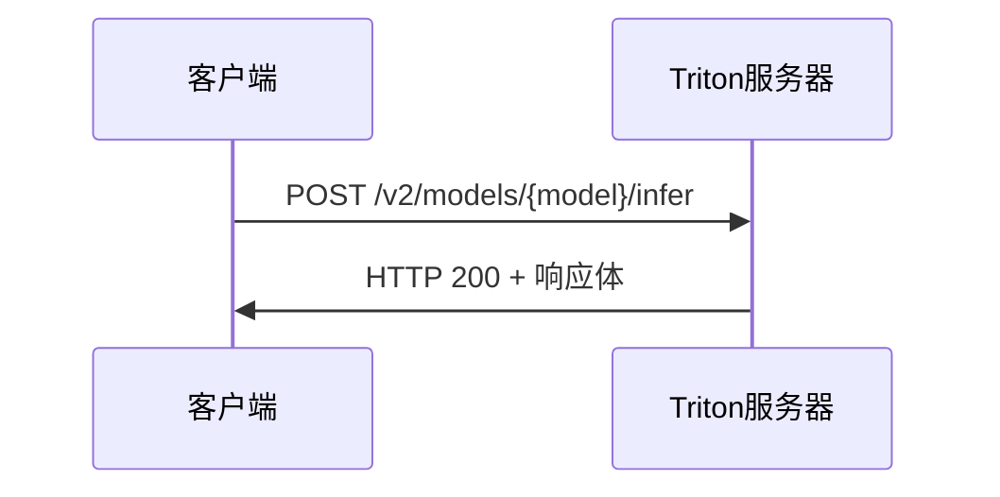
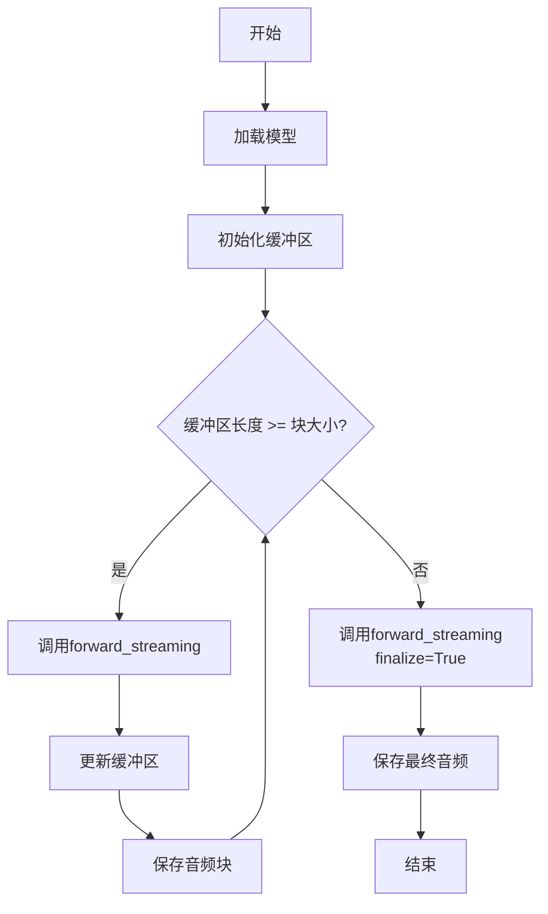

# 扩展集成

<cite>
**本文档引用的文件**   
- [audio_tokenizer/config.pbtxt](file://runtime/triton_trtllm/model_repo/audio_tokenizer/config.pbtxt)
- [speaker_embedding/config.pbtxt](file://runtime/triton_trtllm/model_repo/speaker_embedding/config.pbtxt)
- [token2wav/config.pbtxt](file://runtime/triton_trtllm/model_repo/token2wav/config.pbtxt)
- [cosyvoice2/config.pbtxt](file://runtime/triton_trtllm/model_repo/cosyvoice2/config.pbtxt)
- [tensorrt_llm/config.pbtxt](file://runtime/triton_trtllm/model_repo/tensorrt_llm/config.pbtxt)
- [convert_checkpoint.py](file://runtime/triton_trtllm/scripts/convert_checkpoint.py)
- [client_grpc.py](file://runtime/triton_trtllm/client_grpc.py)
- [client_http.py](file://runtime/triton_trtllm/client_http.py)
- [streaming_inference.py](file://runtime/triton_trtllm/streaming_inference.py)
- [offline_inference.py](file://runtime/triton_trtllm/offline_inference.py)
- [token2wav.py](file://runtime/triton_trtllm/token2wav.py)
- [audio_tokenizer/1/model.py](file://runtime/triton_trtllm/model_repo/audio_tokenizer/1/model.py)
- [speaker_embedding/1/model.py](file://runtime/triton_trtllm/model_repo/speaker_embedding/1/model.py)
- [token2wav/1/model.py](file://runtime/triton_trtllm/model_repo/token2wav/1/model.py)
- [run.sh](file://runtime/triton_trtllm/run.sh)
</cite>

## 目录
1. [集成概述](#集成概述)
2. [Triton模型配置详解](#triton模型配置详解)
3. [模型转换与部署](#模型转换与部署)
4. [微服务部署指导](#微服务部署指导)
5. [客户端调用示例](#客户端调用示例)
6. [流式推理机制](#流式推理机制)

## 集成概述

CosyVoice项目通过Triton Inference Server实现了高效的语音合成服务集成。该集成方案将语音合成流程分解为多个独立的微服务模块，包括音频分词器（audio_tokenizer）、说话人嵌入提取器（speaker_embedding）和声码器（token2wav）等，每个模块都作为独立的Triton模型服务运行。这种架构设计不仅提高了系统的可扩展性和灵活性，还支持动态批处理和流式推理等高级功能。系统通过gRPC和HTTP两种协议提供客户端接口，满足不同应用场景的需求。

**Section sources**
- [run.sh](file://runtime/triton_trtllm/run.sh#L1-L143)

## Triton模型配置详解

### 音频分词器配置

`audio_tokenizer`模块的`config.pbtxt`文件定义了音频分词服务的配置。该服务接收原始音频波形作为输入，并输出对应的语音分词序列。配置中关键参数包括：
- **name**: 模型名称为"audio_tokenizer"
- **backend**: 使用Python后端
- **max_batch_size**: 最大批处理大小由环境变量`${triton_max_batch_size}`控制
- **dynamic_batching**: 启用动态批处理，最大队列延迟由`${max_queue_delay_microseconds}`控制
- **input**: 定义了两个输入张量：`reference_wav`（浮点型，维度为[-1]）和`reference_wav_len`（整型，维度为[1]）
- **output**: 定义了一个输出张量`prompt_speech_tokens`（整型，维度为[-1]）
- **instance_group**: 在CPU上运行一个实例

```mermaid
graph TD
A[客户端] --> B[audio_tokenizer]
B --> C[输入: reference_wav<br/>类型: TYPE_FP32<br/>维度: [-1]]
B --> D[输入: reference_wav_len<br/>类型: TYPE_INT32<br/>维度: [1]]
B --> E[输出: prompt_speech_tokens<br/>类型: TYPE_INT32<br/>维度: [-1]]
B --> F[平台: Python]
B --> G[实例: CPU]
```

**Diagram sources **
- [audio_tokenizer/config.pbtxt](file://runtime/triton_trtllm/model_repo/audio_tokenizer/config.pbtxt#L15-L53)

### 说话人嵌入提取器配置

`speaker_embedding`模块的`config.pbtxt`文件定义了说话人特征提取服务的配置。该服务从参考音频中提取说话人嵌入向量，用于保持语音合成的说话人一致性。配置要点包括：
- **name**: 模型名称为"speaker_embedding"
- **input**: 仅有一个输入张量`reference_wav`（浮点型，维度为[-1]）
- **output**: 输出张量`prompt_spk_embedding`（半精度浮点型，维度为[-1]）
- **parameters**: 通过`model_dir`参数指定模型文件目录

```mermaid
graph TD
A[客户端] --> B[speaker_embedding]
B --> C[输入: reference_wav<br/>类型: TYPE_FP32<br/>维度: [-1]]
B --> D[输出: prompt_spk_embedding<br/>类型: TYPE_FP16<br/>维度: [-1]]
B --> E[平台: Python]
B --> F[实例: CPU]
```

**Diagram sources **
- [speaker_embedding/config.pbtxt](file://runtime/triton_trtllm/model_repo/speaker_embedding/config.pbtxt#L15-L48)

### 声码器配置

`token2wav`模块的`config.pbtxt`文件定义了声码器服务的配置，这是语音合成流程中的关键组件。该服务将语音分词序列转换为最终的音频波形。其配置特点包括：
- **name**: 模型名称为"token2wav"
- **input**: 定义了多个可选输入张量，包括`target_speech_tokens`、`prompt_speech_tokens`、`prompt_speech_feat`、`prompt_spk_embedding`等
- **output**: 输出张量`waveform`（浮点型，维度为[-1]）
- **optional**: 多个输入被标记为可选，支持灵活的推理模式

```mermaid
graph TD
A[客户端] --> B[token2wav]
B --> C[输入: target_speech_tokens<br/>类型: TYPE_INT32<br/>维度: [-1]]
B --> D[输入: prompt_speech_tokens<br/>类型: TYPE_INT32<br/>维度: [-1]<br/>可选]
B --> E[输入: prompt_speech_feat<br/>类型: TYPE_FP16<br/>维度: [-1,80]<br/>可选]
B --> F[输入: prompt_spk_embedding<br/>类型: TYPE_FP16<br/>维度: [-1]<br/>可选]
B --> G[输出: waveform<br/>类型: TYPE_FP32<br/>维度: [-1]]
B --> H[平台: Python]
B --> I[实例: CPU]
```

**Diagram sources **
- [token2wav/config.pbtxt](file://runtime/triton_trtllm/model_repo/token2wav/config.pbtxt#L15-L80)

### 主模型配置

`cosyvoice2`模块的`config.pbtxt`文件定义了主语音合成模型的配置。该配置通过BLS（Backend Load Splitting）机制集成了多个子模型，实现了端到端的语音合成服务。关键配置包括：
- **name**: 模型名称为"cosyvoice2"
- **model_transaction_policy**: 通过`decoupled`参数控制解耦模式，支持流式推理
- **input**: 定义了文本输入`reference_text`和`target_text`，以及可选的音频输入
- **parameters**: 包含`llm_tokenizer_dir`和`model_dir`等重要参数

```mermaid
graph TD
A[客户端] --> B[cosyvoice2]
B --> C[输入: reference_wav<br/>类型: TYPE_FP32<br/>维度: [-1]<br/>可选]
B --> D[输入: reference_text<br/>类型: TYPE_STRING<br/>维度: [1]<br/>可选]
B --> E[输入: target_text<br/>类型: TYPE_STRING<br/>维度: [1]]
B --> F[输出: waveform<br/>类型: TYPE_FP32<br/>维度: [-1]]
B --> G[平台: Python]
B --> H[实例: CPU]
```

**Diagram sources **
- [cosyvoice2/config.pbtxt](file://runtime/triton_trtllm/model_repo/cosyvoice2/config.pbtxt#L15-L73)

### TensorRT-LLM配置

`tensorrt_llm`模块的`config.pbtxt`文件定义了基于TensorRT-LLM的大语言模型推理配置。该配置支持复杂的推理参数和高级功能，包括：
- **backend**: 后端类型由`${triton_backend}`变量控制
- **input**: 定义了丰富的输入参数，如`input_ids`、`request_output_len`、`temperature`等
- **output**: 包含多个输出张量，如`output_ids`、`sequence_length`、`cum_log_probs`等
- **parameters**: 包含大量推理参数，如`max_beam_width`、`kv_cache_free_gpu_mem_fraction`等



**Diagram sources **
- [tensorrt_llm/config.pbtxt](file://runtime/triton_trtllm/model_repo/tensorrt_llm/config.pbtxt#L27-L858)

## 模型转换与部署

### 模型转换脚本

`convert_checkpoint.py`脚本负责将PyTorch格式的模型检查点转换为Triton支持的TensorRT-LLM格式。该脚本提供了丰富的命令行参数，支持多种量化和优化选项：

- **基本参数**: `--model_dir`指定源模型目录，`--output_dir`指定输出目录
- **并行化参数**: `--tp_size`、`--pp_size`、`--cp_size`分别控制张量并行、流水线并行和上下文并行的大小
- **数据类型**: `--dtype`参数支持`float16`、`bfloat16`、`float32`等数据类型
- **量化选项**: `--use_weight_only`启用权重量化，`--weight_only_precision`指定量化精度（int8或int4）
- **平滑量化**: `--smoothquant`参数支持平滑量化技术，提高量化模型的精度

该脚本通过`QWenForCausalLM.quantize`方法执行实际的模型转换过程，并支持多线程并行转换以提高效率。



**Diagram sources **
- [convert_checkpoint.py](file://runtime/triton_trtllm/scripts/convert_checkpoint.py#L1-L331)

### 部署流程

`run.sh`脚本提供了完整的模型部署流程，包含多个阶段：
1. **环境准备**: 设置Python路径和CUDA可见设备
2. **模型下载**: 从HuggingFace和ModelScope下载预训练模型
3. **模型转换**: 使用`convert_checkpoint.py`将模型转换为TensorRT格式
4. **引擎构建**: 使用`trtllm-build`工具构建TensorRT推理引擎
5. **模型仓库创建**: 组织模型文件结构并填充配置模板
6. **服务启动**: 启动Triton推理服务器

该脚本通过阶段控制机制（`stage`和`stop_stage`参数）支持分步执行，便于调试和监控。

**Section sources**
- [run.sh](file://runtime/triton_trtllm/run.sh#L1-L143)

## 微服务部署指导

### 音频分词器部署

`audio_tokenizer`模块作为独立的微服务部署，其核心实现位于`model.py`文件中。该服务通过`TritonPythonModel`类实现，包含以下关键组件：
- **initialize方法**: 初始化模型，加载`s3tokenizer`模型文件
- **execute方法**: 处理批量推理请求，将音频波形转换为语音分词
- **内存管理**: 使用`ORIGINAL_VOCAB_SIZE`常量进行词汇表偏移

部署时需要确保模型目录中包含`speech_tokenizer_v2.onnx`文件，并正确设置`model_dir`参数。

**Section sources**
- [audio_tokenizer/1/model.py](file://runtime/triton_trtllm/model_repo/audio_tokenizer/1/model.py#L39-L98)

### 说话人嵌入提取器部署

`speaker_embedding`模块的部署实现支持ONNX和TensorRT两种后端。其`model.py`文件包含：
- **TRT支持**: 通过`load_spk_trt`方法支持TensorRT加速
- **特征提取**: 使用Kaldi的FBank特征提取器
- **批处理**: 支持批量处理多个音频输入

该服务将提取的说话人嵌入向量作为半精度浮点数输出，以减少内存占用和传输开销。

**Section sources**
- [speaker_embedding/1/model.py](file://runtime/triton_trtllm/model_repo/speaker_embedding/1/model.py#L40-L154)

### 声码器部署

`token2wav`模块的部署实现最为复杂，集成了流式推理和缓存机制。其关键特性包括：
- **流式支持**: 通过`token_offset`和`finalize`输入参数支持流式推理
- **缓存管理**: 使用`hift_cache_dict`字典管理每个请求的缓存状态
- **重叠处理**: 使用汉明窗进行音频块的淡入淡出处理，确保流式输出的连续性

该服务支持通过`token2wav_model`参数选择不同的声码器实现，并可通过`load_trt`方法启用TensorRT加速。

**Section sources**
- [token2wav/1/model.py](file://runtime/triton_trtllm/model_repo/token2wav/1/model.py#L163-L278)

## 客户端调用示例

### gRPC客户端

`client_grpc.py`提供了gRPC协议的客户端实现，支持同步和异步调用模式。该客户端的主要功能包括：
- **流式推理**: 支持流式语音合成，可实时获取音频输出
- **性能监控**: 收集和分析推理延迟、队列时间等性能指标
- **批量处理**: 支持多任务并发处理，提高吞吐量

客户端通过`UserData`类管理每个请求的状态，并通过回调函数处理异步响应。



**Diagram sources **
- [client_grpc.py](file://runtime/triton_trtllm/client_grpc.py#L1-L923)

### HTTP客户端

`client_http.py`提供了HTTP协议的客户端实现，适用于简单的推理请求。该客户端的特点包括：
- **简单易用**: 通过标准的HTTP POST请求进行通信
- **JSON格式**: 使用JSON格式传输输入输出数据
- **同步调用**: 采用同步调用模式，等待完整响应

客户端通过`prepare_request`函数构建符合Triton API规范的请求体，并使用`requests`库发送HTTP请求。



**Diagram sources **
- [client_http.py](file://runtime/triton_trtllm/client_http.py#L1-L173)

## 流式推理机制

### 流式推理实现

`streaming_inference.py`脚本展示了流式推理的具体实现。该脚本通过以下机制实现流式语音合成：
- **分块处理**: 将目标语音分词序列分割为多个小块进行处理
- **重叠缓冲**: 使用`OVERLAP_SIZE`参数控制块间重叠，确保输出连续性
- **动态策略**: 支持"equal"（等长）和"exponential"（指数增长）两种分块策略

流式推理通过`forward_streaming`方法实现，该方法在每次调用时处理一个分词块，并返回对应的音频波形。



**Diagram sources **
- [streaming_inference.py](file://runtime/triton_trtllm/streaming_inference.py#L1-L123)

### 流式推理优势

流式推理机制为语音合成应用带来了显著优势：
- **低延迟**: 用户可以在模型完成全部推理前就开始接收音频输出
- **内存效率**: 避免一次性处理长序列导致的内存峰值
- **用户体验**: 实现"边说边听"的自然交互体验
- **资源利用率**: 通过动态批处理提高GPU利用率

通过合理配置`CHUNK_SIZE`和`OVERLAP_SIZE`参数，可以在推理延迟和音频质量之间取得最佳平衡。

**Section sources**
- [streaming_inference.py](file://runtime/triton_trtllm/streaming_inference.py#L1-L123)
- [token2wav.py](file://runtime/triton_trtllm/token2wav.py#L1-L336)