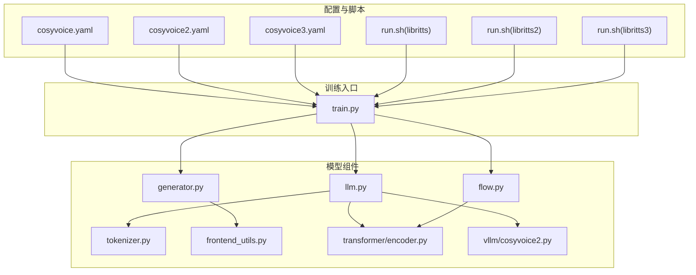
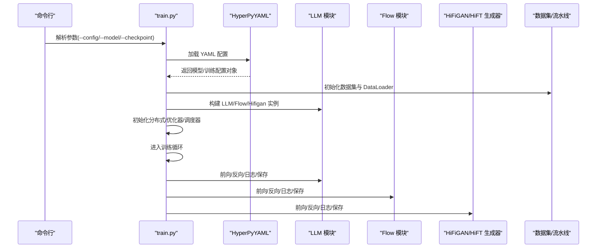
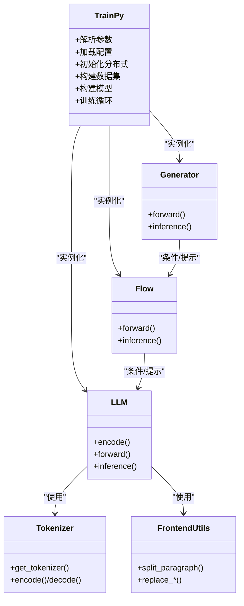

# 自定义模型

<cite>
**本文引用的文件**
- [cosyvoice/bin/train.py](file://cosyvoice/bin/train.py)
- [examples/libritts/cosyvoice/conf/cosyvoice.yaml](file://examples/libritts/cosyvoice/conf/cosyvoice.yaml)
- [examples/libritts/cosyvoice2/conf/cosyvoice2.yaml](file://examples/libritts/cosyvoice2/conf/cosyvoice2.yaml)
- [examples/libritts/cosyvoice3/conf/cosyvoice3.yaml](file://examples/libritts/cosyvoice3/conf/cosyvoice3.yaml)
- [examples/libritts/cosyvoice/run.sh](file://examples/libritts/cosyvoice/run.sh)
- [examples/libritts/cosyvoice2/run.sh](file://examples/libritts/cosyvoice2/run.sh)
- [examples/libritts/cosyvoice3/run.sh](file://examples/libritts/cosyvoice3/run.sh)
- [cosyvoice/llm/llm.py](file://cosyvoice/llm/llm.py)
- [cosyvoice/flow/flow.py](file://cosyvoice/flow/flow.py)
- [cosyvoice/hifigan/generator.py](file://cosyvoice/hifigan/generator.py)
- [cosyvoice/tokenizer/tokenizer.py](file://cosyvoice/tokenizer/tokenizer.py)
- [cosyvoice/utils/frontend_utils.py](file://cosyvoice/utils/frontend_utils.py)
- [cosyvoice/transformer/encoder.py](file://cosyvoice/transformer/encoder.py)
- [cosyvoice/vllm/cosyvoice2.py](file://cosyvoice/vllm/cosyvoice2.py)
</cite>

## 目录
1. [简介](#简介)
2. [项目结构](#项目结构)
3. [核心组件](#核心组件)
4. [架构总览](#架构总览)
5. [详细组件分析](#详细组件分析)
6. [依赖关系分析](#依赖关系分析)
7. [性能考虑](#性能考虑)
8. [故障排查指南](#故障排查指南)
9. [结论](#结论)
10. [附录](#附录)

## 简介
本章节面向希望在 CosyVoice 中自定义与配置模型的开发者，系统讲解如何基于现有配置文件（如 cosyvoice.yaml、cosyvoice2.yaml、cosyvoice3.yaml）进行模型定制，覆盖训练超参数、数据处理流水线、模型架构选项、文本前端、LLM 层结构以及声码器替换等关键主题，并结合 examples/libritts/ 下的 run.sh 脚本说明训练流程的可定制化点。同时提供常见问题与解决方案，帮助快速定位配置加载失败、参数不兼容等问题。

## 项目结构
CosyVoice 的模型配置采用 YAML + HyperPyYAML 的方式组织，训练入口通过命令行参数选择具体配置文件与训练阶段。典型结构如下：
- 配置文件：examples/libritts/*/conf/*.yaml
- 训练脚本：examples/libritts/*/run.sh
- 训练入口：cosyvoice/bin/train.py
- 模型组件：llm、flow、hifigan、tokenizer、frontend、transformer 等

图表来源
- [cosyvoice/bin/train.py](file://cosyvoice/bin/train.py#L1-L196)
- [examples/libritts/cosyvoice/conf/cosyvoice.yaml](file://examples/libritts/cosyvoice/conf/cosyvoice.yaml#L1-L257)
- [examples/libritts/cosyvoice2/conf/cosyvoice2.yaml](file://examples/libritts/cosyvoice2/conf/cosyvoice2.yaml#L1-L234)
- [examples/libritts/cosyvoice3/conf/cosyvoice3.yaml](file://examples/libritts/cosyvoice3/conf/cosyvoice3.yaml#L1-L225)
- [examples/libritts/cosyvoice/run.sh](file://examples/libritts/cosyvoice/run.sh#L1-L109)
- [examples/libritts/cosyvoice2/run.sh](file://examples/libritts/cosyvoice2/run.sh#L1-L111)
- [examples/libritts/cosyvoice3/run.sh](file://examples/libritts/cosyvoice3/run.sh#L1-L112)
- [cosyvoice/llm/llm.py](file://cosyvoice/llm/llm.py#L1-L740)
- [cosyvoice/flow/flow.py](file://cosyvoice/flow/flow.py#L1-L434)
- [cosyvoice/hifigan/generator.py](file://cosyvoice/hifigan/generator.py#L1-L747)
- [cosyvoice/tokenizer/tokenizer.py](file://cosyvoice/tokenizer/tokenizer.py#L1-L328)
- [cosyvoice/utils/frontend_utils.py](file://cosyvoice/utils/frontend_utils.py#L1-L137)
- [cosyvoice/transformer/encoder.py](file://cosyvoice/transformer/encoder.py#L1-L475)
- [cosyvoice/vllm/cosyvoice2.py](file://cosyvoice/vllm/cosyvoice2.py#L1-L104)

章节来源
- [cosyvoice/bin/train.py](file://cosyvoice/bin/train.py#L1-L196)
- [examples/libritts/cosyvoice/conf/cosyvoice.yaml](file://examples/libritts/cosyvoice/conf/cosyvoice.yaml#L1-L257)
- [examples/libritts/cosyvoice2/conf/cosyvoice2.yaml](file://examples/libritts/cosyvoice2/conf/cosyvoice2.yaml#L1-L234)
- [examples/libritts/cosyvoice3/conf/cosyvoice3.yaml](file://examples/libritts/cosyvoice3/conf/cosyvoice3.yaml#L1-L225)
- [examples/libritts/cosyvoice/run.sh](file://examples/libritts/cosyvoice/run.sh#L1-L109)
- [examples/libritts/cosyvoice2/run.sh](file://examples/libritts/cosyvoice2/run.sh#L1-L111)
- [examples/libritts/cosyvoice3/run.sh](file://examples/libritts/cosyvoice3/run.sh#L1-L112)

## 核心组件
- 训练入口与配置加载
  - 训练入口负责解析命令行参数、加载 YAML 配置、初始化分布式环境、构建数据集与优化器、执行训练循环并保存模型。
  - 支持按模型类型（llm/flow/hifigan）分别训练，支持 DeepSpeed 与 PyTorch DDP。
- LLM 层（语言模型）
  - 提供 TransformerLM、Qwen2LM、CosyVoice3LM 等实现，支持文本编码、语音离散 token 编码、采样策略、推理生成与流式解码。
- Flow（扩散/去噪）模块
  - 提供掩码扩散与条件 CFM 的实现，支持长度调节、说话人嵌入融合、流式推理与因果结构。
- 声码器（HiFi-GAN/HiFT）
  - 提供非因果与因果两种 HiFT 生成器，支持 F0 预测、ISTFT、残差块融合与流式合成。
- 文本前端与分词
  - 提供多语言 Whisper 分词器与 Qwen 分词器，支持特殊标记注册、语言切换、标点与数字处理。
- 数据处理流水线
  - 包含打开 parquet、分词、过滤、重采样、提取梅尔谱、计算 F0、打乱排序、批处理与填充等步骤。

章节来源
- [cosyvoice/bin/train.py](file://cosyvoice/bin/train.py#L40-L196)
- [cosyvoice/llm/llm.py](file://cosyvoice/llm/llm.py#L33-L740)
- [cosyvoice/flow/flow.py](file://cosyvoice/flow/flow.py#L24-L434)
- [cosyvoice/hifigan/generator.py](file://cosyvoice/hifigan/generator.py#L378-L747)
- [cosyvoice/tokenizer/tokenizer.py](file://cosyvoice/tokenizer/tokenizer.py#L209-L328)
- [cosyvoice/utils/frontend_utils.py](file://cosyvoice/utils/frontend_utils.py#L65-L137)

## 架构总览
下图展示从配置到训练与推理的关键交互关系。

图表来源
- [cosyvoice/bin/train.py](file://cosyvoice/bin/train.py#L96-L196)
- [examples/libritts/cosyvoice/conf/cosyvoice.yaml](file://examples/libritts/cosyvoice/conf/cosyvoice.yaml#L1-L257)
- [examples/libritts/cosyvoice2/conf/cosyvoice2.yaml](file://examples/libritts/cosyvoice2/conf/cosyvoice2.yaml#L1-L234)
- [examples/libritts/cosyvoice3/conf/cosyvoice3.yaml](file://examples/libritts/cosyvoice3/conf/cosyvoice3.yaml#L1-L225)

## 详细组件分析

### 配置文件结构与关键参数
- 固定参数（sample_rate、llm_input_size、llm_output_size、spk_embed_dim 等）
  - 控制采样率、LLM 输入输出维度、说话人嵌入维度等全局设置。
- LLM 配置
  - text_encoder_input_size、text_token_size、speech_token_size、length_normalized_loss、lsm_weight、spk_embed_dim。
  - text_encoder、llm 可选 TransformerEncoder 或 ConformerEncoder，控制注意力头数、前馈通道、层数、dropout 等。
  - sampling 为采样策略函数，如 top-p/top-k 等。
- Flow 配置
  - input_size、output_size、spk_embed_dim、output_type、vocab_size、input_frame_rate、only_mask_loss。
  - encoder、length_regulator、decoder、decoder_conf 等，其中 decoder 支持 ConditionalCFM 或 CausalConditionalCFM。
- 声码器（HiFT/HiFiGAN）
  - in_channels、base_channels、nb_harmonics、sampling_rate、upsample_rates/kernels、istft_params、resblock 参数、lrelu_slope、audio_limit、f0_predictor。
- 数据处理流水线
  - parquet_opener、get_tokenizer、tokenize、filter、resample、truncate、feat_extractor、compute_fbank、compute_f0、parse_embedding、shuffle、sort、batch、padding。
  - data_pipeline 与 data_pipeline_gan 定义不同阶段的数据处理链路。
- 训练配置
  - train_conf 与 train_conf_gan，包含优化器类型、学习率、warmup 步数、最大轮次、梯度裁剪、累积步数、日志间隔等。

章节来源
- [examples/libritts/cosyvoice/conf/cosyvoice.yaml](file://examples/libritts/cosyvoice/conf/cosyvoice.yaml#L7-L257)
- [examples/libritts/cosyvoice2/conf/cosyvoice2.yaml](file://examples/libritts/cosyvoice2/conf/cosyvoice2.yaml#L7-L234)
- [examples/libritts/cosyvoice3/conf/cosyvoice3.yaml](file://examples/libritts/cosyvoice3/conf/cosyvoice3.yaml#L7-L225)

### 训练流程定制化（以 run.sh 为例）
- 数据准备阶段
  - 下载 LibriTTS 数据集、准备 wav.scp/text/utt2spk/spk2utt。
  - 提取说话人嵌入（campplus）、提取离散语音 token（speech_tokenizer_v1/v2/v3）。
  - 将数据转换为 parquet 并生成 data.list。
- 训练阶段
  - 使用 torchrun 启动多 GPU 训练，支持 DeepSpeed 与 PyTorch DDP。
  - 通过 --config 指定配置文件，--model 指定训练模块（llm/flow/hifigan），--checkpoint 指定预训练权重。
  - 支持 --use_amp、--pin_memory、--deepspeed_config 等参数。
- 模型平均与导出
  - 训练结束后对最近若干检查点做模型平均，随后导出 JIT/ONNX 用于推理加速。

章节来源
- [examples/libritts/cosyvoice/run.sh](file://examples/libritts/cosyvoice/run.sh#L1-L109)
- [examples/libritts/cosyvoice2/run.sh](file://examples/libritts/cosyvoice2/run.sh#L1-L111)
- [examples/libritts/cosyvoice3/run.sh](file://examples/libritts/cosyvoice3/run.sh#L1-L112)

### 文本前端与分词器定制
- 多语言 Whisper 分词器
  - 支持 multilingual 开关、语言与任务（transcribe/translate）选择，注册特殊 token（语言、音频事件、情感、时间戳等）。
- Qwen 分词器
  - 支持 CosyVoice2/CosyVoice3 版本，注册大量特殊 token（呼吸音、笑声、噪声、音素等），可配置是否跳过特殊 token。
- 前端工具
  - 中文字符识别、角标替换、括号清理、数字拼写、段落切分、空白处理、仅标点判断等。

章节来源
- [cosyvoice/tokenizer/tokenizer.py](file://cosyvoice/tokenizer/tokenizer.py#L209-L328)
- [cosyvoice/utils/frontend_utils.py](file://cosyvoice/utils/frontend_utils.py#L65-L137)

### LLM 层结构定制
- TransformerLM
  - 文本嵌入 + Conformer/Transformer 文本编码器 + 语音离散 token 嵌入 + LLM（Transformer/Qwen） + 解码器 + 采样策略。
- Qwen2LM
  - 基于 Qwen2 的编码器，支持混合/单流序列构造、DPO 推理、vLLM 推理队列。
- CosyVoice3LM
  - 扩展了更大的词表空间与特殊 token，支持 instruct 流程（待实现）。
- 推理与流式
  - 支持逐步解码、最小/最大 token 文本比、停止 token、缓存与流式 chunk 大小。

章节来源
- [cosyvoice/llm/llm.py](file://cosyvoice/llm/llm.py#L33-L740)

### Flow 扩散模块定制
- 掩码扩散（非因果）
  - 输入离散语音 token，经编码器与长度调节器，结合条件特征进行扩散损失计算。
- 因果掩码扩散
  - 支持预前瞻长度、静态/动态 chunk、流式推理 finalize 控制。
- DiT 扩散（CosyVoice3）
  - 引入 DiT 结构作为估计器，提升流式与长序列稳定性。

章节来源
- [cosyvoice/flow/flow.py](file://cosyvoice/flow/flow.py#L24-L434)

### 声码器替换与定制
- 非因果 HiFT 生成器
  - 支持谐波源、ISTFT、残差块融合、F0 预测器。
- 因果 HiFT 生成器
  - 支持因果卷积、预看窗口、流式合成 finalize 控制。
- 替换建议
  - 若需替换为其他声码器，可在配置中将 hifigan.generator 指向新实现，并确保输入维度（梅尔频带数）与输出采样率一致。

章节来源
- [cosyvoice/hifigan/generator.py](file://cosyvoice/hifigan/generator.py#L378-L747)

### vLLM 集成（CosyVoice2）
- CosyVoice2ForCausalLM
  - 基于 vLLM 的 Qwen2 模型封装，支持 LoRA、流水线并行、权重加载与 logits 计算。
- 适用场景
  - 大规模 LLM 推理加速，配合 Qwen2LM 的 vLLM 输出队列机制。

章节来源
- [cosyvoice/vllm/cosyvoice2.py](file://cosyvoice/vllm/cosyvoice2.py#L29-L104)

## 依赖关系分析
- 配置到模型实例
  - YAML 中使用 !new 与 !name 构造类实例与函数，HyperPyYAML 在运行时解析并实例化。
- 训练入口耦合
  - train.py 通过参数选择模型类型，按需覆盖配置字典，避免无关模块被实例化。
- 组件内聚与解耦
  - LLM/Flow/Hifigan 各自独立，通过统一的数据接口（字典 batch）交互；文本前端与分词器可插拔。

图表来源
- [cosyvoice/bin/train.py](file://cosyvoice/bin/train.py#L96-L196)
- [cosyvoice/llm/llm.py](file://cosyvoice/llm/llm.py#L33-L740)
- [cosyvoice/flow/flow.py](file://cosyvoice/flow/flow.py#L24-L434)
- [cosyvoice/hifigan/generator.py](file://cosyvoice/hifigan/generator.py#L378-L747)
- [cosyvoice/tokenizer/tokenizer.py](file://cosyvoice/tokenizer/tokenizer.py#L209-L328)
- [cosyvoice/utils/frontend_utils.py](file://cosyvoice/utils/frontend_utils.py#L65-L137)

## 性能考虑
- 训练性能
  - 使用 AMP（--use_amp）、Pin Memory（--pin_memory）、合适的 batch 类型与大小、动态/静态 chunk 训练。
  - DeepSpeed 与 PyTorch DDP 的选择与配置（--deepspeed_config）影响显存占用与吞吐。
- 推理性能
  - vLLM 集成可显著降低 LLM 推理延迟；流式合成（chunk_size、token_mel_ratio）平衡延迟与质量。
  - 声码器因果实现减少延迟，但需注意预看窗口与 finalize 控制。

## 故障排查指南
- 配置加载失败
  - 症状：启动时报错无法解析 YAML 或找不到模块。
  - 排查要点：
    - 确认 YAML 文件路径正确，键名大小写与缩进无误。
    - 确保使用的类路径（如 cosyvoice.llm.llm.TransformerLM）存在于代码库。
    - 使用 overrides 参数（如 qwen_pretrain_path）时，确认配置文件中存在对应占位键。
- 参数不兼容
  - 症状：训练报错或结果异常。
  - 排查要点：
    - 检查 sample_rate 与梅尔谱参数（n_fft、hop_size、win_size）是否匹配。
    - 检查 token_frame_rate 与 token_mel_ratio 是否与 Flow/HiFT 配置一致。
    - 确认 spk_embed_dim 与各模块输入维度一致。
- 训练不稳定或显存溢出
  - 症状：梯度爆炸、NaN、OOM。
  - 排查要点：
    - 降低学习率、启用梯度裁剪（grad_clip）、减小 batch size 或使用 accumulate_grad。
    - 检查数据流水线中的 truncate 与 batch 配置，确保长度分布合理。
- 推理延迟过高
  - 症状：首包延迟大、流式合成卡顿。
  - 排查要点：
    - 调整 chunk_size、num_decoding_left_chunks、token_mel_ratio。
    - 使用 vLLM 加速 LLM 推理，或导出 JIT/ONNX。

章节来源
- [cosyvoice/bin/train.py](file://cosyvoice/bin/train.py#L107-L115)
- [examples/libritts/cosyvoice/conf/cosyvoice.yaml](file://examples/libritts/cosyvoice/conf/cosyvoice.yaml#L114-L115)
- [examples/libritts/cosyvoice2/conf/cosyvoice2.yaml](file://examples/libritts/cosyvoice2/conf/cosyvoice2.yaml#L78-L89)
- [examples/libritts/cosyvoice3/conf/cosyvoice3.yaml](file://examples/libritts/cosyvoice3/conf/cosyvoice3.yaml#L77-L96)

## 结论
通过 YAML 配置与 HyperPyYAML 的组合，CosyVoice 提供了高度可定制的模型训练与推理框架。开发者可根据目标语言、语音风格与硬件条件，灵活调整 LLM/Flow/HiFT 结构、数据处理流水线与训练超参数。结合 run.sh 的多阶段流程与 vLLM 的集成，可在保证质量的同时显著提升训练与推理效率。

## 附录

### 基于现有配置创建新模型配置的步骤
- 选择模板
  - 从 examples/libritts/*/conf 中选择与目标版本最接近的配置文件作为模板。
- 修改关键参数
  - 采样率与梅尔参数：确保 n_fft、hop_size、win_size 与 sample_rate 一致。
  - LLM 维度：llm_input_size、llm_output_size、spk_embed_dim 保持一致。
  - Flow 参数：input_frame_rate、token_mel_ratio、chunk_size 与推理脚本一致。
  - 声码器：确保 in_channels 与梅尔维数一致，upsample 参数与 hop_size 匹配。
- 数据流水线
  - 根据数据格式调整 tokenize、filter、resample、truncate、compute_fbank、compute_f0、padding 等步骤。
- 训练脚本
  - 更新 run.sh 中的 --config、--checkpoint、--model_dir、--tensorboard_dir 等路径与参数。

章节来源
- [examples/libritts/cosyvoice/conf/cosyvoice.yaml](file://examples/libritts/cosyvoice/conf/cosyvoice.yaml#L1-L257)
- [examples/libritts/cosyvoice2/conf/cosyvoice2.yaml](file://examples/libritts/cosyvoice2/conf/cosyvoice2.yaml#L1-L234)
- [examples/libritts/cosyvoice3/conf/cosyvoice3.yaml](file://examples/libritts/cosyvoice3/conf/cosyvoice3.yaml#L1-L225)
- [examples/libritts/cosyvoice/run.sh](file://examples/libritts/cosyvoice/run.sh#L70-L88)
- [examples/libritts/cosyvoice2/run.sh](file://examples/libritts/cosyvoice2/run.sh#L70-L89)
- [examples/libritts/cosyvoice3/run.sh](file://examples/libritts/cosyvoice3/run.sh#L71-L90)

### 实际代码示例（路径参考）
- 修改文本前端
  - 参考路径：[cosyvoice/utils/frontend_utils.py](file://cosyvoice/utils/frontend_utils.py#L65-L137)
  - 示例用途：自定义段落切分策略、标点处理、数字拼写规则。
- 调整 LLM 层结构
  - 参考路径：[cosyvoice/llm/llm.py](file://cosyvoice/llm/llm.py#L33-L740)
  - 示例用途：更换编码器类型（Conformer/Transformer）、调整采样策略、启用 vLLM。
- 替换 HiFiGAN 声码器
  - 参考路径：[cosyvoice/hifigan/generator.py](file://cosyvoice/hifigan/generator.py#L378-L747)
  - 示例用途：将 hifigan.generator 指向自定义实现，确保输入维度与采样率匹配。

章节来源
- [cosyvoice/utils/frontend_utils.py](file://cosyvoice/utils/frontend_utils.py#L65-L137)
- [cosyvoice/llm/llm.py](file://cosyvoice/llm/llm.py#L33-L740)
- [cosyvoice/hifigan/generator.py](file://cosyvoice/hifigan/generator.py#L378-L747)