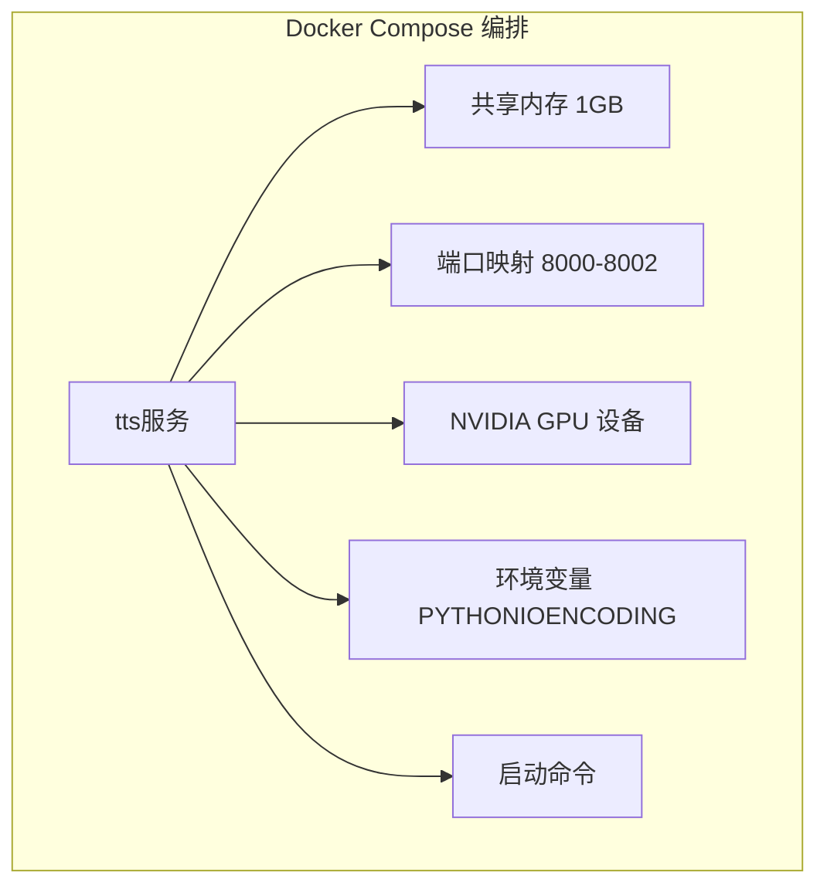
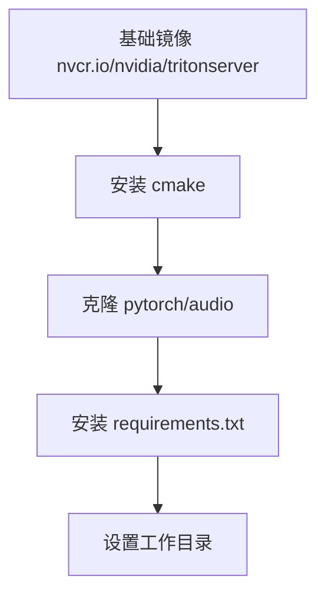
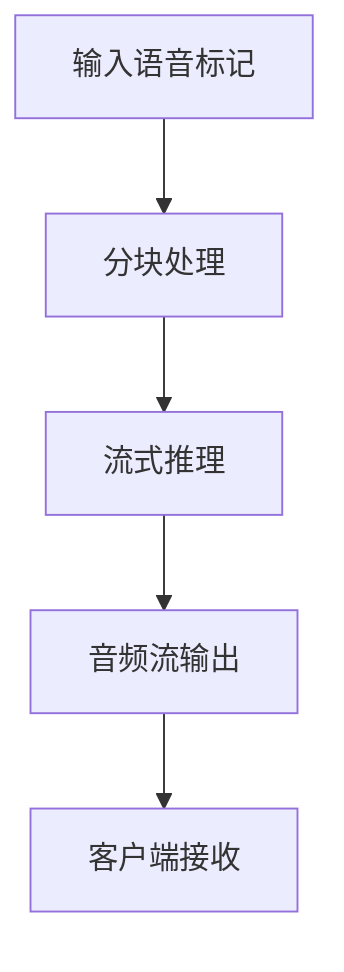
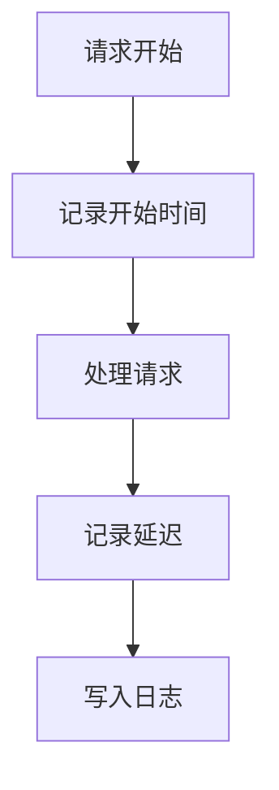
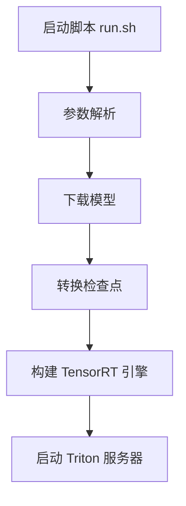

# 部署优化

<cite>
**本文档引用文件**   
- [docker-compose.yml](file://runtime/triton_trtllm/docker-compose.yml)
- [Dockerfile.server](file://runtime/triton_trtllm/Dockerfile.server)
- [streaming_inference.py](file://runtime/triton_trtllm/streaming_inference.py)
- [run.sh](file://runtime/triton_trtllm/run.sh)
- [token2wav.py](file://runtime/triton_trtllm/token2wav.py)
- [offline_inference.py](file://runtime/triton_trtllm/offline_inference.py)
- [client_grpc.py](file://runtime/triton_trtllm/client_grpc.py)
- [client_http.py](file://runtime/triton_trtllm/client_http.py)
- [docker-compose.dit.yml](file://runtime/triton_trtllm/docker-compose.dit.yml)
- [config.pbtxt](file://runtime/triton_trtllm/model_repo/cosyvoice2/config.pbtxt)
- [config.pbtxt](file://runtime/triton_trtllm/model_repo/tensorrt_llm/config.pbtxt)
- [fill_template.py](file://runtime/triton_trtllm/scripts/fill_template.py)
</cite>

## 目录
1. [引言](#引言)
2. [多服务编排与资源隔离](#多服务编排与资源隔离)
3. [镜像构建优化](#镜像构建优化)
4. [流式推理与吞吐量优化](#流式推理与吞吐量优化)
5. [性能监控与日志收集](#性能监控与日志收集)
6. [启动参数调优](#启动参数调优)
7. [结论](#结论)

## 引言
CosyVoice 是一个先进的语音合成系统，支持在生产环境中进行高效部署。本文档重点介绍其部署优化策略，涵盖使用 `docker-compose.yml` 编排多个推理服务（如LLM、Flow、HiFiGAN），实现资源隔离与弹性扩展；分析 `Dockerfile.server` 中的镜像构建优化，包括依赖精简、多阶段构建和CUDA环境配置；讲解 `streaming_inference.py` 中的低延迟流式处理机制，以及如何通过批处理和GPU内存优化提升吞吐量；提供性能监控和日志收集的最佳实践，并结合 `run.sh` 中的启动参数调优建议。

## 多服务编排与资源隔离

CosyVoice 使用 Docker Compose 进行多服务编排，确保 LLM、Flow 和 HiFiGAN 等推理服务之间的资源隔离和高效协同。通过 `docker-compose.yml` 文件定义服务配置，利用 NVIDIA Container Runtime 实现 GPU 资源的精确分配。

**图源**
- [docker-compose.yml](file://runtime/triton_trtllm/docker-compose.yml#L1-L20)

**节源**
- [docker-compose.yml](file://runtime/triton_trtllm/docker-compose.yml#L1-L20)

## 镜像构建优化

### 依赖精简与多阶段构建
`Dockerfile.server` 采用多阶段构建策略，从基础的 NVIDIA Triton Server 镜像出发，仅安装必要的依赖项，如 `cmake` 和 `pytorch/audio`，并通过 `pip install -r requirements.txt` 安装 Python 依赖，有效减少了最终镜像的体积。

### CUDA环境配置
镜像构建过程中，明确设置了 CUDA 环境路径，并使用 `git clone` 获取特定版本的 `pytorch/audio` 库，确保与 CUDA 环境兼容。此外，通过 `WORKDIR /workspace` 设置工作目录，便于后续操作。

**图源**
- [Dockerfile.server](file://runtime/triton_trtllm/Dockerfile.server#L1-L8)

**节源**
- [Dockerfile.server](file://runtime/triton_trtllm/Dockerfile.server#L1-L8)

## 流式推理与吞吐量优化

### 低延迟流式处理机制
`streaming_inference.py` 实现了低延迟的流式推理机制。通过 `forward_streaming` 方法，模型能够逐步生成音频流，而不是等待整个序列完成。这通过设置 `CHUNK_SIZE` 和 `OVERLAP_SIZE` 参数来控制每次推理的语音标记数量，从而实现平滑的音频流输出。

### 批处理与GPU内存优化
为了提升吞吐量，系统采用了批处理技术。在 `token2wav.py` 中，`CosyVoice2_Token2Wav` 类通过 `forward` 方法处理批量输入，利用 GPU 的并行计算能力。同时，通过 `TrtContextWrapper` 管理 TensorRT 上下文池，减少上下文切换开销，优化 GPU 内存使用。

**图源**
- [streaming_inference.py](file://runtime/triton_trtllm/streaming_inference.py#L1-L123)
- [token2wav.py](file://runtime/triton_trtllm/token2wav.py#L1-L336)

**节源**
- [streaming_inference.py](file://runtime/triton_trtllm/streaming_inference.py#L1-L123)
- [token2wav.py](file://runtime/triton_trtllm/token2wav.py#L1-L336)

## 性能监控与日志收集

### 性能监控
`client_grpc.py` 提供了详细的性能监控功能。通过 `UserData` 类记录每个请求的开始时间、首块延迟和次块延迟，并在 `write_triton_stats` 函数中将这些统计信息写入日志文件。这有助于分析系统的响应时间和吞吐量。

### 日志收集
日志收集通过 `run.sh` 脚本中的 `log-dir` 参数指定日志目录。在 `offline_inference.py` 中，性能数据被记录到 `log.txt` 文件中，包含数据加载时间、音频处理时间、LLM推理时间等关键指标。

**图源**
- [client_grpc.py](file://runtime/triton_trtllm/client_grpc.py#L1-L800)
- [offline_inference.py](file://runtime/triton_trtllm/offline_inference.py#L1-L653)

**节源**
- [client_grpc.py](file://runtime/triton_trtllm/client_grpc.py#L1-L800)
- [offline_inference.py](file://runtime/triton_trtllm/offline_inference.py#L1-L653)

## 启动参数调优

`run.sh` 脚本提供了丰富的启动参数，用于调优系统性能。例如，`--batch-size` 参数控制批处理大小，`--token2wav-batch-size` 参数控制 `token2wav` 模型的批处理大小。此外，`--kv-cache-free-gpu-memory-fraction` 参数用于调整 KV 缓存的 GPU 内存占用比例，以平衡内存使用和推理速度。

**图源**
- [run.sh](file://runtime/triton_trtllm/run.sh#L1-L143)

**节源**
- [run.sh](file://runtime/triton_trtllm/run.sh#L1-L143)

## 结论
通过上述部署优化策略，CosyVoice 在生产环境中实现了高效的资源利用和低延迟的流式推理。多服务编排确保了资源隔离，镜像构建优化减少了部署开销，流式处理机制提升了用户体验，而性能监控和日志收集则为系统维护提供了有力支持。结合合理的启动参数调优，可以进一步提升系统的整体性能和稳定性。